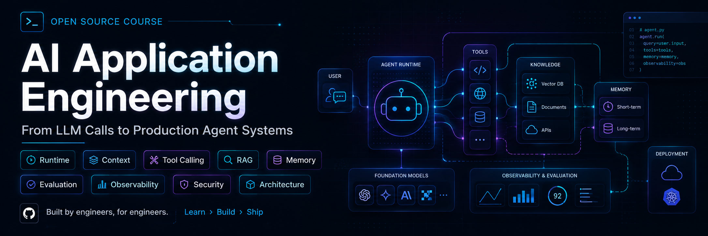

<p align="center">
  
</p>

# AI Application Engineering

## 从模型调用，到生产级 Agent 系统

一门面向开发者的中文开源课程。讲清楚 LLM、Tool、Agent Runtime、RAG、Memory、评测、可观测性和安全在工程上到底是怎么回事——**为什么这样设计、什么时候会坏、坏了怎么办**。

[](./lessons/)
[](./README.md)
[](./LICENSE)

**[在线阅读 →](https://lance2016.github.io/ai-app-engineering/)**（带搜索和上下课导航，比在 GitHub 上翻目录舒服）

## 这是一门什么课

**这是理论课，不是项目教程。** 你不需要 clone 它、装依赖、跑起来。打开任何一课就能读。

- **讲机制，不讲某个框架。** 先看清 Agent 循环、上下文组装、工具守卫本身是什么，再决定用不用 LangGraph。框架只在每课末尾一张表里对照一下，附官网链接。
- **代码是插图。** 每课的「机制拆解」里有几段二三十行的示意代码，为了说清一个机制，省略了 import、日志和错误处理，**不能直接运行**。唯一的例外是前置 LLM 原理那八篇，里面有几个纯标准库的小实验，`python3 xxx.py` 就能跑，因为「跑一下看数字怎么变」是它们的全部意义（那一组是草稿，见[前置总览](./prerequisites/README.md)）。
- **把失败当内容。** 每课都有「常见错误」，讲的是这个机制在生产里具体会怎么坏。
- **每课有一线经验。** 来自一个真实的语音机器人项目：踩过什么坑、后来怎么改的。

**如果你要的是能跑的代码**，参考实现在另一个仓库：[ai-app-engineering-ref](https://github.com/lance2016/ai-app-engineering-ref)——一个带工具调用、RAG、Memory、评测、trace 和部署的服务，`docker compose up` 就能起来。七个里程碑里 M0–M5 已完成，M6（多租户平台 RFC）和 framework-lab 还是草稿，四个 capstone 完成了一个。

## 这门课适合谁

| 你的情况 | 这门课给你什么 |
|---|---|
| 会 Python 和后端，调通过模型 API，但停在「demo 能跑」，不知道离上线还差什么 | 从第 00 课顺着读，缺的那一圈骨架就是 Part 4 的内容 |
| 在用 LangChain 或 LangGraph，却说不清框架替你做了哪些决定 | 每课用普通 Python 讲同一个机制，末尾一张表对照三个框架的叫法 |
| 要做 AI 应用的架构评审或技术选型，需要一份判断依据 | [课程总览](./lessons/README.md)的能力域清单，加 [12 条工程原则](./principles/README.md) |
| 线上出了问题，只能看到最后那句错误回答 | 失败分层定位贯穿全课，第 18、19 课给证据链 |

**不适合三种情况。** 想要 `git clone` 就能跑的项目——去[参考实现仓库](https://github.com/lance2016/ai-app-engineering-ref)；想学怎么训练或微调模型——这里只讲到应用工程师做决策的深度；不写代码只想了解 AI 能做什么——正文全是机制和示意代码。

## 从哪里开始

两条路径，看你属于哪一种。

|  | 没做过 AI 应用 | 做过 RAG 或 Agent |
|---|---|---|
| **第一步** | 从 [00 起步](./lessons/00-setup/README.md) 顺着读，别跳 | 先花 20 分钟做 [24 题自测](./reference/diagnostic.md) |
| **然后** | Part 1 → Part 5 按顺序走完 | 按自测结果挑薄弱的 Part 读 |
| **模型原理** | token、attention、KV cache 不熟，先补[前置八篇](./prerequisites/README.md) | 读到「前置 F0x」的引用再回查 |
| **想直接看结论** | 学完每个 Part 后回看[工程原则](./principles/README.md) | [12 条工程原则](./principles/README.md)是全课的压缩版 |
| **正在选框架** | 学完 Part 2 再看 | [框架一览与选型标准](./reference/frameworks.md) |

[前置 · LLM 原理](./prerequisites/README.md)那一组是**可选的补充**，不是必修：主线 26 课在需要的地方会点名引用它（那一组还是草稿，比主线薄）。
不确定自己的底子够不够，看一眼[进课程前该有的能力清单](./reference/foundations.md)；每个 Part 在搭什么、学完怎么算过关，见[课程总览](./lessons/README.md)。

## 26 课

每课 1～2.5 小时（第 00 课半小时），结构固定：为什么需要 → 心智模型 → 机制拆解 → 常见错误 → 取舍 → 工程落地 → 框架映射 → 一线经验 → 练习。

**每个 Part 的出师标准——学完该能回答哪些问题——见[课程总览](./lessons/README.md)。**

### Part 0 起步

**学完之后。** 知道这门课的代码为什么不追求能跑，什么时候该去参考实现。

| # | 课程 | 一句话 |
|---|---|---|
| 00 | [起步：怎么读这门课，怎么接第一个模型](./lessons/00-setup/README.md) | 课程定位，加一段能直接复制去跑的最小模型调用 |

### Part 1 模型与上下文

**学完之后。** 应用能选对模型、拿到可解析的结构化输出、把指令和上下文管起来，并接上语义检索。

| # | 课程 | 一句话 |
|---|---|---|
| 01 | [从模型到应用：能力边界、成本模型与选型](./lessons/01-how-llms-work/README.md) | 把模型当有规格书的部件：硬约束过滤、能力探针、每段对话的成本模型 |
| 02 | [模型调用、结构化输出与流式](./lessons/02-model-api-structured-output-streaming/README.md) | 拆开一次调用：消息格式、参数、JSON Schema 约束、流式增量、重试与成本 |
| 03 | [Prompt Engineering 与单次调用的上下文](./lessons/03-prompt-engineering/README.md) | 系统指令、few-shot、输出约束、prompt 版本化与回归门禁 |
| 04 | [Embedding 与向量检索基础](./lessons/04-embeddings-and-vector-search/README.md) | 选模型和维度、暴力检索到什么规模换索引、切块怎样改变召回、pgvector |

### Part 2 Tool 与 Agent

**学完之后。** 应用有了工具、循环、状态、上下文组装和能力接入，可以自己走多步完成一个任务，并且见过这套零件在一个真实产品里怎么拼。

| # | 课程 | 一句话 |
|---|---|---|
| 05 | [Tool Calling：从 Schema 到副作用](./lessons/05-tool-calling/README.md) | 工具调用成功包含三件事：选对工具、参数有效、外部系统真的做了且只做了一次 |
| 06 | [Agent 循环与控制流](./lessons/06-agent-loop/README.md) | 观察、决策、行动的最小循环；停止条件、预算、失败分类与恢复 |
| 07 | [Agent State 与 Runtime](./lessons/07-agent-state-and-runtime/README.md) | 状态是一份事件记录；checkpoint、暂停恢复、人工介入、double texting |
| 08 | [Agent 的 Context Engineering](./lessons/08-context-engineering-for-agents/README.md) | 每一轮怎么组装上下文：裁剪、压缩、工具结果整形、缓存友好的布局 |
| 09 | [Workflow 还是 Agent：架构模式](./lessons/09-workflow-vs-agent/README.md) | 五种 workflow 模式，以及什么时候才真的需要自治 Agent |
| 10 | [多智能体、Handoff 与 Racing](./lessons/10-multi-agent-handoff/README.md) | 多个 Agent 如何分工、交接和并行竞速；状态归谁、历史给多少 |
| 11 | [MCP：模型上下文协议](./lessons/11-mcp/README.md) | 能力怎么接入：生命周期、能力发现、两条错误通道、断连处理 |
| 12 | [Skill 与能力生态分层](./lessons/12-skills-and-capability-layers/README.md) | Tool、MCP、Skill、Plugin、A2A 各管什么；渐进式加载与供应链钉死 |
| 13 | [Agent Harness：把前八课装进一个真实系统](./lessons/13-agent-harness/README.md) | 编码 Agent 拆解：工具界面、权限分级、hook、上下文寿命 |

### Part 3 知识与记忆

**学完之后。** 应用有了检索、引用、记忆，以及一套管数据的规矩。

| # | 课程 | 一句话 |
|---|---|---|
| 14 | [RAG 端到端](./lessons/14-rag-end-to-end/README.md) | 解析、切块、索引、混合检索、重排、生成、引用，七步每步怎么坏、怎么测 |
| 15 | [Memory：提取、整合与检索](./lessons/15-memory/README.md) | 会话、任务、长期记忆的边界；提取、冲突合并、过期和删除 |
| 16 | [数据工程与数据质量](./lessons/16-data-engineering/README.md) | 版本、新鲜度、权限和删除演练，决定 RAG 上限的不是模型而是数据 |

### Part 4 生产工程

**学完之后。** 应用有了评测、trace、限流、fallback、成本账、安全边界和部署流程。

| # | 课程 | 一句话 |
|---|---|---|
| 17 | [AI 应用系统架构与端到端数据流](./lessons/17-system-architecture/README.md) | 从客户端到模型再回来的一条完整请求链，以及存储边界 |
| 18 | [评测：Golden Set、LLM Judge 与 Agent Eval](./lessons/18-evaluation/README.md) | 没有评测集就没有「变好了」；切片、kappa、轨迹断言、回归门禁 |
| 19 | [可观测性：从日志到 LLM Trace](./lessons/19-observability/README.md) | 结构化日志、OpenTelemetry GenAI 语义约定、四种故障在 trace 里的样子 |
| 20 | [可靠性、成本、部署与 LLMOps](./lessons/20-reliability-cost-llmops/README.md) | 超时、重试、限流、熔断、fallback、成本预算、SLO、容器与灰度 |
| 21 | [安全与治理](./lessons/21-security-governance/README.md) | 提示注入、越权、数据泄露、沙箱、供应链、多租户边界、数据生命周期 |
| 22 | [模型适配、微调与推理服务](./lessons/22-model-adaptation-finetuning-inference/README.md) | 什么时候该微调、显存怎么算、托管和自建的成本临界点 |

### Part 5 产品与技术决策

**学完之后。** 能独立设计一个 AI 应用，并写得出一份别人能审的技术决策。

| # | 课程 | 一句话 |
|---|---|---|
| 23 | [AI 产品设计与交互](./lessons/23-product-design-ux/README.md) | 流式 UI 状态机、确认与撤销、引用展示、带切片的反馈闭环 |
| 24 | [语音应用：链路、延迟预算与打断](./lessons/24-voice-agents/README.md) | 级联还是端到端、一秒的预算怎么分、打断之后历史该记什么 |
| 25 | [系统设计与技术决策](./lessons/25-system-design-decisions/README.md) | 容量估算、决策矩阵的敏感性、带退出条件的 ADR |

## 仓库结构

```text
├── lessons/          主线 26 课，每课 README + exercises.md
├── prerequisites/    前置 · LLM 原理 F00–F07，八篇
├── principles/       12 条工程原则，一条一个文件
├── reference/        术语表、技术选型、框架一览、外部资料
└── docs/ mkdocs.yml  文档站配置（内容都是上面几个目录的符号链接）
```

## 这门课和别的有什么不同

| 已有资源 | 它的侧重 | 本课补什么 |
|---|---|---|
| [12-factor-agents](https://github.com/humanlayer/12-factor-agents) | 12 条 Agent 工程原则 | 每条原则背后的机制和它会怎么坏 |
| [ai-agents-for-beginners](https://github.com/microsoft/ai-agents-for-beginners) | Agent 知识地图，示例绑 Azure | 不绑云厂商，加评测、可观测、成本、安全的生产视角 |
| [langchain-academy](https://github.com/langchain-ai/langchain-academy) | LangGraph 的 State / Graph / Checkpoint | 用普通 Python 讲同样的机制，读者再选框架 |
| [llm-course](https://github.com/mlabonne/llm-course)、[LLMs-from-scratch](https://github.com/rasbt/LLMs-from-scratch) | 模型原理与训练 | 只取应用工程师需要的那一层，压进前置 |

## 参考资料

术语见 [glossary.md](./reference/glossary.md)，自测题见 [diagnostic.md](./reference/diagnostic.md)，能力清单见 [foundations.md](./reference/foundations.md)，技术选型见 [stack.md](./reference/stack.md)，框架对比见 [frameworks.md](./reference/frameworks.md)，外部资料见 [resources.md](./reference/resources.md)。

## 贡献与许可

贡献方式见 [CONTRIBUTING.md](./CONTRIBUTING.md)。给 AI 协作者的续写说明见 [AGENTS.md](./AGENTS.md)。

文档采用 CC BY-NC-SA 4.0，代码采用 MIT，见 [LICENSE](./LICENSE)。
