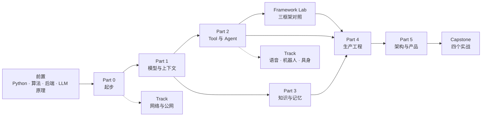

# AI 应用开发工程师：从入门到精通

> 面向有后端开发经验的工程师。用一个贯穿全程的真实项目，讲清楚怎样把 LLM 从「能调用」做成「可上线的 Agent 系统」。
> 中文写作。主线不绑定任何 Agent 框架，先用普通 Python 看清机制，再在 Framework Lab 里用三个主流框架对照。附带语音机器人方向的真实案例。

**状态：第一版正文已就位，正在补实践闭环。** 24 课、12 条原则、13 个 Python 与后端前置模块有正文和可运行代码；LLM 原理前置 8 个模块是带实验的草稿，算法前置 7 个模块是大纲；主项目 M0～M5 有代码和验收测试，M6 是设计型里程碑；Framework Lab 和 Capstone 是大纲。状态列见各表，`complete` 表示代码能跑、练习有答案、CI 能验证。

## 这门课和别的有什么不同

| 已有资源 | 它的侧重 | 本课补什么 |
|---|---|---|
| [12-factor-agents](https://github.com/humanlayer/12-factor-agents) | 12 条 Agent 工程原则 | 原则怎么落到一个真实项目里 |
| [ai-agents-for-beginners](https://github.com/microsoft/ai-agents-for-beginners) | Agent 知识地图，示例绑 Azure | 不绑云厂商，加评测、可观测、成本、安全的生产视角 |
| [langchain-academy](https://github.com/langchain-ai/langchain-academy) | LangGraph 的 State / Graph / Checkpoint | 用普通 Python 讲同样的机制，读者再选框架 |
| [generative-ai-for-beginners](https://github.com/microsoft/generative-ai-for-beginners) | GenAI 应用通识 | 通识压进前置，主线直接从应用工程切入 |
| [llm-course](https://github.com/mlabonne/llm-course)、[LLMs-from-scratch](https://github.com/rasbt/LLMs-from-scratch) | 模型原理与训练 | 只取应用工程师需要的那一层，作为前置 F 组 |

## 路线图

零基础读者从 [前置](./prerequisites/README.md) 开始：Python 语言、算法、后端工程、LLM 原理四组学完再进主线。有后端经验但没碰过 LLM 的人只学 LLM 原理那一组。

Part 2 和 Part 3 没有硬依赖，可以并行或按兴趣先后。

四条轨道：**主线** `lessons/` 按编号学；**实践** `project/` 的里程碑、Framework Lab 和 Capstone，每课的概念都在这里落地；**横向贯穿** 评测、安全、可观测、成本从第一个项目就带着，Part 4 再系统深化；**方向选修** `tracks/` 按岗位挑。阶段依赖和能力阶梯见 [ROADMAP.md](./ROADMAP.md)。

## 课程总表

前置模块见 [prerequisites/README.md](./prerequisites/README.md)，有后端经验的人做完那里的自检可以直接跳过。

状态：`outline` 只有目标和心智模型 · `draft` 有代码，缺练习、反例或项目落点 · `complete` 正文完整、代码能跑、有失败注入、练习有答案、有项目落点、CI 能验证。

| # | 课程 | 一句话 | 状态 |
|---|---|---|---|
| **Part 0 起步** | | | |
| 00 | [环境与模型接入](./lessons/00-setup/README.md) | 搭好 uv + Python 3.12 环境，接入一个真实模型和一个 fake adapter，让后面每一课的代码都能离线跑 | complete |
| **Part 1 模型与上下文** | | | |
| 01 | [从模型到应用：能力边界、成本模型与选型](./lessons/01-how-llms-work/README.md) | 把模型当有规格书的部件：硬约束过滤、能力探针、每段对话的成本模型、幻觉的应用层对策、可替换性 | complete |
| 02 | [模型调用、结构化输出与流式](./lessons/02-model-api-structured-output-streaming/README.md) | 把一次模型调用拆开：消息格式、参数、JSON Schema 约束输出、流式增量、重试与成本记录 | complete |
| 03 | [Prompt Engineering 与单次调用的上下文](./lessons/03-prompt-engineering/README.md) | 系统指令、few-shot、输出约束、prompt 版本化与测试；一次调用的上下文里该放什么、不该放什么 | complete |
| 04 | [Embedding 与向量检索基础](./lessons/04-embeddings-and-vector-search/README.md) | 选 embedding 模型和维度、暴力检索到什么规模换索引、切块怎样改变召回、pgvector 建表建索引 | complete |
| **Part 2 Tool 与 Agent** | | | |
| 05 | [Tool Calling：从 Schema 到副作用](./lessons/05-tool-calling/README.md) | 工具调用成功包含三件事：模型选对工具、参数有效、外部系统真的完成 | complete |
| 06 | [Agent 循环与控制流](./lessons/06-agent-loop/README.md) | 观察、决策、行动的最小循环；停止条件、步数与预算、失败分类与对应的恢复动作 | complete |
| 07 | [Agent State 与 Runtime：持久化、暂停恢复与人工介入](./lessons/07-agent-state-and-runtime/README.md) | 状态模型（对话、任务、业务、记忆）、checkpoint 与持久化、launch / pause / resume、人工确认与中断、事件流、重复消息与并发、幂等重入 | complete |
| 08 | [Agent 的 Context Engineering](./lessons/08-context-engineering-for-agents/README.md) | 运行时怎样组装每一轮的上下文：系统指令、历史裁剪与压缩、工具结果注入、检索结果、渐进式披露、子 Agent 上下文隔离、缓存友好的布局 | complete |
| 09 | [Workflow 还是 Agent：架构模式](./lessons/09-workflow-vs-agent/README.md) | Prompt chaining、Routing、Parallelization、Orchestrator-Workers、Evaluator-Optimizer 五种模式，Planner / Executor，以及什么时候才需要自治 Agent | complete |
| 10 | [多智能体、Handoff 与 Racing](./lessons/10-multi-agent-handoff/README.md) | 多个 Agent 如何分工、交接和并行竞速；状态归谁、历史怎么隔离、失败怎么回退 | complete |
| 11 | [MCP：模型上下文协议](./lessons/11-mcp/README.md) | MCP 解决「能力怎么接入」：初始化、能力发现、resources / tools / prompts、权限与断连处理 | complete |
| 12 | [Skill 与能力生态分层](./lessons/12-skills-and-capability-layers/README.md) | Tool、MCP、Skill、Plugin、Agent 协议各管什么；Skill 如何封装可复用的使用方法 | complete |
| **Part 3 知识与记忆** | | | |
| 13 | [RAG 端到端](./lessons/13-rag-end-to-end/README.md) | 解析、切块、索引、混合检索、重排、生成、引用，七步每步怎么坏、怎么测 | complete |
| 14 | [Memory：提取、整合与检索](./lessons/14-memory/README.md) | 会话记忆、任务记忆、长期记忆的边界；记忆的提取、冲突合并、过期和删除 | complete |
| 15 | [数据工程与数据质量](./lessons/15-data-engineering/README.md) | 文档解析、ETL、版本、新鲜度、权限和删除，决定 RAG 上限的不是模型而是数据 | complete |
| **Part 4 生产工程** | | | |
| 16 | [AI 应用系统架构与端到端数据流](./lessons/16-system-architecture/README.md) | 从客户端到模型再回来的一条完整请求链：网关、会话、状态、工具、检索、流式、持久化、后台任务 | complete |
| 17 | [评测：Golden Set、LLM Judge 与 Agent Eval](./lessons/17-evaluation/README.md) | 没有评测集就没有「变好了」 | complete |
| 18 | [可观测性：从日志到 LLM Trace](./lessons/18-observability/README.md) | 结构化日志、OpenTelemetry GenAI 语义约定、Phoenix / Langfuse 接入，四个故障实验 | complete |
| 19 | [可靠性、成本、部署与 LLMOps](./lessons/19-reliability-cost-llmops/README.md) | 超时、重试、限流、熔断、Fallback、模型路由、成本预算、SLO、故障演练；容器化、CI、配置与密钥、灰度与回滚 | complete |
| 20 | [安全与治理](./lessons/20-security-governance/README.md) | 提示注入、越权、数据泄露、沙箱、供应链、多租户边界、数据生命周期 | complete |
| 21 | [模型适配、微调与推理服务](./lessons/21-model-adaptation-finetuning-inference/README.md) | 什么时候该微调、LoRA 怎么工作、量化和 KV Cache 如何影响延迟显存、vLLM 与本地推理的取舍 | complete |
| **Part 5 架构与产品** | | | |
| 22 | [AI 产品设计与交互](./lessons/22-product-design-ux/README.md) | 何时该用 AI、人工基线、流式 UI、引用展示、确认与撤销、转人工、指标与反馈闭环 | complete |
| 23 | [系统设计与技术决策](./lessons/23-system-design-decisions/README.md) | Build vs Buy、模型 vs RAG、Workflow vs Agent、单体 vs 平台；一道多租户知识库 + 任务 Agent 的综合设计题 | complete |
| **Lab** | | | |
| Lab | [Framework & Architecture Lab](./project/framework-lab/README.md) | 同一个审批型 Agent 需求在 LangGraph、OpenAI Agents SDK、Claude Agent SDK 上各做一遍，一致性测试加十二维评分卡，做完 M3 后做 | outline |
| **Capstone** | | | |
| Cap | [Capstone 实战](./project/capstones/README.md) | Production Agent Service、RAG + Memory Agent、Long-running Durable Agent、Multi-tenant AI Platform 四个实战，各有可执行验收与评分量表 | outline |

## 主项目

[AI 应用服务骨架](./project/README.md)：从 asyncio 实验开始，七个里程碑，每个只加一个能力，最终长成带工具、RAG、Memory、评测、可观测性和部署的生产级服务。每课的「对照真实项目」小节都指向这里。做完 M3 进 Framework Lab，做完 M5 进 Capstone。

## 原则

[12 条 AI 应用工程原则](./principles/README.md)。前 6 条和 12-factor-agents 重合，后 6 条是生产视角的补充。

## 方向选修

| Track | 内容 |
|---|---|
| [语音、机器人与具身 AI Agent](./tracks/robotics-voice/README.md) | ASR/TTS 流式管线、打断、Realtime、双模型 racing、设备端工具、具身场景的规划与安全 |
| [网络与公网访问](./tracks/networking/README.md) | TCP/TLS、DNS、反向代理、WSS、Tunnel、VPN |

## 怎么用这门课

1. 零基础从 [prerequisites/](./prerequisites/README.md) 开始；有后端经验的先做那里的自检，缺哪个模块补哪个。LLM 原理在前置 F 组，主线不再补。
2. 已经在做 Agent 项目的人从 Part 2 开始，把 `principles/` 当对照清单。
3. 每课先跑 `code/` 再看正文；做完练习再看 `exercises.md` 里的答案。代码默认用离线的 fake 模型，需要真实模型时按第 00 课配一个 DeepSeek key。
4. 不要只读。每课的「对照真实项目」小节要求你在 `project/` 里落一个增量。做完 M3 去 Framework Lab 用框架重做一遍，做完 M5 挑一个 Capstone。

## 参考资料

术语见 [reference/glossary.md](./reference/glossary.md)，工具选型见 [reference/stack.md](./reference/stack.md)，外部资料见 [reference/resources.md](./reference/resources.md)。

## 给 AI 协作者

这个仓库的大部分正文会由 AI 在人工指导下逐课生成。**新开一个会话续写内容时，先读 [AGENTS.md](./AGENTS.md)**，它说明了目录约定、每课的写作流程、参考仓库的用法和质量门槛。不读它就动手，多半会破坏编号规则或写出和别的课重复的内容。

## 贡献与许可

贡献方式见 [CONTRIBUTING.md](./CONTRIBUTING.md)。文档采用 CC BY-NC-SA 4.0，代码采用 MIT，见 [LICENSE](./LICENSE)。
