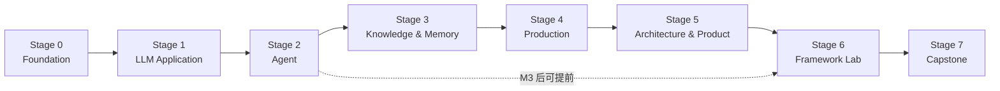
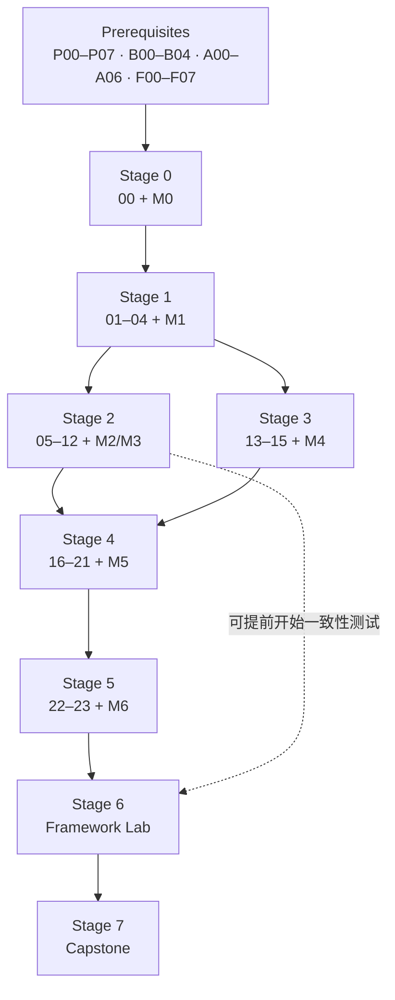

# ROADMAP｜八个 Stage，六层能力

先按 Stage 判断自己该走哪一段，再用课程编号和里程碑定位具体文件。Stage 是给学习者看的路径；`P / B / A / F`、`00–23`、`M0–M6`、`L0–L5` 是仓库内部的检索和验收编号。

## 学习者路径

| Stage | 面向学习者的目标 | 课程与项目 | 验收信号 |
|---|---|---|---|
| 0 Foundation | 补齐开发基础和 LLM 直觉 | [Prerequisites](./prerequisites/README.md)、00、M0 | 能独立运行 Python / HTTP / async 示例，知道模型的边界和预算 |
| 1 LLM Application | 把模型当成可替换的工程部件 | 01–04、M1 | Schema、流式、结构化错误、成本记录和 model adapter 都能跑 |
| 2 Agent | 让模型参与可控的循环和工具调用 | 05–12、M2–M3 | 能暂停等人、恢复执行、拒绝重复消息、记录工具失败 |
| 3 Knowledge & Memory | 让回答有来源，让记忆可治理 | 13–15、M4 | 有引用、Recall@k、版本更新、按来源删除和记忆审计 |
| 4 Production | 把 demo 变成可运维的服务 | 16–21、M5 | 有评测门禁、trace、限流、fallback、预算、部署和安全演练 |
| 5 Architecture & Product | 在写代码前做出可推翻的决策 | 22–23、M6 | 一份带容量、威胁模型、交互约束和退出条件的 RFC |
| 6 Framework Lab | 学会评估框架，而不是背框架 API | baseline + LangGraph + 两个 SDK 适配位 | 一致性测试和 12 维评分卡都有证据，结论不靠排名 |
| 7 Capstone | 交付一个能展示的完整作品 | [Capstones](./project/capstones/README.md) | 代码、测试、eval、trace、runbook、ADR 和 demo 齐全 |

### 选择入口

- **Beginner / 基础不足**：先做 [Prerequisites 自检](./prerequisites/README.md#自检)，只补不会的组；不需要按四组全部重学。
- **Backend Engineer**：自检后从 00 开始，M0 在 P07 asyncio 之后插入；会写 Python / HTTP / SQL 的部分可以快速浏览。
- **Existing AI / Agent Developer**：从 05、19 或 Framework Lab 进入；用 12 条 [工程原则](./principles/README.md) 和项目测试补齐工程盲区。

## 依赖关系

基础模块是入口，不是主线的第五条分支。主线中 Agent 和 Knowledge 两段可以并行，Production 需要它们都完成。

Framework Lab 的一致性测试在 M3 之后就可以开始；Observability 和 Deployment 两个维度等 18、19 学完再补证据。Capstone 1 在 M5 后即可做，Capstone 2 在 M4 后即可做，Capstone 3 需要 Lab，Capstone 4 需要 M6。

## L0–L5 能力自评

L 层是能力阶梯，不是另一套课程顺序。它帮助学习者判断“我能不能独立交付”，不要求按周完成。

| Level | 能力目标 | 主要证据 |
|---|---|---|
| L0 工程基础 | Python、async、HTTP、SQL、Redis、测试；LLM 原理到能做决策 | Prerequisites + M0/M1；能排查 API、并发和数据问题 |
| L1 AI 应用入门 | 模型选型、调用、Prompt、结构化输出、Embedding | 01–04 + M1；有 schema、错误处理、成本和小型评测集 |
| L2 应用工程师 | Tool、Agent loop、State、Context、Workflow、MCP、Skill | 05–12 + M2/M3；有权限、预算、失败恢复和工具测试 |
| L3 知识与能力工程师 | RAG、Memory、数据质量 | 13–15 + M4；能定位数据、检索、上下文和记忆的失败 |
| L4 高级应用工程师 | 评测、Trace、可靠性、部署、安全 | 16–20 + M5；能做 SLO、成本、安全设计和故障演练 |
| L5 资深方向 | 模型与推理选型、产品判断、平台化系统设计 | 21–23 + M6 + 一个 Capstone；能写 RFC 并交付完整系统 |

第 21 课虽然属于 `Part 4`，产出是模型与推理选型决策，所以在能力上归入 L5。12 条原则贯穿所有 Stage，不单独占一个 Stage。

## 两种完成方式

**阅读模式**：心智模型 → 核心机制 → 常见失败 → 生产方案 → 框架映射 → 真实项目。

**实战模式**：code → failure injection → exercises → project milestone → tests。

没有运行证据的内容不算掌握；但读者可以先阅读，不必做完练习才进入下一课。

## 每个 Stage 的共同验收

- 用自己的话解释关键机制，不只复述 API 名。
- 留下一份可运行的项目增量或设计产物。
- 复现一个失败案例、边界测试或故障演练。
- 能回答一道面试题，或完成一次小型设计取舍。
