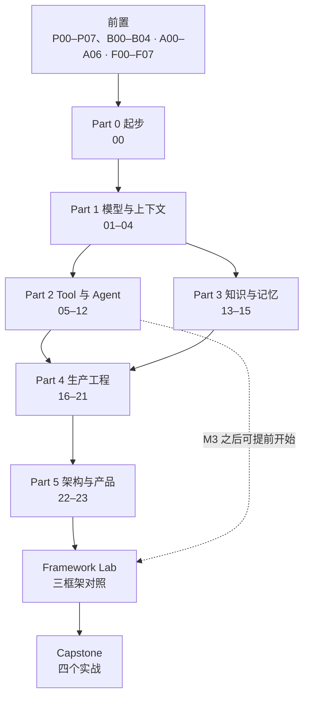

# ROADMAP｜阶段依赖与能力阶梯

## 阶段依赖

Part 2 和 Part 3 没有硬依赖，可以并行。Part 4 需要两者都完成。Framework Lab 默认在 Part 5 之后一次做完，因为评分卡里 Observability、Deployment 两格要学完 18、19 才打得出来；想早点碰框架的人 M3 一做完就可以先做一致性测试部分，两格留到后面补。Capstone 1、2、3 分别在 M5、M4、M3 加 Lab 之后可做，Capstone 4 需要全部。

## 三条线同时走

这三条线不是三种学法，是同一条路上同时发生的三件事。

| 线 | 内容 | 学法 |
|---|---|---|
| 线性主线 | Part 0 → 5 | 按编号 |
| 实践 | `project/` 里程碑 M0～M6、Framework Lab、Capstone | 每课落一个增量；M6 后进 Lab 和 Capstone，Lab 最早可在 M3 后开始 |
| 横向贯穿 | 评测、安全、可观测、成本 | 从 `project/m1` 开始每个里程碑都带最小版本，Part 4 系统深化 |

## 能力阶梯

这是能力阶段，不是时间表，也不是另一套学习顺序。学习顺序只看 README 的六阶段路线；这张表用来自评：学到某处时，对照「晋级门槛」看自己到没到。每周投入不同，进度自然不同。

命名约定：`Part N` 是课程分组，`L0–L5` 是能力阶段，`P00–P07、B00–B04` / `A00–A06` / `F00–F07` 是前置模块，`M0–M6` 是项目里程碑。不要混用。

| 阶段 | 能力目标 | 对应课程 | 代表项目 | 晋级门槛 |
|---|---|---|---|---|
| L0 工程基础 | Python、算法、async、HTTP、SQL、Redis、测试；LLM 原理到能做决策 | [prerequisites/](./prerequisites/README.md) + Part 0 | `project/m0, m1` | 能独立排查 API、并发、数据库问题；能解释 token、窗口、KV cache 为什么影响成本 |
| L1 AI 应用入门 | 模型选型与探针、模型调用、Prompt、结构化输出、Embedding 选型 | Part 1 | `project/m1` 加模型 adapter | 有 Schema、错误处理、成本统计、小型评测集 |
| L2 应用工程师 | Tool、Agent 循环、State 与 Runtime、Context Engineering、Workflow、MCP、Skill；框架选型 | Part 2 + Framework Lab | `project/m2, m3`、Lab | 有状态图、权限、预算、失败恢复、工具测试；能用十二维评分卡说清选某个框架的理由 |
| L3 知识与能力工程师 | RAG、Memory、数据质量 | Part 3 | `project/m4` | 能分辨数据 / 检索 / 上下文 / 工具 / 控制流失败 |
| L4 高级应用工程师 | 评测、Trace、可靠性、部署、安全 | Part 4（16–20） | `project/m5` | 能做容量 / SLO / 成本 / 安全设计和故障演练 |
| L5 资深方向 | 模型与推理选型、产品判断、系统设计、平台化 | 21 + Part 5 | `project/m6` + 一个 Capstone | 能写一份被团队采用的 RFC，并交付过一个过了验收清单的完整系统 |

第 21 课在课程分组上属于 Part 4，但它的产出是选型决策而不是基础设施，所以落在设计型里程碑 M6，计入 L5。

## 每个阶段的共同验收

- 能用自己的话解释关键机制，不是复述 API 名。
- 有一个可运行的项目增量。
- 有一个失败案例或边界测试。
- 能回答一道面试题，或完成一次小型设计取舍。

没有运行证据的内容不算掌握。
