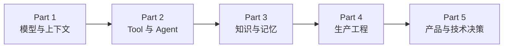

---
hide:
  - navigation
  - toc
---

# AI Application Engineering

## 从模型调用，到生产级 Agent 系统

讲清楚 LLM、Tool、Agent Runtime、RAG、Memory、评测、可观测性和安全在工程上到底是怎么回事——**为什么这样设计、什么时候会坏、坏了怎么办**。

写给已经会 Python 和后端、能调通模型 API，但不知道离上线还差什么的开发者。**24 课，每课 1～2.5 小时**，不绑框架，不绑云厂商，打开就能读。

[从第 00 课开始](lessons/00-setup/README.md){ .md-button .md-button--primary }
[做过 AI 应用？先自测](reference/diagnostic.md){ .md-button }
[课程总览](lessons/README.md){ .md-button }

---

## 课程地图

一个 AI 应用是一层层长出来的。24 课就按这个顺序排，前一个 Part 是后一个的地基。

| Part | 课 | 讲什么 | 学完之后，应用多了什么 |
|---|---|---|---|
| [0 起步](lessons/00-setup/README.md) | 00 | 课程读法 · 最小模型调用 | 知道这门课的代码为什么不追求能跑 |
| [1 模型与上下文](lessons/01-how-llms-work/README.md) | 01–04 | 选型 · 结构化输出 · Prompt · 向量检索 | 能选对模型、拿到可解析的输出、接上语义检索 |
| [2 Tool 与 Agent](lessons/05-tool-calling/README.md) | 05–12 | 工具契约 · 循环 · 状态 · 上下文组装 · MCP | 能自己走多步完成一个任务 |
| [3 知识与记忆](lessons/13-rag-end-to-end/README.md) | 13–15 | RAG · Memory · 数据工程 | 有了检索、引用、记忆和管数据的规矩 |
| [4 生产工程](lessons/16-system-architecture/README.md) | 16–21 | 架构 · 评测 · Trace · 可靠性 · 安全 · 成本 | 有了评测、trace、限流、成本账和安全边界 |
| [5 产品与技术决策](lessons/22-product-design-ux/README.md) | 22–23 | 交互设计 · 容量估算 · ADR | 能独立设计一个应用，写得出别人能审的决策 |

每个 Part 的前置、能力域拆解和出师标准，见[课程总览](lessons/README.md)。

---

## 两条学习路径

|  | 没做过 AI 应用 | 做过 RAG 或 Agent |
|---|---|---|
| **第一步** | 从 [00 起步](lessons/00-setup/README.md)顺着读，别跳 | 先花 20 分钟做 [24 题自测](reference/diagnostic.md) |
| **然后** | Part 1 → Part 5 按顺序走完 | 按自测结果挑薄弱的 Part 读 |
| **模型原理** | 不熟就先补[前置八篇](prerequisites/README.md) | 读到「前置 F0x」的引用再回查 |
| **想直接看结论** | 学完每个 Part 后回看[工程原则](principles/README.md) | [12 条工程原则](principles/README.md)是全课的压缩版 |
| **正在选框架** | 学完 Part 2 再看 | [框架一览与选型标准](reference/frameworks.md) |

[前置 · LLM 原理](prerequisites/README.md)是**可选补充，不是必修**。主线 24 课在需要的地方会点名引用它。

---

## 这门课适合谁

| 你的情况 | 这门课给你什么 |
|---|---|
| 停在「demo 能跑」，不知道离上线还差什么 | 缺的那一圈骨架就是 Part 4 |
| 在用 LangChain 或 LangGraph，说不清框架替你做了什么 | 每课用普通 Python 讲同一个机制，末尾对照三个框架的叫法 |
| 要做架构评审或技术选型，需要判断依据 | [课程总览](lessons/README.md)的能力域清单，加 [12 条工程原则](principles/README.md) |
| 线上出问题，只能看到最后那句错误回答 | 失败分层定位贯穿全课，17、18 课给证据链 |

**三种情况不适合。** 想要 `git clone` 就能跑的项目——去[参考实现仓库](https://github.com/lance2016/ai-app-engineering-ref)；想学训练或微调模型——这里只讲到应用工程师做决策的深度；不写代码——正文全是机制和示意代码。

底子够不够，看[进课程前该有的能力清单](reference/foundations.md)。

---

## 每一课长什么样

固定九节：**为什么需要** → **心智模型** → **机制拆解** → **常见错误** → **取舍** → **工程落地** → **框架映射** → **一线经验** → **练习**

- **代码是插图。** 示意代码二三十行，省略 import、日志和错误处理，不能直接运行。想要能跑的，看[参考实现仓库](https://github.com/lance2016/ai-app-engineering-ref)。
- **把失败当内容。** 「常见错误」讲这个机制在生产里具体会怎么坏；「取舍」列的是你必须自己做的判断，没有标准答案。
- **一线经验**来自一个真实的语音机器人项目：踩过什么坑、后来怎么改的。

---

## 学完之后

拿到一个需求，能独立走完从「该不该用 AI 做」到「用户看到什么」的整条链。拿到一个线上失败案例，能定位到层：数据、检索、上下文、模型、工具、运行时、基础设施、产品，是哪一层出的问题，用什么证据排除其他层。

完整的出师标准见[课程总览](lessons/README.md)。
