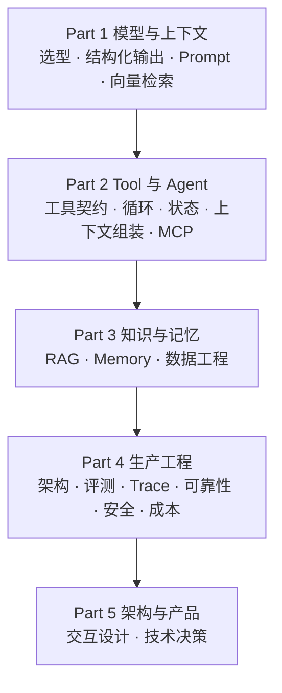

---
hide:
  - navigation
  - toc
---

# AI Application Engineering

## 从模型调用，到生产级 Agent 系统

讲清楚 LLM、Tool、Agent Runtime、RAG、Memory、评测、可观测性和安全在工程上到底是怎么回事——**为什么这样设计、什么时候会坏、坏了怎么办**。

不绑框架，不绑云厂商。打开就能读，不需要装任何东西。

[从第 00 课开始](lessons/00-setup/README.md){ .md-button .md-button--primary }
[做过 AI 应用？先自测](reference/diagnostic.md){ .md-button }

---

## 这是一门什么课

**理论课，不是项目教程。**

- **讲机制，不讲某个框架。** 先看清 Agent 循环、上下文组装、工具守卫本身是什么，再决定用不用 LangGraph。框架只在每课末尾一张表里对照，附官网链接。
- **代码是插图。** 每课的「机制拆解」有几段二三十行的示意代码，为了说清一个机制，省略了 import、日志和错误处理，不能直接运行。
- **把失败当内容。** 每课都有「常见错误」，讲这个机制在生产里具体会怎么坏。
- **每课有一线经验。** 来自一个真实的语音机器人项目：踩过什么坑、后来怎么改的。

想要能跑的代码？参考实现在 [ai-app-engineering-ref](https://github.com/lance2016/ai-app-engineering-ref)：一个带工具调用、RAG、Memory、评测、trace 和部署的服务。七个里程碑里 M0–M5 已完成，M6 和 framework-lab 还是草稿。

---

## 全课在搭什么

一个 AI 应用是一层层长出来的。24 课就按这个顺序排：

每个 Part 的定位、前置和出师标准见[课程总览](lessons/README.md)。

## 两条路走

**没做过 AI 应用**：从 [00 起步](lessons/00-setup/README.md)顺着读，别跳。不确定底子够不够，看一眼[进课程前该有的能力清单](reference/foundations.md)。模型原理不熟（token、attention、KV cache），先补[前置 · LLM 原理](prerequisites/README.md)那八篇——这一组是草稿，比主线课薄，够你做决策但不是完整教程。

**已经做过 RAG 或 Agent**：先花 20 分钟做[自测](reference/diagnostic.md)，24 题定位薄弱区，按结果挑 Part 读。想直接看结论，[12 条工程原则](principles/README.md)是全课的压缩版；正在选框架，看[框架一览与选型标准](reference/frameworks.md)。

---

## 每一课长什么样

固定九节，约 1～2.5 小时：

**为什么需要** → **心智模型** → **机制拆解** → **常见错误** → **取舍** → **工程落地** → **框架映射** → **一线经验** → **练习**

「取舍」那一节没有标准答案，它列的是你必须自己做的判断。「练习」大多是思考题，附折叠的参考答案。

---

## 这门课补的是哪一块

| 已有资源 | 它的侧重 | 这里补什么 |
|---|---|---|
| [12-factor-agents](https://github.com/humanlayer/12-factor-agents) | 12 条 Agent 工程原则 | 每条原则背后的机制和它会怎么坏 |
| [ai-agents-for-beginners](https://github.com/microsoft/ai-agents-for-beginners) | Agent 知识地图，示例绑 Azure | 不绑云厂商，加评测、可观测、成本、安全 |
| [langchain-academy](https://github.com/langchain-ai/langchain-academy) | LangGraph 的 State / Graph / Checkpoint | 用普通 Python 讲同样的机制，读者再选框架 |
| [llm-course](https://github.com/mlabonne/llm-course) | 模型原理与训练 | 只取应用工程师要做决策的那一层 |

---

## 学完之后

拿到一个需求，你能独立走完这条链：这件事该不该用 AI 做、模型怎么选、上下文怎么组织、知识从哪来、要不要工具和记忆、运行时怎么控制、拿什么证明它变好了、线上怎么看、坏了怎么兜、贵了怎么查、被攻击怎么挡、用户看到什么。

拿到一个线上失败案例，你能定位到层：数据、检索、上下文、模型、工具、运行时、基础设施、产品，问题出在哪一层，用什么证据排除其他层。

完整的出师标准见[课程总览](lessons/README.md)。
