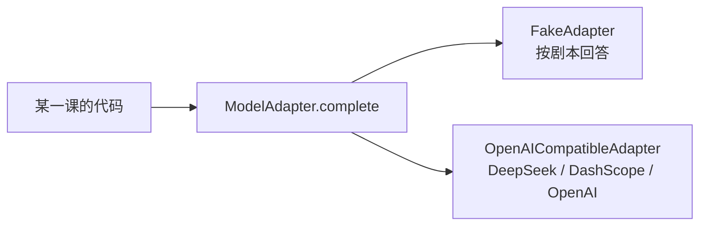

# 00 环境与模型接入

> 搭好 uv + Python 3.12 环境，跑通 fake adapter，再用同一段代码接一次真实模型（默认 DeepSeek）。后面每一课的代码都能离线运行，需要看真实行为时换一个环境变量。

## 学习目标

- 能用 uv 建好环境并运行仓库里任意一课的代码
- 能说清 fake adapter 是什么、为什么课程默认用它
- 能读懂 `aiapp` 包里的四个核心类型：`Message`、`ToolCall`、`ToolSpec`、`ModelResponse`
- 能把 `MODEL_PROVIDER` 从 `fake` 换成 `deepseek`，跑通一次真实的工具调用往返

## 前置

- [P00 环境与工具链](../../prerequisites/python/00-setup-and-tooling/README.md)：会用终端和 uv

## 心智模型

课程里所有代码都通过同一个接口和模型说话：



`ModelAdapter` 是一个 Protocol，只有一个方法：给它一串消息和可选的工具列表，它返回一个 `ModelResponse`。响应里要么是文本，要么是一组 `ToolCall`。哪家供应商在后面，调用方不关心。

fake adapter 按剧本回答。你告诉它"第一次回一个工具调用，第二次回一句话"，它就照做。这样做有三个好处：

1. 不需要 API Key，clone 下来就能跑。
2. 行为确定，可以写断言，可以复现失败。
3. 想演示"模型输出了非法参数"这类反例时，直接在剧本里写一个非法参数就行，不用求真模型犯错。

代价是它不会思考。需要看真实行为时，把 `MODEL_PROVIDER` 换成一个真实供应商，代码一行不改。

真实供应商走的是 OpenAI 兼容协议。课程默认用 **DeepSeek**，原因只有一个：国内能直接访问。DashScope（通义千问）和 OpenAI 用同一个 adapter，差别只在 base URL、key 和模型名。第 02 课会拆开这个 adapter 讲消息格式、结构化输出、流式和重试。

## 最小可运行例子

### 安装

```bash
# 1. 装 uv（已有可跳过）
curl -LsSf https://astral.sh/uv/install.sh | sh        # macOS / Linux
# Windows: powershell -c "irm https://astral.sh/uv/install.ps1 | iex"

# 2. 拉仓库并装依赖。uv 会自己下载 Python 3.12，不依赖系统 Python
git clone <本仓库>
cd ai-app-engineering
uv sync

# 3. 跑第一个例子
uv run python lessons/00-setup/code/01_hello_fake_adapter.py
```

预期输出两行：一行是 fake 模型的回声，一行是估算的 token 用量。

仓库根目录的 `.python-version` 钉在 3.12，`uv sync` 会自动下载这个版本，和系统里装了什么 Python 无关。

`uv sync` 装的依赖只有三个：`pydantic`（schema 和校验）、`openai`（OpenAI 兼容协议的客户端，DeepSeek 也用它）、`python-dotenv`（读 `.env`）。以后哪一课需要新依赖，会在那一课说明。

### 接一次真实模型

```bash
cp .env.example .env
# 编辑 .env，填 DEEPSEEK_API_KEY=sk-...   （在 https://platform.deepseek.com 申请）
MODEL_PROVIDER=deepseek uv run python lessons/00-setup/code/02_real_model_tool_call.py
```

预期：模型请求调用 `get_weather`，运行时返回结果，模型用一句话回答，每一轮打印 token 用量。换成 `MODEL_PROVIDER=dashscope` 并填 `DASHSCOPE_API_KEY`，同一个脚本照跑。

| 文件 | 演示什么 |
|---|---|
| [`code/01_hello_fake_adapter.py`](./code/01_hello_fake_adapter.py) | 拿到 adapter，发一条消息，读响应和用量 |
| [`code/02_real_model_tool_call.py`](./code/02_real_model_tool_call.py) | 同一个循环接真实模型，完成一次工具调用往返；没有 key 时提示后退出 |

`aiapp` 包在 [`project/src/aiapp/`](../../project/src/aiapp/)。这一课只需要读 `adapters/` 下的四个文件，加起来两百多行；`api/`、`runtime/`、`storage/` 是主项目 M1 起才用到的，先不用看：

- `adapters/base.py`：消息、工具调用、工具描述、响应四个类型和 adapter 协议
- `adapters/fake.py`：剧本式假模型，以及 `tool_call_response()` 这个造工具调用的小工具
- `adapters/openai_compat.py`：OpenAI 兼容协议的 adapter，含 DeepSeek / DashScope / OpenAI 三个预设；重点看 `_to_wire()`，它把课程类型翻译成线上格式
- `adapters/__init__.py`：读 `.env`，按 `MODEL_PROVIDER` 选 adapter

## 常见错误与失败注入

- `ModuleNotFoundError: No module named 'aiapp'`：没跑 `uv sync`，或者用了系统 Python 而不是 `uv run`。
- `RuntimeError: DEEPSEEK_API_KEY is not set`：`.env` 没建，或者建了但没填。`.env` 在 `.gitignore` 里，不会被提交。
- `openai.AuthenticationError`：key 填错，或者 base URL 和 key 不是同一家的。`DEEPSEEK_API_KEY` 配 `https://api.deepseek.com`。
- `ImportError: Using SOCKS proxy, but the 'socksio' package is not installed`：你的终端设了 `all_proxy=socks5://...`，httpx 会跟着走代理。DeepSeek 和 DashScope 都不需要代理，最省事的做法是跑的时候把它去掉：`env -u all_proxy -u http_proxy -u https_proxy MODEL_PROVIDER=deepseek uv run python ...`。确实要走代理就 `uv add socksio`。
- 401 但 key 是从别处复制来的：先用 `curl` 直接打一下接口确认 key 有效，再怀疑代码。课程作者写这一课时就踩过一次，环境变量里放着一个早已失效的 key。
- 真实模型没有调用工具，直接回答了：`description` 写得不够明确，或者模型判断不需要。这是正常现象，第 03 课讲怎么写工具描述。

## 取舍

用 fake adapter 换来的是确定性和零成本，失去的是真实模型行为。课程的原则是：讲机制用 fake，看效果用真模型。每课的「最小可运行例子」默认 fake，「对照真实项目」小节才需要真模型。

选 DeepSeek 做默认是可访问性的取舍，不是能力判断。不同供应商在工具调用上的行为有差异，比如参数 JSON 偶尔不合法、是否支持并行调用。adapter 里 `_parse_arguments()` 把不合法的参数包成 `{"_raw": ...}` 而不是抛异常，就是为第 05 课的校验守卫留的口子。

## 练习

见 [exercises.md](./exercises.md)。

## 对照真实项目

这一课的产出就是主项目 [M0](../../project/m0-concurrency/README.md) 的起点：`project/src/aiapp` 会一直长到 M5。

## 延伸阅读

- [uv 文档](https://docs.astral.sh/uv/)（访问日期 2026-09-04）：只需要看 `uv sync` 和 `uv run` 两节。
- [DeepSeek API 文档 · Function Calling](https://api-docs.deepseek.com/guides/function_calling)（访问日期 2026-09-04）：确认它的工具调用格式和 OpenAI 一致。
- [Anthropic · Tool use overview](https://platform.claude.com/docs/en/agents-and-tools/tool-use/overview)（访问日期 2026-09-04）：看 `tool_use` → 执行 → `tool_result` 那一个往返，就是 `aiapp` 里 `ToolCall` 和 `Message(role="tool")` 的来源。

---

[← 课程总表](../../README.md) · [下一课 01 →](../01-how-llms-work/README.md)
