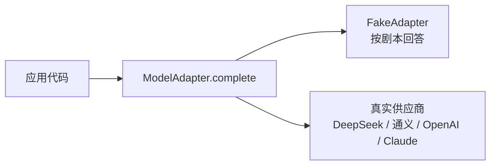

# 00 起步：怎么读这门课，怎么接第一个模型

> 这门课讲机制和取舍，不是一个可以 clone 下来跑的项目。课文里的代码都是为了说清楚一件事，不为了运行。这一课先说清楚这个定位，再给你一段能直接复制去跑的最小模型调用。

## 为什么需要

大部分 AI 应用教程会先让你装一堆东西。等环境装好，注意力已经耗在依赖冲突上了。这门课反过来：先把机制讲清楚，你再决定用什么框架、什么供应商去落地。

所以你需要先知道两件事：课文里的代码该怎么读，以及最小的真实模型调用长什么样。

## 学习目标

- 知道课文里的代码是示意还是可运行，不会去找一个不存在的仓库目录
- 能说清「模型适配器」这个抽象为什么值得从第一天就有
- 能用二十行代码完成一次真实的工具调用往返

## 心智模型

一门课里的代码有三种。这门课只有前两种：

| 形态 | 用途 | 本课程 |
|---|---|---|
| 示意代码 | 说明一个机制，省略掉所有噪音 | 每课的「机制拆解」小节都是这个 |
| 可复制的最小例子 | 你想亲手验证时，复制到自己的环境里跑 | 只在少数几课出现，明确标注 |
| 项目代码 | 一个真实服务的完整实现 | **不在这里**，见[参考实现仓库](https://github.com/lance2016/ai-app-engineering-ref) |

看到 `## 机制拆解` 下面的代码，默认它跑不起来——它引用的类型和函数是为了让你看懂逻辑而虚构的。这是刻意的：把 import、日志、错误处理都塞进去，一段二十行能讲清的机制会变成两百行。

### 所有代码都通过同一个接口和模型说话



`ModelAdapter` 就一个方法：给它一串消息和可选的工具列表，返回一个响应。响应里要么是文本，要么是一组工具调用请求。哪家供应商在后面，调用方不关心。

这不是过度设计。第 12 条工程原则就是「模型是可替换的适配器」：模型换代的速度远快于你的业务代码，任何直接调供应商 SDK 的地方，将来都是一次改动。


**fake adapter 值得单说。** 它按剧本回答：你告诉它「第一次回一个工具调用，第二次回一句话」，它就照做。好处有三个：

1. 不需要 API Key，测试能在 CI 里跑。
2. 行为确定，可以写断言，可以复现失败。
3. 想演示「模型输出了非法参数」这类反例，直接在剧本里写一个非法参数，不用求真模型犯错。

代价是它不会思考。讲机制用 fake，看效果用真模型——这是贯穿全课的做法。

## 机制拆解

这一课的代码是个例外：它**能直接复制去跑**。想亲手跑一次真实调用，只需要一个包和一个 key。国内直接可访问的是 DeepSeek，在 <https://platform.deepseek.com> 申请。

```bash
pip install openai
export DEEPSEEK_API_KEY=sk-...
```

一次完整的工具调用往返，二十来行：

```python
import json, os
from openai import OpenAI

client = OpenAI(api_key=os.environ["DEEPSEEK_API_KEY"],
                base_url="https://api.deepseek.com")

WEATHER = {
    "type": "function",
    "function": {
        "name": "get_weather",
        "description": "Current weather for a city. Use it whenever the user asks about weather.",
        "parameters": {"type": "object",
                       "properties": {"city": {"type": "string"}},
                       "required": ["city"]},
    },
}

messages = [{"role": "user", "content": "深圳现在天气怎么样？"}]

for _ in range(4):                       # 步数上限，第 06 课会讲为什么必须有
    reply = client.chat.completions.create(
        model="deepseek-chat", messages=messages, tools=[WEATHER]
    ).choices[0].message

    if not reply.tool_calls:             # 模型给出了最终回答
        print(reply.content)
        break

    messages.append(reply)
    for call in reply.tool_calls:
        args = json.loads(call.function.arguments)
        result = json.dumps({"city": args["city"], "temp_c": 31, "condition": "sunny"})
        messages.append({"role": "tool", "tool_call_id": call.id, "content": result})
```

这二十行里已经藏着后面十几课的全部主题：消息格式（第 02 课）、工具描述怎么写（第 05 课）、循环怎么停（第 06 课）、历史怎么裁剪（第 08 课）、这次调用花了多少钱（第 19 课）。

换供应商只改两行：通义千问是 `base_url="https://dashscope.aliyuncs.com/compatible-mode/v1"` 加 `model="qwen-plus"`，OpenAI 去掉 `base_url` 即可。它们都走 OpenAI 兼容协议，所以适配器这层抽象成本很低。

## 常见错误

- **`RuntimeError: DEEPSEEK_API_KEY is not set`**：环境变量没设，或者设在了另一个终端窗口里。
- **`openai.AuthenticationError`**：key 和 base URL 不是同一家的。DeepSeek 的 key 只能配 `https://api.deepseek.com`。
- **`ImportError: Using SOCKS proxy, but the 'socksio' package is not installed`**：终端里设了 `all_proxy=socks5://...`，httpx 会跟着走代理。DeepSeek 和通义都不需要代理，跑的时候去掉即可：`env -u all_proxy -u http_proxy -u https_proxy python x.py`。
- **401 但 key 是从别处复制来的**：先用 `curl` 直接打接口确认 key 有效，再怀疑代码。写这一课时就踩过一次，环境变量里放着一个早已失效的 key。
- **模型没调工具，直接回答了**：`description` 写得不够明确，或者模型判断不需要。这是正常现象，第 05 课讲怎么写工具描述。

## 取舍

**用 fake 换确定性，失去真实行为。** 讲机制时这笔交易划算；判断「这个提示词效果好不好」时，fake 一点用都没有。

**选 DeepSeek 做默认是可访问性的取舍，不是能力判断。** 不同供应商在工具调用上的行为有差异：参数 JSON 偶尔不合法、是否支持一轮返回多个调用、`description` 多长会被截断。这些差异是第 05 课校验守卫存在的理由。

## 框架映射

这一课的概念在框架里的位置：

| 本课概念 | LangGraph | OpenAI Agents SDK | Claude Agent SDK |
|---|---|---|---|
| 模型适配器 | `init_chat_model` / LangChain 的 chat model | model provider | SDK 直接绑 Claude |
| 剧本式 fake | 自己实现一个 chat model | 自己实现 `Model` 协议 | 伪造 transport 层 |

官方文档：[LangGraph](https://langchain-ai.github.io/langgraph/) · [OpenAI Agents SDK](https://openai.github.io/openai-agents-python/) · [Claude Agent SDK](https://docs.claude.com/en/api/agent-sdk/overview)（核对日期 2026-09-05）。

## 练习

见 [exercises.md](./exercises.md)。

## 延伸阅读

- [DeepSeek API 文档 · Function Calling](https://api-docs.deepseek.com/guides/function_calling)（访问日期 2026-09-04）：确认它的工具调用格式和 OpenAI 一致。
- [Anthropic · Tool use overview](https://platform.claude.com/docs/en/agents-and-tools/tool-use/overview)（访问日期 2026-09-04）：看 `tool_use` → 执行 → `tool_result` 那一个往返。Claude 的字段名和 OpenAI 不同，机制完全一样——这正是适配器要抹平的那层差异。

---

[下一课 01 →](../01-how-llms-work/README.md)
