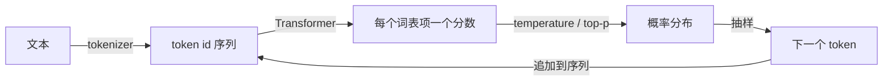

# 01 LLM 工作原理与能力边界

> 应用工程师不需要会训练模型，但需要知道四件事：模型看到的是 token 不是字，输出是从概率分布里抽样出来的，上下文窗口是一笔每轮都在花的预算，以及模型存的是"什么词常跟着什么词"而不是事实。这四件事解释了后面每一课遇到的大部分怪现象。

## 学习目标

- 能解释 token 和字、词的关系，估算一段中英文各占多少 token，并说出为什么中文更贵
- 能说清 temperature 和 top-p 分别改变了什么，以及为什么 temperature 为 0 也不等于"一定正确"
- 能算一轮对话的上下文预算，指出历史增长为什么让多轮成本近似平方增长
- 能用"统计模式而非事实存储"解释幻觉，并说出应用层的两种应对方式

## 前置

- [00 环境与模型接入](../00-setup/README.md)
- 前置模块 [P02 容器与迭代](../../prerequisites/python/02-collections-and-iteration/README.md)：本课代码大量用 `Counter` 和字典

## 心智模型

模型做的事只有一件：给定前面的 token 序列，为词表里每一项打分，然后抽一个出来接在后面，再来一遍。四个后果：

**Token 不是字。** Tokenizer 用 BPE 之类的算法把高频字节串合并成一个 token。英文常见词往往一个 token，中文一个字通常一到两个 token，代码里的空格和符号各算一个。你付费按 token，窗口按 token 算，模型"看到"的边界也在 token 上。这就是为什么模型数不清 "strawberry" 里有几个 r：它看到的不是字母。

**输出是抽样。** 分数经过 temperature 缩放和 softmax 变成概率，再按概率抽一个。temperature 低，分布尖，几乎总选最高分；temperature 高，分布平，第二、第三选项经常出现。top-p 把尾部低概率项直接砍掉。temperature 为 0 就是贪心，每次一样，但"一样"不等于"对"，它只是最可能的那个。

**上下文窗口是预算。** 系统提示、工具定义、检索内容、整段历史、给回答预留的空间，全部挤在一个窗口里。每一轮把历史重新发一遍，所以第 n 轮的输入 token 约等于前 n 轮的总和，一段 20 轮的对话总输入是单轮的几十倍。这不只是钱的问题，也是第 08 课上下文工程存在的理由。

**模型不是数据库。** 参数里存的是训练文本的统计模式。"of" 后面经常跟 "france"，这和"巴黎是法国首都"这条事实是两回事，模型分不清。所以它会流畅地说出从没存在过的论文和 API。需要事实时，要么把事实放进上下文（第 13 课 RAG），要么让它调工具去查（第 05 课）。

Transformer 内部的 attention、KV cache、量化这些放在 [tracks/llm-internals](../../tracks/llm-internals/README.md)，第 21 课讲它们怎么影响延迟和成本。这一课只到"应用工程师做决策够用"的深度。

## 最小可运行例子

全部纯 Python，不需要模型也不需要任何依赖。

| 文件 | 演示什么 | 运行 |
|---|---|---|
| [`code/01_bpe_tokenizer_toy.py`](./code/01_bpe_tokenizer_toy.py) | 60 行 BPE：训练合并规则、编码解码；英文压缩好，中文每字 3 字节几乎不合并 | `uv run python lessons/01-how-llms-work/code/01_bpe_tokenizer_toy.py`，加 `SHOW_MERGES=1` 看每一步合并 |
| [`code/02_sampling_temperature.py`](./code/02_sampling_temperature.py) | 一组假 logits 抽样一千次，看 temperature 和 top-p 怎么改变分布 | 同上，试 `TEMPERATURE=0`、`0.2`、`2.0`，`TOP_P=0.9` |
| [`code/03_context_window_budget.py`](./code/03_context_window_budget.py) | 逐轮算窗口占用和累计成本，看历史怎么吃掉预算 | 同上，加 `INJECT_LONG_HISTORY=1` 看溢出 |
| [`code/04_bigram_lm.py`](./code/04_bigram_lm.py) | 一个 bigram 语言模型，生成的句子有些是真的有些是拼接出来的，它自己分不出 | 同上，换 `SEED` |

`03` 里的价格是示例数字。真实价格在供应商的定价页，会变，不要写进代码。

## 常见错误与失败注入

**用字数估 token。** 中英文比例不同，估出来能差一倍。`01` 打印了 bytes/token，英文常见短语接近 4，中文接近 1.5。要精确就用供应商的 tokenizer 或 token 计数接口，估算时中文按每字 1.5 token 算。

**把 temperature 当"创造力开关"。** 它只改变次优选项胜出的频率，不改变模型知道什么。`02` 里 `banana` 在 temperature 2.0 时能被抽到，不是模型"变有创意了"，是尾部没有被砍掉。抽取结构化数据用 0，需要多样性再调高，并且配 top-p 砍尾。

**只算输出 token。** `03` 把每轮的输入和输出分开算，输入随历史增长，很快成为主要开销。`INJECT_LONG_HISTORY=1` 会在第七八轮撞到窗口上限，那时的选择只有裁历史、做摘要、少检索、缩工具定义。

**期待 temperature 0 消除幻觉。** `04` 的 bigram 模型没有随机性也会生成 "paris is the capital of germany" 之类的句子，因为它就是这么学的。幻觉是机制的一部分，只能在应用层用事实注入和工具调用兜住。

## 取舍

- **中文场景的成本。** 同样内容中文多花一半到一倍 token。提示词的固定部分用英文写、用户内容保持中文，是很多中文产品的实际做法；代价是维护两种语言的提示。
- **确定性与多样性。** 抽取、分类、工具选择这类任务把 temperature 设为 0，换来可复现和可测试；生成文案、头脑风暴需要多样性。同一个应用里不同调用用不同参数是正常的。
- **长窗口不是免费的。** 供应商给了 128k 甚至更长的窗口，不代表应该填满。越长越贵、越慢，而且中间部分的内容更容易被忽略。第 08 课会讲怎么在窗口里做取舍。

## 练习

见 [exercises.md](./exercises.md)。

## 对照真实项目

主项目从 [M0](../../project/m0-concurrency/README.md) 开始就要记录每次调用的 token 用量，M5 的成本统计建立在这上面。`03` 的预算表就是 M5 成本看板的最小雏形。

语音机器人项目的一个经验：早期系统提示用中文写了两千多字的人设和规则，每轮对话固定开销超过三千 token。后来把规则部分改成英文并精简，token 减少约四成，延迟和成本同时下降，用户感知不到区别。另一个经验是语音对话的历史增长很快，每天几百轮，必须有裁剪策略，否则几小时后每一轮都在发一本小说。

## 延伸阅读

- [LLMs-from-scratch · ch02 Working with Text Data](https://github.com/rasbt/LLMs-from-scratch/tree/main/ch02)（访问日期 2026-09-04）：BPE 的完整实现，`05_bpe-from-scratch` 那个 bonus 是本课 `01` 的完整版。
- [karpathy/minbpe](https://github.com/karpathy/minbpe)（访问日期 2026-09-04）：另一份极简 BPE 实现，配视频，想真正弄懂 tokenizer 看这个。
- [generative-ai-for-beginners · 01 Introduction to GenAI](https://github.com/microsoft/generative-ai-for-beginners/tree/main/01-introduction-to-genai) 和 [02 Exploring and comparing LLMs](https://github.com/microsoft/generative-ai-for-beginners/tree/main/02-exploring-and-comparing-different-llms)（访问日期 2026-09-04）：模型分类（基础模型、指令微调、开放权重、embedding 模型）讲得清楚，本课没有重复。
- [Anthropic · Context windows](https://platform.claude.com/docs/en/build-with-claude/context-windows)（访问日期 2026-09-04）：一家供应商对窗口、输入输出 token 的官方解释，配图好。
- [Hugging Face LLM Course · Chapter 1](https://huggingface.co/learn/llm-course/chapter1/1)（访问日期 2026-09-04）：想再往下一层看 Transformer 时的起点。

---

[← 上一课 00](../00-setup/README.md) · [下一课 02 →](../02-model-api-structured-output-streaming/README.md)
