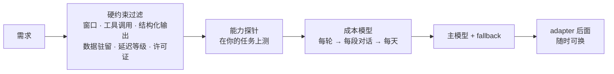
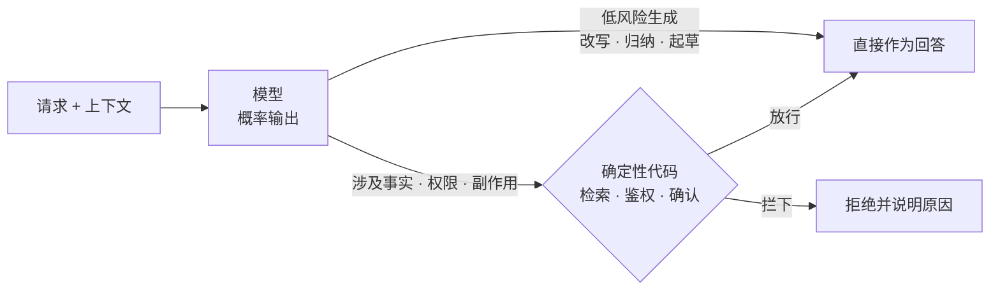

# 01 从模型到应用：能力边界、成本模型与选型

> 前置 F 组讲了模型是怎么工作的。这一课把它当成一个有规格书的部件来用：它哪些事做不稳、一段对话要花多少钱、换掉它要付什么代价。三个问题在项目第一周就得回答，答错了后面全是重做。

## 为什么需要

每个 AI 应用项目开头都会做三个决定：用哪个模型、怎么证明它能做这件事、它会花多少钱。常见做法是看榜单挑一个最强的，写几个 demo 看着不错就上。

三个月后出现的问题几乎是固定的：某类输入它一直做错，但没人知道边界在哪；账单比预想高一个量级，因为没算历史重发；想换模型时发现提示词、解析逻辑、厂商特性全绑在一起。

这一课给的是把这三件事做成可复现流程的最小做法：硬约束过滤、能力探针、成本模型。三个加起来不到一百行。

## 学习目标

- 能为一个具体需求写出模型的硬约束清单，用它筛掉候选，再按「每段对话的成本」而不是「每百万 token 单价」排序
- 能为自己依赖的每一项模型能力写一个确定性探针，并解释为什么探针不能用模型的自我评估代替
- 能用「统计模式而非事实存储」解释幻觉，并为三类场景分别选出应用层的对策

## 前置

- 前置 [F00 LLM 是什么](../../prerequisites/llm-foundations/00-what-an-llm-is/README.md)、[F01 Tokenization](../../prerequisites/llm-foundations/01-tokenization/README.md)、[F04 Context Window 与 Sampling](../../prerequisites/llm-foundations/04-context-window-and-sampling/README.md)、[F07 模型地图](../../prerequisites/llm-foundations/07-model-landscape/README.md)：本课不再解释 token、窗口、采样、模型分类是什么

## 怎么理解它



把模型当部件，四条规格书上的话决定了这门课后面的很多设计：

**能力边界不是能力列表。** 模型卡告诉你它「支持」什么，不告诉你它在你的任务上会怎么错。数字母、做算术、说出训练截止之后的事、按精确长度输出，这些是所有模型都不稳的地方，只是程度不同。边界只能在自己的任务上探出来。

**成本是每轮重发的输入。** 一段对话的账单大头不是回答，是每一轮都要重发的系统提示、工具定义、检索结果和历史。F04 讲了为什么近似平方增长，这一课把它变成一个能填数字的公式。按这个算，两个单价差五倍的模型，在一段对话上的差价可能只有两倍，也可能是十倍，取决于你的固定部分有多大。还有一类模型在回答前先花 token 想一遍，那段思考用户看不到，却照样按输出价计费——见机制拆解第四节。

**幻觉是机制，不是故障。** F00 的 bigram 模型没有随机性也会拼出没见过的句子。应用层只有两条路：把事实放进上下文让它照着说（第 14 课 RAG），或者不让它自由发挥，把输出限制成结构化字段或工具调用（第 02、05 课）。让模型「更努力」、把 temperature 设成 0，都不在选项里。

**模型是可替换的部件，但可替换要设计出来。** 走 OpenAI 兼容协议的模型换起来只改配置，这是原则 12。真正的锁定来自三处：为某个模型调好的提示词、依赖厂商私有特性的代码、没有评测集所以换了也不知道好坏。前两处靠边界隔离，第三处靠第 18 课。

这四条合起来就是一条边界：模型负责生成，事实、权限和副作用归系统。



模型说得多确信，都不构成系统授权。这条边界是原则 01，后面每一课都在它上面加东西。

## 机制拆解

下面几段代码只为说明机制，省略了 import 和输出格式化。

### 一、硬约束在前，价格在后

顺序不能换。一个候选只要违反一条硬约束就出局，不管它多便宜。

```python
LATENCY_ORDER = {"fast": 0, "medium": 1, "slow": 2}

def peak_input_tokens(req) -> int:
    """最后一轮的输入：固定部分，加上之前每一轮都要重发的历史。"""
    return (req.fixed_input_per_turn
            + (req.turns - 1) * (req.user_tokens_per_turn + req.output_tokens_per_turn)
            + req.user_tokens_per_turn)

def hard_filter(c, req) -> list[str]:
    """返回出局理由；空列表表示通过。"""
    reasons = []
    needed = peak_input_tokens(req) + req.output_tokens_per_turn
    if c.context_window < max(req.min_context, needed):
        reasons.append(f"窗口 {c.context_window} 装不下最后一轮的 {needed}")
    if req.needs_tool_calling and not c.tool_calling:
        reasons.append("不支持工具调用")
    if c.residency not in req.allowed_residency:
        reasons.append(f"数据驻留 {c.residency} 不合规")
    if LATENCY_ORDER[c.latency_class] > LATENCY_ORDER[req.max_latency_class]:
        reasons.append(f"太慢（{c.latency_class}）")
    return reasons
```

`peak_input_tokens` 是这段里唯一需要想一下的函数。很多人估窗口时只算「一轮的输入」，结果第八轮左右开始报 400，而且只在长对话用户身上出现，很难复现。

候选的规格该长这样——注意每个数字都要带查价日期，价格和窗口每季度都在变：

```python
Candidate(name="hosted-cn-large", context_window=128_000,
          price_in_per_m=0.55, price_out_per_m=2.20,
          tool_calling=True, structured_output=True,
          residency="cn", latency_class="medium")
```

### 二、成本按「一段对话」算，不按「一次调用」算

```python
def cost_per_conversation(c, req) -> float:
    total_in, history = 0, 0
    for _ in range(req.turns):
        # 每一轮都要重发：固定部分 + 到目前为止的全部历史 + 本轮用户输入
        total_in += req.fixed_input_per_turn + history + req.user_tokens_per_turn
        history += req.user_tokens_per_turn + req.output_tokens_per_turn
    total_out = req.turns * req.output_tokens_per_turn
    return total_in / 1e6 * c.price_in_per_m + total_out / 1e6 * c.price_out_per_m
```

`history` 那个累加是全部重点。它让输入 token 随轮数近似平方增长，而输出只是线性的。填一组你自己的数字进去跑一遍，通常会发现：**固定部分（系统提示 + 工具定义 + 检索结果）比模型单价更能决定账单**。

这也解释了为什么第 08 课要花整整一课讲上下文裁剪。

### 三、探针 = 一个提示 + 一个确定性检查

```python
@dataclass(frozen=True)
class Probe:
    capability: str
    prompt: str
    check: Callable[[str], bool]      # 关键：确定性代码，不是模型判断
    why_it_matters: str

PROBES = [
    Probe("json_format",
          '只返回 JSON，包含 city 和 country 两个键，内容是法国首都。',
          is_json_with_keys("city", "country"),
          "结构化输出解析（第 02 课）"),
    Probe("arithmetic",
          "37 * 43 等于多少？只回答数字。",
          contains_number(1591),
          "任何算术都该走工具（第 05 课）"),
    Probe("counting",
          "strawberry 里有几个字母 r？只回答数字。",
          contains_number(3),
          "token 不是字母（F01）"),
    Probe("admits_unknown",
          "描述 Zorblax-9 公开 API 的三个端点。",
          admits_uncertainty,
          "对不存在的东西流畅作答就是幻觉（F00）"),
]
```

每个探针必须配一句 `why_it_matters`：这项能力挂了，我的应用哪里会坏。写不出这句话的探针，说明你并不真的依赖这项能力，删掉。

跑法很简单：对每个候选跑一遍全套探针，记下通过率。模型升级、提示词改动、供应商换版本，任一发生都重跑一遍。

### 四、推理模型：一笔看不见的输出

有一类模型在回答之前先生成一段思考内容。这段内容用户看不到，但**按输出价计费，也占窗口**，所以上面那个公式对它是错的。

```python
def cost_per_conversation(c, req) -> float:
    total_in, history = 0, 0
    for _ in range(req.turns):
        total_in += req.fixed_input_per_turn + history + req.user_tokens_per_turn
        history += req.user_tokens_per_turn + req.output_tokens_per_turn   # ← 思考内容不进历史
    thinking = req.turns * req.reasoning_tokens_per_turn                   # ← 按输出价算，但不累积
    total_out = req.turns * req.output_tokens_per_turn + thinking
    return total_in / 1e6 * c.price_in_per_m + total_out / 1e6 * c.price_out_per_m
```

两行注释就是全部区别。思考让**每一轮**变贵，但它不像历史那样平方增长，因为下一轮通常不重发它。代价换到了别处：首字延迟从秒级变成十几秒，而且 `reasoning_tokens_per_turn` 是几百还是几万，取决于任务难度和你设的思考预算，**事前估不准，只能实测**。

各家的传递规则还不一样：有的要求同一轮里多次工具调用之间把思考内容原样带回，有的用一个会话 id 在服务端复用。写 adapter 时这是最容易踩的一处不兼容，用之前查各自的文档（原则 12）。

## 常见错误

**按榜单选模型。** 榜单测的是别人的任务。真实模型在探针上的表现往往参差：算术过了，数字母挂了。没在自己任务上跑过探针就选定模型，等于把评测外包给了不认识的人。

**跳过硬约束直接比价。** 一个 4k 窗口的模型靠单价胜出，然后第 12 轮的输入就超出了它的窗口。约束在前，价格在后。

**相信模型的自我评估。** 把 `check` 从确定性函数换成「模型说自己 confident 了吗」，通过率会从五分之二变成五分之四——全是假的。模型对自己的判断和它对事实的判断来自同一个机制，同样不可靠。检查必须是确定性代码，这是原则 01 在选型阶段的形态。

**默认用推理模型做所有任务。** 抽取、分类、改写、格式转换这类有确定答案的任务，推理模型贵几倍、慢十几秒，准确率却不见得更高，有时还会因为「想多了」偏离格式要求。它的收益在多步推导和需要自我纠错的任务上。选型时把这两类任务分开测。

**只算输出 token，或用字数估 token。** 输入随历史增长，很快成为主要开销。中英文 token 比例差一倍；粗估时中文按每字 1.5 token 算，要精确就用供应商的计数接口。

## 取舍

- **一个应用里用几个模型。** 分类、抽取、路由用便宜的小模型，开放对话用大模型，是常态而不是例外。代价是探针和评测集要分别维护，适配器层要支持按任务路由（第 20 课）。
- **中文场景的成本。** 同样内容中文多花一半到一倍 token。提示词的固定部分用英文写、用户内容保持中文，是很多中文产品的实际做法；代价是维护两种语言的提示。
- **长窗口还是检索。** 供应商给了 128k 不代表应该填满。越长越贵越慢，中间部分更容易被忽略。多数场景下「检索出相关的 4k」比「塞进全部 100k」更准也更便宜（第 08、14 课）。
- **推理模型还是小模型加工具。** 一道要算术又要查表的题，可以交给推理模型自己想，也可以让小模型调计算器和检索工具。前者代码少、延迟高、过程不可见；后者每一步都能断言、能复现，代价是要维护工具（第 05 课）。**任务的步骤越固定，第二条路越划算。**
- **厂商托管特性和可替换性。** 服务端工具、托管会话、提示缓存这些特性能省不少代码，但每用一个就多一处锁定。用之前问一句：换供应商时这段代码怎么办。

## 工程落地

选型在生产里不是一次性决定，是一组会随时间变的配置加一条持续跑的检查：

- **模型注册表放配置里，不放代码里**：模型 id、版本钉死、价格和查价日期、窗口、能力标志、供应商。上面的 `Candidate` 就是它的雏形。换模型只改配置。
- **怎么测。** 五个探针加一条通过率基线，就是这门课的第一个评测集。换模型、换版本、供应商悄悄升级，都重跑一遍，跌破基线不上线。它会一路长成第 18 课的 golden set。
- **成本按租户记账**。每次调用的 usage 落库，按天按租户汇总，和供应商账单对账。没有这张表，「这个月为什么贵了三倍」只能靠猜。
- **fallback 模型从第一天就配好**。主模型超时或熔断时切备用（第 20 课）。fallback 模型要过同一组探针，否则切过去的那一刻质量未知。

## 框架映射

三个框架对「模型」这一层的抽象方式不同，决定了换供应商的代价。

| 本课概念 | LangGraph（LangChain） | OpenAI Agents SDK | Claude Agent SDK |
|---|---|---|---|
| 模型抽象 | `BaseChatModel`，`init_chat_model("provider:model")` 按字符串选供应商 | `Model` / `ModelProvider` 接口，默认 OpenAI | 绑定 Anthropic 模型，用 options 里的 `model` 选型号 |
| 换供应商的代价 | 改一个字符串，前提是有对应集成 | 改 provider 或 base URL；厂商私有特性随之失效 | 不支持换供应商，这是选它时要接受的锁定 |
| 用量与成本读取 | 消息上的 `usage_metadata` | `RunResult` 的 usage 汇总 | 每条消息带 usage |

三列里没有哪一列「更好」，只有「你能接受哪种锁定」。官方文档：[LangGraph](https://langchain-ai.github.io/langgraph/) · [OpenAI Agents SDK](https://openai.github.io/openai-agents-python/) · [Claude Agent SDK](https://docs.claude.com/en/api/agent-sdk/overview)（核对日期 2026-09-05）。

## 一线经验

语音机器人项目的两件事。

早期系统提示用中文写了两千多字的人设和规则，每轮对话固定开销超过三千 token。后来把规则部分改成英文并精简，token 减少约四成，延迟和成本同时下降，用户感知不到区别。

另一件是模型升级：供应商发了新版本，团队直接切过去，两天后发现意图识别的一类边界用例全挂了。之后每次升级先跑探针集——上面那套探针就是这么来的。

## 参考实现

想看这一课的机制装进一个真实服务是什么样：参考实现的 [M5 生产化](https://github.com/lance2016/ai-app-engineering-ref/blob/main/project/m5-production/README.md)，成本账与 fallback。

## 延伸阅读

- [generative-ai-for-beginners · 02 Exploring and comparing LLMs](https://github.com/microsoft/generative-ai-for-beginners/tree/main/02-exploring-and-comparing-different-llms)（访问日期 2026-09-04）：模型分类和「在自己的数据上测」的讲法。
- [OpenAI · Model selection](https://platform.openai.com/docs/guides/model-selection)（访问日期 2026-09-04）：「先用最强的模型建评测，再往下换」的顺序值得借。
- [Artificial Analysis](https://artificialanalysis.ai/)（访问日期 2026-09-04）：独立的价格、延迟、吞吐对比。用它做初筛，不要用它替代探针。
- [OpenAI · Reasoning models](https://platform.openai.com/docs/guides/reasoning)（访问日期 2026-09-06）：reasoning token 怎么计费、effort 怎么选。
- [Anthropic · Extended thinking](https://docs.claude.com/en/docs/build-with-claude/extended-thinking)（访问日期 2026-09-06）：另一家的形态。和上一条对着看，能分清哪些是通用机制、哪些是厂商自己的规定。
- [12-factor-agents · factor 01 Natural language to tool calls](https://github.com/humanlayer/12-factor-agents/blob/main/content/factor-01-natural-language-to-tool-calls.md)（访问日期 2026-09-04）：把输出限制成结构化调用，是应对幻觉的第二条路的出处。

---

[← 上一课 00](../00-setup/README.md) · [下一课 02 →](../02-model-api-structured-output-streaming/README.md)
