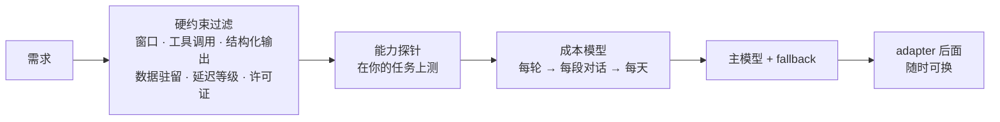

# 01 从模型到应用：能力边界、成本模型与选型

> 前置 F 组讲了模型是怎么工作的。这一课把它当成一个有规格书的部件来用：它哪些事做不稳、一段对话要花多少钱、换掉它要付什么代价。三个问题在项目第一周就得回答，答错了后面全是重做。

## 为什么需要

每个 AI 应用项目开头都会做三个决定：用哪个模型、怎么证明它能做这件事、它会花多少钱。常见的做法是看榜单挑一个最强的，写几个 demo 看着不错就上。三个月后出现的问题几乎是固定的：某类输入它一直做错，但没人知道边界在哪；账单比预想高一个量级，因为没算历史重发；想换模型时发现提示词、解析逻辑、厂商特性全绑在一起。这一课给的是把这三件事做成可复现流程的最小做法：硬约束过滤、能力探针、成本模型，三个都是几十行代码。

## 学习目标

- 能为一个具体需求写出模型的硬约束清单，用它筛掉候选，再按"每段对话的成本"而不是"每百万 token 单价"排序
- 能为自己依赖的每一项模型能力写一个确定性探针，并解释为什么探针不能用模型的自我评估代替
- 能用"统计模式而非事实存储"解释幻觉，并为三类场景分别选出应用层的对策

## 前置

- 前置 [F00 LLM 是什么](../../prerequisites/llm-foundations/00-what-an-llm-is/README.md)、[F01 Tokenization](../../prerequisites/llm-foundations/01-tokenization/README.md)、[F04 Context Window 与 Sampling](../../prerequisites/llm-foundations/04-context-window-and-sampling/README.md)、[F07 模型地图](../../prerequisites/llm-foundations/07-model-landscape/README.md)：本课不再解释 token、窗口、采样、模型分类是什么
- [00 环境与模型接入](../00-setup/README.md)：`aiapp.get_adapter()` 和 fake adapter

## 心智模型

把模型当部件，四条规格书上的话决定了这门课后面的很多设计：

**能力边界不是能力列表。** 模型卡告诉你它"支持"什么，不告诉你它在你的任务上会怎么错。数字母、做算术、说出训练截止之后的事、按精确长度输出，这些是所有模型都不稳的地方，程度不同。边界只能在自己的任务上探出来，探针就是"一个提示加一个确定性检查"，上线前跑一遍，每次换模型再跑一遍。

**成本是每轮重发的输入。** 一段对话的账单大头不是回答，是每一轮都要重发的系统提示、工具定义、检索结果和历史。F04 讲了为什么近似平方增长，这一课把它变成一个可以填数字的公式：固定部分乘轮数，加历史增量的累加。按这个算，两个单价差五倍的模型，在一段对话上的差价可能只有两倍，也可能是十倍，取决于你的固定部分有多大。

**幻觉是机制，不是故障。** F00 的 bigram 模型没有随机性也会拼出没见过的句子。应用层只有两条路：把事实放进上下文让它照着说，这是第 13 课 RAG；或者不让它自由发挥，把输出限制成结构化字段或工具调用，这是第 02 课和第 05 课。让模型"更努力"、把 temperature 设成 0 都不在选项里。

**模型是可替换的部件，但可替换要设计出来。** 走 OpenAI 兼容协议的模型换起来只改 adapter 配置，这是原则 12。真正的锁定来自三处：为某个模型调好的提示词、依赖厂商私有特性的代码、没有评测集所以换了也不知道好坏。前两处靠边界隔离，第三处靠第 17 课。

## 最小可运行例子

| 文件 | 演示什么 | 运行 |
|---|---|---|
| [`code/01_model_selection_matrix.py`](./code/01_model_selection_matrix.py) | 六个假想候选过五条硬约束，幸存者按每段对话成本排序；所有数字都带日期，是假设不是行情 | `uv run python lessons/01-how-llms-work/code/01_model_selection_matrix.py`，加 `INJECT_IGNORE_CONTEXT=1` 看跳过窗口约束会选出什么 |
| [`code/02_capability_probe.py`](./code/02_capability_probe.py) | 五个能力探针：JSON 格式、算术、数字母、按数量输出、承认不知道；fake 模型回放一组"自信但错"的答案 | 同上；`MODEL_PROVIDER=deepseek` 测真实模型；`INJECT_TRUST_SELF_REPORT=1` 看用自我评估代替检查的后果 |
| [`code/03_context_window_budget.py`](./code/03_context_window_budget.py) | 逐轮算窗口占用和累计成本，看历史怎么吃掉预算 | 同上，加 `INJECT_LONG_HISTORY=1` 看溢出 |

`01` 的候选名字是"hosted-cn-large"这类占位符，故意不写真实厂商，因为价格和窗口每季度都在变。用它的时候把候选换成你当天查到的数字，日期一起写进去。`02` 在 fake 模式下五个探针固定两过三挂，报表的形状是重点；接真实模型后数字才是重点。`03` 的价格也是示例。

## 常见错误与失败注入

**按榜单选模型。** 榜单测的是别人的任务。`02` 里 fake 模型的算术过了、数字母挂了，真实模型的分布不同但同样参差。没有在自己任务上跑过探针就选定模型，等于把评测外包给了不认识的人。

**跳过硬约束直接比价。** `INJECT_IGNORE_CONTEXT=1` 时 `01` 让一个 4k 窗口的模型靠单价胜出，脚本末尾算出第 12 轮的输入已经超过它的窗口。生产里这是从第八轮左右开始的 400 错误，而且只在长对话用户身上出现，很难复现。约束在前，价格在后，顺序不能换。

**相信模型的自我评估。** `INJECT_TRUST_SELF_REPORT=1` 把每个探针的检查换成"模型说了 confident 吗"，通过率从五分之二变成五分之四。模型对自己的判断和它对事实的判断来自同一个机制，同样不可靠。检查必须是确定性代码，这是原则 01 在选型阶段的版本。

**只算输出 token，或用字数估 token。** `03` 把输入和输出分开算，输入随历史增长很快成为主要开销。中英文 token 比例差一倍，估算时中文按每字 1.5 token 算，精确就用供应商的计数接口。

## 取舍

- **一个应用里用几个模型。** 分类、抽取、路由用便宜的小模型，开放对话用大模型，是常态而不是例外。代价是探针和评测集要分别维护，adapter 层要支持按任务路由，第 19 课讲路由。
- **中文场景的成本。** 同样内容中文多花一半到一倍 token。提示词的固定部分用英文写、用户内容保持中文，是很多中文产品的实际做法；代价是维护两种语言的提示。
- **长窗口还是检索。** 供应商给了 128k 不代表应该填满。越长越贵越慢，中间部分更容易被忽略。多数场景下"检索出相关的 4k"比"塞进全部 100k"更准也更便宜，第 08 课和第 13 课展开。
- **厂商托管特性和可替换性。** 服务端工具、托管会话、提示缓存这些特性能省不少代码，但每用一个就多一处锁定。用之前问一句：换供应商时这段代码怎么办。

## 生产方案

选型在生产里不是一次性决定，是一组会随时间变的配置和一条持续跑的检查：

- **模型注册表**放在配置里而不是代码里：模型 id、版本钉死、价格和查价日期、窗口、能力标志、所属供应商。`01` 的 `Candidate` 就是它的雏形。换模型只改配置。
- **探针进评测集**。`02` 的五个探针是第 17 课 golden set 的最小形态。模型升级、提示词改动、供应商换版本，任一发生都要重跑，通过率跌破基线就不上线。
- **成本按租户记账**。`03` 的逐轮累计在 M5 变成 `cost_ledger` 表，每次调用的 usage 落库，按天按租户汇总，和供应商账单对账。
- **fallback 模型从第一天就配好**。主模型超时或熔断时切备用，第 19 课讲熔断器，M5 落地。fallback 模型要和主模型过同一组探针，否则切过去的那一刻质量未知。

## 框架映射

三个框架对"模型"这一层的抽象方式不同，决定了换供应商的代价。信息以 2026-09-04 的官方文档为准，动手前重新核对。

| 本课概念 | LangGraph（LangChain） | OpenAI Agents SDK | Claude Agent SDK |
|---|---|---|---|
| 模型抽象 | `BaseChatModel`，`init_chat_model("provider:model")` 按字符串选供应商 | `Model` / `ModelProvider` 接口，默认 OpenAI；可换 OpenAI 兼容 base URL 或经 LiteLLM 接其他厂商 | 绑定 Anthropic 模型，用 options 里的 `model` 选具体型号 |
| 换供应商的代价 | 改一个字符串，前提是 LangChain 有对应集成 | 改 provider 或 base URL；厂商私有特性（托管工具、会话）随之失效 | 不支持换供应商，这是选它时要接受的锁定 |
| 用量与成本读取 | 消息上的 `usage_metadata` | `RunResult` 的 usage 汇总 | 每条消息带 usage，SDK 汇总成本 |
| 本课的 adapter 对应 | 自己写一个 `BaseChatModel` 子类就能接 fake | 实现 `Model` 接口接 fake | 没有对应层，离线测试要 mock SDK |

三列里没有哪一列"更好"。Framework Lab 会用同一个需求在三个框架上各做一遍，这张表是其中"Vendor / Framework Lock-in"那一维的起点。

## 练习

见 [exercises.md](./exercises.md)。

## 对照真实项目

主项目从 [M0](../../project/m0-concurrency/README.md) 起每次调用都记录 usage，`03` 的预算表是 M5 成本看板的最小雏形。[`project/src/aiapp/adapters/`](../../project/src/aiapp/adapters/) 里的 `PRESETS` 就是 `01` 里"模型注册表"的代码版：DeepSeek、DashScope、OpenAI 三个预设只差 base URL 和模型名。M5 会加 `FallbackAdapter`，M6 的 ADR-4 要用本课的矩阵和第 21 课的估算器给多租户平台选模型。

语音机器人项目的两个经验。早期系统提示用中文写了两千多字的人设和规则，每轮对话固定开销超过三千 token；后来把规则部分改成英文并精简，token 减少约四成，延迟和成本同时下降，用户感知不到区别。另一个是模型升级：供应商发了新版本，团队直接切过去，两天后发现意图识别的一类边界用例全挂了。之后每次升级先跑探针集，这就是本课 `02` 的来历。

## 延伸阅读

- [generative-ai-for-beginners · 02 Exploring and comparing LLMs](https://github.com/microsoft/generative-ai-for-beginners/tree/main/02-exploring-and-comparing-different-llms)（访问日期 2026-09-04）：模型分类和"在自己的数据上测"的讲法，本课选型部分的骨架。
- [OpenAI · Model selection](https://platform.openai.com/docs/guides/model-selection)（访问日期 2026-09-04）：一家供应商写的选型指南，"先用最强的模型建评测，再往下换"的顺序值得借。
- [Artificial Analysis](https://artificialanalysis.ai/)（访问日期 2026-09-04）：独立的价格、延迟、吞吐对比。用它做候选的初筛，不要用它替代探针。
- [12-factor-agents · factor 01 Natural language to tool calls](https://github.com/humanlayer/12-factor-agents/blob/main/content/factor-01-natural-language-to-tool-calls.md)（访问日期 2026-09-04）：把模型的输出限制成结构化调用，是应对幻觉的第二条路的出处。

---

[← 上一课 00](../00-setup/README.md) · [下一课 02 →](../02-model-api-structured-output-streaming/README.md)
