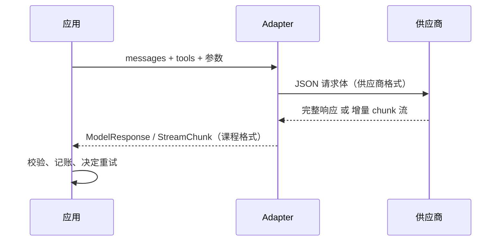
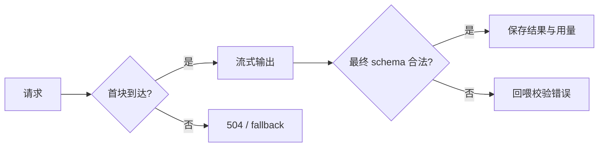
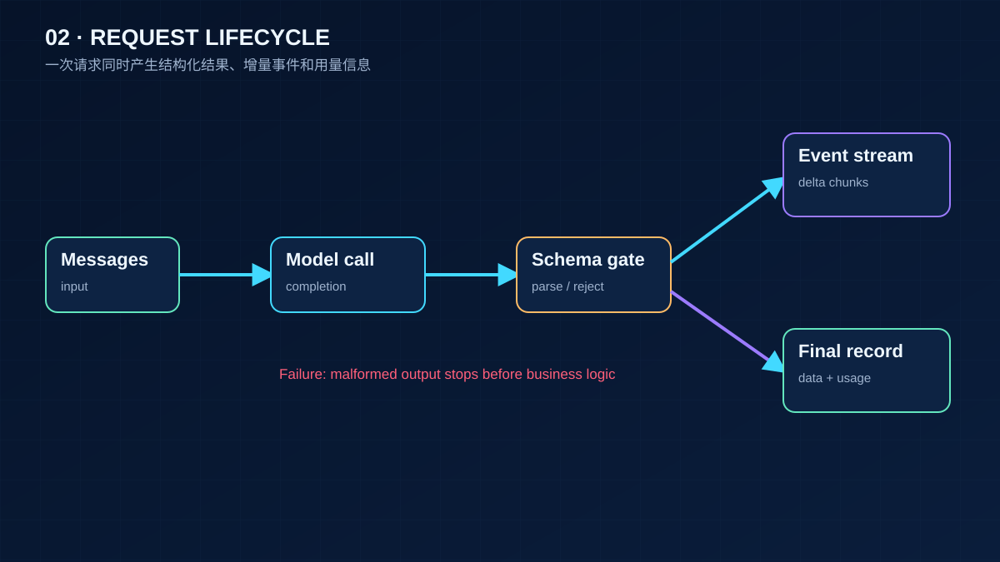

# 02 模型调用、结构化输出与流式

> 一次模型调用只有四样东西：一串消息、几个参数、一段返回、一份用量。这一课把它们拆开看清楚，再补上生产环境没人替你做的两件事：解析失败怎么修，钱怎么记。

## 为什么需要
模型返回的不只是文字：格式可能坏、流可能中断、重试可能重复计费。把消息、schema、增量和用量拆开，才能知道故障发生在协议、解析还是供应商。

## 学习目标

- 能画出一次调用在线上的形状：消息列表怎么变成 JSON、工具结果靠什么和调用对上、temperature 和 max_tokens 各改变什么
- 能用一个 Pydantic 模型同时生成 JSON Schema 和校验返回，并把校验错误回给模型让它自己修
- 能消费流式响应并说清哪些东西只能等最后一块才有；能为一次对话写出重试策略和成本账本

## 前置

- [00 环境与模型接入](../00-setup/README.md)：`aiapp` 的类型和 adapter
- [01 LLM 工作原理与能力边界](../01-how-llms-work/README.md)：token、抽样、上下文窗口是预算
- 前置模块 [P06 Pydantic](../../prerequisites/python/06-pydantic/README.md)、[P07 asyncio](../../prerequisites/python/07-asyncio/README.md)

## 心智模型



四个要点：

**消息是有结构的列表，不是一段字符串。** 每条消息有角色。系统消息放指令，用户和助手消息交替，工具结果是单独一种角色，靠 `tool_call_id` 和助手那条里的调用对上，而不是靠顺序。课程的 `Message` 类型是供应商中立的，adapter 负责翻译成线上格式。线上格式没有"这是个错误"的字段，所以 `is_error=True` 被翻译成内容前缀 `ERROR:`。这类翻译损耗要看得见，`01_messages_and_wire_format.py` 就是把两边并排打印出来。

**参数和消息一起走。** `temperature`、`top_p`、`max_tokens` 放在请求体里和 `messages` 平级。temperature 改的是抽样分布的形状（第 01 课），max_tokens 是输出上限，撞到上限时 `finish_reason` 是 `length` 而不是 `stop`，回答被截断但请求"成功"。工具定义也在同一个请求体里，每次都要发一遍。

**结构化输出是一份 schema 用两次。** 用 Pydantic 模型 `model_json_schema()` 生成给模型看的 JSON Schema，返回后用同一个模型 `model_validate_json()` 校验。校验失败不是异常，是一条新的用户消息："这里不合法，改。"大多数模型第二次就对了。运行时不手动修 JSON。有些供应商支持严格模式（把 schema 交给服务端约束解码），支持的时候用，但客户端校验仍然要有，因为语义错误 schema 挡不住。

**流式改变的是体感，不是计算。** 用户感知的是首 token 时间，你付的是总 token。文本可以一块一块给用户看，但工具调用的参数不完整就不能执行，所以它和用量一起出现在最后一个 `done=True` 的 chunk 上。同一条流，UI 和工具执行器是两个消费者，关心的时刻不同。

还有两件 SDK 不替你做的事：**重试**要区分能重试的（429 限流、超时）和不能重试的（400 请求错误，重发一百次结果一样），退避要指数增长并有上限；**成本**要按用量乘单价逐次记账，单价随时会变，放配置不放代码。

### 正常路径与失败路径




## 最小可运行例子

| 文件 | 演示什么 | 运行 |
|---|---|---|
| [`code/01_messages_and_wire_format.py`](./code/01_messages_and_wire_format.py) | 四条课程消息和它们的线上 JSON 并排打印；工具定义的线上形状 | `uv run python lessons/02-model-api-structured-output-streaming/code/01_messages_and_wire_format.py` |
| [`code/02_structured_output.py`](./code/02_structured_output.py) | Pydantic 模型生成 schema 又做校验；失败回喂给模型修 | 同上，加 `INJECT_BAD_JSON=1` 看第一次返回类型错、日期格式错，第二次通过；`MODEL_PROVIDER=deepseek` 走真模型 |
| [`code/03_streaming.py`](./code/03_streaming.py) | 带时间戳消费流，首 token 时间和总时间分开报；工具调用和用量在最后一块 | 同上，加 `INJECT_SLOW=1` 让每块间隔 0.15 秒，能看到首 token 0.15 秒、全部 1.5 秒 |
| [`code/04_retry_and_cost.py`](./code/04_retry_and_cost.py) | 限流指数退避重试，请求错误不重试；成本账本逐次记账 | 同上，加 `INJECT_RATE_LIMIT=1` 看前两次 429 后 0.05 秒、0.10 秒退避 |
| [`code/05_real_params_probe.py`](./code/05_real_params_probe.py) | 可选：真模型上 temperature 0 和 1.3 各跑三次，max_tokens=2 看截断 | 需要 key：`MODEL_PROVIDER=deepseek uv run python ...`，没有 key 打印提示退出 |

`03` 用了 `FakeAdapter` 的 `chunk_size` 和 `chunk_delay` 两个参数，把一段完整回答切成小块回放。真实 adapter 的 `stream()` 在 `project/src/aiapp/adapters/openai_compat.py`，请求时带 `stream=True` 和 `stream_options={"include_usage": True}`，不带后者最后一块拿不到用量。

`04` 里的单价写在代码里只是为了演示，注释标了日期。真实项目从配置读。

## 常见错误与失败注入

**把校验失败当成崩溃。** `02_structured_output.py` 用 `INJECT_BAD_JSON=1` 让模型第一次返回 `number` 是整数、日期是 `30/08/2026`、金额是带逗号的字符串。校验报的第一条是 `Input should be a valid string`，这条原文作为下一轮用户消息发回去，第二次就对了。如果把 `except` 删掉，程序在第一次就死了，模型连改的机会都没有。

**自己动手修 JSON。** 看到 `"total": "1,280.50"` 就写个正则去掉逗号，看到日期格式不对就写个转换。每修一处就是一条没人记得的业务规则，而且模型下次换个花样又要修。让模型改，运行时只负责判对错。

**忘了剥代码围栏。** 很多模型即使被要求"只输出 JSON"也会包一层 ```` ```json ````。`02` 里 `_strip_fences` 就是干这个的。这是极少数值得在运行时做的归一化，因为它无歧义且和业务无关。

**流式时在第一块就动手。** `03_streaming.py` 里工具调用只在 `done=True` 那块出现。如果 UI 消费者和工具消费者共用一个回调、在收到任何 chunk 时就尝试解析工具参数，会在参数还是半截 JSON 的时候执行。

**重试 400。** `04` 的 `complete_with_retry` 对 `BadRequest` 直接 `raise`。请求体本身错了，重发只是重复错误并多付一次钱。能重试的只有 429、5xx、超时这类"再试可能不一样"的错误。

**用量只记输出。** `04` 记的是 `input_tokens` 加 `output_tokens` 分别乘单价。多轮对话里输入随历史增长，是主要开销；只记输出会低估几倍。第 01 课算过这个账。

## 取舍

- **严格 schema 模式 vs 客户端校验。** 服务端约束解码几乎消灭格式错误，但不是所有供应商和模型都支持，且 schema 特性受限（有的不支持 `pattern`、`format`）。客户端校验永远要有，它还能挡语义错误。两者叠加是常态。
- **流式 vs 一次返回。** 流式让首 token 快，代价是客户端逻辑复杂：要处理半截文本、断线重连、以及"工具调用要等最后"。后台任务、结构化抽取、评测跑批不需要流式，别为不需要的东西付复杂度。
- **重试次数与延迟。** 面向用户的实时调用，一次重试可能就超出可接受等待；后台任务可以多试。退避的上限和总次数应该是调用方的参数，不是写死的常量。第 19 课把它扩展成限流和熔断。
- **temperature 设多少。** 抽取、分类、工具选择用 0 或接近 0，要的是稳定；创作类任务才调高。0 不保证正确，只保证每次一样，评测时这一点很重要。

## 生产方案
M1 的 [`run_turn`](../../project/src/aiapp/runtime/turn.py) 负责首块前后的错误边界，M5 的成本与 resilience 代码负责预算、重试和 fallback。

## 框架映射

| 本课概念 | LangGraph | OpenAI Agents SDK | Claude Agent SDK |
|---|---|---|---|
| structured output / streaming | response schema + streaming events | output types + streamed events | content blocks + message stream |

*映射按 Framework Lab 的概念边界整理，框架行为以官方文档和 [Framework Lab](../../project/framework-lab/README.md) 在 2026-09-04 的实现证据为准。*


## 练习

见 [exercises.md](./exercises.md)。

## 对照真实项目

主项目 [M0](../../project/m0-concurrency/README.md) 的并发实验用的就是本课的 `complete()` 和 `stream()`。[M1 API 骨架](../../project/m1-api-skeleton/README.md) 把 `03` 的流式变成了一个 SSE 端点：[`aiapp/runtime/turn.py`](../../project/src/aiapp/runtime/turn.py) 的 `run_turn()` 消费 `stream()`，文本增量作为 `assistant_delta` 事件推给客户端，`run_finished` 事件里带本轮 usage；`tests/project/m1/test_threads.py` 断言增量拼起来等于最终消息。首块超时返回 504、供应商报错返回 502 的映射在 [`aiapp/api/errors.py`](../../project/src/aiapp/api/errors.py)。`04` 的重试和成本账本要到 M5 才进 adapter 层。

作者的语音机器人项目有一条相关经验：早期结构化输出靠在提示词里反复强调"只输出 JSON"，线上仍有百分之几的返回带解释文字或围栏，每次都是客服反馈后手动补规则。后来改成本课的做法，schema 和校验用同一个 Pydantic 模型，失败原文回喂重试一次，格式类错误基本消失，剩下的都是真正的语义错误，这些才值得人看。另一条是流式：TTS 需要一边收文本一边合成，但设备动作命令必须等完整参数。两个消费者读同一条流，前者按句号切句，后者只看最后一块。

## 延伸阅读

- [Anthropic · Messages API](https://platform.claude.com/docs/en/api/messages)（访问日期 2026-09-04）：一个供应商完整的请求体定义，对照 `01` 的线上形状看，注意角色、工具结果和参数都在同一层。
- [Anthropic · Structured outputs](https://platform.claude.com/docs/en/build-with-claude/structured-outputs)（访问日期 2026-09-04）：服务端约束输出格式的做法和它的限制，读完你就知道客户端校验为什么还是要留。
- [OpenAI · Structured Outputs 指南](https://platform.openai.com/docs/guides/structured-outputs) 与 [Cookbook 示例](https://cookbook.openai.com/examples/structured_outputs_intro)（访问日期 2026-09-04）：另一家的等价机制，Cookbook 里从 Pydantic 模型直接生成 schema 的写法和 `02` 一致。
- [DeepSeek · JSON Output](https://api-docs.deepseek.com/guides/json_mode) 与 [参数设置](https://api-docs.deepseek.com/quick_start/parameter_settings)（访问日期 2026-09-04）：课程默认供应商的 JSON 模式要求提示词里含 "json" 字样，以及不同任务的 temperature 建议值。
- [Anthropic · Streaming](https://platform.claude.com/docs/en/build-with-claude/streaming) 与 [OpenAI · Streaming responses](https://platform.openai.com/docs/guides/streaming-responses)（访问日期 2026-09-04）：事件类型和最后一块的内容，`StreamChunk.done` 的设计来源。
- [generative-ai-for-beginners · 06 Text generation apps](https://github.com/microsoft/generative-ai-for-beginners/blob/main/06-text-generation-apps/README.md)、[07 Chat applications](https://github.com/microsoft/generative-ai-for-beginners/blob/main/07-building-chat-applications/README.md)（访问日期 2026-09-04）：通识层面的调用与对话应用讲法，可以对照检查本课有没有漏掉初学者会问的问题。

---

[← 上一课 01](../01-how-llms-work/README.md) · [下一课 03 →](../03-prompt-engineering/README.md)
