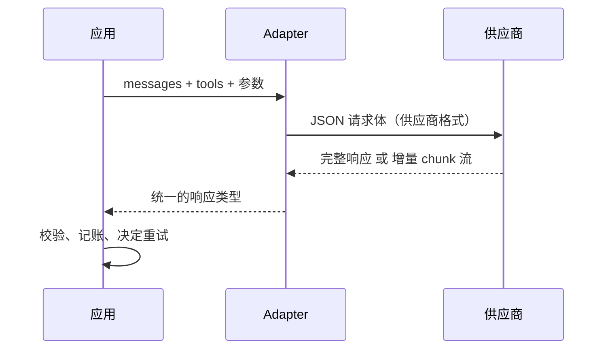
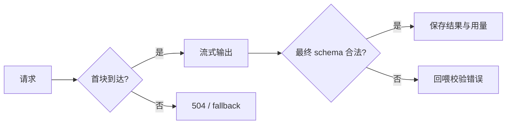

# 02 模型调用、结构化输出与流式

> 一次模型调用只有四样东西：一串消息、几个参数、一段返回、一份用量。这一课把它们拆开看清楚，再补上生产环境没人替你做的两件事：解析失败怎么修，钱怎么记。

## 为什么需要

模型返回的不只是文字：格式可能坏、流可能中断、重试可能重复计费。把消息、schema、增量和用量拆开，才能知道故障发生在协议、解析还是供应商。

## 学习目标

- 能画出一次调用在线上的形状：消息列表怎么变成 JSON、工具结果靠什么和调用对上、temperature 和 max_tokens 各改变什么
- 能用一个 Pydantic 模型同时生成 JSON Schema 和校验返回，并把校验错误回给模型让它自己修
- 能消费流式响应并说清哪些东西只能等最后一块才有
- 能为一次对话写出重试策略和成本账本

## 前置

- [01 从模型到应用](../01-how-llms-work/README.md)：token、抽样、上下文窗口是预算

## 心智模型



四个要点：

**消息是有结构的列表，不是一段字符串。** 每条消息有角色。系统消息放指令，用户和助手消息交替，工具结果是单独一种角色，靠 `tool_call_id` 和助手那条里的调用对上，**而不是靠顺序**。

**参数和消息一起走。** `temperature`、`top_p`、`max_tokens` 放在请求体里，和 `messages` 平级。temperature 改的是抽样分布的形状（第 01 课）；`max_tokens` 是输出上限，撞到上限时 `finish_reason` 是 `length` 而不是 `stop`——回答被截断，但请求「成功」了。工具定义也在同一个请求体里，每次都要重发一遍。

**结构化输出是一份 schema 用两次。** 用 Pydantic 模型生成给模型看的 JSON Schema，返回后用同一个模型校验。校验失败不是异常，是一条新的用户消息：「这里不合法，改。」大多数模型第二次就对了。**运行时不手动修 JSON。**

**流式改变的是体感，不是计算。** 用户感知的是首 token 时间，你付的是总 token。文本可以一块一块给用户看，但工具调用的参数不完整就不能执行，所以它和用量一起出现在最后一块上。同一条流，UI 和工具执行器是两个消费者，关心的时刻不同。




还有两件 SDK 不替你做的事。**重试**要区分能重试的（429 限流、超时）和不能重试的（400 请求错误，重发一百次结果一样），退避要指数增长并有上限。**成本**要按用量乘单价逐次记账，单价随时会变，放配置不放代码。

## 机制拆解

### 一、消息到线上格式的翻译有损耗

课程用的中立消息类型是这样一组：

```python
Message(role="system",    content="You are terse.")
Message(role="user",      content="Weather in Shenzhen?")
Message(role="assistant", tool_calls=(ToolCall(id="call_1", name="get_weather",
                                               arguments={"city": "Shenzhen"}),))
Message(role="tool",      tool_call_id="call_1",
        content="service unavailable", is_error=True)
```

翻译成 OpenAI 兼容格式时，前三条几乎一一对应。第四条有个问题：**线上格式没有「这是个错误」的字段**。所以适配器只能把它编码进内容里：

```python
def to_wire(m: Message) -> dict:
    if m.role == "tool":
        content = f"ERROR: {m.content}" if m.is_error else m.content
        return {"role": "tool", "tool_call_id": m.tool_call_id, "content": content}
    ...
```

这类翻译损耗值得看见。模型能不能识别出「这是个失败」，取决于你这个前缀写得够不够明确——这是提示工程侵入协议层的一个例子。

### 二、一份 schema 用两次，失败就回喂

```python
class Invoice(BaseModel):
    number: str
    vendor: str
    date: str = Field(pattern=r"^\d{4}-\d{2}-\d{2}$")
    total: float
    currency: str = Field(min_length=3, max_length=3)
    items: list[LineItem]

SYSTEM = ("Extract the invoice as JSON matching this JSON Schema exactly. "
          "Output only the JSON object.\n"
          + json.dumps(Invoice.model_json_schema(), ensure_ascii=False))

async def extract(model, text, max_attempts=3) -> Invoice:
    messages = [Message(role="system", content=SYSTEM),
                Message(role="user", content=text)]
    for attempt in range(1, max_attempts + 1):
        reply = await model.complete(messages)
        try:
            return Invoice.model_validate_json(strip_fences(reply.content))
        except ValidationError as exc:
            detail = exc.errors()[0]["msg"]          # 报第一条就够，别一次给十条
            messages.append(Message(role="assistant", content=reply.content))
            messages.append(Message(role="user",
                content=f"That was not valid: {detail}. Return only the corrected JSON."))
    raise RuntimeError("model never produced valid JSON")
```

模型第一次可能返回 `{"number": 4471, "date": "30/08/2026", "total": "1,280.50"}`——数字类型错、日期格式错、金额带逗号。Pydantic 报的第一条错误原文直接发回去，第二次基本就对了。

`strip_fences` 是极少数值得在运行时做的归一化：很多模型即使被要求「只输出 JSON」也会包一层 ```` ```json ````。它无歧义、和业务无关，所以可以自动处理。**除此之外的修补都该交给模型**。

### 三、流式的两个消费者

```python
async def run(model, messages):
    started = time.monotonic()
    first_token_at = None
    text = []

    async for chunk in model.stream(messages, tools=tools):
        if chunk.delta:                      # 文本增量：UI 立刻显示
            if first_token_at is None:
                first_token_at = time.monotonic() - started
            text.append(chunk.delta)
            ui.append(chunk.delta)

        if chunk.done:                       # 只有最后一块才有这些
            tool_calls = chunk.tool_calls    # 参数完整了才能执行
            usage = chunk.usage              # 记账靠它
```

首 token 时间和总时间要分开测。用户投诉「慢」，八成指的是首 token，不是总时长。

请求真实供应商的流式接口时，记得带 `stream_options={"include_usage": True}`——不带这个，最后一块拿不到用量，你的成本账本就是空的。

### 四、重试要看错误类型，不看次数

```python
async def complete_with_retry(model, messages, max_attempts=4, base_delay=0.05):
    for attempt in range(1, max_attempts + 1):
        try:
            return await model.complete(messages)
        except RateLimited:
            if attempt == max_attempts:
                raise
            await asyncio.sleep(base_delay * 2 ** (attempt - 1))   # 指数退避
        except BadRequest:
            raise            # 请求体本身错了，重发只是重复错误并多付一次钱
```

成本账本就是一次乘法，关键是**每次调用都记**，而不是月底看账单：

```python
def record(self, label, usage, provider) -> float:
    price_in, price_out = PRICES[provider]        # 单价来自配置，不是代码
    cost = (usage.input_tokens  / 1e6 * price_in
          + usage.output_tokens / 1e6 * price_out)
    self.entries.append((label, usage, cost))
    return cost
```

单次调用的数字小到看着无所谓。乘以用户数和轮数之后再判断它便不便宜。

## 常见错误

**把校验失败当成崩溃。** 删掉那个 `except`，程序在第一次就死了，模型连改的机会都没有。校验失败是正常路径的一部分。

**自己动手修 JSON。** 看到 `"total": "1,280.50"` 就写个正则去逗号，看到日期格式不对就写个转换。每修一处就是一条没人记得的业务规则，而且模型下次换个花样又要修。让模型改，运行时只判对错。

**流式时在第一块就动手。** 工具调用只在最后一块出现。如果 UI 消费者和工具消费者共用一个回调，会在参数还是半截 JSON 的时候执行。

**重试 400。** 请求体本身错了，重发只是重复错误并多付一次钱。能重试的只有 429、5xx、超时这类「再试可能不一样」的错误。

**用量只记输出。** 多轮对话里输入随历史增长，是主要开销；只记输出会低估几倍。第 01 课算过这笔账。

## 取舍

- **严格 schema 模式 vs 客户端校验。** 服务端约束解码几乎消灭格式错误，但不是所有供应商和模型都支持，且 schema 特性受限（有的不支持 `pattern`、`format`）。客户端校验永远要有，它还能挡语义错误。两者叠加是常态。
- **流式 vs 一次返回。** 流式让首 token 快，代价是客户端逻辑复杂：半截文本、断线重连、工具调用要等最后。后台任务、结构化抽取、评测跑批不需要流式，别为不需要的东西付复杂度。
- **重试次数与延迟。** 面向用户的实时调用，一次重试可能就超出可接受等待；后台任务可以多试。退避的上限和总次数应该是调用方的参数，不是写死的常量。第 19 课把它扩展成限流和熔断。
- **temperature 设多少。** 抽取、分类、工具选择用 0 或接近 0，要的是稳定；创作类任务才调高。**0 不保证正确，只保证每次一样**——评测时这一点很重要。

## 工程落地

- **首块超时和整体超时是两个值。** 首块超时短（用户等不了），整体超时长（长回答正常）。映射到 HTTP 上，首块超时返回 504，供应商报错返回 502，两者的排查方向完全不同。
- **流式接口一旦开始推送，就不能再改 HTTP 状态码。** 首块之后出错，只能在流里推一个 `error` 事件。所以所有能在首块前做的检查（鉴权、限流、参数校验）都必须在首块前做完。
- **usage 要落库，不是打日志。** 「这个租户这个月花了多少」要能查出来，不能靠 grep。
- **重试和幂等要一起设计。** 一次带副作用的调用超时重试，可能产生两次副作用。第 05 课讲幂等键。

## 框架映射

| 本课概念 | LangGraph | OpenAI Agents SDK | Claude Agent SDK |
|---|---|---|---|
| 结构化输出 | `with_structured_output(schema)` | agent 的 `output_type` | 工具 schema 或提示约束 |
| 流式 | `astream` / `astream_events` | `Runner.run_streamed` 的事件流 | 消息流的 content block |
| 重试与成本 | 自己写，或用 LangChain 的 retry 包装 | 自己写 | 自己写 |

官方文档：[LangGraph](https://langchain-ai.github.io/langgraph/) · [OpenAI Agents SDK](https://openai.github.io/openai-agents-python/) · [Claude Agent SDK](https://docs.claude.com/en/api/agent-sdk/overview)（核对日期 2026-09-05）。

## 一线经验

语音机器人项目早期靠在提示词里反复强调「只输出 JSON」，线上仍有百分之几的返回带解释文字或代码围栏，每次都是客服反馈后手动补规则。改成本课的做法之后——schema 和校验共用一个 Pydantic 模型，失败原文回喂重试一次——格式类错误基本消失，剩下的都是真正的语义错误。这些才值得人看。

另一条是流式的两个消费者：TTS 需要一边收文本一边合成，但设备动作命令必须等完整参数。同一条流，前者按句号切句立刻发声，后者只看最后一块。这两个需求写在一个回调里必然打架。

## 练习

见 [exercises.md](./exercises.md)。

## 延伸阅读

- [Anthropic · Messages API](https://platform.claude.com/docs/en/api/messages)（访问日期 2026-09-04）：一个供应商完整的请求体定义，注意角色、工具结果和参数都在同一层。
- [Anthropic · Structured outputs](https://platform.claude.com/docs/en/build-with-claude/structured-outputs)（访问日期 2026-09-04）：服务端约束输出格式的做法和它的限制，读完就知道客户端校验为什么还是要留。
- [OpenAI · Structured Outputs 指南](https://platform.openai.com/docs/guides/structured-outputs)（访问日期 2026-09-04）：另一家的等价机制，从 Pydantic 模型直接生成 schema 的写法和本课一致。
- [DeepSeek · JSON Output](https://api-docs.deepseek.com/guides/json_mode)（访问日期 2026-09-04）：它的 JSON 模式要求提示词里含 "json" 字样，是个典型的供应商特性差异。
- [Anthropic · Streaming](https://platform.claude.com/docs/en/build-with-claude/streaming) 与 [OpenAI · Streaming responses](https://platform.openai.com/docs/guides/streaming-responses)（访问日期 2026-09-04）：事件类型和最后一块的内容。

---

[← 上一课 01](../01-how-llms-work/README.md) · [下一课 03 →](../03-prompt-engineering/README.md)
