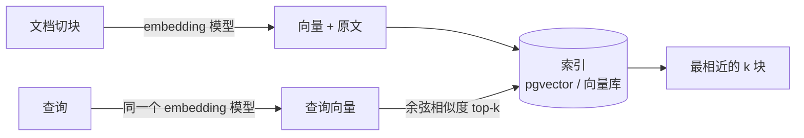

# 04 Embedding 与向量检索基础

> 前置 F02 讲了 embedding 是什么、余弦为什么先归一化。这一课只讲工程：怎么选模型和维度、暴力检索到什么规模要换索引、切块怎样改变召回、pgvector 怎么建表建索引。为第 13 课 RAG 和第 14 课 Memory 打底。

## 学习目标

- 能为一个场景选 embedding 模型和维度，说出托管与自部署的取舍，以及换模型的迁移成本
- 能实现暴力 top-k 检索，说出它的复杂度和什么时候需要近似索引
- 能用实验说明切块大小如何改变检索结果
- 能写出 pgvector 建表、建索引和查询的 SQL

## 前置

- 前置 [F02 Embedding 与向量空间](../../prerequisites/llm-foundations/02-embeddings/README.md)：向量为什么能比较、余弦与归一化、embedding 层和文本 embedding 模型的区别。本课不再解释这些
- 前置模块 [P09 SQL 与 SQLAlchemy](../../prerequisites/python/09-sql-and-sqlalchemy/README.md)：pgvector 部分要看 SQL

## 心智模型



F02 讲了向量为什么能比较。这里只补三个工程事实：

**玩具向量暴露真模型的价值。** 本课 `01` 的词袋向量只数词，所以"重置密码"和"重置路由器"得分一样高；真实 embedding 模型把"忘记登录密码"和"重置密码"拉近、把"重置路由器"推远。`04` 用真实模型重跑同一张表就能看到差别。

**归一化后余弦就是点积。** pgvector 的 `<=>` 算的是余弦距离，等于 1 减余弦相似度；存归一化后的向量可以用内积代替余弦省一次开方。

**检索就是最近邻。** 暴力法把查询向量和每一条比一遍，精确但 O(N)。几十万条以内没问题；再大就要近似索引，HNSW 或 IVFFlat，用一点召回率换几个数量级的速度。

一个经常被忽略的事实：查询和文档必须用**同一个** embedding 模型。换了模型，整个索引要重建。这是选型时要提前想清楚的迁移成本。

## 最小可运行例子

前三个纯 Python，第四个需要一个有 embedding 接口的供应商。

| 文件 | 演示什么 | 运行 |
|---|---|---|
| [`code/01_toy_embeddings_and_cosine.py`](./code/01_toy_embeddings_and_cosine.py) | hashing 词袋向量 + 余弦；共享词得分高，换了说法得分低，正好暴露玩具向量的局限 | `uv run python lessons/04-embeddings-and-vector-search/code/01_toy_embeddings_and_cosine.py` |
| [`code/02_topk_search.py`](./code/02_topk_search.py) | 暴力索引，top-k，统计比较次数 | 同上，`K=1` |
| [`code/03_chunking_changes_recall.py`](./code/03_chunking_changes_recall.py) | 同一份文档整块和按句切两种方式，目标句子的排名不同 | 同上 |
| [`code/04_real_embeddings.py`](./code/04_real_embeddings.py) | 用真实模型重跑 `01` 的表，改写换说法的那条排到前面 | `MODEL_PROVIDER=dashscope uv run python ...`，DeepSeek 没有 embedding 接口 |

### pgvector 最小用法

主项目 M4 用 PostgreSQL 加 pgvector 存向量，一个库同时管业务数据和检索。核心 SQL 只有四句：

```sql
CREATE EXTENSION IF NOT EXISTS vector;

CREATE TABLE chunks (
    id         bigserial PRIMARY KEY,
    doc_id     text NOT NULL,
    content    text NOT NULL,
    embedding  vector(1024)          -- 维度必须和 embedding 模型一致
);

-- 近似索引；小数据量可以先不建，暴力扫描也很快
CREATE INDEX ON chunks USING hnsw (embedding vector_cosine_ops);

-- <=> 是余弦距离，越小越近
SELECT id, content, 1 - (embedding <=> $1) AS similarity
FROM chunks
ORDER BY embedding <=> $1
LIMIT 5;
```

维度写死在表定义里，换 embedding 模型就要建新表重灌数据。`doc_id` 让你能按文档删除，这是第 15 课数据生命周期的基础。

## 常见错误与失败注入

**查询和文档用了不同模型。** 结果看起来能跑，相似度全是噪音。`04` 里查询和候选走同一次 API 调用，就是为了避免这个错。

**没归一化就比点积。** 长文本的向量模长大，点积天然偏高。`01` 的 `embed()` 最后一步是 L2 归一化，删掉它再跑，长句子会莫名靠前。

**切块只按长度切。** `03` 展示整块文档的向量是五个话题的平均值，一个专讲密码的干扰项反而排到前面。按句子或段落切，让每块只讲一件事，是第 13 课的起点。

**把玩具向量当真。** `01` 里"重置路由器"和"重置密码"得分一样高。用词袋做语义检索，用户很快会遇到这种假阳性。玩具是用来理解机制的，上线用真实模型。

## 取舍

- **托管 embedding 还是自部署。** 托管接口按 token 计费、零运维，但数据要出境到供应商；自部署开源模型（如 bge、gte 系列）数据不出门，要自己管 GPU 和版本。对多数中文场景，先用 DashScope 这类托管接口起步，数据敏感再迁。
- **维度大小。** 高维更准也更贵：存储、索引内存、比较时间都随维度线性增长。很多模型支持在调用时指定较低维度，用 5% 的精度换一半的存储，值得实测。
- **精确还是近似。** 十万条以内暴力扫描几十毫秒，先别建索引。上了 HNSW 要接受召回率不是 100%，并且写入变慢。索引参数（`m`、`ef_construction`）要在自己的数据上调。

## 练习

见 [exercises.md](./exercises.md)。

## 对照真实项目

主项目 [M4.1](../../project/m4-rag-and-memory/README.md) 把本课的 `VectorIndex` 换成 [`aiapp/knowledge/postgres_store.py`](../../project/src/aiapp/knowledge/postgres_store.py) 的 pgvector 表，`02` 的 `search()` 变成 `search_vector()` 里的余弦距离排序。embedding 走 [`adapters/embeddings.py`](../../project/src/aiapp/adapters/embeddings.py) 的 `EmbeddingAdapter`，离线用 `HashingEmbedding`，`EMBEDDING_PROVIDER=dashscope` 换真实模型。每条向量记 `embedding_model`，搜索时只比同模型的向量，`test_vectors_from_another_model_are_never_compared` 就是下面那个事故的测试。`scripts/eval_recall.py` 是 `03` 实验的可重复版本。

语音机器人项目里 embedding 用在两处：对话历史检索和长期记忆召回。一个教训是换了一次 embedding 模型后忘了重建旧记忆的向量，新旧向量混在一个表里，召回质量悄悄下降了几周才被发现。后来给每条向量记了模型版本字段，查询时只在同版本内比较。

## 延伸阅读

- [generative-ai-for-beginners · 08 Building Search Applications](https://github.com/microsoft/generative-ai-for-beginners/tree/main/08-building-search-applications)（访问日期 2026-09-04）：余弦相似度的图解，加一个用 YouTube 字幕做的检索示例。
- [pgvector README](https://github.com/pgvector/pgvector)（访问日期 2026-09-04）：距离操作符、HNSW 和 IVFFlat 的参数、维度限制都在这一页。
- [OpenAI · Embeddings guide](https://platform.openai.com/docs/guides/embeddings)（访问日期 2026-09-04）：维度裁剪、常见用例，接口形状和 DashScope 兼容模式一致。
- [阿里云百炼 · 文本向量](https://help.aliyun.com/zh/model-studio/embedding)（访问日期 2026-09-04）：`04` 用的 text-embedding-v3 的维度、批量限制和计费。
- [Anthropic · Embeddings](https://platform.claude.com/docs/en/build-with-claude/embeddings)（访问日期 2026-09-04）：Anthropic 自己不提供 embedding 模型，这页讲了怎么选第三方，选型考虑写得实在。

---

[← 上一课 03](../03-prompt-engineering/README.md) · [下一课 05 →](../05-tool-calling/README.md)
