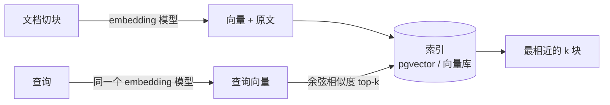
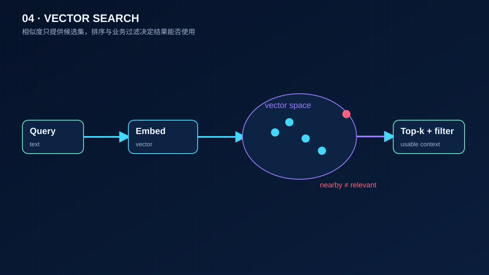

# 04 Embedding 与向量检索基础

> 前置 F02 讲了 embedding 是什么、余弦为什么先归一化。这一课只讲工程：怎么选模型和维度、暴力检索到什么规模要换索引、切块怎样改变召回、pgvector 怎么建表建索引。为第 13 课 RAG 和第 14 课 Memory 打底。

## 为什么需要

检索质量先受 embedding、切块和索引影响。换个更强的模型并不能修复错误的切块粒度或过时的向量。先把召回指标和索引边界测出来，才知道该优化哪一层。

## 学习目标

- 能为一个场景选 embedding 模型和维度，说出托管与自部署的取舍，以及换模型的迁移成本
- 能实现暴力 top-k 检索，说出它的复杂度和什么时候需要近似索引
- 能说明切块大小如何改变检索结果
- 能写出 pgvector 建表、建索引和查询的 SQL

## 前置

- 前置 [F02 Embedding 与向量空间](../../prerequisites/llm-foundations/02-embeddings/README.md)：向量为什么能比较、余弦与归一化、embedding 层和文本 embedding 模型的区别。本课不再解释这些

## 心智模型



F02 讲了向量为什么能比较。这里只补三个工程事实：

**归一化后余弦就是点积。** pgvector 的 `<=>` 算的是余弦距离，等于 1 减余弦相似度。存归一化后的向量，可以用内积代替余弦，省一次开方。

**检索就是最近邻。** 暴力法把查询向量和每一条比一遍，精确但 O(N)。几十万条以内没问题；再大就要近似索引——HNSW 或 IVFFlat——用一点召回率换几个数量级的速度。

**查询和文档必须用同一个 embedding 模型。** 换了模型，整个索引要重建。这是选型时就要算清楚的迁移成本，不是上线后再说的事。



## 机制拆解

### 一、用玩具向量看清机制，也看清它的局限

最简单的「embedding」是哈希词袋：把每个词哈希进一个桶，数个数，再归一化。

```python
DIM = 64

def embed(text: str, dim: int = DIM) -> list[float]:
    """把每个 token 哈希进 dim 个桶之一，计数，再做 L2 归一化。"""
    vec = [0.0] * dim
    for tok in tokenize(text):
        bucket = int(hashlib.md5(tok.encode()).hexdigest(), 16) % dim
        vec[bucket] += 1.0
    norm = math.sqrt(sum(v * v for v in vec)) or 1.0
    return [v / norm for v in vec]         # 不归一化，长文本会天然占便宜
```

拿 `"how do I reset my password"` 去比四个候选，结果是这样：

| 余弦 | 候选 | 说明 |
|---:|---|---|
| 高 | steps to reset your password | 共享词多 |
| ~0 | I forgot my login credentials | **同义但没共享词，漏了** |
| 高 | how do I reset my router | **共享词但意思不同，假阳性** |
| ~0 | quarterly revenue grew by twelve percent | 确实无关 |

中间两行就是你付钱给 embedding 模型的理由：真实模型会把「忘记登录凭据」拉近，把「重置路由器」推远。词袋做不到，因为它只认字面。

### 二、暴力检索的成本是明确的

```python
class VectorIndex:
    def __init__(self):
        self._rows: dict[str, list[float]] = {}
        self.comparisons = 0

    def add(self, doc_id, text):
        self._rows[doc_id] = embed(text)

    def search(self, query, k) -> list[tuple[float, str]]:
        q = embed(query)
        scored = []
        for doc_id, vec in self._rows.items():
            self.comparisons += 1              # 每次查询比 N 次
            scored.append((cosine(q, vec), doc_id))
        return heapq.nlargest(k, scored)
```

每次查询 O(N) 次比较。十万条向量、1024 维，一次查询几十毫秒——完全可以接受。所以**别一上来就建索引**：先跑暴力，测出真实延迟，超出预算了再换。

`heapq.nlargest` 而不是全排序，是因为 k 通常远小于 N。

### 三、切块大小是检索参数，不是存储细节

同一份文档，两种切法，同一个查询，结果不同：

```python
DOCUMENT = ("Our return policy allows refunds within thirty days. "
            "Shipping is free for orders above fifty dollars. "
            "Gift cards never expire and can be used online or in store. "
            "To reset your password use the link on the login page. "     # ← 目标句
            "Loyalty points are earned on every purchase.")

DISTRACTOR = "Password managers help you keep unique passwords for every site."

def one_chunk(text):   return [text]
def by_sentence(text): return [s.strip() for s in re.split(r"(?<=\.)\s+", text) if s.strip()]
```

查询 `"how to reset password"`：

- **整块切**：文档确实**包含**答案，但它的向量是五个话题的平均值。那个纯讲密码的干扰项反而排第一。
- **按句切**：目标句单独成块，向量只表达一件事，排第一。

这就是「一个 chunk 只讲一件事」这条经验的来源。第 13 课会把它展开成完整的切块策略。

### 四、pgvector 的最小用法

用 PostgreSQL 加 pgvector 存向量，一个库同时管业务数据和检索。核心 SQL 只有四句：

```sql
CREATE EXTENSION IF NOT EXISTS vector;

CREATE TABLE chunks (
    id         bigserial PRIMARY KEY,
    doc_id     text NOT NULL,          -- 按文档删除靠它，见第 15 课
    content    text NOT NULL,
    embedding  vector(1024)            -- 维度必须和 embedding 模型一致
);

-- 近似索引；数据量小可以先不建，暴力扫描也很快
CREATE INDEX ON chunks USING hnsw (embedding vector_cosine_ops);

-- <=> 是余弦距离，越小越近
SELECT id, content, 1 - (embedding <=> $1) AS similarity
FROM chunks
ORDER BY embedding <=> $1
LIMIT 5;
```

**维度写死在表定义里**。换 embedding 模型就要建新表重灌数据——这是上面说的迁移成本的具体形态。

一个值得从第一天就加的字段：`embedding_model`。查询时只比同模型的向量。理由见下面的「一线经验」。

## 常见错误

**查询和文档用了不同模型。** 结果看起来能跑，相似度全是噪音。这是最难发现的一类错误，因为没有任何异常。

**没归一化就比点积。** 长文本的向量模长大，点积天然偏高，长句子会莫名靠前。

**切块只按长度切。** 500 字一刀，切口正好落在句子中间，两边都残缺。按语义边界（段落、句子、标题层级）切，长度只作为上限。

**把玩具向量当真。** 用词袋做语义检索，用户很快会遇到「重置路由器」那种假阳性。玩具是用来理解机制的，上线用真实模型。

## 取舍

- **托管 embedding 还是自部署。** 托管接口按 token 计费、零运维，但数据要出境到供应商；自部署开源模型（bge、gte 系列）数据不出门，要自己管 GPU 和版本。多数中文场景先用托管接口起步，数据敏感再迁。
- **维度大小。** 高维更准也更贵：存储、索引内存、比较时间都随维度线性增长。很多模型支持调用时指定较低维度，用 5% 的精度换一半的存储，值得实测。
- **精确还是近似。** 十万条以内暴力扫描几十毫秒，先别建索引。上了 HNSW 要接受召回率不是 100%，写入也变慢。索引参数（`m`、`ef_construction`）必须在自己的数据上调，抄别人的值没有意义。

## 工程落地

- **每条向量记录它的 embedding 模型和版本**，查询时按版本过滤。迁移期间新旧向量必然共存。
- **重建索引要能在线做**：新建一张表灌新向量，切换读流量，再删旧表。直接在原表上 `ALTER` 维度是做不到的。
- **召回率要有可重复的度量**。准备一组「查询 → 应该召回哪几条」的样本，每次改切块策略或换模型都跑一遍。没有这个数字，一切优化都是感觉。
- **`doc_id` 上要有索引**，因为按文档删除是高频操作（用户删文档、合规删除）。

## 框架映射

| 本课概念 | LangGraph | OpenAI Agents SDK | Claude Agent SDK |
|---|---|---|---|
| 向量存储 | LangChain 的 `VectorStore` 抽象，几十个实现 | 没有内置，自己写检索工具 | 没有内置，外部检索工具 |
| embedding | LangChain 的 `Embeddings` 接口 | 直接调供应商接口 | 直接调供应商接口 |

只有 LangChain 生态在这一层做了抽象。好处是换向量库改一行；代价是多一层依赖，且各实现的能力差异被抽象藏起来了（有的支持元数据过滤，有的不支持）。官方文档：[LangGraph](https://langchain-ai.github.io/langgraph/) · [OpenAI Agents SDK](https://openai.github.io/openai-agents-python/) · [Claude Agent SDK](https://docs.claude.com/en/api/agent-sdk/overview)（核对日期 2026-09-05）。

## 一线经验

语音机器人项目里 embedding 用在两处：对话历史检索和长期记忆召回。

一个教训是换了一次 embedding 模型后，忘了重建旧记忆的向量。新旧向量混在一个表里，召回质量悄悄下降了几周才被发现——因为没有任何报错，只是「感觉最近记性变差了」。

后来给每条向量加了模型版本字段，查询时只在同版本内比较，迁移期间跑一个后台任务慢慢重算。这个字段成本几乎为零，省下的是一次很难定位的故障。

## 练习

见 [exercises.md](./exercises.md)。

## 延伸阅读

- [generative-ai-for-beginners · 08 Building Search Applications](https://github.com/microsoft/generative-ai-for-beginners/tree/main/08-building-search-applications)（访问日期 2026-09-04）：余弦相似度的图解，加一个用 YouTube 字幕做的检索示例。
- [pgvector README](https://github.com/pgvector/pgvector)（访问日期 2026-09-04）：距离操作符、HNSW 和 IVFFlat 的参数、维度限制都在这一页。
- [OpenAI · Embeddings guide](https://platform.openai.com/docs/guides/embeddings)（访问日期 2026-09-04）：维度裁剪、常见用例。
- [阿里云百炼 · 文本向量](https://help.aliyun.com/zh/model-studio/embedding)（访问日期 2026-09-04）：text-embedding-v3 的维度、批量限制和计费；国内可直接访问。
- [Anthropic · Embeddings](https://platform.claude.com/docs/en/build-with-claude/embeddings)（访问日期 2026-09-04）：Anthropic 自己不提供 embedding 模型，这页讲怎么选第三方，选型考虑写得实在。

---

[← 上一课 03](../03-prompt-engineering/README.md) · [下一课 05 →](../05-tool-calling/README.md)
