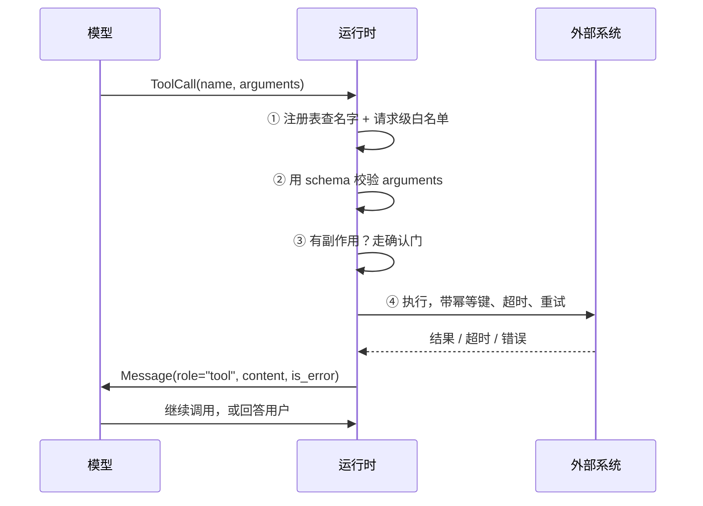

# 05 Tool Calling：从 Schema 到副作用

> 「工具调用成功」不是一件事，是三件事：模型选对了工具、参数是有效的、外部系统真的做了且只做了一次。运行时要分别保证这三件事，模型一件也保证不了。

## 学习目标

- 能画出一次工具调用从模型输出到结果回喂的完整链路，并指出每一步由谁负责
- 能独立实现校验、注册表白名单、幂等键、确认门四个守卫，并说清每个守卫防的是哪种失败
- 能拿一段出错的调用记录，判断失败发生在「选工具、填参数、执行」哪一层

## 前置

- [02 模型调用、结构化输出与流式](../02-model-api-structured-output-streaming/README.md)：知道 JSON Schema 怎么约束模型输出
- [00 环境与模型接入](../00-setup/README.md)：会用 `aiapp` 里的 `ToolCall`、`ToolSpec`、`Message(role="tool")`
- 前置模块 [P04 类与 dataclass](../../prerequisites/python/04-oop-and-dataclasses/README.md)、[P06 Pydantic](../../prerequisites/python/06-pydantic/README.md)

## 心智模型

模型看到的工具是一段 JSON Schema。它的输出是一段结构化 JSON，说"我想调这个工具，参数是这些"。到这里为止，世界上什么都没变。接下来每一步都是确定性代码：

四个守卫各防一种失败：

| 守卫 | 防什么 | 失败时怎么办 |
|---|---|---|
| ① 注册表与白名单 | 模型编造了不存在的工具名，或调了这个场景不该碰的工具 | 回一个 `is_error` 结果，不抛异常 |
| ② Schema 校验 | 参数缺字段、类型错、枚举值不在范围内 | 把校验错误原文回给模型，让它修 |
| ③ 确认门 | 用户没明确要求的副作用被执行 | 暂停，问用户，拒绝也是一个正常结果 |
| ④ 幂等键 | 超时重试导致副作用发生两次 | 同一个调用派生同一个键，外部系统识别重放 |

注意第 ②、① 两步的错误都是**回给模型**而不是抛给用户。模型拿到"unknown tool: delete_user_data"之后，通常会换一个存在的工具；拿到"unit must be celsius or fahrenheit"之后，通常会改参数。运行时不替它猜。

还有一条不在图里但同样重要：**动作只从工具调用通道取**。模型在正文里写的任何 JSON，哪怕格式完美，都只是文本。用正则从回答里捞"函数调用"出来执行，是最常见的事故来源之一。

## 最小可运行例子

四个文件各演示一个守卫。每个都能直接跑，带 `INJECT_*` 环境变量时注入对应的失败。

| 文件 | 演示什么 | 运行 |
|---|---|---|
| [`code/01_schema_validation.py`](./code/01_schema_validation.py) | Pydantic 模型同时生成 schema 和做校验；非法参数作为错误结果回喂 | `uv run python lessons/05-tool-calling/code/01_schema_validation.py`，加 `INJECT_BAD_ARGS=1` 看模型改参数 |
| [`code/02_registry_and_allowlist.py`](./code/02_registry_and_allowlist.py) | 注册表 + 请求级白名单；只把允许的工具告诉模型，编造的名字被拒 | 同上，加 `INJECT_UNKNOWN_TOOL=1` |
| [`code/03_idempotency_key.py`](./code/03_idempotency_key.py) | 从 `ToolCall` 派生幂等键；超时重试后账本仍然只有一笔 | 同上，加 `INJECT_TIMEOUT=1` |
| [`code/04_confirmation_gate.py`](./code/04_confirmation_gate.py) | 有副作用的工具先问用户；拒绝作为正常结果回给模型 | 同上，加 `USER_DECISION=no` |

读代码时留意两点。第一，`run_tool` / `dispatch` 的返回值永远是 `Message`，成功和失败只差一个 `is_error`，调用方不需要 try/except。第二，四个文件的主循环长得一样：调模型、没有工具调用就结束、有就执行并把结果追加进消息。这个循环第 06 课会正式展开。

## 常见错误与失败注入

**只用 `tool_call.id` 做幂等键。** 模型重试时往往会生成一个新的 id，键就变了，副作用照样发生两次。`03_idempotency_key.py` 里的键混入了工具名和规范化后的参数，同样的意图会得到同样的键。可以自己试一下：把 `idempotency_key` 改成只返回 `call.id`，再在 `run_transfer` 里模拟模型第二次用新 id 重发同一笔转账。

**把校验错误抛成异常。** `01_schema_validation.py` 里如果把 `except ValidationError` 删掉，`INJECT_BAD_ARGS=1` 会直接让程序崩掉。模型本来有能力在下一轮修正参数，现在它连知道自己错了的机会都没有。

**给模型看全部工具。** `02_registry_and_allowlist.py` 里 `registry.specs(allowlist)` 只把允许的工具放进请求。如果改成把所有已注册工具都传给模型，模型就有可能在只读场景里选到 `delete_doc`。白名单要在"告诉模型有什么"这一步就生效，而不是等它选完再拒绝。

**用正则从回答里提取"函数调用"。** 四个例子里没有任何一处解析 `reply.content`。这是故意的。一旦开了这个口子，模型在文本里的任何表演都会变成动作。

## 取舍

- **严格校验 vs 宽容解析。** 严格校验会让模型多跑一轮来修参数，多花一次调用的延迟和 token。宽容解析（比如自动把 `"kelvin"` 改成 `"celsius"`）省了这一轮，但运行时替模型做了决定，出错时没人知道为什么。默认严格，只对确定无歧义的归一化（去空格、大小写）放宽。
- **确认门的粒度。** 每个副作用都问用户，Agent 会很烦人；一个都不问，风险不可控。常见做法是按可逆性分级：可撤销的直接做，不可撤销的问，涉及资金和删除的必须问。第 07 课会把"问"变成可以跨请求暂停和恢复的状态。
- **幂等键放在哪一层。** 由运行时派生并传给外部系统，是最省事的做法，但要求外部系统支持幂等键。不支持时只能在运行时自己维护"已执行"记录，这就引入了状态持久化的问题，也是第 07 课的内容。

## 练习

见 [exercises.md](./exercises.md)。

## 对照真实项目

幂等键的存储在 [M2](../../project/m2-state-and-storage/README.md) 已经落地：`Idempotency-Key` 请求头经 Redis `SET NX EX` 认领，重复请求重放第一次的结果而不再调模型，见 [`api/routes/threads.py`](../../project/src/aiapp/api/routes/threads.py)。工具级的幂等键派生在 M3。

这一课直接对应主项目 [M3.1 Tool contract](../../project/m3-tool-workflow/README.md) 和 M3.2 确认与幂等。M3 会把这四个文件里的守卫合并成一个 `ToolRunner`，接到 M2 的状态存储上。

一个来自语音机器人项目的模式，去掉了业务细节：系统用一个小模型专门做意图分类并输出工具调用，另一个大模型负责聊天。小模型偶尔会输出训练时见过但当前没注册的工具名，也会漏掉必填参数。早期的修法是改提示词，效果不稳定。后来的修法就是这一课的守卫①和②：注册表查不到就当作"没有命令"回喂，参数校验失败就把错误回给它重试一次。提示词一个字没改，问题消失了。另一个教训是大模型在聊天正文里偶尔会写出格式完美的函数调用 JSON，一度被运行时解析执行。修法是只认工具调用通道，正文一律当文本。

## 延伸阅读

- [12-factor-agents · factor 01: Natural Language to Tool Calls](https://github.com/humanlayer/12-factor-agents/blob/main/content/factor-01-natural-language-to-tool-calls.md)（访问日期 2026-09-04）：一页讲清"工具调用只是把自然语言变成结构化对象"。
- [12-factor-agents · factor 04: Tools are just structured outputs](https://github.com/humanlayer/12-factor-agents/blob/main/content/factor-04-tools-are-structured-outputs.md)（访问日期 2026-09-04）：模型决定做什么，代码决定怎么做，两者分离。文末链接了几篇 function calling、JSON mode、constrained generation 的对比。
- [ai-agents-for-beginners · 04 Tool Use](https://github.com/microsoft/ai-agents-for-beginners/blob/main/04-tool-use/README.md)（访问日期 2026-09-04）：把工具调用系统拆成 schema、执行逻辑、消息处理、集成框架、错误校验、状态六个组件，适合对照检查自己漏了哪一块。后半部分绑定微软框架，可以跳过。
- [Anthropic · Tool use overview](https://platform.claude.com/docs/en/agents-and-tools/tool-use/overview)（访问日期 2026-09-04）：`tool_use` → 执行 → `tool_result` 的完整往返，以及 `is_error` 字段。这就是 `aiapp` 里类型设计的来源。

---

[← 上一课 04](../04-embeddings-and-vector-search/README.md) · [下一课 06 →](../06-agent-loop/README.md)
