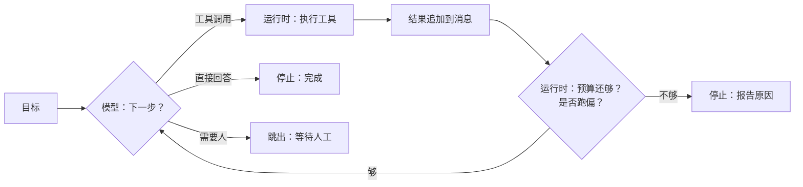
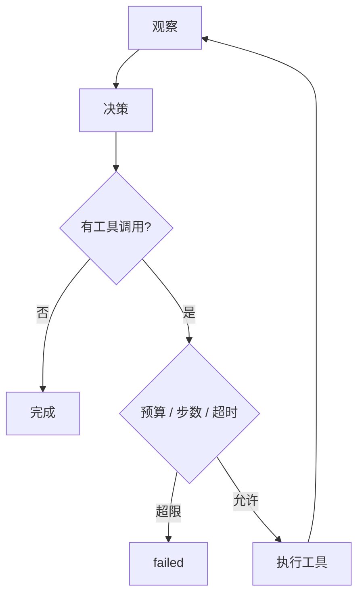
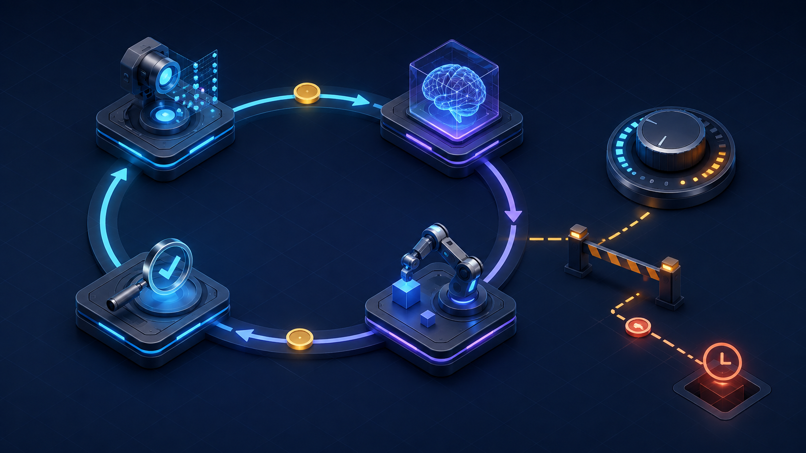

# 06 Agent 循环与控制流

> Agent 就是一个循环：模型决定下一步，运行时执行，把结果放回去，再问模型。这一课讲这个循环里哪些事归模型、哪些事归运行时，以及循环怎么停。停不下来的 Agent 不是 Agent，是事故。

## 为什么需要
没有明确停止条件的 Agent 会在失败时继续调用，直到预算耗尽或账单失控。循环必须能被读懂、测试，也必须由运行时决定何时停止。

## 学习目标

- 能写出一个最小的 Agent 循环，并说清循环里每一行代码是模型的责任还是运行时的责任
- 能实现步数、token、时间三种预算，并让循环停止时报告是哪一种耗尽了
- 能给工具失败分类，并为每一类指定一种确定性的恢复动作

## 前置

- [05 Tool Calling](../05-tool-calling/README.md)：工具契约和四个守卫，本课的循环建立在它们之上
- 前置模块 [P07 asyncio](../../prerequisites/python/07-asyncio/README.md)：`asyncio.run`、超时、`sleep`

## 心智模型

循环里只有一个菱形归模型：**下一步做什么**。其余全归运行时：执行、记账、判断该不该继续、决定怎么处理失败。把这个边界画清楚，Agent 的可靠性问题就变成了普通软件的可靠性问题。

三个要点：

**停止条件全部由运行时持有。** 模型"自然停下"是一种停止方式，但不能是唯一的。至少还要有步数上限、token 预算、时间预算，以及跑偏检测。每种停止都要有名字，让用户和日志知道为什么停的。

**失败要分类，恢复要确定。** 网络抖动重试就行；参数错了回给模型让它改；模型反复调同一个工具，再问它一次只会得到同样的结果，应该警告一次然后升级给人。三种情况用同一招"再问模型"，结果是烧钱、绕圈、然后超时。

**一个 Agent 管 3～10 步。** 上下文越长模型越容易跑偏，这是 12-factor 的 factor 10 反复强调的经验。任务大就拆成多个小 Agent，让确定性代码把它们串起来。这一点第 09 课和第 10 课展开。

还有一条来自 factor 08 的观察：循环不一定要一口气跑完。模型请求"问用户一个问题"或"部署到生产"时，正确做法是**跳出循环**，把状态存下来，等人回来再续。这一课的循环还是单进程内的，怎么跨请求暂停和恢复是第 07 课的内容。

### 循环的停止点

## 最小可运行例子

| 文件 | 演示什么 | 运行 |
|---|---|---|
| [`code/01_minimal_loop.py`](./code/01_minimal_loop.py) | 最小循环：两次工具调用后回答；`RunResult` 带 `stop_reason` | `uv run python lessons/06-agent-loop/code/01_minimal_loop.py`，加 `INJECT_ENDLESS=1` 看步数上限兜底 |
| [`code/02_budgets.py`](./code/02_budgets.py) | 一个 `Budget` 对象同时管步数、token、时间，每轮结算后返回第一个耗尽的预算 | 同上，加 `INJECT_TOKEN_BURN=1` 或 `INJECT_SLOW_MODEL=1` |
| [`code/03_failure_routing.py`](./code/03_failure_routing.py) | 三类失败三条路：瞬时错误重试、参数错误回喂、重复调用警告一次后升级 | 同上，加 `INJECT_OFF_TRACK=1` |

文件用 `# %%` 分成了 cell，在 VS Code 里可以一格一格跑。读的时候留意：三个文件的 `run_agent` 都是十几行，复杂度不在循环本身，在循环外面的预算和路由。

## 常见错误与失败注入

**`while True` 加一个"模型总会停"的假设。** `01_minimal_loop.py` 用 `INJECT_ENDLESS=1` 模拟一个永远请求工具的模型。没有 `max_steps` 的话，这个进程会一直跑到 API 额度耗尽。真实模型不会故意这样，但会因为工具结果里的某句话进入循环，比如工具返回"请重试"。

**预算只在开头检查。** `02_budgets.py` 在每轮**结算之后**检查。如果只在进入循环时检查一次，一轮里模型返回一个超长回答就直接突破预算。另一个变体是只算输出 token 不算输入，而输入随着历史增长是主要开销。

**把所有异常都 catch 成"工具失败，重试"。** `03_failure_routing.py` 里 `ValueError` 和 `TransientError` 走不同的路。参数错误重试一百次结果也一样；瞬时错误回给模型让它"修参数"则是让它修一个不存在的问题。

**跑偏检测太敏感。** 例子里用"工具名加规范化参数"做签名，完全相同才算重复。如果只看工具名，一个正常的"读三个文件"任务会被误判成循环。

## 取舍

- **步数上限设多少。** 太小任务做不完，太大失控成本高。经验值是按任务类型分档：查询类 3～5，多工具协作 8～12，超过 15 步的任务应该拆。上限是安全网，不是目标。
- **重试的代价谁付。** 重试是延迟换成功率。给用户的实时对话里，一次重试可能就超出了可接受的等待时间；后台任务则可以多重试几次。重试策略应该是循环的参数，不是写死的常量。
- **升级给人 vs 直接放弃。** 升级需要有人接，有人接就要有第 07 课的暂停机制。没有这个机制时，诚实的"我做不到"比假装完成好，也比无限等待好。

## 生产方案
M3 的 [`run_agent`](../../project/src/aiapp/runtime/loop.py) 统一步数、时间和失败路由；M5 再叠加请求级成本预算。

## 框架映射

| 本课概念 | LangGraph | OpenAI Agents SDK | Claude Agent SDK |
|---|---|---|---|
| observe → decide → act loop | conditional edges / recursion limit | Runner + max turns | SDK-managed loop + max turns |

*映射按 Framework Lab 的概念边界整理，框架行为以官方文档和 [Framework Lab](../../project/framework-lab/README.md) 在 2026-09-04 的实现证据为准。*

## 练习

见 [exercises.md](./exercises.md)。

## 对照真实项目

主项目 [M3](../../project/m3-tool-workflow/README.md) 的 [`aiapp/runtime/loop.py`](../../project/src/aiapp/runtime/loop.py) 就是本课的 `run_agent`：`01` 的步数上限、`02` 的 `Budget` 和 `StopReason` 原样进了 [`budget.py`](../../project/src/aiapp/runtime/budget.py)，每条 `run_finished` / `run_failed` 事件带一份预算快照落库；`03` 的失败路由拆成两处，瞬时重试和参数回喂在 `ToolRunner`，跑偏的一次警告和升级在循环里。`tests/project/m3/test_loop.py` 里 `test_step_limit_stops_an_endless_model` 和 `test_repeating_the_same_call_gets_one_warning_then_escalates` 对应本课两个注入。

语音机器人项目的一个经验：早期依赖模型"聊完自己停"，结果是模型倾向于一直找话说，用户想结束对话时要反复说"不聊了"。后来加了一个显式的退出工具，模型判断用户想结束时调用它，运行时收到后静默终止，比在提示词里写"用户说再见时停止"稳定得多。这就是"停止条件由运行时持有"的一个具体形态：给模型一个表达"我想停"的结构化出口，但停不停由代码决定。另一个经验是任务型 Agent 的步数上限要比聊天型小得多，因为每一步都伴随一次设备动作，跑偏的代价是物理的。

## 延伸阅读

- [12-factor-agents · factor 08 Own your control flow](https://github.com/humanlayer/12-factor-agents/blob/main/content/factor-08-own-your-control-flow.md)（访问日期 2026-09-04）：三种控制流形态的代码示例，"跳出循环等人"就出自这里。
- [12-factor-agents · factor 10 Small, focused agents](https://github.com/humanlayer/12-factor-agents/blob/main/content/factor-10-small-focused-agents.md)（访问日期 2026-09-04）：为什么一个 Agent 管 3～10 步，以及"模型变强了这条还成立吗"的回答。
- [ai-agents-for-beginners · 01 Intro to AI Agents](https://github.com/microsoft/ai-agents-for-beginners/blob/main/01-intro-to-ai-agents/README.md)（访问日期 2026-09-04）：Agent 的定义和组成部分，可以对照本课的循环图检查有没有漏掉的组件。
- [Agent 框架对比与选型](../../project/framework-lab/00-landscape.md)：学完本课再看，判断框架时先问"循环由谁控制、怎么停"。

---

[← 上一课 05](../05-tool-calling/README.md) · [下一课 07 →](../07-agent-state-and-runtime/README.md)
