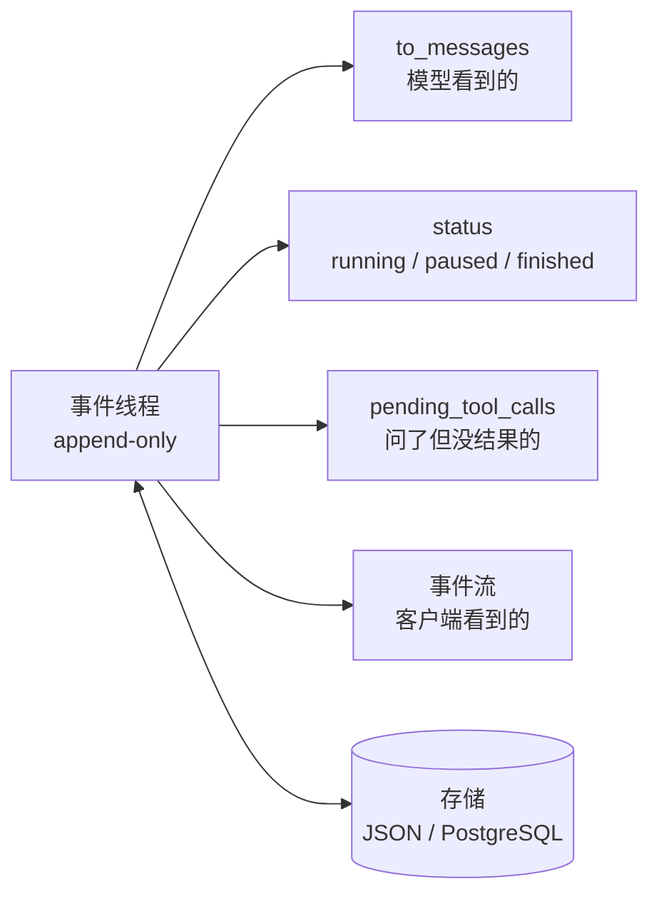
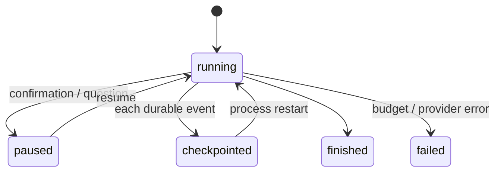

# 07 Agent State 与 Runtime：持久化、暂停恢复与人工介入

> 上一课的循环跑在一个进程里，停下就没了。这一课把状态从局部变量里拿出来，变成一份可以存盘、可以加载、可以从任意一点继续的事件记录。做到这一步，「等用户回来再继续」和「进程崩了接着跑」就成了同一件事。

## 为什么需要

把状态留在局部变量里，进程退出、用户晚点回复、网络重试，都会让任务丢失或重复。事件、checkpoint 和恢复协议要先于框架抽象想清楚。

## 学习目标

- 能把 Agent 的状态建模为一个 append-only 的事件线程，并从它推导出模型消息、运行状态和待处理的工具调用
- 能实现跨进程的暂停与恢复：把「问用户」做成工具调用，checkpoint 到存储，另一个进程加载后继续，且已执行的工具不重跑
- 能说出 double texting 的三种策略，并解释为什么「没有策略」等于「行为未定义」

## 前置

- [06 Agent 循环与控制流](../06-agent-loop/README.md)：循环结构、停止条件、「跳出循环等人」的伏笔
- [05 Tool Calling](../05-tool-calling/README.md)：幂等键。恢复时不重跑已执行的工具，靠的是同一个思路

## 怎么理解它



一句话：**发生过什么是唯一的事实，其他都是它的推导。** 这是 12-factor 的 factor 05 和 factor 12 合起来的意思。

运行时不维护「当前第几步、是否在等用户」这类变量，需要时从事件列表里算。好处是存盘只存一个列表，恢复只加载一个列表，界面展示和日志排障看的也是同一个列表——几边永远不会不一致。

在这个模型上，四件事变得很自然：

**问人是一个工具调用。** 模型输出 `request_human_input(question=...)`，运行时记一条 `human_input_requested` 事件，存盘，退出。它和调用 `find_restaurants` 唯一的区别是结果不是立刻有的。factor 07 把这叫「用工具调用联系人类」。

**暂停发生在选好工具和执行之间。** 模型已经说了要做什么，运行时还没做。在这个点上存盘，恢复时先看待处理的调用：有结果的跳过，没结果的执行。所以进程在任何一步崩掉都能接上，而且不会把已经做过的事再做一遍。

**恢复就是「加载，然后继续 fold」。** 没有特殊的恢复逻辑。同一个 `run()` 函数，传入一个新线程就是启动，传入一个加载回来的线程就是恢复。

**客户端看的是同一份事件。** 循环每 append 一条就 yield 一条，前端拿到的进度和存进数据库的记录是同一个对象。不需要再发明一套 progress 结构。



## 机制拆解

### 一、事件是事实，其余全是推导

一段跑到一半的对话，事件线程长这样：

```python
t.append("user_message",      content="Book me a table for two tonight.")
t.append("assistant_message", tool_calls=[{"id": "c1", "name": "find_restaurants",
                                           "arguments": {"party": 2}}])
t.append("tool_result",       tool_call_id="c1", content='["Noodle House", "Sea Breeze"]')
t.append("assistant_message", tool_calls=[{"id": "c2", "name": "request_human_input",
                                           "arguments": {"question": "哪一家？"}}])
t.append("human_input_requested", tool_call_id="c2", question="哪一家？")
```

三个推导方法，加起来二十几行：

```python
def to_messages(self) -> list[Message]:
    """模型看到的。运行时专用事件在这里被过滤掉。"""
    ...

def pending_tool_calls(self) -> list[ToolCall]:
    """问了但还没有结果的调用 —— 恢复时从这里继续。"""
    asked = {c.id: c for e in self.events if e.type == "assistant_message"
                    for c in e.tool_calls}
    answered = {e.data["tool_call_id"] for e in self.events
                if e.type in ("tool_result", "human_input")}
    return [c for cid, c in asked.items() if cid not in answered]

def status(self) -> str:
    """running / paused / finished —— 算出来的，没有对应字段。"""
    ...
```

`status()` 是**算出来的**，这一点很关键。它没有对应的存储字段，所以不存在「数据库说在等用户、事件里却没有提问」这种不一致。

### 二、暂停恢复：同一个函数，两种入口

```python
async def run(thread, model, max_steps=6):
    while thread.steps() < max_steps:
        # ① 先把模型已经要求、但还没结果的调用处理掉
        for call in thread.pending_tool_calls():
            if call.name == "request_human_input":
                thread.append("human_input_requested",
                              tool_call_id=call.id, question=call.arguments["question"])
                thread.save(CHECKPOINT)
                return                       # 暂停：存盘后直接退出进程
            thread.append("tool_result", tool_call_id=call.id, content=execute(call))
            thread.save(CHECKPOINT)          # 每记一条结果就 checkpoint

        # ② 再问模型下一步
        reply = await model.complete(thread.to_messages(), tools=TOOLS)
        thread.append("assistant_message", content=reply.content,
                      tool_calls=reply.tool_calls)
        thread.save(CHECKPOINT)
        if not reply.tool_calls:
            thread.append("run_finished", answer=reply.content)
            thread.save(CHECKPOINT)
            return
```

启动和恢复的差别只在调用方：

```python
if CHECKPOINT.exists():
    thread = Thread.load(CHECKPOINT)
    if thread.status() == "paused":
        pending = thread.pending_tool_calls()[0]
        thread.append("human_input", tool_call_id=pending.id, content=user_answer)
else:
    thread = Thread()
    thread.append("user_message", content=goal)

await run(thread, model)      # 同一个函数
```

第 ① 步那个循环是整段的核心：它让「恢复」不需要任何特殊逻辑。已经有结果的调用不在 `pending_tool_calls()` 里，自然不会重跑。

### 三、事件流就是同一份事件

```python
async def run_streaming(thread, model) -> AsyncIterator[Event]:
    """和上面同一个循环；每次 append 的同时 yield 给监听方。"""
    yield thread.append("run_started")
    for _ in range(6):
        reply = await model.complete(thread.to_messages(), tools=tools)
        yield thread.append("assistant_message", content=reply.content,
                            tool_calls=reply.tool_calls)
        if not reply.tool_calls:
            yield thread.append("run_finished", answer=reply.content)
            return
        for call in reply.tool_calls:
            yield thread.append("tool_result", tool_call_id=call.id,
                                content=execute(call))
```

`thread.append()` 返回它刚追加的事件，所以 `yield thread.append(...)` 一行同时做了两件事。这个小设计保证了**流和存储不可能不一致**——它们是同一个对象。

客户端那边格式化成 SSE 就行：

```python
def as_sse(event) -> str:
    return f"event: {event.type}\ndata: {json.dumps(event.data, ensure_ascii=False)}\n"
```

### 四、double texting 的三种策略

用户在第一次运行还没结束时又发了一条。三种做法：

```python
async def handle_second_message(thread, current: asyncio.Task, text: str):
    if POLICY == "reject":
        await current                       # 直接丢弃第二条，第一次运行继续

    elif POLICY == "enqueue":
        await current                       # 等第一次跑完
        thread.append("user_message", content=text)
        await run(thread, model)            # 再跑第二次

    elif POLICY == "interrupt":
        current.cancel()
        with contextlib.suppress(asyncio.CancelledError):
            await current
        done = sum(1 for e in thread.events if e.type == "tool_result")
        thread.append("run_interrupted", completed_tool_results=done)
        thread.append("user_message", content=text)
        await run(thread, model)            # 已完成的工具结果留在线程里，不浪费
```

看 interrupt 那一支里的 `completed_tool_results`：**被打断不等于前面白干**。已经拿到的工具结果留在事件线程里，第二次运行的模型能看到它们。

不选任何一种策略，第二条消息会在第一次运行还在写线程时被追加进去，两个循环交错写同一个列表。这不是 bug，是**没有做决定**。

## 常见错误

**先执行工具，再记事件。** 上面的顺序是 `execute()` → `append("tool_result")` → `save()`。如果崩在 `execute()` 之后、`save()` 之前，恢复时这个工具会再跑一次。

运行时做不到「执行和记录」原子化——这正是第 05 课幂等键存在的理由：既然无法避免重跑，就让重跑无害。

**恢复时重放所有事件的副作用。** 有人把「恢复」实现成「从头把每条事件再执行一遍」。**事件是记录，不是指令。** 恢复只是把列表加载进内存，然后从待处理的调用继续。

**执行状态另存一份。** 比如在线程之外再存一个 `status` 字段。两处只要有一次没同步，Agent 就会卡在一个自相矛盾的状态里。

**double texting 没有策略。** 见上。

## 取舍

- **每步存盘 vs 只在暂停时存盘。** 每步存盘让任意点崩溃都能恢复，代价是每一步多一次写。对话类 Agent 步数少，每步存没问题；长任务可以按阶段存，但要接受阶段内崩溃会重做。
- **interrupt vs enqueue。** interrupt 响应快，用户改主意时立刻生效，但已经花掉的模型调用作废；enqueue 不浪费，但用户要等第一轮跑完。聊天场景通常 interrupt，后台任务通常 enqueue。reject 最简单，适合「一次只能有一个操作在进行」的场景，比如支付。
- **线程里放多少东西。** factor 05 建议尽量把执行状态都放进线程，但 session id、密钥、大文件这类东西不该进模型上下文。`to_messages()` 是过滤器：线程里可以有运行时专用事件，模型看不到。第 08 课会在这个过滤器上做更多事。

## 工程落地

- **JSON 文件换成数据库表**时，`run()` 一行都不用改——这正是把存储抽象成 `save()` / `load()` 两个方法的收益。
- **并发写要有乐观锁**。`(conversation_id, seq)` 上加唯一约束，`append(event, expected_seq=n)` 冲突就失败重读。两个写者只有一个能赢，这比事后对账便宜得多。
- **`status` 字段可以有，但只能是缓存**。事实来源永远是事件列表。加这个字段是为了让「列出所有 paused 的会话」不用扫全表。
- **人工介入有两种，不要混。** 「问用户一个问题」的答案本身就是工具结果；「批准一个副作用」批准之后工具还要真的跑。两者的恢复路径不同，事件字段也该不同。
- **事件表只增不改**，这让审计和回放天然成立。要改就追加一条修正事件。

## 框架映射

| 本课概念 | LangGraph | OpenAI Agents SDK | Claude Agent SDK |
|---|---|---|---|
| 状态持久化 | `checkpointer`（SQLite / Postgres） | `RunState` 序列化 + `Session` 存历史 | `session_id` + resume |
| 暂停 | 节点里 `interrupt()` | `needs_approval` 或 `StopAtTools` | `can_use_tool` 回调返回 deny |
| 恢复 | 传 `None` 从上次 checkpoint 继续 | `RunState.from_string()` | `resume=session_id` |
| 事件流 | `astream_events` | `Runner.run_streamed` | 消息流 |

LangGraph 在这一层做得最完整，但要注意一个坑：节点内 `interrupt()` **之前**的副作用，在 resume 时会重跑——因为 checkpoint 的粒度是节点，不是语句。官方文档：[LangGraph](https://langchain-ai.github.io/langgraph/) · [OpenAI Agents SDK](https://openai.github.io/openai-agents-python/) · [Claude Agent SDK](https://docs.claude.com/en/api/agent-sdk/overview)（核对日期 2026-09-05）。

## 一线经验

语音机器人项目早期把「当前在哪个子 Agent」「是否在等用户确认」这类执行状态存在一个单独的状态对象里，和对话历史分开。一次部分失败之后两边不一致，机器人反复问同一个问题。

修法是把这些状态都改成从历史推导，单独的状态对象只留缓存作用，不再是事实来源。

另一个和 double texting 直接相关的场景：语音输入天然会出现用户在机器人说话时插话。那里用的是 interrupt 策略，但保留了被打断之前已经完成的工具结果——和上面 interrupt 分支的做法一样。

## 参考实现

想看这一课的机制装进一个真实服务是什么样：参考实现的 [M2 数据与状态](https://github.com/lance2016/ai-app-engineering-ref/blob/main/project/m2-state-and-storage/README.md)，checkpoint 与 resume。

## 延伸阅读

- [12-factor-agents · factor 05 Unify execution state and business state](https://github.com/humanlayer/12-factor-agents/blob/main/content/factor-05-unify-execution-state.md)（访问日期 2026-09-04）：本课那张事件线程图的出处，列了七个好处。
- [12-factor-agents · factor 06 Launch/Pause/Resume](https://github.com/humanlayer/12-factor-agents/blob/main/content/factor-06-launch-pause-resume.md) 与 [factor 07 Contact humans with tools](https://github.com/humanlayer/12-factor-agents/blob/main/content/factor-07-contact-humans-with-tools.md)（访问日期 2026-09-04）：注意 factor 06 那条备注——很多编排器允许暂停，但不允许在「选好工具」和「执行工具」之间暂停。
- [12-factor-agents · factor 12 Stateless reducer](https://github.com/humanlayer/12-factor-agents/blob/main/content/factor-12-stateless-reducer.md)（访问日期 2026-09-04）：作者自己说「这条主要是好玩」，但本课的事件线程就是照它写的。
- [LangGraph · Persistence](https://langchain-ai.github.io/langgraph/concepts/persistence/) 与 [Human-in-the-loop](https://langchain-ai.github.io/langgraph/concepts/human_in_the_loop/)（访问日期 2026-09-05）：同一组问题的框架化回答，值得对照看它的 checkpoint 粒度选择。

---

[← 上一课 06](../06-agent-loop/README.md) · [下一课 08 →](../08-context-engineering-for-agents/README.md)
