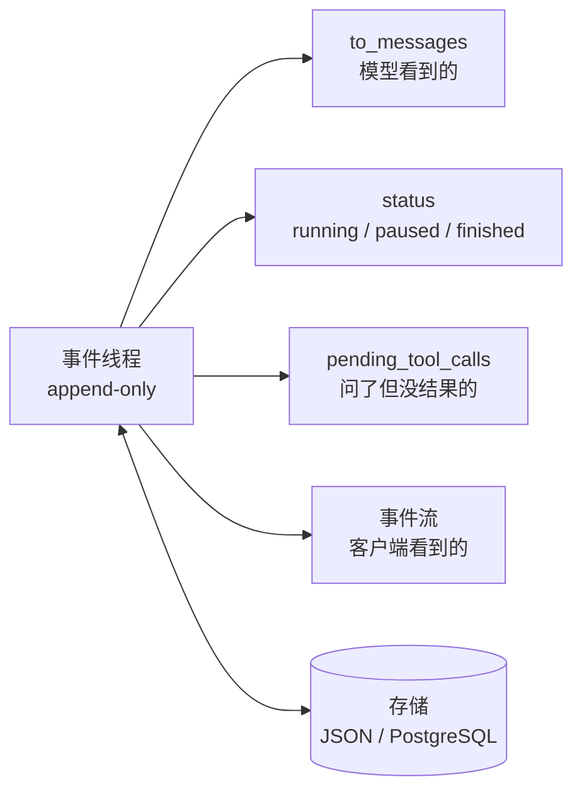

# 07 Agent State 与 Runtime：持久化、暂停恢复与人工介入

> 上一课的循环跑在一个进程里，停下就没了。这一课把状态从局部变量里拿出来，变成一份可以存盘、可以加载、可以从任意一点继续的事件记录。做到这一步，"等用户回来再继续"和"进程崩了接着跑"就成了同一件事。

## 学习目标

- 能把 Agent 的状态建模为一个 append-only 的事件线程，并从它推导出模型消息、运行状态和待处理的工具调用
- 能实现跨进程的暂停与恢复：把"问用户"做成工具调用，checkpoint 到存储，另一个进程加载后继续，且已执行的工具不重跑
- 能说出 double texting 的三种策略，并解释为什么"没有策略"等于"行为未定义"

## 前置

- [06 Agent 循环与控制流](../06-agent-loop/README.md)：循环结构、停止条件、"跳出循环等人"的伏笔
- [05 Tool Calling](../05-tool-calling/README.md)：幂等键。恢复时不重跑已执行的工具，靠的是同一个思路
- 前置模块 [P09 SQL 与 SQLAlchemy](../../prerequisites/python/09-sql-and-sqlalchemy/README.md)：本课用 JSON 文件代替数据库，M2 换成 PostgreSQL

## 心智模型

一句话：**发生过什么是唯一的事实，其他都是它的推导**。这是 12-factor 的 factor 05 和 factor 12 合在一起的意思。运行时不维护"当前第几步、是否在等用户"这类变量，需要时从事件列表里算。好处是存盘只存一个列表，恢复只加载一个列表，界面展示和日志排障看的也是同一个列表，几边永远不会不一致。

在这个模型上，四件事变得很自然：

**问人是一个工具调用。** 模型输出 `request_human_input(question=...)`，运行时记一条 `human_input_requested` 事件，存盘，退出。它和调用 `find_restaurants` 唯一的区别是结果不是立刻有的。factor 07 把这叫"用工具调用联系人类"。

**暂停发生在选好工具和执行之间。** 模型已经说了要做什么，运行时还没做。这个点上存盘，恢复时先看 `pending_tool_calls()`：有结果的跳过，没结果的执行。所以进程在任何一步崩掉都能接上，而且不会把已经做过的事再做一遍。

**恢复就是"加载，然后继续 fold"。** 没有特殊的恢复逻辑。同一个 `run()` 函数，传入一个新线程就是启动，传入一个加载回来的线程就是恢复。langchain-academy 里"invoke 时传 None 就从上次 checkpoint 继续"是同一个思想。

**客户端看的是同一份事件。** 循环每 append 一条就 yield 一条，前端拿到的进度和存进数据库的记录是同一个对象。不需要再发明一套"progress"结构。

## 最小可运行例子

| 文件 | 演示什么 | 运行 |
|---|---|---|
| [`code/01_state_as_event_log.py`](./code/01_state_as_event_log.py) | 手工构造一个线程，同一份事件打印成三种视图，JSON 往返无损 | `uv run python lessons/07-agent-state-and-runtime/code/01_state_as_event_log.py` |
| [`code/02_pause_resume.py`](./code/02_pause_resume.py) | 跨进程暂停恢复。第一次运行停在"问用户"，带 `USER_ANSWER` 再跑一次续上；`INJECT_CRASH=1` 在第一步后崩掉，再跑一次从第一步之后接上，工具不重跑 | 见文件顶部的四条命令，按顺序执行 |
| [`code/03_event_stream.py`](./code/03_event_stream.py) | 循环用 async generator 边 append 边 yield，客户端按 SSE 格式打印，最后断言流和线程一致 | `uv run python lessons/07-agent-state-and-runtime/code/03_event_stream.py` |
| [`code/04_double_texting.py`](./code/04_double_texting.py) | 运行中收到第二条消息：reject、enqueue、interrupt 三种策略 | 同上，`DOUBLE_TEXT=reject` / `enqueue` / `interrupt` |

事件线程本身在 [`project/src/aiapp/thread.py`](../../project/src/aiapp/thread.py)，不到 100 行，四个例子都用它。读的顺序建议：先 `thread.py` 的三个推导方法，再 `01`，再 `02` 的 `run()`。

`02` 用临时目录里的 JSON 文件当存储，路径会打印出来。M2 会把它换成 PostgreSQL 的一张表，`run()` 一行都不用改。

## 常见错误与失败注入

**先执行工具，再记事件。** `02_pause_resume.py` 是先 `execute()` 再 `append("tool_result")` 再 `save()`。如果崩在 `execute()` 之后、`save()` 之前，恢复时这个工具会再跑一次。这就是第 05 课幂等键存在的理由：运行时做不到"执行和记录"原子化，只能让重跑无害。可以把 `INJECT_CRASH` 的位置挪到 `execute()` 和 `save()` 之间自己看一次。

**恢复时重放所有事件的副作用。** 有人把"恢复"实现成"从头把每条事件再执行一遍"。事件是记录，不是指令。恢复只是把列表加载进内存，然后从 `pending_tool_calls()` 继续。

**执行状态另存一份。** 比如在线程之外再存一个 `status` 字段。两处只要有一次没同步，Agent 就会卡在"数据库说在等用户，事件里没有提问"的状态。`thread.py` 里 `status()` 是算出来的，没有对应的字段。

**double texting 没有策略。** `04_double_texting.py` 不设 `DOUBLE_TEXT` 时默认 interrupt。如果把 `handle_second_message` 整个删掉，第二条消息会在第一次运行还在写线程的时候被追加进去，两个循环交错写同一个列表，结果取决于调度顺序。这不是 bug，是没有做决定。

## 取舍

- **每步存盘 vs 只在暂停时存盘。** 每步存盘让任意点崩溃都能恢复，代价是每一步多一次写。对话类 Agent 步数少，每步存没问题；长任务可以按阶段存，但要接受阶段内崩溃会重做。
- **interrupt vs enqueue。** interrupt 响应快，用户改主意时立刻生效，但已经花掉的模型调用作废；enqueue 不浪费，但用户要等第一轮跑完。聊天场景通常 interrupt，后台任务通常 enqueue。reject 最简单，适合"一次只能有一个操作在进行"的场景，比如支付。
- **线程放多少东西。** factor 05 建议尽量把执行状态都放进线程，但 session id、密钥、大文件这类东西不该进模型上下文。`to_messages()` 是过滤器：线程里可以有运行时专用事件，模型看不到。第 08 课会在这个过滤器上做更多事。

## 练习

见 [exercises.md](./exercises.md)。

## 对照真实项目

主项目 [M2 数据与状态](../../project/m2-state-and-storage/README.md) 把 `thread.py` 的 `save()` / `load()` 换成 [`aiapp/storage/`](../../project/src/aiapp/storage/) 的 `ThreadStore` 协议：`load()` 返回快照，`append(event, expected_seq=)` 靠 `(conversation_id, seq)` 的唯一约束做乐观锁，两个写者只有一个能赢。`status()` 和 `pending_tool_calls()` 仍然是对事件列表的 fold，`conversation.status` 只是缓存。本课的 `02_pause_resume.py` 在 [`project/m2-state-and-storage/code/01_pause_resume_with_store.py`](../../project/m2-state-and-storage/code/01_pause_resume_with_store.py) 里换成了 store，三个场景行为不变。double texting 的 reject 策略在 [`api/routes/threads.py`](../../project/src/aiapp/api/routes/threads.py) 里是一把 Redis 运行锁，第二条消息返回 409。这一课的 `run()` 是 M3 `ToolRunner` 的骨架。

语音机器人项目的一个教训：早期把"当前在哪个子 Agent"、"是否在等用户确认"这类执行状态存在一个单独的状态对象里，和对话历史分开。一次部分失败后两边不一致，机器人反复问同一个问题。后来的修法是把这些状态都变成从历史推导，单独的状态对象只留缓存作用，不再是事实来源。另一个和 double texting 直接相关的场景：语音输入天然会出现用户在机器人说话时插话。那里用的是 interrupt 策略，但保留了被打断之前已经完成的工具结果，和 `04` 里 interrupt 分支的做法一样。

## 延伸阅读

- [12-factor-agents · factor 05 Unify execution state and business state](https://github.com/humanlayer/12-factor-agents/blob/main/content/factor-05-unify-execution-state.md)（访问日期 2026-09-04）：本课心智模型的出处，列了七个好处。
- [12-factor-agents · factor 06 Launch/Pause/Resume](https://github.com/humanlayer/12-factor-agents/blob/main/content/factor-06-launch-pause-resume.md) 与 [factor 07 Contact humans with tools](https://github.com/humanlayer/12-factor-agents/blob/main/content/factor-07-contact-humans-with-tools.md)（访问日期 2026-09-04）：注意 factor 06 那条备注，很多编排器允许暂停，但不允许在"选好工具"和"执行工具"之间暂停。
- [12-factor-agents · factor 12 Stateless reducer](https://github.com/humanlayer/12-factor-agents/blob/main/content/factor-12-stateless-reducer.md)（访问日期 2026-09-04）：作者自己说"这条主要是好玩"，但 `thread.py` 就是照它写的。
- [langchain-academy · module-2 state schema / reducers、module-3 breakpoints / edit state、module-6 double-texting](https://github.com/langchain-ai/langchain-academy)（访问日期 2026-09-04）：LangGraph 对同一组问题的框架化回答。看 reducer 那一节里"两个并行节点同时写一个键"的例子，本课的事件线程用 append-only 绕开了这个问题。

---

[← 上一课 06](../06-agent-loop/README.md) · [下一课 08 →](../08-context-engineering-for-agents/README.md)
