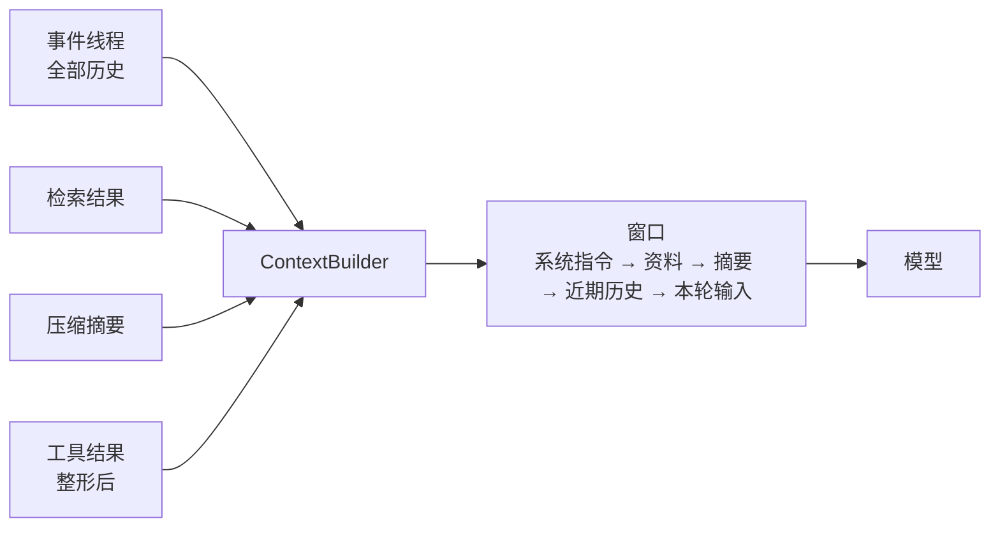
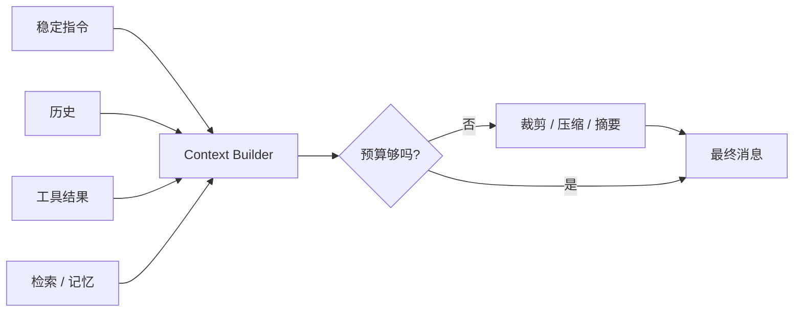

# 08 Agent 的 Context Engineering

> 模型是无状态函数：输入是「到现在为止发生了什么，下一步是什么」，输出是下一步。第 03 课讲怎么写好这段输入里的指令部分，这一课讲运行时每一轮怎么把指令、历史、检索结果、工具结果拼成一个窗口，以及怎么在窗口装不下的时候做决定。

## 为什么需要

上下文不是一个无限大的字符串。历史、工具结果和检索内容会互相挤占预算，最终让模型丢掉真正重要的约束。每一轮的组装过程都应该是可解释的。

## 学习目标

- 能写一个 ContextBuilder，把系统指令、参考资料、摘要、历史、工具结果按固定顺序组装进 token 预算内
- 能实现压缩（compaction）：老对话摘要化、完整日志保留、关键事实不交给摘要
- 能把一个巨大的工具结果整形成「概览 + 引用 + 按需取更多」，并说明为什么稳定前缀能省钱

## 前置

- [07 Agent State 与 Runtime](../07-agent-state-and-runtime/README.md)：事件线程是本课的输入。`to_messages()` 是最简单的上下文组装，本课把它做成可配置的
- [03 Prompt Engineering](../03-prompt-engineering/README.md)：单次调用里指令怎么写

## 心智模型



Anthropic 把上下文叫作 **attention budget**：窗口里每多一个 token，模型对其他 token 的注意力就少一点。上下文越长召回能力越差，是所有模型都有的性质。所以上下文工程的目标不是「塞得越多越好」，而是**在预算内放进信号最强的一组 token**。

四个动作：

**组装有顺序。** 稳定的东西在前：系统指令、工具定义、参考资料。易变的东西在后：近期历史、本轮输入、当前时间。顺序不只影响模型理解，还决定供应商的前缀缓存能不能命中。

**装不下就压缩，但日志不丢。** 事件线程是完整的，模型看到的是摘要加近期几轮。摘要是模型生成的，会漏东西；运行时确定知道重要的事实（过敏、预算、截止日期）要单独列出来原文传递，不依赖摘要。

**工具结果要整形。** 五百行查询结果原样进窗口，既费钱又把重点淹没。给模型一个概览（多少行、什么列、头几行、统计），存一个引用 id，再提供一个「取更多」的工具。这是 Anthropic 说的 **just-in-time**：上下文里放标识符，数据按需加载。

**自己掌控最终的消息列表。** factor 03 的核心主张。框架帮你拼上下文时，你要能打印出最终发给模型的每一条消息。看不到就调不了。




## 机制拆解

### 一、ContextBuilder：先放固定区段，再用剩余预算填历史

```python
@dataclass
class ContextBuilder:
    system: str
    budget_tokens: int
    documents: list[str] = field(default_factory=list)
    summary: str = ""
    history: list[Message] = field(default_factory=list)
    dropped: list[Message] = field(default_factory=list)

    def build(self) -> list[Message]:
        # ① 固定区段，顺序写死
        fixed = [Message(role="system", content=self.system)]
        if self.documents:
            docs = "\n\n".join(f"<doc id={i}>\n{d}\n</doc>"
                               for i, d in enumerate(self.documents))
            fixed.append(Message(role="user", content=f"Reference material:\n{docs}"))
        if self.summary:
            fixed.append(Message(role="user",
                                 content=f"Summary of earlier conversation:\n{self.summary}"))

        spent = sum(estimate_tokens(m.content) for m in fixed)
        if spent > self.budget_tokens:
            # 固定部分就超了：这是配置错误，不该靠裁历史来掩盖
            raise ValueError(f"fixed sections alone use {spent} tokens")

        # ② 从最近往前填历史，装不下就停
        kept = []
        for m in reversed(self.history):
            cost = estimate_tokens(m.content) + 8 * len(m.tool_calls)
            if spent + cost > self.budget_tokens:
                break
            kept.insert(0, m)
            spent += cost

        self.dropped = self.history[:len(self.history) - len(kept)]
        return fixed + kept
```

两个细节：

- **固定部分超预算时抛异常，不裁剪。** 系统提示词加参考资料就把窗口占满了，这是设计问题，静默裁历史只会让它更难发现。
- **`self.dropped` 要留下来。** 「这一轮丢了几条、第一条丢的是什么」应该进日志。丢东西不可怕，不知道丢了什么才可怕。

### 二、压缩：摘要不可信，关键事实单独走

```python
def extract_protected(thread) -> list[str]:
    """确定性抽取那些不能交给摘要的事实。"""
    return [e.data["content"] for e in thread.events
            if e.type == "user_message" and "allergic" in e.data["content"].lower()]

async def compact(thread, summarizer):
    messages = thread.to_messages()
    old, recent = messages[:-2], messages[-2:]      # 最近两条不压
    transcript = "\n".join(f"{m.role}: {m.content}" for m in old)
    reply = await summarizer.complete([Message(role="user",
        content=f"Summarize for continuity:\n{transcript}")])
    thread.append("compaction",
                  summary=reply.content,
                  covers=len(old),
                  protected=extract_protected(thread))   # ← 兜底

def window_for_model(thread) -> list[Message]:
    last = latest_compaction(thread)
    if last is None:
        return thread.to_messages()
    head = [Message(role="user", content=f"Summary so far: {last.data['summary']}")]
    if last.data["protected"]:
        head.append(Message(role="user",
            content="Facts to keep verbatim: " + " | ".join(last.data["protected"])))
    return head + thread.to_messages()[last.data["covers"]:]
```

`compaction` 是一条**事件**，不是对历史的覆写。原始消息全都还在线程里，只是不进窗口了。审计、回放、换个摘要策略重跑，都靠这一点。

`protected` 那个字段是整段的重点。摘要模型漏掉「对花生过敏」时，没有任何报错，之后所有菜单建议都可能出错。修法不是换更好的摘要模型，而是**让运行时对确定重要的事实单独负责**。

哪些算「确定重要」，是业务判断，不是技术判断。医疗、金融、合同场景各有各的清单。

### 三、工具结果整形：上下文里放引用，数据按需取

```python
RESULT_STORE: dict[str, list[dict]] = {}

def shape(rows: list[dict], head: int = 3, tail: int = 2) -> str:
    """紧凑视图：这是什么、有多大、样本长什么样、怎么取更多。"""
    ref = f"res_{uuid.uuid4().hex[:6]}"
    RESULT_STORE[ref] = rows                     # 全量存在窗口外
    by_status = Counter(r["status"] for r in rows)
    return json.dumps({
        "result_id":     ref,
        "row_count":     len(rows),
        "columns":       list(rows[0].keys()),
        "status_counts": dict(by_status),        # 聚合比原始行有用得多
        "head":          rows[:head],
        "tail":          rows[-tail:],
        "hint": f"call fetch_rows(result_id='{ref}', offset, limit) for more",
    })
```

500 行 JSON 原样进窗口是几万 token；整形后是几百。信息量反而更大，因为 `status_counts` 这种聚合是模型自己数不准的。

`hint` 字段告诉模型怎么要更多数据。配一个 `fetch_rows` 工具，模型需要细节时自己取。

### 四、稳定前缀省钱

供应商缓存的是**它见过的最长前缀**。系统提示词开头放一个时间戳，每次请求前缀都不同，缓存永远不命中：

```python
def build_window(turn, history) -> list[Message]:
    if VOLATILE:                                  # 反面教材
        system = f"Current time: {now}\nRequest #{turn}\n{RULES}\n{TOOLS_BLOCK}"
        return [Message(role="system", content=system), *history]

    # 正确做法：易变的东西放最后一条消息里
    system = f"{RULES}\n{TOOLS_BLOCK}"
    return [Message(role="system", content=system), *history,
            Message(role="user", content=f"(current time: {now})")]
```

十轮对话，稳定布局从第二轮起每轮命中，易变布局零命中。模型行为完全一样，成本差一大截。

## 常见错误

**摘要当事实。** 见上面的 `protected`。这类问题 ai-agents-for-beginners 叫 context poisoning 和 context distraction。

**先裁剪再组装。** 有人先把历史砍到固定条数，再加系统提示词和资料，结果资料一多就超预算，或者历史剩太多浪费预算。顺序必须是：固定区段 → 算剩余预算 → 从最近往前填历史。

**工具结果原样进窗口。** 除了费钱，更糟的是模型会在那堆数据里「看到」不存在的规律。

**时间戳放在系统提示词开头。** 很多人为了让模型知道现在几点，把时间写进系统提示词第一行。时间放在最后一条消息里效果一样，钱省一大半。

## 取舍

- **压缩的激进程度。** 压得狠，窗口小、便宜、模型专注，但丢细节的风险大——而且丢的往往是「当时看起来不重要、后来才发现关键」的信息。先做保守压缩，用评测确认没有回归，再逐步加大。
- **预检索 vs 运行时探索。** 把资料提前检索好塞进窗口，快但可能过期或不相关；让 Agent 用工具按需查，准但慢。变化快的内容适合按需，稳定的内容（法条、合同）适合预检索。多数系统是混合的。
- **自定义格式 vs 标准消息格式。** factor 03 提到可以不用 system/user/assistant 的标准格式，把整段历史打包成一条消息以节省 token 和注意力。收益是真的，代价是失去供应商对标准格式的优化（比如对工具调用的特殊处理）。先用标准格式，测出瓶颈再改。

## 工程落地

- **每次组装都留一份报告**：每个区段占了多少 token、丢了几条历史、工具结果压缩比多少。这份报告跟着 trace 走，是排查「模型为什么忘了刚才说的话」的唯一线索。
- **裁剪按整轮，不按条。** 只裁掉半轮（留下 assistant 的工具调用、丢掉对应的 tool result）会让模型看到不完整的对话，行为很怪。
- **`result_id` 的存储要有 TTL**，否则一天下来内存里全是没人再取的查询结果。
- **提示缓存要主动用**。供应商支持显式缓存断点时（比如 Anthropic 的 `cache_control`），把断点打在系统提示词和工具定义之后。

## 框架映射

| 本课概念 | LangGraph | OpenAI Agents SDK | Claude Agent SDK |
|---|---|---|---|
| 上下文组装 | 节点里自己从 state 拼 messages | `instructions` + input items | system prompt + 历史 |
| 历史裁剪 | `trim_messages` / `RemoveMessage` | Session 自己管 | SDK 自动压缩 |
| 压缩 | 自己写节点 | 自己写 | 内置自动 compaction |

Claude Agent SDK 的自动压缩最省事，代价是压缩策略不在你手里——正好是 factor 03 警告的那件事。官方文档：[LangGraph](https://langchain-ai.github.io/langgraph/) · [OpenAI Agents SDK](https://openai.github.io/openai-agents-python/) · [Claude Agent SDK](https://docs.claude.com/en/api/agent-sdk/overview)（核对日期 2026-09-05）。

## 一线经验

语音机器人的设备端每轮都会上报一段环境状态（时间、位置、正在播放什么）。早期把它放在系统提示词的开头，结果前缀缓存几乎从不命中。挪到最后一条用户消息里之后，同样的对话成本降了一大截，模型行为没有任何变化。

另一个教训：长对话的历史裁剪一度只按条数。用户说过的一条关键约束被裁掉后，模型反复违反它。后来的做法就是上面的 `protected`——确定重要的约束由运行时单独维护，不依赖它恰好还在窗口里。

## 练习

见 [exercises.md](./exercises.md)。

## 延伸阅读

- [12-factor-agents · factor 03 Own your context window](https://github.com/humanlayer/12-factor-agents/blob/main/content/factor-03-own-your-context-window.md)（访问日期 2026-09-04）：「在任何时刻，你给模型的输入都是『到现在发生了什么，下一步是什么』」。自定义上下文格式的例子在这里。
- [Anthropic · Effective context engineering for AI agents](https://www.anthropic.com/engineering/effective-context-engineering-for-ai-agents)（访问日期 2026-09-04）：attention budget、just-in-time 加载、compaction 三个概念的出处，本课的骨架。
- [ai-agents-for-beginners · 12 Context Engineering](https://github.com/microsoft/ai-agents-for-beginners/blob/main/12-context-engineering/README.md)（访问日期 2026-09-04）：四种常见失败（poisoning、distraction、confusion、clash）的分类和例子。
- [Anthropic · Prompt caching](https://platform.claude.com/docs/en/build-with-claude/prompt-caching)（访问日期 2026-09-05）：显式缓存断点的用法，读完再看一遍稳定前缀那一节。

---

[← 上一课 07](../07-agent-state-and-runtime/README.md) · [下一课 09 →](../09-workflow-vs-agent/README.md)
