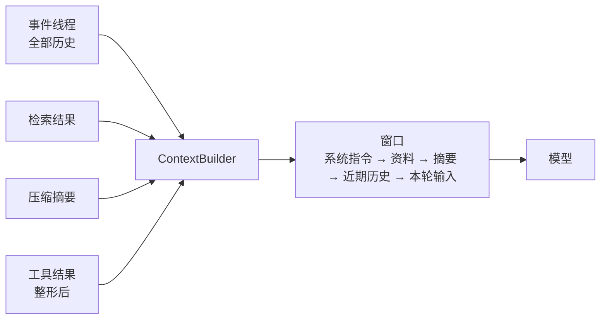

# 08 Agent 的 Context Engineering

> 模型是无状态函数：输入是"到现在为止发生了什么，下一步是什么"，输出是下一步。第 03 课讲怎么写好这段输入里的指令部分，这一课讲运行时每一轮怎么把指令、历史、检索结果、工具结果拼成一个窗口，以及怎么在窗口装不下的时候做决定。

## 学习目标

- 能写一个 ContextBuilder，把系统指令、参考资料、摘要、历史、工具结果按固定顺序组装进 token 预算内，并打印出发给模型的完整消息
- 能实现压缩（compaction）：老对话摘要化、完整日志保留、关键事实不交给摘要
- 能把一个巨大的工具结果整形成"概览 + 引用 + 按需取更多"，并说明为什么稳定前缀能省钱

## 前置

- [07 Agent State 与 Runtime](../07-agent-state-and-runtime/README.md)：事件线程是本课的输入。`to_messages()` 是最简单的上下文组装，本课把它做成可配置的
- [03 Prompt Engineering](../03-prompt-engineering/README.md)：单次调用里指令怎么写
- [05 Tool Calling](../05-tool-calling/README.md)：工具结果是消息，它的形状由运行时决定

## 心智模型

Anthropic 把上下文叫作 **attention budget**：窗口里每多一个 token，模型对其他 token 的注意力就少一点。上下文长度增加时召回能力下降，是所有模型都有的性质。所以上下文工程的目标不是"塞得越多越好"，而是**在预算内放进信号最强的一组 token**。

这一课的方法可以概括成四个动作：

**组装有顺序。** 稳定的东西在前：系统指令、工具定义、参考资料。易变的东西在后：近期历史、本轮输入、当前时间。顺序不只影响模型理解，还决定供应商的前缀缓存能不能命中。

**装不下就压缩，但日志不丢。** 事件线程是完整的，模型看到的是摘要加近期几轮。摘要是模型生成的，会漏东西；运行时确定知道重要的事实（过敏、预算、截止日期）要单独列出来原文传递，不依赖摘要。

**工具结果要整形。** 五百行查询结果原样进窗口，既费钱又把重点淹没。给模型一个概览（多少行、什么列、头几行、统计），存一个引用 id，再提供一个"取更多"的工具。这是 Anthropic 说的 **just-in-time**：上下文里放标识符，数据按需加载。

**自己掌控最终的消息列表。** factor 03 的核心主张。框架帮你拼上下文时，你要能打印出最终发给模型的每一条消息。看不到就调不了。

## 最小可运行例子

| 文件 | 演示什么 | 运行 |
|---|---|---|
| [`code/01_context_builder.py`](./code/01_context_builder.py) | 五个区段按固定顺序组装，预算内保留最近的历史，报告每段 token 和丢掉了什么 | `uv run python lessons/08-context-engineering-for-agents/code/01_context_builder.py`，加 `INJECT_OVERFLOW=1` 看裁剪 |
| [`code/02_compaction.py`](./code/02_compaction.py) | 超过阈值时用（fake）模型摘要老对话，线程保留全部事件；受保护的事实原文传递 | 同上，加 `INJECT_LOSSY=1` 看摘要漏掉过敏信息时保护列表怎么兜底 |
| [`code/03_tool_result_shaping.py`](./code/03_tool_result_shaping.py) | 500 行结果整形成概览 + result_id，模型可用 `fetch_rows` 按需取 | 同上，加 `INJECT_RAW=1` 对比 token 数 |
| [`code/04_stable_prefix.py`](./code/04_stable_prefix.py) | 十轮对话里对前缀做哈希，稳定布局 9/10 命中，把时间戳放进系统提示词的布局 0/10 | 同上，加 `INJECT_VOLATILE_PREFIX=1` |

`01` 的 `ContextBuilder.build()` 是本课的核心，二十行。它对第 07 课 `Thread.to_messages()` 的改进只有两点：区段有顺序，历史有预算。M3 会把它接到真实的检索结果上。

## 常见错误与失败注入

**摘要当事实。** `02_compaction.py` 的 `INJECT_LOSSY=1` 让摘要漏掉"过敏花生"，模型此后所有菜单建议都可能出错，而且没有任何报错。修法不是换更好的摘要模型，是让运行时对确定重要的事实单独负责。ai-agents-for-beginners 把这类问题叫 context poisoning 和 context distraction。

**先裁剪再组装。** 有人先把历史砍到固定条数，再加系统提示词和资料，结果资料一多就超预算，或者历史剩太多浪费预算。`01` 的顺序是先放固定区段、算出剩余预算、再从最近往前填历史。

**工具结果原样进窗口。** `03_tool_result_shaping.py` 的 `INJECT_RAW=1` 把 500 行 JSON 直接放进去，token 数是整形版的几十倍。更糟的是模型会在那堆数据里"看到"不存在的规律。

**时间戳放在系统提示词开头。** `04_stable_prefix.py` 演示的正是这个。很多人为了让模型知道现在几点，把时间写进系统提示词第一行，于是每次请求前缀都不同，缓存永远不命中。时间放在最后一条消息里效果一样，钱省一大半。

## 取舍

- **压缩的激进程度。** 压得狠，窗口小、便宜、模型专注，但丢细节的风险大，而且丢的往往是"当时看起来不重要、后来才发现关键"的信息。Anthropic 的建议是先做保守压缩，用评测确认没有回归，再逐步加大。
- **预检索 vs 运行时探索。** 把资料提前检索好塞进窗口，快但可能过期或不相关；让 Agent 用工具按需查，准但慢。变化快的内容适合按需，稳定的内容（法条、合同）适合预检索。多数系统是混合的。
- **自定义格式 vs 标准消息格式。** factor 03 提到可以不用 system/user/assistant 的标准格式，把整段历史打包成一条消息以节省 token 和注意力。收益是真的，代价是失去供应商对标准格式的优化（比如对工具调用的特殊处理）。先用标准格式，测出瓶颈再改。

## 练习

见 [exercises.md](./exercises.md)。

## 对照真实项目

主项目 [M3](../../project/m3-tool-workflow/README.md) 的 `ToolRunner` 把工具结果先经过 `shape()` 再进线程；`ContextBuilder` 在 M4 接上检索结果后成为每轮调用模型前的固定一步。

语音机器人项目的一个具体经验：设备端每轮都会上报一段环境状态（时间、位置、正在播放什么），早期把它放在系统提示词的开头，结果前缀缓存几乎从不命中。挪到最后一条用户消息里之后，同样的对话成本降了一大截，模型行为没有变化。另一个教训是长对话的历史裁剪一度只按条数，用户说过的一条关键约束被裁掉后模型反复违反它，后来做法就是本课 `02` 的思路：确定重要的约束由运行时单独维护，不依赖它恰好还在窗口里。

## 延伸阅读

- [12-factor-agents · factor 03 Own your context window](https://github.com/humanlayer/12-factor-agents/blob/main/content/factor-03-own-your-context-window.md)（访问日期 2026-09-04）："在任何时刻，你给模型的输入都是'到现在发生了什么，下一步是什么'"。自定义上下文格式的例子在这里。
- [Anthropic · Effective context engineering for AI agents](https://www.anthropic.com/engineering/effective-context-engineering-for-ai-agents)（访问日期 2026-09-04）：attention budget、just-in-time 加载、compaction 三个概念的出处，本课的骨架。
- [ai-agents-for-beginners · 12 Context Engineering](https://github.com/microsoft/ai-agents-for-beginners/blob/main/12-context-engineering/README.md)（访问日期 2026-09-04）：四种常见失败（poisoning、distraction、confusion、clash）的分类和例子，以及"记录选择、压缩、隔离的元数据以便排查"的建议。
- [langchain-academy · module-2 trim-filter-messages、chatbot-summarization](https://github.com/langchain-ai/langchain-academy/tree/main/module-2)（访问日期 2026-09-04）：LangGraph 里裁剪和摘要的框架化做法，`RemoveMessage` 的用法值得看一眼。

---

[← 上一课 07](../07-agent-state-and-runtime/README.md) · [下一课 09 →](../09-workflow-vs-agent/README.md)
