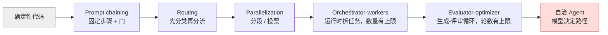

# 09 Workflow 还是 Agent：架构模式

> 面对一个需求，先问"能不能不用 Agent"。Anthropic 跟几十个团队做过 Agent 之后的结论是：最成功的实现用的都是简单、可组合的模式，而不是复杂框架。这一课给出五种 workflow 模式和一张判断表，帮你在"写死流程"和"放开让模型决定"之间选一个正确的位置。

> 附：[Agent 框架对比与选型](./bonus/agent-frameworks-compared.md)，学完本课再看。

## 学习目标

- 能用普通 Python 各写一个 prompt chaining、routing、parallelization、orchestrator-workers、evaluator-optimizer 的最小实现，并说出每种模式的适用条件
- 能对一个具体需求做判断：用确定性代码、用 workflow、还是用自治 Agent，理由是什么
- 能解释 planner / executor 和 evaluator-optimizer 为什么算 workflow 而不是 Agent

## 前置

- [06 Agent 循环与控制流](../06-agent-loop/README.md)：本课不再实现循环，直接引用它。第 06 课讲的是"运行时怎么执行一个 loop"，本课讲"面对需求时该不该用 loop"
- [05 Tool Calling](../05-tool-calling/README.md)

## 心智模型

Anthropic 的分类把"agentic system"分成两类：**workflow** 是模型和工具按预先写好的代码路径编排；**agent** 是模型自己决定过程和工具用法。两者之间不是好坏，是**可预测性和灵活性的交换**。

从左到右，模型的决策权越来越大，系统的可预测性越来越小，成本和延迟越来越高。**默认从最左边开始，只在简单方案确实不够时向右移一格。**

五种模式一句话：

| 模式 | 什么时候用 | 运行时守住什么 |
|---|---|---|
| Prompt chaining | 任务能干净地拆成固定顺序的子任务 | 步骤之间的确定性检查（门） |
| Routing | 输入有明显类别，各类别用不同提示词或模型更好 | 分类结果必须落在已知类别里，否则走兜底 |
| Parallelization | 子任务彼此独立（分段），或需要多个视角提高置信度（投票） | 聚合是代码做的，模型看不到其他分支 |
| Orchestrator-workers | 子任务的数量和内容要看输入才知道 | 计划是结构化输出，数量和类型有上限 |
| Evaluator-optimizer | 有明确的评审标准，且迭代确实能改善 | 评审结论结构化，轮数有上限，返回最佳而非最后 |

**Planner / executor** 是 orchestrator-workers 的一种：planner 输出结构化的子任务列表，executor 逐个执行。它算 workflow，因为路径由代码控制，模型只是填了计划的内容。**Evaluator-optimizer** 也算 workflow，因为循环的形状是固定的：生成、评审、再生成，模型不能决定"这次不评审了"。

只有当路径无法预先枚举、必须让模型根据每一步的结果决定下一步时，才需要自治 Agent。那就是第 06 课的循环。代价是更高的成本、更长的延迟、错误会累积，所以要有沙箱、预算和评测。

## 最小可运行例子

五个文件各实现一种模式，每个不到 80 行，都不依赖第 06 课的循环。

| 文件 | 演示什么 | 注入 |
|---|---|---|
| [`code/01_prompt_chaining.py`](./code/01_prompt_chaining.py) | 大纲 → 门 → 草稿 → 门 → 润色 | `INJECT_BAD_OUTLINE=1`：大纲只有一节，第一道门直接拒绝 |
| [`code/02_routing.py`](./code/02_routing.py) | 分类器决定走便宜模型还是强模型；未知类别走人工 | `INJECT_UNKNOWN_LANE=1` |
| [`code/03_parallelization.py`](./code/03_parallelization.py) | 分段评审三个关注点并合并；三次投票取多数 | 无 |
| [`code/04_orchestrator_workers.py`](./code/04_orchestrator_workers.py) | 计划是 Pydantic 校验的结构化输出，`max_length=8` 是契约的一部分 | `INJECT_HUGE_PLAN=1`：40 个子任务的计划被拒 |
| [`code/05_evaluator_optimizer.py`](./code/05_evaluator_optimizer.py) | 生成、评分、反馈循环，三轮上限，返回历史最佳 | `INJECT_NEVER_PASSES=1` |

运行任意一个：`uv run python lessons/09-workflow-vs-agent/code/<file>`。

读的时候注意每个文件里"模型做的事"和"代码做的事"的分界：门、类别校验、聚合、计划上限、轮数上限全是代码。这就是 workflow 比 Agent 可预测的原因。

## 常见错误与失败注入

**用 Agent 解决 chaining 就能解决的问题。** 一个"翻译、校对、排版"的任务被做成了自治 Agent，模型有时跳过校对，有时排版两次。它的步骤是固定的，应该是 `01` 的链。

**分类结果不校验。** `02_routing.py` 的 `INJECT_UNKNOWN_LANE=1` 让分类器输出一个不存在的类别。没有校验的代码会 `KeyError` 崩掉，或者更糟，用字符串匹配把它路由到一个随便的地方。

**计划没有上限。** `04_orchestrator_workers.py` 的 `INJECT_HUGE_PLAN=1` 让编排模型提出 40 个子任务。Pydantic 的 `max_length=8` 在计划进入执行前就拒绝了它。上限是契约，不是运行中的判断。

**Evaluator 永远不满意。** `05_evaluator_optimizer.py` 的 `INJECT_NEVER_PASSES=1`。没有轮数上限的版本会一直烧钱；有上限但返回"最后一次"而不是"最好一次"的版本会返回一个更差的结果。

## 取舍

- **可预测性 vs 灵活性。** workflow 的路径可以画出来、测出来、在出问题时定位到某一步。Agent 的路径每次不同，只能靠 trace 事后看。对合规要求高、失败代价大的场景，这一条就足够决定用 workflow。
- **延迟 vs 准确率。** chaining 把一次调用拆成三次，延迟翻三倍，但每次调用的任务更简单、更准。parallelization 反过来用并发换时间。选哪个看用户等得起多久。
- **框架 vs 直接调 API。** Anthropic 的建议是先直接用 API，很多模式几行代码就够；用框架就要理解它底层做了什么。本课五个文件加起来不到 400 行，这是"够不够"的一个参照。选框架前先看 [bonus 里的对比](./bonus/agent-frameworks-compared.md)。

## 练习

见 [exercises.md](./exercises.md)。

## 对照真实项目

主项目 [M3](../../project/m3-tool-workflow/README.md) 的 Tool Workflow 就是一个 routing + chaining 的组合：先分类意图，再走固定的"校验、确认、执行"链。它刻意不用自治 Agent，因为每一步都有副作用。M3 的 README 会记录这个选型理由。

语音机器人项目的经验：用户的一句话可能同时是聊天和指令（"放点爵士乐，然后跟我讲讲 Miles Davis"），最初用一个 Agent 循环处理，模型经常只做其中一半。后来改成 routing：一个小模型先分类成"纯聊天 / 纯指令 / 两者都有"三类，再分别走不同的路径。分类模型偶尔输出训练时见过但当前不存在的类别名，兜底是当作"纯聊天"，这就是 `02` 里 `human_review` 那个分支的角色。这个 routing 的并行版本是第 10 课的 racing。

## 延伸阅读

- [Anthropic · Building effective agents](https://www.anthropic.com/research/building-effective-agents)（访问日期 2026-09-04）：本课五种模式的出处。附录里"Agent 的两个实践领域"和"给工具写好文档"两节也值得读。
- [12-factor-agents · factor 10 Small, focused agents](https://github.com/humanlayer/12-factor-agents/blob/main/content/factor-10-small-focused-agents.md)（访问日期 2026-09-04）：为什么用确定性代码把多个小 Agent 串起来，比一个大 Agent 可靠。
- [ai-agents-for-beginners · 07 Planning Design](https://github.com/microsoft/ai-agents-for-beginners/blob/main/07-planning-design/README.md)（访问日期 2026-09-04）：用结构化输出做任务分解和迭代重规划的例子，对应本课 `04`。
- [ai-agents-for-beginners · 03 Agentic Design Patterns](https://github.com/microsoft/ai-agents-for-beginners/blob/main/03-agentic-design-patterns/README.md)（访问日期 2026-09-04）：偏用户体验视角的设计原则（透明、可控、一致），和本课的架构视角互补。
- [langchain-academy · module-4 parallelization、sub-graph、map-reduce](https://github.com/langchain-ai/langchain-academy/tree/main/module-4)（访问日期 2026-09-04）：LangGraph 里同样模式的图式表达，map-reduce 那节对应本课 `03` 和 `04`。

---

[← 上一课 08](../08-context-engineering-for-agents/README.md) · [下一课 10 →](../10-multi-agent-handoff/README.md)
