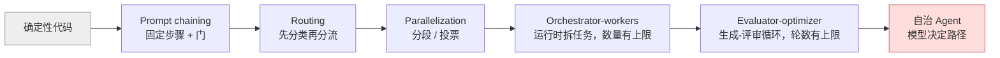
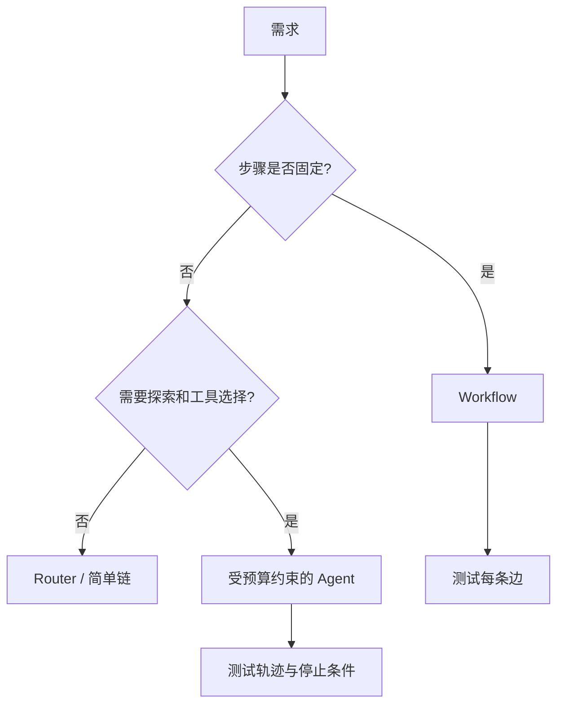
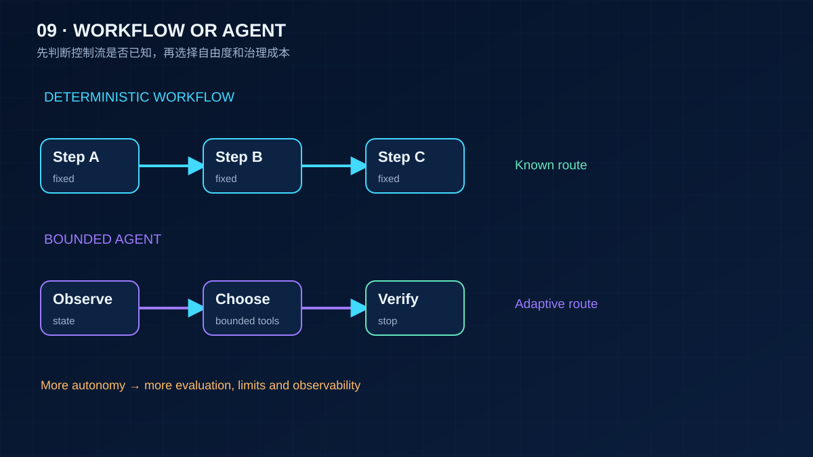

# 09 Workflow 还是 Agent：架构模式

> 面对一个需求，先问「能不能不用 Agent」。Anthropic 跟几十个团队做过 Agent 之后的结论是：最成功的实现用的都是简单、可组合的模式，而不是复杂框架。这一课给出五种 workflow 模式和一张判断表，帮你在「写死流程」和「放开让模型决定」之间选一个正确的位置。

## 为什么需要

把所有需求都交给自治 Agent，会把可预测的业务流程变成难测的黑箱。先识别能固定的控制流，再为真正需要探索的分支保留自由度。

## 学习目标

- 能各写一个 prompt chaining、routing、parallelization、orchestrator-workers、evaluator-optimizer 的最小实现，并说出每种模式的适用条件
- 能对一个具体需求做判断：用确定性代码、用 workflow、还是用自治 Agent，理由是什么
- 能解释 planner / executor 和 evaluator-optimizer 为什么算 workflow 而不是 Agent

## 前置

- [06 Agent 循环与控制流](../06-agent-loop/README.md)：第 06 课讲的是「运行时怎么执行一个 loop」，本课讲「面对需求时该不该用 loop」

## 心智模型

Anthropic 的分类把 agentic system 分成两类：**workflow** 是模型和工具按预先写好的代码路径编排；**agent** 是模型自己决定过程和工具用法。两者之间不是好坏，是**可预测性和灵活性的交换**。



从左到右，模型的决策权越来越大，系统的可预测性越来越小，成本和延迟越来越高。**默认从最左边开始，只在简单方案确实不够时向右移一格。**

| 模式 | 什么时候用 | 运行时守住什么 |
|---|---|---|
| Prompt chaining | 任务能干净地拆成固定顺序的子任务 | 步骤之间的确定性检查（门） |
| Routing | 输入有明显类别，各类别用不同提示词或模型更好 | 分类结果必须落在已知类别里，否则走兜底 |
| Parallelization | 子任务彼此独立（分段），或需要多个视角提高置信度（投票） | 聚合是代码做的，模型看不到其他分支 |
| Orchestrator-workers | 子任务的数量和内容要看输入才知道 | 计划是结构化输出，数量和类型有上限 |
| Evaluator-optimizer | 有明确的评审标准，且迭代确实能改善 | 评审结论结构化，轮数有上限，返回最佳而非最后 |

**Planner / executor 是 orchestrator-workers 的一种**：planner 输出结构化的子任务列表，executor 逐个执行。它算 workflow，因为路径由代码控制，模型只是填了计划的内容。

**Evaluator-optimizer 也算 workflow**，因为循环的形状是固定的：生成、评审、再生成。模型不能决定「这次不评审了」。

只有当路径无法预先枚举、必须让模型根据每一步的结果决定下一步时，才需要自治 Agent。那就是第 06 课的循环。代价是更高的成本、更长的延迟、错误会累积，所以要有沙箱、预算和评测。





## 机制拆解

五种模式，五段代码。读的时候注意**「模型做的事」和「代码做的事」的分界**：门、类别校验、聚合、计划上限、轮数上限，全是代码。这就是 workflow 比 Agent 可预测的原因。

### 一、Prompt chaining：步骤之间有门

```python
async def write_article(model, topic) -> str:
    outline = await step(model, "Produce a 3-5 line outline.", topic)
    gate_outline(outline)                    # ← 门，确定性检查
    draft = await step(model, "Write one paragraph per outline line.", outline)
    if len(draft) < 40:
        raise ValueError("draft too short")  # ← 门
    return await step(model, "Tighten the prose; keep every fact.", draft)

def gate_outline(outline: str) -> None:
    sections = [line for line in outline.splitlines() if line.strip()]
    if len(sections) < 3:
        raise ValueError(f"outline has {len(sections)} section(s); need at least 3")
```

门的作用是**不让坏的中间结果流到下游**。没有门的链条会一路把错误放大，最后一步的输出看起来很流畅，但基于一个一节的大纲。

延迟变成三倍，换来的是每次调用的任务更简单、更准。

### 二、Routing：分类结果必须校验

```python
LANES = {
    "faq":          ("cheap-model", "Answer briefly from the FAQ."),
    "refund":       ("strong-model", "You handle refund disputes. Policy: ..."),
    "human_review": (None, None),            # 兜底车道
}

async def classify(classifier, question) -> str:
    reply = await classifier.complete([...])
    label = reply.content.strip().lower()
    if label not in LANES:                   # ← 关键：不认识的类别不能崩，也不能瞎猜
        return "human_review"
    return label
```

分类器有时会输出一个训练时见过、但当前不存在的类别名。没有这个校验，代码要么 `KeyError` 崩掉，要么更糟——用字符串模糊匹配把它路由到一个随便的地方。

兜底车道选哪个是业务决定。这里选 `human_review`（最安全），不选 `faq`（最便宜）。

### 三、Parallelization：分段与投票

```python
# 分段：一份文档，三个关注点，各自独立
async def sectioned_review(text) -> dict[str, str]:
    concerns = {"security": ..., "performance": ..., "style": ...}
    results = await asyncio.gather(*(review(c, text, m) for c, m in concerns.items()))
    return dict(results)

# 投票：同一个问题问三次，取多数
async def vote_is_safe(text, attempts=3) -> tuple[bool, Counter]:
    replies = await asyncio.gather(*(v.complete([...]) for v in voters))
    tally = Counter(r.content.strip().lower() for r in replies)
    return tally["safe"] > attempts // 2, tally
```

两种用法差别很大。**分段**是把一个大任务拆成互不相干的小任务，图的是速度和每个子任务的专注度。**投票**是同一个任务做多次，图的是置信度——用成本换准确率。

共同点：聚合是代码做的，模型看不到其他分支的结果。这是它和多 Agent 协作（第 10 课）的分界。

### 四、Orchestrator-workers：计划是有 schema 的

```python
class SubTask(BaseModel):
    kind: str = Field(pattern="^(read|search|compute)$")   # 类型白名单
    description: str

class Plan(BaseModel):
    subtasks: list[SubTask] = Field(max_length=8)          # 上限是契约的一部分

async def run(orchestrator, task):
    try:
        plan = Plan.model_validate_json(
            (await orchestrator.complete([...])).content)
    except ValidationError as exc:
        return f"plan rejected: {exc.errors()[0]['msg']}"   # 计划进入执行前就被拒
    results = await asyncio.gather(*(worker(s) for s in plan.subtasks))
    return await synthesize(orchestrator, results)
```

`max_length=8` 那一行是整段的重点。编排模型偶尔会提出 40 个子任务的计划——**上限是契约，不是运行中的判断**。写在 schema 里，它在计划进入执行之前就被拒绝了，一分钱都不花。

`kind` 的正则同理：worker 只会实现有限几种能力，模型编出一个 `"deploy"` 类型的子任务时，应该在这里被挡住。

### 五、Evaluator-optimizer：返回最佳，不是最后

```python
MAX_ROUNDS = 3

async def refine(generator, evaluator, task) -> tuple[str, bool]:
    feedback = ""
    best, best_score = "", -1
    for round_no in range(1, MAX_ROUNDS + 1):
        draft = (await generator.complete([...f"{task}\nFeedback: {feedback}"])).content
        verdict = json.loads((await evaluator.complete([...])).content)   # 结构化评审

        if verdict["score"] > best_score:          # ← 记住历史最佳
            best, best_score = draft, verdict["score"]
        if verdict["score"] >= 8:
            return best, True

        feedback = verdict["feedback"]
    return best, False              # 轮数用完，返回最佳，并标明没达标
```

两个容易写错的地方：

1. **没有轮数上限**：评审模型永远不满意，循环一直烧钱。
2. **返回最后一次而不是最好一次**：第二轮 9 分，第三轮 6 分，返回 6 分那个。迭代不保证单调变好。

`verdict` 是结构化的（`score` + `feedback`），所以「要不要继续」是运行时判断的，不是模型说了算。

## 常见错误

**用 Agent 解决 chaining 就能解决的问题。** 一个「翻译、校对、排版」的任务被做成了自治 Agent，模型有时跳过校对，有时排版两次。它的步骤是固定的，应该是一条链。

**分类结果不校验。** 见上面第二节。

**计划没有上限。** 见上面第四节。上限要写进 schema，不要写成 `if len(plan) > 8: ...` 那种执行时的判断——那时模型调用的钱已经花了。

**Evaluator 永远不满意。** 见上面第五节。

## 取舍

- **可预测性 vs 灵活性。** workflow 的路径可以画出来、测出来、在出问题时定位到某一步。Agent 的路径每次不同，只能靠 trace 事后看。对合规要求高、失败代价大的场景，这一条就足够决定用 workflow。
- **延迟 vs 准确率。** chaining 把一次调用拆成三次，延迟翻三倍，但每次调用的任务更简单、更准。parallelization 反过来用并发换时间。选哪个看用户等得起多久。
- **框架 vs 直接调 API。** Anthropic 的建议是先直接用 API，很多模式几十行代码就够；用框架就要理解它底层做了什么。上面五种模式，每种的核心逻辑都在二十行以内——这是「够不够」的一个参照。框架全景见 [reference/frameworks.md](../../reference/frameworks.md)。

## 工程落地

- **每种模式的失败形态不同，监控也不同。** chaining 看每道门的拒绝率，routing 看各车道的分布和兜底率，orchestrator 看计划被拒的比例，evaluator-optimizer 看平均轮数。
- **模式可以嵌套，但要有边界。** routing 的某一条车道里跑一个 chaining 是合理的；chaining 的某一步里跑一个自治 Agent 就要谨慎——外层的确定性会被内层的不确定性吃掉。
- **选型要留记录。** 「为什么这里用 workflow 不用 Agent」应该写进设计文档。三个月后有人想「优化」成自治 Agent 时，这份记录是唯一的防线。

## 框架映射

| 本课概念 | LangGraph | OpenAI Agents SDK | Claude Agent SDK |
|---|---|---|---|
| workflow 编排 | `StateGraph` + 条件边，这是它的强项 | agent 之间 handoff，或直接写 Python | 主要面向自治 loop |
| 并行 | 图里的并行分支 + reducer | `asyncio.gather` 自己写 | 自己写 |
| 结构化计划 | 节点输出带 schema 的 state | agent 的 `output_type` | 工具 schema |

LangGraph 是三个里唯一把 workflow 当一等公民的。如果你的系统大部分是确定性流程、只有少数节点交给模型，它的图模型很贴。官方文档：[LangGraph](https://langchain-ai.github.io/langgraph/) · [OpenAI Agents SDK](https://openai.github.io/openai-agents-python/) · [Claude Agent SDK](https://docs.claude.com/en/api/agent-sdk/overview)（核对日期 2026-09-05）。

## 一线经验

语音机器人项目里，用户的一句话可能同时是聊天和指令：「放点爵士乐，然后跟我讲讲 Miles Davis」。最初用一个 Agent 循环处理，模型经常只做其中一半。

后来改成 routing：一个小模型先分类成「纯聊天 / 纯指令 / 两者都有」三类，再分别走不同的路径。分类模型偶尔输出训练时见过但当前不存在的类别名，兜底是当作「纯聊天」——这就是上面 `human_review` 那个分支的角色。

这个 routing 的并行版本是第 10 课的 racing。

## 练习

见 [exercises.md](./exercises.md)。

## 延伸阅读

- [Anthropic · Building effective agents](https://www.anthropic.com/research/building-effective-agents)（访问日期 2026-09-04）：本课五种模式的出处。附录里「Agent 的两个实践领域」和「给工具写好文档」两节也值得读。
- [12-factor-agents · factor 10 Small, focused agents](https://github.com/humanlayer/12-factor-agents/blob/main/content/factor-10-small-focused-agents.md)（访问日期 2026-09-04）：为什么用确定性代码把多个小 Agent 串起来，比一个大 Agent 可靠。
- [ai-agents-for-beginners · 07 Planning Design](https://github.com/microsoft/ai-agents-for-beginners/blob/main/07-planning-design/README.md)（访问日期 2026-09-04）：用结构化输出做任务分解和迭代重规划的例子。
- [langchain-academy · module-4 parallelization、sub-graph、map-reduce](https://github.com/langchain-ai/langchain-academy/tree/main/module-4)（访问日期 2026-09-04）：同样模式的图式表达。

---

[← 上一课 08](../08-context-engineering-for-agents/README.md) · [下一课 10 →](../10-multi-agent-handoff/README.md)
