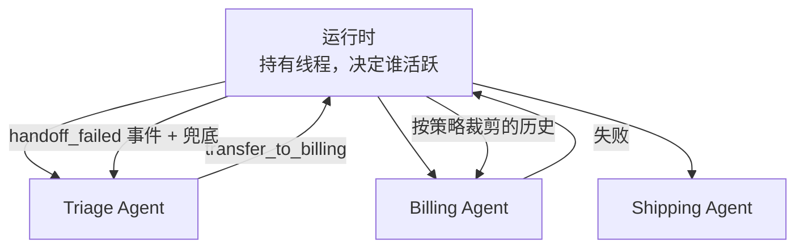
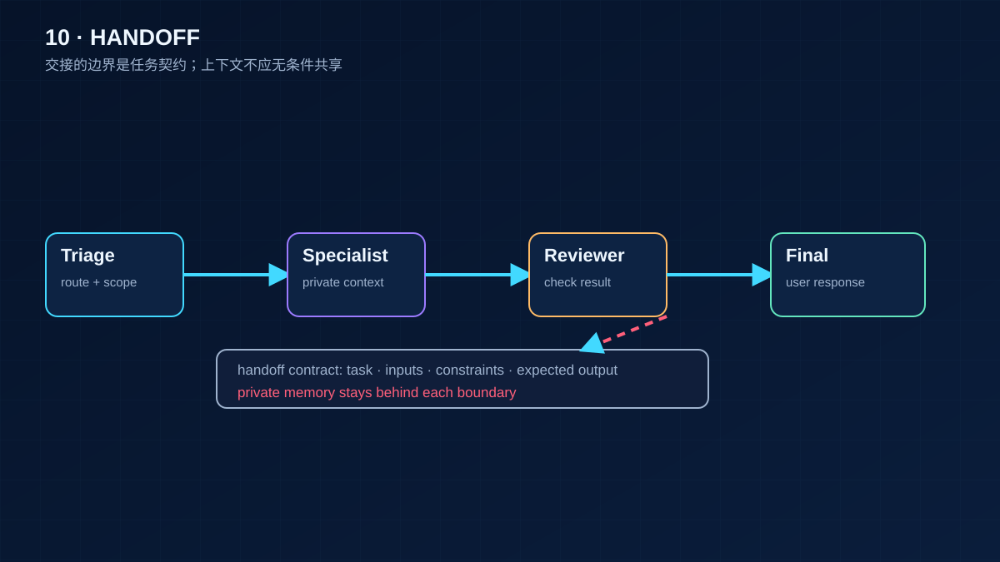

# 10 多智能体、Handoff 与 Racing

> 一个 Agent 管 3～10 步是可靠的上限。任务再大，就拆成几个小 Agent，让运行时把它们串起来或并起来。这一课讲三个具体问题：控制权怎么交接、交接时历史给多少、两个 Agent 并行时谁的输出算数。它们的共同答案是：由运行时决定，不由任何一个 Agent 决定。

## 为什么需要
多个 Agent 直接互传上下文会造成状态归属不明、权限扩大和失败无法回退。交接需要显式事件、最小视图和明确的控制权。

## 学习目标

- 能实现 handoff：把"转交"做成工具调用，由运行时切换活跃 Agent，并按策略决定专家 Agent 看到多少历史
- 能实现 racing：两个模型并行处理同一输入，按规则取舍，其中一个超时时有确定的兜底
- 能说清多 Agent 系统里状态归谁、每个 Agent 看到什么、一个 Agent 失败时控制权怎么回来

## 前置

- [09 Workflow 还是 Agent](../09-workflow-vs-agent/README.md)：本课是 routing 和 orchestrator-workers 在多 Agent 上的延伸
- [07 Agent State 与 Runtime](../07-agent-state-and-runtime/README.md)：多个 Agent 共用一个事件线程，靠 `agent` 标签区分
- [08 Agent 的 Context Engineering](../08-context-engineering-for-agents/README.md)：handoff 时给专家的历史，就是一次上下文组装

## 心智模型

多 Agent 不是让几个模型互相聊天。它是运行时的一个编排层，Agent 之间不直接通信，所有交接都经过运行时。这样三件事才有归属：

**Handoff 是工具调用。** Triage Agent 输出 `transfer_to_billing(reason=...)`，和调用任何工具一样经过注册表和校验。运行时收到后把活跃 Agent 换成 billing。OpenAI Agents SDK 把这叫 handoff，把"把另一个 Agent 当工具调用、结果回给自己"叫 agents-as-tools，两者的区别是控制权有没有转移。

**历史给多少是策略。** 全给：专家看到一切，token 最多，容易被无关历史干扰。只给最后一句：便宜、专注，但丢了"用户已经说过订单号"这类上下文。摘要：折中，但摘要本身可能漏。`01` 让你三种都跑一遍看差别。真实系统里这个策略通常按目标 Agent 配置。

**Racing 是并行的 routing。** 第 09 课的 routing 是先分类再处理，串行，慢。语音场景等不了，于是让聊天模型和分类模型同时跑：分类说"是指令"就取消聊天草稿去执行，说"是聊天"就用草稿，分类超时就直接用草稿。规则写在代码里，两个模型都不知道对方存在。

**状态归运行时，Agent 拿视图。** 所有 Agent 的输出都进同一个线程，带 `agent` 标签。每个 Agent 调模型时拿到的是运行时算出来的视图：用户消息共享，assistant 消息只看自己的。专家 Agent 抛异常，运行时记一条 `handoff_failed`，控制权回到 triage，它用手头信息给用户一个诚实的答复。

## 最小可运行例子

| 文件 | 演示什么 | 运行 |
|---|---|---|
| [`code/01_handoff.py`](./code/01_handoff.py) | 转交是工具调用；`HANDOFF_HISTORY=full / summary / last` 三种策略下专家看到的消息 | `uv run python lessons/10-multi-agent-handoff/code/01_handoff.py`，换环境变量看三种 |
| [`code/02_racing.py`](./code/02_racing.py) | 聊天模型和分类模型并行；指令 / 聊天 / 两者都有三种裁决；分类超时兜底到草稿 | 同上，加 `INJECT_CLASSIFIER_TIMEOUT=1` |
| [`code/03_ownership_and_fallback.py`](./code/03_ownership_and_fallback.py) | 一个线程多个 Agent，`view_for()` 给每个 Agent 算视图；专家失败记事件、控制权回 triage | 同上，加 `INJECT_SPECIALIST_FAIL=1` |

`03` 的 `view_for()` 是第 08 课 ContextBuilder 的多 Agent 版本，十行。它和 `01` 的 `context_for_specialist()` 解决的是同一个问题的两个时刻：交接那一刻给多少，之后每一轮给多少。

## 常见错误与失败注入

**Agent 之间直接传消息。** 有人让 triage 的输出直接成为 billing 的输入，中间没有运行时。结果是没有人记录交接发生过，billing 失败时没有地方回退，历史策略也没法配置。`03` 里所有交接都经过 `handle()`，线程里有 `handoff` 和 `handoff_failed` 事件。

**Handoff 全量带历史。** `HANDOFF_HISTORY=full` 在三条消息的例子里没问题，二十轮之后专家 Agent 的窗口里大部分是和它无关的闲聊。它会被干扰，也贵。默认策略应该是 summary 或 last，全量是需要理由的选择。

**Racing 没有超时。** `02_racing.py` 的 `INJECT_CLASSIFIER_TIMEOUT=1` 让分类模型慢半秒。没有 `wait_for` 的版本，用户就要等这半秒；有超时但没有兜底的版本，用户得到一个错误。正确的行为是超时就用聊天草稿，并记录"这次没分类"以便事后看分类超时率。

**取消了草稿但它已经产生副作用。** `02` 里被取消的是一个纯文本草稿，取消是安全的。如果聊天模型也能调工具，取消它之前必须确认它没有已执行的调用。这是第 07 课"执行和记录之间不能崩"的另一个形态。

## 取舍

- **拆成多个 Agent 还是一个大 Agent。** 拆的收益：每个 Agent 的上下文小、提示词专、能独立测试和替换。代价：交接策略、视图计算、失败回退都是新代码。经验是先用一个 Agent 加 routing，等某个分支的提示词长到互相打架了再拆。
- **Handoff 还是 agents-as-tools。** 转移控制权适合"接下来的对话都归专家"（客服转接）；当工具调用适合"问一下专家再回来"（让翻译 Agent 翻一段）。前者专家直接面对用户，后者主 Agent 始终在场。别混用：一个专家既能被当工具调又能接管控制权，状态会很难讲清楚。
- **Racing 的成本。** 并行意味着两次模型调用都要付钱，被取消的那次也常常已经计费。它换来的是延迟。只在延迟真的重要（语音、实时交互）时用，后台任务用第 09 课的串行 routing。

## 生产方案
M3 的 runtime 记录 handoff 事件并按 Agent 生成视图；M5 的 trace 和租户 guardrail 让交接可审计。

## 框架映射

| 本课概念 | LangGraph | OpenAI Agents SDK | Claude Agent SDK |
|---|---|---|---|
| handoff / isolated views / racing | subgraph / Command / parallel branches | handoff / agents as tools | subagents / sessions / permission modes |

*映射按 Framework Lab 的概念边界整理，框架行为以官方文档和 [Framework Lab](../../project/framework-lab/README.md) 在 2026-09-04 的实现证据为准。*

## 练习

见 [exercises.md](./exercises.md)。

## 对照真实项目

主项目 [M3.4](../../project/m3-tool-workflow/README.md) 是可选里程碑：把 M3 的 Tool Workflow 拆成 router + worker 两个 Agent，用 `01` 的 handoff 和 `03` 的视图。它可选是因为多 Agent 的收益要到任务足够复杂时才显现，主项目在 M3 阶段还不需要。

语音机器人项目就是 `02` 的来源。一个聊天模型负责自然回复，一个小的意图分类模型并行判断用户是不是在发指令（调音量、放音乐、退出）。分类结果有三种：只聊天，用聊天回复；只指令，取消聊天回复去执行；两者都有，执行指令同时用聊天回复。踩过的坑有两个。一是分类模型偶尔输出训练时见过、当前没注册的工具名，最初用提示词压，效果不稳，后来是第 05 课的注册表兜底：查不到就当"只聊天"。二是聊天模型的回复正文里偶尔出现格式完美的函数调用 JSON，一度被解析执行，后来只认工具调用通道，正文一律当文本。这两条都和多 Agent 无关，但正是多 Agent 系统里最容易出的问题：每多一个模型，就多一处需要运行时守卫的地方。

## 延伸阅读

- [ai-agents-for-beginners · 08 Multi-agent design patterns](https://github.com/microsoft/ai-agents-for-beginners/blob/main/08-multi-agent/README.md)（访问日期 2026-09-04）：什么场景值得多 Agent，group chat / hand-off / collaborative filtering 三种模式，以及"要能看见 Agent 之间的交互"。
- [OpenAI Agents SDK · README](https://github.com/openai/openai-agents-python/blob/main/README.md)（访问日期 2026-09-04）：handoffs 和 agents-as-tools 两个概念的区分，文档里的 handoff input filter 就是本课 `01` 的历史策略。
- [12-factor-agents · factor 10 Small, focused agents](https://github.com/humanlayer/12-factor-agents/blob/main/content/factor-10-small-focused-agents.md)（访问日期 2026-09-04）：拆小 Agent 的理由。
- [langchain-academy · module-4 sub-graph、map-reduce](https://github.com/langchain-ai/langchain-academy/tree/main/module-4)（访问日期 2026-09-04）：子图有自己的 state schema、父图只看到它暴露的键，对应本课 `03` 的视图思想。
- [Agent 框架对比与选型](../../project/framework-lab/00-landscape.md)：判断框架的六个问题里，"多 Agent 怎么交接"那一条现在你有了自己的答案。

---

[← 上一课 09](../09-workflow-vs-agent/README.md) · [下一课 11 →](../11-mcp/README.md)
