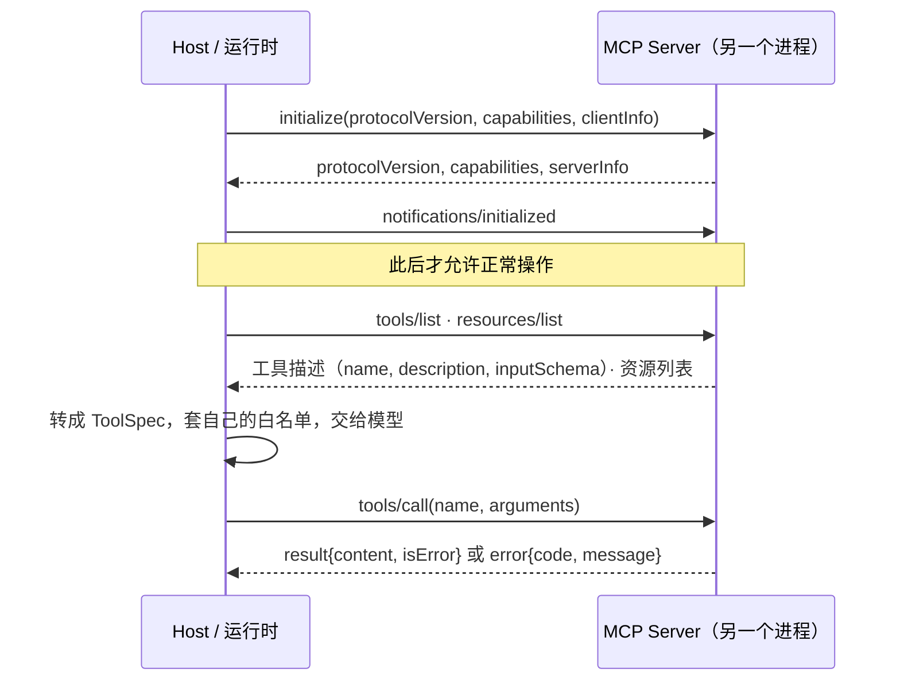
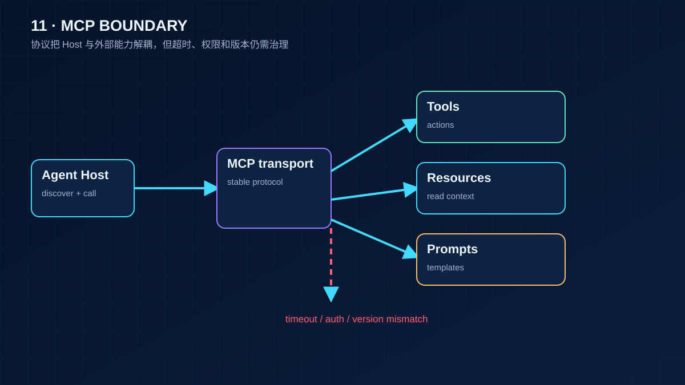

# 11 MCP：模型上下文协议

> 第 05 课的工具是你自己写在进程里的函数。MCP 解决的是另一个问题：工具在别的进程、别的机器、别人的代码里，怎么让运行时在启动时发现它们、按统一格式调用它们、并在它们消失时不被拖死。它是能力的「接入协议」，**不替代第 05 课的任何一个守卫**。

## 为什么需要

接入外部能力后，工具列表、权限和连接生命周期都不再由本进程完全控制。协议错误和工具业务错误必须分开处理，断连也要能恢复。

## 学习目标

- 能画出 MCP 的生命周期，并说清为什么 `tools/list` 必须发生在握手之后
- 能分辨「协议错误」和「工具执行失败」两条错误通道，并说出各自该怎么处理
- 能把 MCP server 暴露的工具接进第 05 课的注册表与白名单，并处理 server 进程死亡

## 前置

- [05 Tool Calling](../05-tool-calling/README.md)：ToolSpec、白名单、错误结果。MCP 工具最终都要变成这些东西

## 心智模型



三个要点：

**协议只管「怎么接」，不管「能不能用」。** server 说它有 `delete_note`，不代表这次请求可以删除。第 05 课的白名单在 host 侧，作用于「把哪些工具告诉模型」这一步。MCP 只是多了一个工具来源。

**两条错误通道。** 参数不合法、方法不存在、没握手就调用，走 JSON-RPC 的 `error` 对象，带标准错误码。工具本身执行失败（比如要删的笔记不存在），走 `result.isError = true`，正文里说明原因。**前者是 host 代码有 bug，后者要回喂给模型让它换办法。** 混在一起，模型就会看到一堆它无法处理的协议错误。

**server 是另一个进程。** 它会崩、会挂起、会在你不知道的时候升级。client 必须能在 stdout 关闭时立刻得到一个错误而不是永远阻塞；重连后要重新握手、重新发现能力，**不能假设工具列表和上次一样**。

规范里还有很多这里没碰的部分：prompts、sampling、elicitation、resource 订阅、Streamable HTTP 传输、鉴权。它们都建在同一个生命周期上，学会 stdio 上的这一小圈，其余是查文档的事。



## 机制拆解

MCP 就是 JSON-RPC 2.0 加一套约定好的方法名。看清消息长什么样，协议就没有神秘感了。

### 一、握手：三条消息

```jsonc
// → 客户端发起
{"jsonrpc":"2.0","id":1,"method":"initialize","params":{
   "protocolVersion":"2026-07-28",
   "capabilities":{},
   "clientInfo":{"name":"my-agent","version":"0.1"}}}

// ← 服务端回应它支持什么
{"jsonrpc":"2.0","id":1,"result":{
   "protocolVersion":"2026-07-28",
   "capabilities":{"tools":{},"resources":{}},
   "serverInfo":{"name":"notes","version":"0.1"}}}

// → 客户端确认（notification，没有 id，不需要回应）
{"jsonrpc":"2.0","method":"notifications/initialized"}
```

**在第三条之前调 `tools/list` 是协议错误**，规范里明确要求 server 拒绝。理由很实际：双方还没就协议版本达成一致，此时交换的任何结构都可能对不上。

server 侧的方法分派本质上是这样一个状态机：

```python
def handle(self, method, params):
    if method == "initialize":
        self.state = "initializing"
        return {"protocolVersion": PROTOCOL, "capabilities": ..., "serverInfo": ...}

    if method == "notifications/initialized":
        self.state = "ready"
        return None                      # notification 不回应

    if self.state != "ready":            # ← 规范要求的这一道检查
        raise JsonRpcError(-32600, "server not initialized")

    if method == "tools/list":  return {"tools": self.visible_tools()}
    if method == "tools/call":  return self.call_tool(params)
    raise JsonRpcError(-32601, f"method not found: {method}")
```

### 二、工具描述：MCP 的 `inputSchema` 就是 JSON Schema

```jsonc
{"tools":[
  {"name":"search_notes",
   "description":"Search the user's notes.",
   "inputSchema":{"type":"object",
                  "properties":{"query":{"type":"string"}},
                  "required":["query"]},
   "annotations":{"readOnlyHint":true}},        // ← 这个字段很有用
  {"name":"delete_note",
   "description":"Delete a note by uri.",
   "inputSchema":{"type":"object",
                  "properties":{"uri":{"type":"string"}},
                  "required":["uri"]}}
]}
```

转成运行时自己的类型，**同时套上白名单**：

```python
ALLOWLIST = frozenset({"search_notes"})     # 这次请求不允许删除，无论 server 提供了什么

def specs_from_server(client, allowlist) -> list[ToolSpec]:
    return [ToolSpec(name=t["name"], description=t["description"],
                     parameters=t["inputSchema"])
            for t in client.request("tools/list")["tools"]
            if t["name"] in allowlist]       # ← 删掉这个过滤，delete_note 就直通模型了
```

`annotations.readOnlyHint` 值得用起来：它可以直接决定这个工具要不要过第 05 课的确认门。没有这个标注的工具，默认当成有副作用。

### 三、两条错误通道长得不一样

```jsonc
// 通道 A：协议错误 —— 你的代码有 bug，记日志去修
{"jsonrpc":"2.0","id":7,"error":{"code":-32602,"message":"missing required param: query"}}

// 通道 B：工具执行失败 —— 回喂给模型，让它换个办法
{"jsonrpc":"2.0","id":8,"result":{
   "content":[{"type":"text","text":"note not found: notes://nope"}],
   "isError":true}}
```

分派代码要把两者分开：

```python
def dispatch(client, call, allowlist) -> Message:
    if call.name not in allowlist:
        return error_msg(call, f"tool not allowed here: {call.name}")
    try:
        res = client.request("tools/call",
                             {"name": call.name, "arguments": call.arguments})
    except JsonRpcError as exc:
        log.error("MCP protocol error, fix the caller: %s", exc)   # 通道 A
        return error_msg(call, "internal error")                   # 别把协议细节喂给模型
    text = " ".join(c["text"] for c in res["content"] if c["type"] == "text")
    return Message(role="tool", tool_call_id=call.id,
                   is_error=res.get("isError", False), content=text)   # 通道 B
```

常见的错误码：`-32601` 方法不存在，`-32602` 参数无效，`-32600` 请求无效（比如没握手）。

### 四、断连：EOF 必须变成异常

```python
def request(self, method, params=None):
    self._write({"jsonrpc": "2.0", "id": next(self._ids),
                 "method": method, "params": params or {}})
    line = self._proc.stdout.readline()
    if not line:                       # ← 这两行是防止整个 Agent 循环挂死的关键
        raise ServerGone("server closed stdout")
    ...
```

重连就是把生命周期再走一遍：

```python
def call(client, tool):
    for attempt in (1, 2):
        try:
            return client, ok(client.request("tools/call", {...}))
        except ServerGone:
            client.close()                    # 清理子进程，别留僵尸
            if attempt == 2:
                return client, error_msg(tool, "notes server unavailable")
            client = connect()                # 新进程，重新 initialize，重新发现能力
```

`connect()` 里必须重新 `initialize` 和 `tools/list`。server 升级后 schema 可能变了，沿用旧 schema 会让参数校验通过、执行失败——这类 bug 极难定位。

### 真实项目不要自己写这些

上面是为了看清协议。实际用官方 Python SDK：server 端 `FastMCP` 一个装饰器把函数变成工具，类型注解自动生成 `inputSchema`；client 端 `stdio_client` 加 `ClientSession`，`initialize()` 之后 `list_tools()` / `call_tool()`。

**MCP Inspector** 是一个网页工具，能连上任何 server 手动发消息看响应。排查握手和 schema 问题比打日志快得多。

## 常见错误

**把 server 的工具列表原样给模型。** 协议层不替你做权限。删掉那个白名单过滤，server 提供什么模型就能调什么。

**协议错误回喂给模型。** 模型会试图「修正参数」，而问题根本不在它。这类错误应该记日志、报警、改代码。

**读到 EOF 还在等。** 没有 `ServerGone` 那两行，`json.loads("")` 会抛一个和真实原因完全无关的异常，排查方向立刻跑偏。

**重连后沿用旧的工具列表。** 见上面第四节。

## 取舍

- **stdio vs HTTP。** stdio 简单、无网络、无鉴权问题，适合本地工具（文件、shell、本地数据库）。Streamable HTTP 适合远程共享的 server，但要处理鉴权、会话和重连。协议层面两者一样，差别在传输和安全。
- **每次请求重新发现 vs 缓存工具列表。** 每次 `tools/list` 多一个往返，但永远不会用错 schema。折中是缓存加订阅 `listChanged` 通知。对启动一次跑很久的 host，缓存加通知合理；对短命进程，每次发现更省心。
- **一个大 server vs 多个小 server。** 一个 server 暴露 50 个工具，模型的上下文里就是 50 段描述。按领域拆成小 server，host 按任务挑选接哪几个——和第 06 课「一个 Agent 管 3～10 步」是同一个逻辑。第 12 课的 Skill 是在这之上再加一层「什么时候用哪组工具」的说明。

## 工程落地

- **MCP 工具和本地工具走同一套守卫。** 校验、白名单、确认门、幂等，一个都不能少。MCP 只是工具的来源不同。
- **每次 `tools/call` 打一个 span**，记录 server 名、工具名、耗时和 `isError`。MCP 引入了一个进程边界，没有 trace 的话「慢」和「错」都定位不到。
- **server 进程要有生命周期管理**：启动超时、健康检查、崩溃后的退避重启。别让一个疯狂重启的 server 拖垮整个 host。
- **第三方 server 是供应链风险。** 它能读你传过去的一切参数。接入前要看代码、钉版本、限制它能访问的资源。第 20 课展开。

## 框架映射

| 本课概念 | LangGraph | OpenAI Agents SDK | Claude Agent SDK |
|---|---|---|---|
| MCP 接入 | LangChain 的 MCP adapter 包 | `mcp_servers=[...]` 参数 | 原生支持，配置里声明 |
| 权限控制 | 自己在节点里过滤 | 自己过滤 | `can_use_tool` 回调 |

Claude Agent SDK 对 MCP 的支持最深，因为 Claude Code 本身就是 MCP host。官方文档：[MCP 规范](https://modelcontextprotocol.io/specification/latest) · [LangGraph](https://langchain-ai.github.io/langgraph/) · [OpenAI Agents SDK](https://openai.github.io/openai-agents-python/) · [Claude Agent SDK](https://docs.claude.com/en/api/agent-sdk/overview)（核对日期 2026-09-05）。

## 练习

见 [exercises.md](./exercises.md)。

## 延伸阅读

- [MCP 规范 · 最新版](https://modelcontextprotocol.io/specification/latest)（访问日期 2026-09-04，当前修订版 2026-07-28）：先读 [Lifecycle](https://modelcontextprotocol.io/specification/latest/basic/lifecycle)，再读 [Tools](https://modelcontextprotocol.io/specification/latest/server/tools) 和 [Resources](https://modelcontextprotocol.io/specification/latest/server/resources)。本课的消息形状就是这三页的子集。
- [modelcontextprotocol/python-sdk](https://github.com/modelcontextprotocol/python-sdk)（访问日期 2026-09-04）：README 里「15 行写一个 server、10 行写一个 client」两段，对照本课看 SDK 替你做了什么。
- [modelcontextprotocol/inspector](https://github.com/modelcontextprotocol/inspector)（访问日期 2026-09-04）：调试任何 MCP server 的第一工具。
- [ai-agents-for-beginners · 11 Agentic Protocols](https://github.com/microsoft/ai-agents-for-beginners/blob/main/11-agentic-protocols/README.md)（访问日期 2026-09-04）：把 MCP、A2A、NLWeb 放在一起讲，适合建立「哪个协议解决哪层问题」的直觉。

---

[← 上一课 10](../10-multi-agent-handoff/README.md) · [下一课 12 →](../12-skills-and-capability-layers/README.md)
