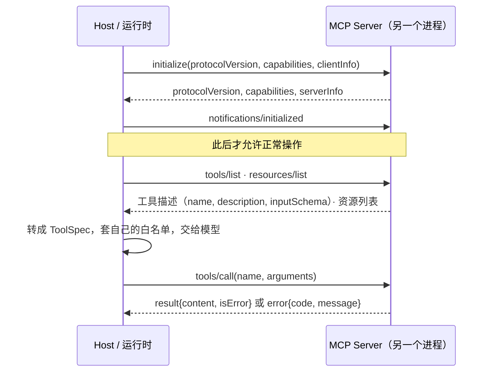

# 11 MCP：模型上下文协议

> 第 05 课的工具是你自己写在进程里的函数。MCP 解决的是另一个问题：工具在别的进程、别的机器、别人的代码里，怎么让运行时在启动时发现它们、按统一格式调用它们、并在它们消失时不被拖死。它是能力的"接入协议"，不替代第 05 课的任何一个守卫。

## 为什么需要
接入外部能力后，工具列表、权限和连接生命周期都不再由本进程完全控制。协议错误和工具业务错误必须分开处理，断连也要能恢复。

## 学习目标

- 能画出 MCP 的生命周期（initialize、initialized、正常操作、关闭），并说清为什么 tools/list 必须发生在握手之后
- 能用纯 Python 读写 MCP 的 JSON-RPC 消息，分辨"协议错误"和"工具执行失败"两条错误通道
- 能把 MCP server 暴露的工具接进第 05 课的注册表与白名单，并处理 server 进程死亡

## 前置

- [05 Tool Calling](../05-tool-calling/README.md)：ToolSpec、白名单、错误结果。MCP 工具最终都要变成这些东西
- [06 Agent 循环与控制流](../06-agent-loop/README.md)：工具结果回喂的循环
- 前置模块 [P03 模块、异常与日志](../../prerequisites/python/03-modules-errors-and-logging/README.md)：子进程和异常

## 心智模型

三个要点：

**协议只管"怎么接"，不管"能不能用"。** server 说它有 `delete_note`，不代表这次请求可以删除。第 05 课的白名单在 host 侧，作用于"把哪些工具告诉模型"这一步。MCP 只是多了一个工具来源。

**两条错误通道。** 参数不合法、方法不存在、没握手就调用，走 JSON-RPC 的 `error` 对象，带标准错误码（`-32602` 参数无效、`-32601` 方法不存在）。工具本身执行失败（比如要删的笔记不存在），走 `result.isError = true`，正文里说明原因。前者是 host 代码有 bug，后者要回喂给模型让它换办法。混在一起，模型就会看到一堆它无法处理的协议错误。

**server 是另一个进程。** 它会崩、会挂起、会在你不知道的时候升级。client 必须能在 stdout 关闭时立刻得到一个错误而不是永远阻塞，重连后要重新握手、重新发现能力，不能假设工具列表和上次一样。

规范本身还有很多这里没碰的部分：prompts、sampling、elicitation、resource 订阅、Streamable HTTP 传输、鉴权。它们都建在同一个生命周期上，学会 stdio 上的这一小圈，其余是查文档的事。

## 最小可运行例子

例子用一个 200 行的玩具 server 和 client（`code/toy_mcp/`），刻意不用官方 SDK，让每一条 JSON 消息都能看见。消息形状按规范 2026-07-28 版。

| 文件 | 演示什么 | 运行 |
|---|---|---|
| [`code/01_capability_discovery.py`](./code/01_capability_discovery.py) | 完整握手；同一个 server 以 `--read-only` 启动就少一个工具；握手前调用被拒 | `uv run python lessons/11-mcp/code/01_capability_discovery.py` |
| [`code/02_tool_call_and_allowlist.py`](./code/02_tool_call_and_allowlist.py) | server 暴露的工具经过 host 白名单再给模型；两条错误通道各演示一次 | 同上，加 `INJECT_WRITE_CALL=1` 看模型请求被拦截的写工具 |
| [`code/03_disconnect_handling.py`](./code/03_disconnect_handling.py) | server 在 tools/call 期间退出；client 检测 EOF、清理子进程、重连重握手、重试一次 | 同上，加 `INJECT_SERVER_CRASH=1` |

读 `toy_mcp/server.py` 的 `handle()`，它就是规范里"哪些方法在哪个阶段合法"的直译。读 `toy_mcp/client.py` 的 `request()`，注意 EOF 变成 `ServerGone` 异常这一行，这是防止整个 Agent 循环挂死的关键。

真实项目不要自己写这个。官方 Python SDK 里 server 端用 `FastMCP`，一个装饰器把函数变成工具，类型注解自动生成 `inputSchema`；client 端用 `stdio_client` 加 `ClientSession`，`initialize()` 之后 `list_tools()` / `call_tool()`。MCP Inspector 是一个网页工具，能连上任何 server 手动发消息看响应，排查握手和 schema 问题比打日志快得多。

## 常见错误与失败注入

**把 server 的工具列表原样给模型。** `02` 里 server 明明暴露了 `delete_note`，模型只看到 `search_notes`。如果把 `specs_from_server` 的白名单过滤删掉，`INJECT_WRITE_CALL=1` 的那次删除就会真的发到 server。协议层不替你做权限。

**协议错误回喂给模型。** `02` 结尾故意发了一个缺参数的调用，server 返回 `-32602`。这是 host 侧参数拼装的 bug，应该记日志修代码。如果把它当工具结果回给模型，模型会试图"修正参数"，而问题根本不在它。

**读到 EOF 还在等。** 把 `client.py` 里 `if not line: raise ServerGone` 那两行删掉，再跑 `INJECT_SERVER_CRASH=1`，`json.loads("")` 会抛一个和真实原因无关的异常。真实 SDK 里对应的是超时和连接关闭的处理，同样容易被忽略。

**重连后沿用旧的工具列表。** `03` 重连时重新 `initialize()` 并且没有缓存 `tools/list` 的结果。server 升级后工具的 schema 可能变了，沿用旧 schema 会让参数校验通过、执行失败。

## 取舍

- **stdio vs HTTP。** stdio 简单、无网络、无鉴权问题，适合本地工具（文件、shell、本地数据库）。Streamable HTTP 适合远程共享的 server，但要处理鉴权、会话和重连。课程只做 stdio，因为协议层面两者一样，差别在传输和安全。
- **每次请求重新发现 vs 缓存工具列表。** 每次 `tools/list` 多一个往返，但永远不会用错 schema。折中是缓存加订阅 `listChanged` 通知。对启动一次跑很久的 host，缓存加通知合理；对短命进程，每次发现更省心。
- **一个大 server vs 多个小 server。** 一个 server 暴露 50 个工具，模型的上下文里就是 50 段描述。按领域拆成小 server，host 按任务挑选接哪几个，和第 06 课"一个 Agent 管 3～10 步"是同一个逻辑。第 12 课的 Skill 则是在这之上再加一层"什么时候用哪组工具"的说明。

## 生产方案
M3 的 [`MCP client`](../../project/src/aiapp/tools/) 只把白名单能力暴露给模型，并在 trace 中记录初始化、断连和重连。

## 框架映射

| 本课概念 | LangGraph | OpenAI Agents SDK | Claude Agent SDK |
|---|---|---|---|
| MCP lifecycle / tools list | custom MCP client or tool node | MCP servers / hosted tools | MCP server + permission callback |

*映射按 Framework Lab 的概念边界整理，框架行为以官方文档和 [Framework Lab](../../project/framework-lab/README.md) 在 2026-09-04 的实现证据为准。*

## 练习

见 [exercises.md](./exercises.md)。

## 对照真实项目

主项目 [M3.3](../../project/m3-tool-workflow/README.md) 的 [`aiapp/runtime/mcp_source.py`](../../project/src/aiapp/runtime/mcp_source.py) 就是本课 `02` 的 `specs_from_server` 加 `dispatch`：`tools/list` 的每个工具注册成普通 `Tool`，`annotations.readOnlyHint` 决定要不要过确认门，所以 MCP 工具和本地工具走同一套校验、白名单和幂等。`03` 的断连处理变成了"服务器死了算 `TransientToolError`，处理器重连一次，交给 runner 重试"。客户端在 [`aiapp/mcp/client.py`](../../project/src/aiapp/mcp/client.py)，服务端 `AIAPP_MCP_COMMAND` 指定。`tests/project/m3/test_mcp.py` 覆盖只读注册、确认、重连和持续崩溃。M5 的可观测性要给每次 `tools/call` 打一个 span，记录 server 名、工具名、耗时和 `isError`。

## 延伸阅读

- [MCP 规范 · 最新版](https://modelcontextprotocol.io/specification/latest)（访问日期 2026-09-04，当前修订版 2026-07-28）：先读 [Lifecycle](https://modelcontextprotocol.io/specification/latest/basic/lifecycle)，再读 [Tools](https://modelcontextprotocol.io/specification/latest/server/tools) 和 [Resources](https://modelcontextprotocol.io/specification/latest/server/resources)。本课的玩具 server 就是这三页的子集。
- [modelcontextprotocol/python-sdk](https://github.com/modelcontextprotocol/python-sdk)（访问日期 2026-09-04）：README 里"15 行写一个 server、10 行写一个 client"两段，对照本课的 200 行看 SDK 替你做了什么。
- [modelcontextprotocol/inspector](https://github.com/modelcontextprotocol/inspector)（访问日期 2026-09-04）：调试任何 MCP server 的第一工具。
- [ai-agents-for-beginners · 11 Agentic Protocols](https://github.com/microsoft/ai-agents-for-beginners/blob/main/11-agentic-protocols/README.md)（访问日期 2026-09-04）：把 MCP、A2A、NLWeb 放在一起讲，适合建立"哪个协议解决哪层问题"的直觉。A2A 部分在第 12 课会用到。

---

[← 上一课 10](../10-multi-agent-handoff/README.md) · [下一课 12 →](../12-skills-and-capability-layers/README.md)
