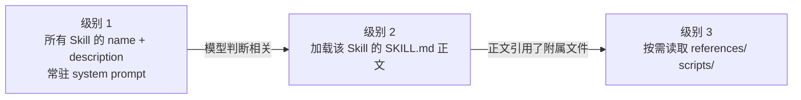

# 12 Skill 与能力生态分层

> 到这一课，"能力"这个词已经有了好几层意思：进程里的函数（Tool）、别的进程暴露的接口（MCP）、一段教模型怎么用这些东西的说明（Skill）、宿主软件的扩展包（Plugin）、Agent 之间的通话协议（A2A）。它们经常被混着叫。这一课把它们各归各位，然后把 Skill 这一层做出来。

## 为什么需要
能力说明、工具实现和宿主插件混在一起，会让上下文膨胀，也会把第三方内容直接当成可信指令。渐进加载和来源校验是可维护性的边界。

## 学习目标

- 能用一张表说清 Tool、MCP、Skill、Plugin、A2A 各自回答什么问题，以及一个能力从哪一层接入
- 能实现 Skill 的三级渐进式加载，并解释为什么只有元数据常驻上下文
- 能对一个第三方 Skill 做安装前校验和内容哈希固定，说出它属于供应链风险的理由

## 前置

- [05 Tool Calling](../05-tool-calling/README.md)：注册表。Skill 的 `allowed-tools` 要和它对账
- [08 Agent 的 Context Engineering](../08-context-engineering-for-agents/README.md)：按需加载的机制。本课是它在"能力说明"上的具体应用
- [11 MCP](../11-mcp/README.md)：接入协议。Skill 常常是"怎么用一组 MCP 工具"的说明书

## 心智模型

| 层 | 回答的问题 | 长什么样 | 谁消费它 |
|---|---|---|---|
| Tool | 能做什么动作 | 一个函数加 JSON Schema | 运行时执行，模型选择 |
| MCP | 动作在哪、怎么接进来 | 另一个进程，JSON-RPC 协议 | 运行时发现和调用 |
| Skill | 什么场景下、按什么步骤用这些动作 | 一个目录，`SKILL.md` 加脚本和参考资料 | 模型阅读 |
| Plugin | 怎么把上面这些打包装进某个宿主 | 宿主定义的清单文件加上述内容 | 宿主软件安装 |
| A2A | 一个 Agent 怎么把任务交给另一个 Agent | Agent Card、任务、消息、产物的协议 | Agent 之间 |

一句话区分：Tool 和 MCP 是**运行时执行**的，Skill 是**模型阅读**的。一个 Skill 不会自己做任何事，它只是让模型在合适的时候知道该调哪些工具、按什么顺序、注意什么。第 05 课的守卫对 Skill 里提到的每一个工具照样生效。

Skill 的形态很简单：一个目录，里面一个 `SKILL.md`，YAML frontmatter 里至少有 `name` 和 `description`，正文是给模型看的说明，可以带 `scripts/`、`references/` 等附属文件。这个形式来自 Anthropic 的 Agent Skills，现在有一份公开的规范。

**渐进式加载**是 Skill 有用的前提。几十个 Skill 全文都放进上下文，模型还没开始干活就先花掉几万 token。所以分三级：

级别 1 每个 Skill 只占一两行，所以 `description` 要写得像一个"什么时候用我"的判断条件，而不是功能介绍。级别 2 和 3 只在模型明确请求时发生。

**Skill 是你没写的代码，拿着你的工具在跑。** 它能指挥模型调用有副作用的工具，它的 `references/` 可以被替换，它的 `scripts/` 是真正会执行的程序。所以安装一个第三方 Skill 和安装一个依赖包是同一级别的事：校验格式、对账 `allowed-tools`、记录内容哈希、更新时重新审。

## 最小可运行例子

`code/skills/` 里有两个手写的 Skill 当教材。

| 文件 | 演示什么 | 运行 |
|---|---|---|
| [`code/01_progressive_loading.py`](./code/01_progressive_loading.py) | 三级加载，每级打印累计 token；附属文件不能逃出 Skill 目录 | `uv run python lessons/12-skills-and-capability-layers/code/01_progressive_loading.py`，加 `INJECT_UNKNOWN_SKILL=1` 看模型请求不存在的 Skill |
| [`code/02_validate_and_pin.py`](./code/02_validate_and_pin.py) | 安装前校验（必填字段、slug、描述长度、`allowed-tools` 对账）和内容哈希固定 | 同上，加 `INJECT_TAMPER=1` 看安装后被改过的 Skill 被拒绝加载 |

读 `01` 时注意 `level1_prompt()` 只用了 `name` 和 `description`，正文一个字都没进去。读 `02` 时注意 `digest()` 哈希的是整个目录，不只是 `SKILL.md`：改一个 `references/policy.md` 就能让模型按错误的报销上限干活。

## 常见错误与失败注入

**把 Skill 正文全放进 system prompt。** `01` 里级别 1 约 110 token，两个 Skill 全文加起来约 290。放大到 30 个 Skill，前者不到 2000，后者过万。而且全文常驻会让模型在不相关的任务里也被这些指令干扰。

**description 写成功能介绍。** "处理报销单"和"当用户问某笔费用能不能报、或要审一份报销清单时使用"，模型对后者的触发判断准确得多。级别 1 的每一行都是在回答"什么时候该加载我"。

**附属文件路径不设边界。** `01` 的 `Skill.reference()` 检查了解析后的路径是否还在 Skill 目录内。删掉这个检查，一个 `references/../../.env` 就能读到密钥。Skill 正文是模型读的，模型会照着里面的路径去请求。

**只哈希 SKILL.md。** `02` 的 `INJECT_TAMPER=1` 改的是 `references/policy.md`。如果 `digest()` 只算 `SKILL.md`，这次篡改不会被发现，模型会拿着"酒精可报销 500"去审单。

## 取舍

- **Skill 说明 vs 硬编码流程。** 把步骤写进 Skill 让模型执行，灵活但不确定；写成第 09 课的 Workflow 代码，确定但改一步要发版。合规要求高的步骤走代码，需要理解自然语言的判断走 Skill。
- **allowed-tools 是约束还是提示。** 规范里它主要是声明。本课把它当对账清单：Skill 要求的工具注册表里没有，就发警告。更严格的做法是运行时在该 Skill 激活期间把白名单收窄到 `allowed-tools`，代价是 Skill 之间切换时白名单也要切。
- **哈希固定 vs 自动更新。** 固定住的 Skill 不会被悄悄改，也不会拿到修复。和依赖锁文件一样：固定，然后有意识地升级并重新审。

## 生产方案
M3 的 [`skills`](../../project/skills/) 使用元数据常驻、正文按需加载，并在安装时做哈希和 allowlist 校验。

## 框架映射

| 本课概念 | LangGraph | OpenAI Agents SDK | Claude Agent SDK |
|---|---|---|---|
| skill / capability metadata | prompt or tool description layer | instructions + tools | CLAUDE.md / skill-like project instructions |

*映射按 Framework Lab 的概念边界整理，框架行为以官方文档和 [Framework Lab](../../project/framework-lab/README.md) 在 2026-09-04 的实现证据为准。*

## 练习

见 [exercises.md](./exercises.md)。

## 对照真实项目

主项目 [M3.3](../../project/m3-tool-workflow/README.md) 的 [`aiapp/runtime/skills.py`](../../project/src/aiapp/runtime/skills.py) 是本课两个文件的合体：`01` 的三级加载变成 `SkillLoader.catalog()` 进 system prompt、`load_skill` 和 `read_skill_reference` 两个只读工具；`02` 的校验变成 `validate_skill()`，安装前跑，不合格的 Skill 进 `rejected` 不进目录。Skill 本身在 [`project/skills/expense-report/`](../../project/skills/expense-report/SKILL.md)。加载成功会追加 `skill_loaded(name, tokens)` 事件，M5 用它算触发准确率。内容哈希钉版本还没做，是 M5 供应链检查的一项。

语音机器人项目里有类似的一层：每种玩法有一份"剧本"，包含触发条件、流程、离场判断，运行时先只给模型所有玩法的名字和一句话描述，模型选定后再加载完整剧本。踩过的坑和本课说的一样：描述写成了功能介绍，导致模型在闲聊时也去加载玩法；后来把描述改写成"用户表现出 X 意图时"的判断条件，误触发才降下来。

## 延伸阅读

- [Anthropic · Agent Skills 概览](https://platform.claude.com/docs/en/agents-and-tools/agent-skills/overview)（访问日期 2026-09-04）：SKILL.md 格式、frontmatter 字段、渐进式披露的官方说明。
- [Anthropic Engineering · Equipping agents for the real world with Agent Skills](https://www.anthropic.com/engineering/equipping-agents-for-the-real-world-with-agent-skills)（访问日期 2026-09-04）：为什么要分三级加载，以及 PDF Skill 怎样把大段参考资料拆到附属文件里。
- [anthropics/skills](https://github.com/anthropics/skills)（访问日期 2026-09-04）：一批真实 Skill 的源码，`spec/` 目录是 Agent Skills 规范，`template/` 是起手模板。读几个 `SKILL.md` 比读任何介绍都直观。
- [A2A 协议](https://a2a-protocol.org/latest/)（访问日期 2026-09-04）：Agent 之间的协议，Agent Card 相当于 Agent 级别的"name + description"。第 10 课的 handoff 如果跨系统，就是它的用武之地。
- [ai-agents-for-beginners · 11 Agentic Protocols](https://github.com/microsoft/ai-agents-for-beginners/blob/main/11-agentic-protocols/README.md)（访问日期 2026-09-04）：MCP 与 A2A 放在一起比较的那一节。

---

[← 上一课 11](../11-mcp/README.md) · [下一课 13 →](../13-rag-end-to-end/README.md)
