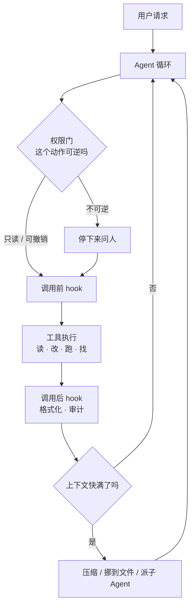

# 13 Agent Harness：把前八课装进一个真实系统

> 05 到 12 课的零件已经齐了：工具、循环、状态、上下文、能力接入。这一课把它们放进一个真实产品形态里看一遍——编码 Agent。它是这两年被用得最重的一类 Agent，它撞过的墙，你的应用迟早也会撞。

## 为什么需要

前面每一课单独看都成立，拼起来会冒出一批新问题。这些问题只在「Agent 真的能改变你的机器」时才暴露：

模型要求删掉一个目录，该直接执行、问一句、还是拒绝？一次会话跑了两百轮，上下文早就满了，压缩之后它忘了自己在改哪个文件。团队想让它每次写完文件自动跑格式化，于是有人把这条规则写进了系统提示词——它有时生效，有时不生效，没人说得清为什么。

这些都不是新机制，是**已有机制的组合方式**。编码 Agent 把这些组合全部撞过一遍，沉淀出一套现在被反复借鉴的设计。这一课拆的就是这套设计。

## 学习目标

- 能说出一个 harness 由哪几层组成，并指出每一层对应前面哪一课的机制
- 能解释编辑类工具为什么用「替换一段唯一文本」而不是整文件重写，以及匹配不唯一时该返回什么
- 能判断一条规则该放进权限声明、hook 还是提示词，并说出理由

## 前置

- [05 Tool Calling](../05-tool-calling/README.md)、[06 Agent 循环与控制流](../06-agent-loop/README.md)、[07 Agent State 与 Runtime](../07-agent-state-and-runtime/README.md)：这一课是这三样的组合形态，不再重复它们的机制
- [12 Skill 与能力生态分层](../12-skills-and-capability-layers/README.md)：Skill 和 MCP 在 harness 里各占哪一格

## 怎么理解它



图里青瓷色的三块是这一课的重点：**模型和循环只占中间一小格，harness 的大部分代码在循环外面**，做四件确定性的事。

**工具是给模型的界面，不是给人的 API。** 人改文件用 `sed`，模型不该。给模型的工具要满足三条：动作正交（读、改、跑、找，四个动词覆盖绝大多数任务）、错误能自解释（告诉它哪里错了、下一步怎么办）、结果可预期。SWE-agent 把这一层叫 **agent-computer interface**，它的实验结论很直接：同一个模型，换一套工具界面，成功率差出一大截。

**权限判断属于动作，不属于模型。** 每个工具声明自己的可逆性：只读、可撤销、不可逆。运行时拿这个声明加当前模式，决定直接做、问一句还是拒绝。模型不参与这个判断——它连自己在申请什么权限都不知道。这是第 05 课那道确认门在 harness 里的完整形态。

**纪律要落在拦截点上，不落在提示词里。** 「写完文件跑格式化」「不要碰 migrations 目录」这类规则，写进 hook 是每次都执行，写进提示词是大概执行。原则 11 说的就是这件事。

**上下文有寿命，运行时要管。** 长会话必然撞窗口，三种办法：压缩（有损，最容易丢的是「还没做完的事」）、把内容挪到文件系统按需再读（第 08 课的 just-in-time）、派一个子 Agent 去干脏活，它的上下文和主循环隔离，只把结论带回来。**三种都会丢信息，区别在于丢的是哪一部分、以及你知不知道丢了。**

## 机制拆解

下面三段代码只为说明机制，省略了 import、并发控制和日志，不能直接运行。

### 一、四个动词就是一套工具集

```python
TOOLS = [
    Tool("read_file", read_file, Reversibility.READ_ONLY,
         "读一个文件的一段。文件超过两千行时必须带 offset 和 limit。"),
    Tool("edit_file", edit_file, Reversibility.UNDOABLE,
         "把文件里一段唯一出现的文本换成新文本。"
         "不要用它整文件重写，那是 write_file 的事。"),          # ← 分工写在描述里
    Tool("run", run_shell, Reversibility.IRREVERSIBLE,
         "在工作目录里跑一条命令。不要用它读写文件，"
         "读用 read_file，改用 edit_file。"),                    # ← 堵住绕过工具边界的路
    Tool("grep", grep, Reversibility.READ_ONLY,
         "按正则在仓库里找，返回文件名和行号，不返回整个文件。"),
]
```

描述里那两句「不要用它做 X，改用 Y」不是客套话，是**工具之间的分工声明**。少了它们，模型会用 `run` 去跑 `cat` 和 `sed`，把另外三个工具的边界全绕过去——权限分级、审计、错误回喂跟着一起失效。

第三个参数是可逆性，它是下面权限门唯一的判断依据。工具**在注册时就声明**自己有多危险，而不是等运行时去猜。

### 二、编辑用替换，不用重写

```python
def edit_file(path: str, old: str, new: str) -> str:
    text = read(path)
    hits = text.count(old)
    if hits == 0:
        raise ToolError("没找到那段文本。先 read_file 确认原文，注意缩进和空行。")
    if hits > 1:
        raise ToolError(f"这段文本出现了 {hits} 次，改哪一处不确定。"
                        f"把 old 往前后各扩几行，让它唯一。")   # ← 告诉模型下一步怎么办
    write(path, text.replace(old, new, 1))
    return f"改了 {path}，一处"
```

**唯一性检查就是这个工具的全部价值**，三件事一起解决了：

零次和多次都不是崩溃，是**给模型的下一步指令**（第 05 课的错误回喂）。模型看到「出现了 3 次，把上下文扩几行」，下一轮基本就对了。

整文件重写的代价是双份的：一个八百行的文件改两行，要读进来八百行、再写出去八百行，token 翻倍还慢。更糟的是模型重写时会悄悄删掉它认为不重要的部分，**这类丢失不报错**，只能靠 diff 发现。

它还顺手解决了一半的并发问题：如果在你读完之后有人改了那一段，`old` 就匹配不上，这次编辑会失败，而不是把别人的改动覆盖掉。

### 三、权限门与 hook：两种确定性拦截

```python
def decide(tool: Tool, mode: str) -> Decision:
    if tool.reversibility is Reversibility.READ_ONLY:
        return Decision.ALLOW
    if mode == "plan":                                  # 只读模式：任何写操作都不放行
        return Decision.DENY
    if tool.reversibility is Reversibility.IRREVERSIBLE and mode != "auto":
        return Decision.ASK                             # ← 依据是动作的声明，不是模型的措辞
    return Decision.ALLOW

async def call_tool(tool, args, mode, hooks):
    d = decide(tool, mode)
    if d is Decision.DENY:
        return ToolResult(error="当前模式不允许这个动作，换一种做法")   # ← 回给模型，不是抛异常
    if d is Decision.ASK and not await ask_user(tool, args):
        return ToolResult(error="用户拒绝了这个动作，问清楚再继续")

    for h in hooks.pre(tool.name):      # 调用前：能改参数，也能直接否决
        args = h(args)
    result = await tool.fn(**args)
    for h in hooks.post(tool.name):     # 调用后：格式化、审计、跑测试
        h(result)
    return result
```

拒绝和否决都变成**工具结果回给模型**，不是异常。模型知道自己被拦了，可以换一条路；抛异常只会让循环断在半路，用户看到的是一个栈回溯（第 06 课的失败分类）。

`hooks.pre` 能改参数，所以「给这条命令自动加 `--dry-run`」「把相对路径规范化」这类规则也落在这里。`hooks.post` 里那行格式化**每次都会执行**，写在系统提示词里则是大概会执行——这就是原则 11 最直白的一个例子。

## 常见错误

**给一个万能的 shell 工具就完事。** 它确实什么都能干，代价是权限分级、审计和错误回喂同时失效：你只知道模型跑了一条命令，不知道它在读还是在删。**工具的边界就是你能施加控制的边界。**

**编辑走整文件重写。** 见第二节。省下的那点实现工作，会以 token、延迟和无声的内容丢失还回来。

**把纪律写进系统提示词。** 「改完一定要跑测试」「不要碰 migrations」，模型多数时候会听。**多数时候不构成安全边界。** 能写成权限声明的写声明，能写成 hook 的写 hook，剩下的才留给提示词。

**压缩时把「还没做完的事」压没了。** 摘要是模型写的，它倾向保留「聊过什么」，丢掉「第三步还没做」。待办清单是运行时状态（第 07 课），要单独存、每轮原样带回，别指望它活过一次压缩。

## 取舍

- **工具少而通用，还是多而专用。** 四个动词好学、好审计，但模型要多绕几步；十几个专用工具一步到位，代价是每个都要写描述、测试和权限声明，而且工具定义每一轮都在占上下文（第 08 课）。**先做四个，等 trace 里反复出现同一组合，再把它固化成一个工具。**
- **审批频率。** 每一步都问，用户三分钟后就开始无脑点同意，确认门等于没有（第 23 课讲的是同一件事）。只在不可逆动作上问，可撤销的动作靠「做了 + 能看 diff + 能撤」兜住。
- **沙箱强度。** 关掉网络、限死工作目录最安全，但很多真实任务要装依赖、查文档。折中是分级：默认只读加工作目录可写，需要网络时显式开一个会话级开关，并且把这次开关记进事件。
- **派子 Agent 还是主循环自己做。** 子 Agent 隔离上下文，主循环只拿回结论，长任务里省得多；代价是它看不到主循环的全部背景，容易做偏，trace 上还多一层（第 10、19 课）。

## 工程落地

- **每个动作落一条事件**：谁申请的、判定是 allow 还是 ask、谁批准的、改了哪些文件、diff 的哈希。出了事，这份记录是唯一能回答「它到底做了什么」的东西（原则 09）。
- **权限配置分层**：项目级（放在仓库里，跟着代码走 review）、用户级、会话级。冲突时取最严的那一层，不是最近的那一层。
- **沙箱边界写进配置，不写进代码**：工作目录、允许的命令前缀、网络开关。这些是会被审计的东西，藏在代码里没人看得见。
- **子 Agent 的预算独立结算**：主循环的步数和 token 预算不能被一个跑飞的子 Agent 吃光（第 06 课）。
- **怎么测。** 拿一组真实仓库任务做样本，但断言不要写在最终回答上，写在**轨迹**上：改了哪些文件、不该动的有没有动、不可逆动作发生了几次、有没有绕过审批、压缩之后待办还在不在。这些断言都是确定性的，一秒内跑完，能进 CI（第 18 课）。

## 框架映射

| 本课概念 | LangGraph | OpenAI Agents SDK | Claude Agent SDK |
|---|---|---|---|
| 工具集与描述 | `@tool`，描述取自 docstring | `@function_tool` | 自带文件与命令工具，可增可删 |
| 权限判断 | 自己写，用 `interrupt` 停下来问 | guardrail 管输入输出，动作级要自己写 | 内置权限模式与工具白名单 |
| 确定性拦截点 | 节点前后自己插 | 生命周期 hooks | hooks，挂在工具调用等事件上 |
| 上下文压缩 | 自己写 | session 提供历史管理 | 内置 |
| 子 Agent | 子图 | handoff 或 agent-as-tool | subagent，各自独立上下文 |

三家都不管的是**沙箱**：进程隔离、文件系统边界、网络开关，全部是你自己的事。官方文档：[LangGraph](https://langchain-ai.github.io/langgraph/) · [OpenAI Agents SDK](https://openai.github.io/openai-agents-python/) · [Claude Agent SDK](https://docs.claude.com/en/api/agent-sdk/overview)（核对日期 2026-09-06）。

## 参考实现

想看这一课的机制装进一个真实服务是什么样：参考实现的 [M3 Tool Workflow](https://github.com/lance2016/ai-app-engineering-ref/blob/main/project/m3-tool-workflow/README.md)，工具注册表与确认门。

## 延伸阅读

- [SWE-agent: Agent-Computer Interfaces Enable Automated Software Engineering](https://arxiv.org/abs/2405.15793)（访问日期 2026-09-06）：读摘要和讲工具界面设计的那一节。「工具是给模型的界面」这个说法的出处。
- [Claude Code · Hooks 参考](https://docs.claude.com/en/docs/claude-code/hooks)（访问日期 2026-09-06）：一套成熟的拦截点设计，事件类型和它们能改什么，值得照着抄。
- [Claude Code · 子 Agent](https://docs.claude.com/en/docs/claude-code/sub-agents)（访问日期 2026-09-06）：上下文隔离怎么配，和第 10 课对着读。
- [aider · Repository map](https://aider.chat/docs/repomap.html)（访问日期 2026-09-06）：怎么在有限上下文里表示一个大代码库，第 08 课那套预算思路的一个具体解法。
- [Anthropic · Writing effective tools for AI agents](https://www.anthropic.com/engineering/writing-tools-for-agents)（访问日期 2026-09-06）：工具描述和返回值该怎么写，本课第一节的展开。
- [openai/codex](https://github.com/openai/codex)（访问日期 2026-09-06）：一个开源的终端编码 agent，直接看它的沙箱和审批分级怎么落地。

---

[← 上一课 12](../12-skills-and-capability-layers/README.md) · [下一课 14 →](../14-rag-end-to-end/README.md)
