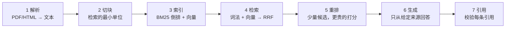
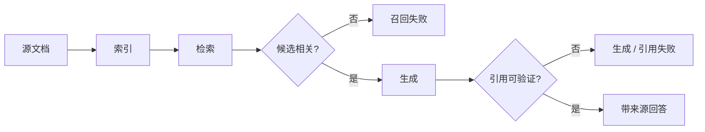

# 13 RAG 端到端

> RAG 是七个步骤串成的一条流水线：解析、切块、索引、检索、重排、生成、引用。每一步都有一种自己独有的坏法，而用户看到的永远只是"答错了"。这一课的目标不是把七步做得多好，而是让你能对任何一次答错说出"坏在第几步"，并且有数据证明。

## 为什么需要
用户只看到“答错了”，但原因可能是解析、切块、召回、重排、生成或引用任一步。把链路拆成可测的阶段，才能做有证据的优化。

## 学习目标

- 能画出七步流水线，并为每一步说出一种典型失败和检测它的方法
- 能不依赖任何库实现切块、BM25、向量相似度、RRF 融合和引用校验，说清每个组件在真实系统里对应什么
- 能用一个 golden set 算 Recall@k，改一个参数后判断哪一步变好、哪一步变坏

## 前置

- [04 Embedding 与向量检索基础](../04-embeddings-and-vector-search/README.md)：余弦相似度，本课的玩具向量沿用那里的构造
- [05 Tool Calling](../05-tool-calling/README.md)：引用校验的思路和"模型输出是建议"一脉相承
- 前置模块 [P02 容器与迭代](../../prerequisites/python/02-collections-and-iteration/README.md)：Counter、排序、推导式

## 心智模型

| 步 | 典型坏法 | 怎么发现 |
|---|---|---|
| 解析 | 表格变成乱序文字、页眉页脚混进正文 | 抽样看解析结果，不看最终答案 |
| 切块 | 太大：噪音多，分数平；太小：答案被撕开 | golden 短语是否还在同一块里；Recall@k 随块大小的变化 |
| 索引 | 文档更新了索引没更；权限字段没进索引 | 版本号和删除演练，第 15 课 |
| 检索 | 词法找不到同义改写；向量找不到精确数字和型号 | 分别算 BM25 和向量的 Recall@k，看各自漏什么 |
| 重排 | 重排器和检索器口径不一致，把对的排下去 | 重排前后 Recall@k 对比 |
| 生成 | 模型用了自己的知识而不是来源；来源里没有答案时硬编 | 引用率；"来源不含答案"的 golden 用例 |
| 引用 | 编造不存在的引用 id；引用和句子对不上 | 代码校验，本课 `04` |

**检索这一步要两条腿走路。** BM25 匹配精确词，擅长型号、数字、专有名词，对同义改写无能为力。向量匹配语义，擅长改写，但对"3 到 5 天"和"1 到 2 天"这种只差数字的句子分辨力弱。两者的排名用 RRF 融合，只看名次不看分数，所以不需要把两种分数拉到同一尺度。

**引用是生成阶段的校验。** 模型说"来源 [refund-policy#0] 支持这句话"，这和第 05 课模型说"我调用了工具"是同一类陈述：一个建议，需要代码去核实。核实两件事：这个 id 确实在这次检索结果里；被引用的块和这句话确有词汇重叠。

**Agentic RAG 是这条流水线加上第 06 课的循环。** 模型看到检索结果觉得不够，改写查询再查一次，或者换一个数据源。它没有改变七步里任何一步的坏法，只是让流水线可以跑多轮。先把单轮做对。

### 从回答反推失败位置

## 最小可运行例子

`code/corpus/` 是四篇虚构的客服政策，`code/golden.json` 是 10 个问题和每个问题必须命中的短语。`code/ragkit.py` 放共用的切块、BM25、玩具向量、RRF，全部纯 Python。

| 文件 | 演示什么 | 运行 |
|---|---|---|
| [`code/01_chunking.py`](./code/01_chunking.py) | 段落切块加一段重叠；段落超长时退到句子级 | `uv run python lessons/13-rag-end-to-end/code/01_chunking.py`，加 `CHUNK_SIZE=5000` 或 `CHUNK_SIZE=80` |
| [`code/02_bm25_vs_vectors.py`](./code/02_bm25_vs_vectors.py) | 三个查询下两种检索器的 top-3，看它们各漏什么 | 同上 |
| [`code/03_hybrid_and_rerank.py`](./code/03_hybrid_and_rerank.py) | RRF 融合，再用一个二元组重叠的启发式当重排器 | 同上 |
| [`code/04_generate_with_citations.py`](./code/04_generate_with_citations.py) | 只从来源回答并逐句引用；代码校验引用 | 同上，加 `INJECT_FAKE_CITATION=1` 看编造的引用被抓住 |
| [`code/05_recall_at_k.py`](./code/05_recall_at_k.py) | 三种检索器在 golden set 上的 Recall@1/3/5，列出漏掉的问题 | 同上，加 `CHUNK_SIZE=5000` / `CHUNK_SIZE=120` |

`05` 在默认块大小 450 字符下的结果（10 个问题）：

| 检索器 | R@1 | R@3 | R@5 |
|---|---|---|---|
| bm25 | 0.80 | 1.00 | 1.00 |
| vector（玩具） | 0.50 | 0.90 | 0.90 |
| hybrid | 0.70 | 0.90 | 1.00 |

把 `CHUNK_SIZE` 降到 120，向量的 R@3 掉到 0.70，hybrid 掉到 0.80，漏掉的问题都被列出来了。这张表是这一课最重要的产出：**没有它，任何一次调参都是猜。**

## 常见错误与失败注入

**用玩具向量得出"hybrid 更好"的结论。** 上表里 hybrid 的 R@1 比纯 BM25 还低。玩具向量把"how"、"is"这些词也算进相似度，噪音拖累了融合结果。这不是 RRF 的问题，是融合一个弱检索器的必然结果。换成真实 embedding 模型后结论通常反转，但你必须重新测，不能沿用。

**切块只看大小不看边界。** `01` 的切块器先按段落，段落超长再按句子。如果改成固定字符数硬切，一个数字会被切成"1 到" 和 "2 个工作日"两半。`CHUNK_SIZE=80` 下 golden 短语依然 10/10 完整，就是因为切块没有越过句子边界。

**引用校验只检查 id 存在。** `04` 的 `verify()` 还检查被引块和句子有词汇重叠。删掉这个检查，模型可以把任何一句话挂在任何一个真实 id 后面，看起来有据可查，实际上是拼贴。

**golden set 里只有能答的问题。** `golden.json` 的 10 个问题都有答案。真实系统必须有几个"来源里没有答案"的用例，看模型是不是老实说不知道。这一课没放，留作练习 5。

## 取舍

- **块大小。** 小块检索精确、上下文少；大块上下文全、分数平。经验起点是 300～800 字符加一段重叠，然后用 Recall@k 调。没有通用最优值，每个语料不同。
- **BM25 还是向量还是都要。** 只有 BM25，同义改写会漏；只有向量，型号和数字会混。都要就多一套索引和一次融合。语料里精确标识符多的（法规、技术手册）BM25 权重要高。
- **重排的代价。** 交叉编码器重排器把候选数从几十压到几个，质量提升明显，但每个候选都要过一次模型。候选取多少是延迟和召回的直接权衡，通常 20～50。
- **pgvector 还是专用向量库。** 主项目用 pgvector，一个库同时放业务数据和向量，少一个组件，权限过滤可以用 SQL 的 WHERE。到千万级向量或者需要复杂的过滤加近邻组合时再评估专用库。

## 生产方案
M4 的 [`knowledge`](../../project/src/aiapp/knowledge/) 和 [`eval`](../../project/src/aiapp/eval/) 分别记录检索证据和 Recall@k；API 只返回经过校验的引用。

## 框架映射

| 本课概念 | LangGraph | OpenAI Agents SDK | Claude Agent SDK |
|---|---|---|---|
| retrieval pipeline / citations | retriever + tool node + generation node | file search / retrieval tool | MCP or custom retrieval tool |

*映射按 Framework Lab 的概念边界整理，框架行为以官方文档和 [Framework Lab](../../project/framework-lab/README.md) 在 2026-09-04 的实现证据为准。*

## 练习

见 [exercises.md](./exercises.md)。

## 对照真实项目

主项目 [M4](../../project/m4-rag-and-memory/README.md) 的 [`aiapp/knowledge/`](../../project/src/aiapp/knowledge/) 就是这七步：`ingest.py` 是 `01` 的切块，多了 `start`/`end` 切片和内容哈希；`postgres_store.py` 用 `tsvector` 替代 `ragkit` 的 BM25、用 pgvector 替代玩具向量；`hybrid.py` 是 `rrf()`；`citations.py` 是 `04` 的 `verify()`，运行结束后由路由调用并把结果记成 `citations_checked` 事件；`scripts/eval_recall.py` 是 `05`，多了 miss 分类，基线表在 M4 README。`tests/project/m4/test_knowledge_store_contract.py` 里 Recall@5 ≥ 0.85 是 CI 门禁。

## 延伸阅读

- [Lewis 等 · Retrieval-Augmented Generation for Knowledge-Intensive NLP Tasks](https://arxiv.org/abs/2005.11401)（访问日期 2026-09-04）：RAG 一词的出处。只需要读摘要和图 1，理解"检索器和生成器是两个可以分别评测的组件"。
- [Okapi BM25](https://en.wikipedia.org/wiki/Okapi_BM25)（访问日期 2026-09-04）：公式和 k1、b 两个参数的含义。`ragkit.py` 的 `BM25` 类就是这一页的直译。
- [pgvector](https://github.com/pgvector/pgvector)（访问日期 2026-09-04）：README 里的索引类型（HNSW、IVFFlat）和距离函数，M4 用它。
- [generative-ai-for-beginners · 15 RAG and Vector Databases](https://github.com/microsoft/generative-ai-for-beginners/blob/main/15-rag-and-vector-databases/README.md)（访问日期 2026-09-04）：通识版的七步，附一个 notebook；它的"评测"一节和本课 `05` 对照读。
- [ai-agents-for-beginners · 05 Agentic RAG](https://github.com/microsoft/ai-agents-for-beginners/blob/main/05-agentic-rag/README.md)（访问日期 2026-09-04）：多轮检索的动机、失败模式和边界。读完本课再看，你会发现它讨论的所有问题都能落到七步中的某一步。

---

[← 上一课 12](../12-skills-and-capability-layers/README.md) · [下一课 14 →](../14-memory/README.md)
