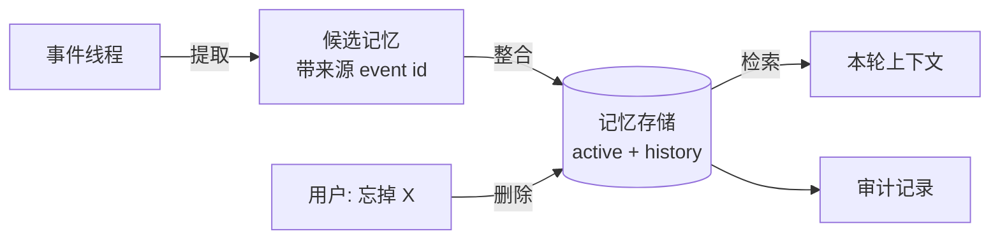

# 14 Memory：提取、整合与检索

> 模型没有记忆，它每次只看到运行时递过去的那一串消息。"记忆"是运行时替它做的四件事：从对话里提取值得记的东西，和已有的合并，下次需要时挑出相关的放进上下文，用户要求时删掉。每一步都是确定性代码加一次可校验的模型调用，没有魔法。

## 学习目标

- 能区分会话记忆、任务记忆、长期记忆，说清各自的权威来源和生命周期，并知道哪一种根本不需要"记忆系统"
- 能实现带来源的记忆提取、按主题的冲突整合、按用户过滤的相关性检索，以及留审计的定向删除
- 能解释为什么"没有来源的记忆"和"不做整合的记忆"各会造成什么故障

## 前置

- [07 Agent State 与 Runtime](../07-agent-state-and-runtime/README.md)：事件线程。长期记忆的来源就是线程里的事件编号
- [原则 05](../../principles/05-runtime-owns-state.md)：四类状态。本课只讲第四类
- [04 Embedding 与向量检索基础](../04-embeddings-and-vector-search/README.md)：本课检索用关键词重叠做示意，生产里换成向量

## 心智模型

先把三个常被混为一谈的东西分开：

| 名字 | 是什么 | 存在哪 | 需要专门的记忆系统吗 |
|---|---|---|---|
| 会话记忆 | 这次对话说过什么 | 事件线程 | 不需要，`to_messages()` 就是它 |
| 任务记忆 | 走到哪一步、拿到了什么中间结果 | 从事件线程推导 | 不需要，第 07 课已经解决 |
| 长期记忆 | 跨会话仍然成立的事实、偏好、经历 | 独立的记忆存储 | 需要，这一课讲的就是它 |

ai-agents-for-beginners 把长期记忆再细分为 persona、episodic、entity 等类型；LangChain 的文档用认知科学的三分法：semantic（关于用户的事实）、episodic（发生过的事）、procedural（怎么做事的规则）。分类名不重要，重要的是它们的处理流程一样：

**提取**是一次结构化输出的模型调用。输入是带编号的对话，输出是候选记忆列表，每条必须指回它来自哪几行。运行时用 schema 校验这一点，缺来源的整批拒收。

**整合**是纯代码。去重、按主题解决冲突（新的替换旧的，旧的进历史）、给有时效的经历设过期。LangChain 把这叫"在后台"更新，和"在热路径上"边聊边写相对；两种都可以，但整合逻辑不该交给模型。

**检索**先按用户过滤，再按相关性排序，只取前几条。这一步是租户边界所在，第 20 课会回来讲。

**删除**按来源和主题定向删，删的时候写一条审计事件，记下删了什么、谁要求的、原始出处。

## 最小可运行例子

| 文件 | 演示什么 | 运行 |
|---|---|---|
| [`code/01_extract_with_provenance.py`](./code/01_extract_with_provenance.py) | fake 模型从带编号的对话里抽出三条记忆，Pydantic 强制每条带 `source_event_ids`；注入时提取器不给来源，整批被拒 | `uv run python lessons/14-memory/code/01_extract_with_provenance.py`，加 `INJECT_NO_PROVENANCE=1` |
| [`code/02_consolidate.py`](./code/02_consolidate.py) | 五条候选合并成三条：一条重复、一条冲突被替换、一条过期；注入时不整合，"diet" 主题下同时存在两条互相矛盾的记忆 | 同上，加 `INJECT_NO_CONSOLIDATION=1` |
| [`code/03_retrieve_and_forget.py`](./code/03_retrieve_and_forget.py) | 按用户过滤再按关键词重叠排序；用户要求忘掉"家庭"相关内容，定向删除并写审计 | `uv run python lessons/14-memory/code/03_retrieve_and_forget.py` |

三个文件加起来两百多行，没有向量库，没有模型服务。生产里换掉的只有两处：`01` 的 fake 换真模型，`03` 的关键词重叠换向量相似度。流程一行不改。

## 常见错误与失败注入

**记忆没有来源。** `01` 的注入开关让提取器返回空的 `source_event_ids`。运行时拒收，因为一条"用户不吃辣"如果不知道是哪次对话哪句话来的，用户问"你为什么这么认为"答不上来，用户说"我没说过"也无法核对，用户说"忘掉我关于饮食说的话"更不知道该删哪条。Pydantic 的 `min_length=1` 就是这条规则的全部实现。

**不整合直接追加。** `02` 的注入开关跳过整合。结果是 `about("diet")` 返回"是素食者"和"开始吃鱼了，不再素食"两条。模型拿到互相矛盾的信息会随机选一个，用户看到的是一个前后不一的助手。整合后旧的进 `history`，需要时还能查"用户以前说过什么"。

**检索忘了按用户过滤。** `03` 里 `retrieve()` 第一步是 `m.user_id == user_id`。把这一行删掉再跑，`u99` 的花生过敏会出现在 `u42` 的上下文里。这是最常见也最严重的记忆系统事故，不是概率问题，是权限问题。

**删除只删了记忆本身。** 如果记忆已经被拷贝进某个摘要、某个用户画像字段或某个缓存，只删记忆表那一行不够。第 15 课的删除演练讲怎么证明删干净了。

## 取舍

- **热路径提取 vs 后台提取。** 边聊边提取，用户下一句就能用上，但每轮多一次模型调用；后台批量提取省钱，但有延迟。常见做法是热路径只提取用户明确说"记住"的，其余后台做。
- **profile vs collection。** langchain-academy 对比了两种 schema：一个固定字段的用户画像，和一个开放的记忆条目集合。画像结构清楚、容易展示给用户、容易删除；集合更灵活但需要整合逻辑。`02` 用的是集合加按主题整合，这样两者的好处都占一点。
- **记多少。** 记得越多检索越难、隐私风险越大。一个实用的标准：这条记忆下次对话用得上的概率有多大，用不上就不记。episode 类默认设过期，`02` 里是 180 天。

## 练习

见 [exercises.md](./exercises.md)。

## 对照真实项目

主项目 [M4.3](../../project/m4-rag-and-memory/README.md) 把 `01` 到 `03` 合成 [`aiapp/knowledge/memory.py`](../../project/src/aiapp/knowledge/memory.py) 的 `MemoryService`：`extract_candidates()` 是 `01`，来源不指向本线程的用户消息就整批拒绝；`remember()` 是 `02` 的去重和同主题取代；`recall()` 和 `forget()` 是 `03`，遗忘是带原因的软删除，`history` 视图就是审计。存储在 PostgreSQL 的 `memory` 表，和 pgvector 同库。每轮请求前召回的记忆作为一段 `user` 消息注入上下文，`test_memories_are_extracted_recalled_next_turn_and_forgotten` 验证遗忘之后模型再也看不到它。

语音机器人项目有一个和本课直接相关的教训：家庭场景下多个家庭成员共用一台设备，早期记忆只按设备存，结果孩子说的偏好出现在给家长的回答里。修法就是 `03` 里那一行按用户过滤，加上声纹或显式身份切换来确定"当前用户是谁"。另一个经验是记忆里写着的事实要标"用户明说"还是"模型推断"，推断出来的东西在回答里要用"我记得你好像……"这种可被纠正的语气，而不是当成事实陈述。

## 延伸阅读

- [ai-agents-for-beginners · 13 Agent Memory](https://github.com/microsoft/ai-agents-for-beginners/blob/main/13-agent-memory/README.md)（访问日期 2026-09-04）：记忆类型的分法比本课细，"实现与存储"一节讲了 Mem0 的两阶段（提取、更新）流程，和本课的提取加整合是同一个思路。后半部分绑微软框架，可以跳过。
- [langchain-academy · module-5](https://github.com/langchain-ai/langchain-academy/tree/main/module-5)（访问日期 2026-09-04）：四个 notebook 从跨线程的 store 讲到 profile 和 collection 两种 schema，再到会自己决定更新哪种记忆的 agent。看 markdown 说明就够，代码绑 LangGraph。
- [LangChain · Memory 概念页](https://docs.langchain.com/oss/python/concepts/memory)（访问日期 2026-09-04）：semantic、episodic、procedural 三分法和"热路径 vs 后台"两种写入时机的出处。

---

[← 上一课 13](../13-rag-end-to-end/README.md) · [下一课 15 →](../15-data-engineering/README.md)
