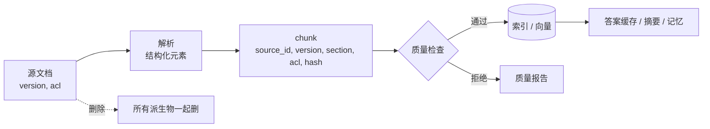
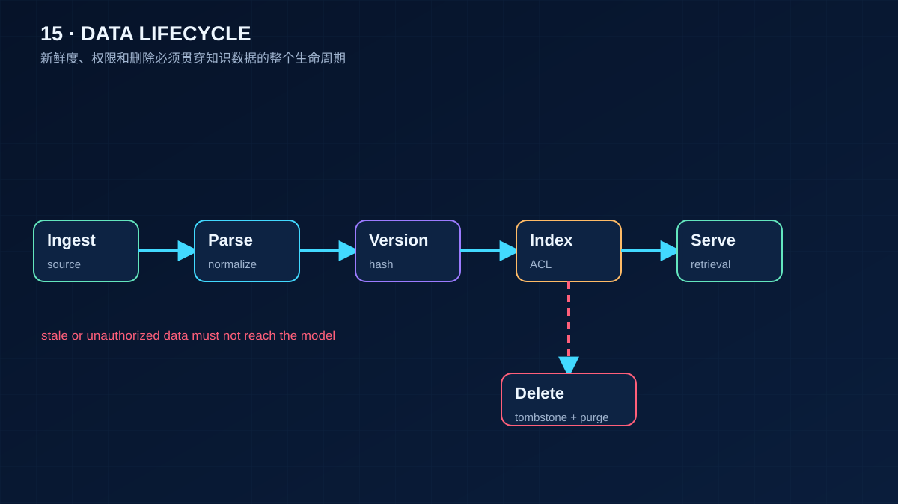

# 15 数据工程与数据质量

> RAG 的上限不是模型定的，是数据定的。检索不到、检索错、引用了过期版本、把别人不该看的内容放进上下文，这些故障没有一个能靠换模型解决。这一课讲文档从进来到被删掉的整个生命周期，以及怎么证明每一步做对了。

## 为什么需要
RAG 的数据会更新、重复、过期和被删除。只写一个 ingest 脚本无法证明旧版本不会继续被召回，也无法证明租户权限没有泄露。

## 学习目标

- 能把一份文档变成带来源、版本、权限标签和内容哈希的 chunk，并在入库前拦住空块、重复块和编码错误
- 能实现增量更新：文档改了一段，只重新处理那一段，并能查出索引里有没有落后于源文档的陈旧数据
- 能设计并执行一次删除演练，证明删掉一个源文档后所有派生数据都不存在了

## 前置

- [13 RAG 端到端](../13-rag-end-to-end/README.md)：知道 chunk 是什么、索引是给谁用的
- 前置模块 [P02 容器与迭代](../../prerequisites/python/02-collections-and-iteration/README.md)、[P03 模块、异常与日志](../../prerequisites/python/03-modules-errors-and-logging/README.md)

## 心智模型

一份文档进了系统之后会"长出"很多东西：

四个原则贯穿这条链：

**元数据跟着 chunk 走。** 来源、版本、章节、权限标签、内容哈希，每个 chunk 自带。检索出来的每一条都能回答"你从哪来、是哪个版本、谁能看"。权限不是检索完再过滤的，是 chunk 的属性。

**哈希决定要不要重做。** 重新处理一份文档时，按内容哈希对比：一样的跳过，不一样的替换，源里没有了的删掉。embedding 是这条链里最贵的一步，增量更新省的就是它。

**质量检查在入库前。** 空块、重复块、乱码块进了索引就是噪音，检索时会占掉本该给有效内容的名额。入库前拒掉，比事后清理便宜十倍。

**删除是一个必须演练的操作。** 派生物散落在索引、缓存、摘要、记忆里。"删了源文档"不等于"删干净了"。唯一的证明方式是删完之后去每个地方搜残留。

解析这一步本课用纯 Python 处理 markdown 示意。真实项目里 PDF、扫描件、PPT 要用专门的解析器：Docling 和 Unstructured 都能把多种格式转成带结构的元素（标题、段落、表格），输出形状和本课的 `parse_sections()` 一样，后面的流程不变。

## 最小可运行例子

| 文件 | 演示什么 | 运行 |
|---|---|---|
| [`code/01_parse_and_chunk.py`](./code/01_parse_and_chunk.py) | 按标题切分、按长度切块但不跨章节、每块带五项元数据；质量检查拦空块、乱码、重复 | `uv run python lessons/15-data-engineering/code/01_parse_and_chunk.py`，加 `INJECT_BAD_INPUT=1` |
| [`code/02_incremental_update.py`](./code/02_incremental_update.py) | 文档从 v1 到 v2 改了一节删了一节，索引报告 2 条不变、1 条重新处理、2 条删除（被替换的旧版本也算删除），没变的 chunk 版本号跟着升；`stale_chunks()` 查陈旧数据 | `uv run python lessons/15-data-engineering/code/02_incremental_update.py` |
| [`code/03_delete_drill.py`](./code/03_delete_drill.py) | 一个源文档派生到三个存储；删除后逐个搜残留；注入时漏删答案缓存，演练报失败 | `uv run python lessons/15-data-engineering/code/03_delete_drill.py`，加 `INJECT_ORPHANS=1` |

`03` 在演练失败时以非零退出码结束，这是故意的：它应该作为 CI 的一步，删不干净就红。

## 常见错误与失败注入

**chunk 跨章节。** 把整篇文档拼成一个字符串再按固定长度切，一个 chunk 里会同时有"数字商品"和"实体商品"的退款规则，检索命中后模型拿到的是半句话。`01` 先按标题分节，再在节内切块。

**没有内容哈希，每次全量重做。** 文档改了一个标点，全部 chunk 重新 embedding。一千份文档的知识库，每天改几份，费用和延迟都不可接受。`02` 用哈希做 diff，只处理变化的部分。

**权限在检索后过滤。** 先检索 top-10 再按权限过滤，用户可能拿到 3 条甚至 0 条，因为名额被他看不到的内容占了。更糟的是有些实现忘了过滤。权限标签跟着 chunk 进索引，检索时作为过滤条件，`01` 的 `acl` 字段就是为这一步准备的。

**删除漏掉派生物。** `03` 的注入开关模拟最常见的漏法：答案缓存里有一条用这份文档生成的回答，文档删了，缓存还在，用户下次问同样的问题还能拿到"已删除"内容。GDPR 第 17 条要求的是删除，不是"从主表删除"。

## 取舍

- **chunk 大小。** 小 chunk 检索精确但上下文碎，大 chunk 上下文完整但容易混入无关内容。没有通用值，按文档类型调：FAQ 类小，长篇说明类大。先按章节边界切，再在节内按大小切，是一个稳妥的起点。
- **增量更新的粒度。** 按 chunk 哈希 diff 最省，但一段话改一个词整段重做。可以接受，因为一段就是最小的语义单位，再细分不值得。
- **删除的彻底程度 vs 成本。** 派生物越多，删除越贵。答案缓存加个"来源文档列表"字段，删除时按它反查，比全量扫描便宜。设计派生物的时候就要想好怎么删。

## 生产方案
M4 的 ingest 与 [`postgres_store`](../../project/src/aiapp/knowledge/postgres_store.py) 保存版本、ACL、hash 和 source_id，并有删除演练测试。

## 框架映射

| 本课概念 | LangGraph | OpenAI Agents SDK | Claude Agent SDK |
|---|---|---|---|
| versioned chunks / delete propagation | document loader + vector store | file search indexing | external data source / MCP resource |

*映射按 Framework Lab 的概念边界整理，框架行为以官方文档和 [Framework Lab](../../project/framework-lab/README.md) 在 2026-09-04 的实现证据为准。*

## 练习

见 [exercises.md](./exercises.md)。

## 对照真实项目

主项目 [M4.1](../../project/m4-rag-and-memory/README.md) 的 [`aiapp/knowledge/ingest.py`](../../project/src/aiapp/knowledge/ingest.py) 是 `01`：按标题切段、内容哈希、质量检查；`Retriever.ingest()` 是 `02`：只给哈希变了的 chunk 重新算 embedding，`IngestReport` 报 `embedded / reused / removed`；`03` 的删除演练变成了 `DELETE /v1/documents/{id}` 响应里的 `residue` 计数，`test_delete_leaves_no_residue_anywhere` 断言全零。

语音机器人项目的知识库是玩法和故事内容，一个真实教训是内容团队更新了某个故事文本，索引里的旧版本没被替换，机器人念的还是旧的。根因就是没有版本和哈希，更新流程是"追加"而不是"替换"。`02` 的 `stale_chunks()` 是后来加的巡检，每天跑一次，有陈旧数据就告警。

## 延伸阅读

- [generative-ai-for-beginners · 15 RAG and Vector Databases](https://github.com/microsoft/generative-ai-for-beginners/blob/main/15-rag-and-vector-databases/README.md)（访问日期 2026-09-04）："Creating a knowledge base" 一节讲了从文本到 embedding 的准备过程；它的 `data/` 目录里放的是几份 markdown 源文档，这就是本课默认的源格式。
- [Docling](https://github.com/docling-project/docling)（访问日期 2026-09-04）：多格式文档转结构化输出的开源解析器，看 README 的 Features 和 Python usage 两节。
- [Unstructured](https://github.com/Unstructured-IO/unstructured)（访问日期 2026-09-04）：另一个常用解析库，`partition` 系列函数把文档拆成带类型的元素。
- [GDPR 第 17 条 · 被遗忘权](https://gdpr-info.eu/art-17-gdpr/)（访问日期 2026-09-04）：删除演练存在的法律原因。不需要读全文，看第一段就知道"删除"的范围是什么。

---

[← 上一课 14](../14-memory/README.md) · [下一课 16 →](../16-system-architecture/README.md)
