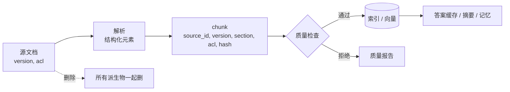

# 15 数据工程与数据质量

> RAG 的上限不是模型定的，是数据定的。检索不到、检索错、引用了过期版本、把别人不该看的内容放进上下文，这些故障没有一个能靠换模型解决。这一课讲文档从进来到被删掉的整个生命周期，以及怎么证明每一步做对了。

## 为什么需要

RAG 的数据会更新、重复、过期和被删除。只写一个 ingest 脚本，无法证明旧版本不会继续被召回，也无法证明租户权限没有泄露。

## 学习目标

- 能把一份文档变成带来源、版本、权限标签和内容哈希的 chunk，并在入库前拦住空块、重复块和编码错误
- 能实现增量更新：文档改了一段只重新处理那一段，并能查出索引里有没有落后于源文档的陈旧数据
- 能设计并执行一次删除演练，证明删掉一个源文档后所有派生数据都不存在了

## 前置

- [13 RAG 端到端](../13-rag-end-to-end/README.md)：知道 chunk 是什么、索引是给谁用的

## 心智模型

一份文档进了系统之后会「长出」很多东西：



四个原则贯穿这条链：

**元数据跟着 chunk 走。** 来源、版本、章节、权限标签、内容哈希，每个 chunk 自带。检索出来的每一条都能回答「你从哪来、是哪个版本、谁能看」。**权限不是检索完再过滤的，是 chunk 的属性。**

**哈希决定要不要重做。** 重新处理一份文档时，按内容哈希对比：一样的跳过，不一样的替换，源里没有了的删掉。embedding 是这条链里最贵的一步，增量更新省的就是它。

**质量检查在入库前。** 空块、重复块、乱码块进了索引就是噪音，检索时会占掉本该给有效内容的名额。入库前拒掉，比事后清理便宜十倍。

**删除是一个必须演练的操作。** 派生物散落在索引、缓存、摘要、记忆里。「删了源文档」不等于「删干净了」。

解析这一步下面用 markdown 示意。真实项目里 PDF、扫描件、PPT 要用专门的解析器：Docling 和 Unstructured 都能把多种格式转成带结构的元素（标题、段落、表格），输出形状和这里一样，后面的流程不变。


## 机制拆解

### 一、chunk 自带全套元数据

```python
@dataclass(frozen=True)
class Chunk:
    source_id: str          # 从哪来
    source_version: int     # 哪个版本
    section: str            # 文档里的哪一节
    text: str
    acl: tuple[str, ...]    # 谁能看 —— 进索引，不是检索后过滤
    content_hash: str       # 变没变

    def with_hash(self) -> "Chunk":
        h = hashlib.sha256(
            f"{self.source_id}|{self.section}|{self.text}".encode()).hexdigest()[:12]
        return replace(self, content_hash=h)
```

哈希要包含 `source_id` 和 `section`，不只是文本。两份不同文档里出现同一句话是常事，它们是两个 chunk，不该被当成重复。

### 二、切块不跨章节

```python
def parse_sections(markdown: str) -> list[tuple[str, str]]:
    """按标题切分。PDF、DOCX、扫描件要用真正的解析器，但输出形状一样。"""
    sections, title, buf = [], "root", []
    for line in markdown.splitlines():
        if re.match(r"^#{1,6}\s", line):
            if buf:
                sections.append((title, "\n".join(buf).strip()))
            title, buf = line.lstrip("# ").strip(), []
        else:
            buf.append(line)
    if buf:
        sections.append((title, "\n".join(buf).strip()))
    return sections

def chunk(source_id, version, markdown, acl) -> list[Chunk]:
    chunks = []
    for section, text in parse_sections(markdown):
        for start in range(0, max(len(text), 1), MAX_CHUNK_CHARS):
            chunks.append(Chunk(source_id, version, section,
                                text[start:start + MAX_CHUNK_CHARS], acl).with_hash())
    return chunks
```

两层循环的顺序是重点：**先分节，再在节内切块**。反过来（整篇拼成一个字符串再按长度切）会让一个 chunk 里同时出现「数字商品」和「实体商品」的退款规则——检索命中之后，模型拿到的是两条互相矛盾的规则的一半。

### 三、质量检查是入库的门

```python
def quality_check(chunks) -> tuple[list[Chunk], list[str]]:
    seen, kept, problems = set(), [], []
    for c in chunks:
        if not c.text.strip():
            problems.append(f"空块，出现在 {c.section!r}")
            continue
        if "�" in c.text:                       # U+FFFD 替换字符
            problems.append(f"编码错误，出现在 {c.section!r}")
            continue
        if c.content_hash in seen:
            problems.append(f"重复块 {c.content_hash}，出现在 {c.section!r}")
            continue
        seen.add(c.content_hash)
        kept.append(c)
    return kept, problems
```

`�` 那一条检查特别值得有。它是解码失败时的占位符，出现它就说明某一步的编码猜错了——通常是 PDF 解析或者非 UTF-8 的旧文档。这类块检索时永远不会命中，但会一直占着存储和索引。

`problems` 要输出成报告，不是静默丢弃。「这次入库拒了多少、为什么」是数据质量的第一个指标。

### 四、增量更新：三个集合运算

```python
def upsert_source(self, source_id, version, sections, today) -> dict[str, int]:
    incoming = {hash_of(source_id, sec, text): IndexedChunk(...)
                for sec, text in sections.items()}
    current = {h: c for h, c in self.by_hash.items() if c.source_id == source_id}

    unchanged = set(incoming) & set(current)
    added     = set(incoming) - set(current)
    removed   = set(current)  - set(incoming)

    for h in removed:
        del self.by_hash[h]
    for h in added:
        self.by_hash[h] = incoming[h]          # ← 只有这些要重新算 embedding
    for h in unchanged:
        # 内容没变，但要把版本号推进到新版本，否则会被 stale 检查误报
        self.by_hash[h] = replace(self.by_hash[h], source_version=version)

    self.source_versions[source_id] = version
    return {"unchanged": len(unchanged), "embedded": len(added), "removed": len(removed)}
```

`unchanged` 那一支容易漏：内容没变的 chunk 也要更新 `source_version`。不更新的话，下面的陈旧检查会一直报它落后。

陈旧检查本身很简单，但必须有：

```python
def stale_chunks(self) -> list[IndexedChunk]:
    """版本号落后于源文档当前版本的 chunk。"""
    return [c for c in self.by_hash.values()
            if c.source_version < self.source_versions.get(c.source_id, c.source_version)]
```

每天跑一次，非空就告警。它抓的是「更新流程中途失败」这类不会抛异常的故障。

### 五、删除演练：删完之后去搜残留

```python
@dataclass
class DerivedStores:
    """一份源文档会散落到的所有地方。生产里这些是不同的系统。"""
    chunks:       dict[str, str] = field(default_factory=dict)   # chunk_id -> source_id
    embeddings:   dict[str, str] = field(default_factory=dict)
    answer_cache: dict[str, str] = field(default_factory=dict)   # 最容易被漏掉的那个
    audit:        list[str]      = field(default_factory=list)

    def delete_source(self, source_id: str) -> None:
        for store_name in ("chunks", "embeddings", "answer_cache"):
            store = getattr(self, store_name)
            for key in [k for k, v in store.items() if v == source_id]:
                del store[key]
        self.audit.append(f"deleted source {source_id}")

    def residue(self, source_id: str) -> dict[str, int]:
        """删完之后逐个存储搜残留。这才是演练的价值所在。"""
        return {name: sum(1 for v in getattr(self, name).values() if v == source_id)
                for name in ("chunks", "embeddings", "answer_cache")}
```

演练的形态就是：入库 → 删除 → `residue()` → 全零才算过。

```python
if any(stores.residue(source_id).values()):
    sys.exit(1)      # 这一步应该在 CI 里，删不干净就红
```

每个派生存储都要有一个字段能反查到源文档。答案缓存加一个「本条回答基于哪些文档」的字段，成本几乎为零，但没有它，删除时只能全量扫描或者干脆漏掉。

## 常见错误

**chunk 跨章节。** 见第二节。

**没有内容哈希，每次全量重做。** 文档改了一个标点，全部 chunk 重新 embedding。一千份文档的知识库，每天改几份，费用和延迟都不可接受。

**权限在检索后过滤。** 先检索 top-10 再按权限过滤，用户可能拿到 3 条甚至 0 条——名额被他看不到的内容占了。更糟的是有些实现忘了过滤。

**删除漏掉派生物。** 最常见的漏法是答案缓存：文档删了，缓存里那条基于它生成的回答还在，用户下次问同样的问题还能拿到已删除内容。**「被遗忘权」要求的是删除，不是「从主表删除」。**

## 取舍

- **chunk 大小。** 小 chunk 检索精确但上下文碎，大 chunk 上下文完整但容易混入无关内容。按文档类型调：FAQ 类小，长篇说明类大。先按章节边界切、再在节内按大小切，是稳妥的起点。
- **增量更新的粒度。** 按 chunk 哈希 diff 最省，但一段话改一个词整段重做。可以接受——一段就是最小的语义单位，再细分不值得。
- **删除的彻底程度 vs 成本。** 派生物越多，删除越贵。**设计派生物的时候就要想好怎么删**，事后补反查字段的代价高得多。

## 工程落地

- **入库要有报告**：这批文档产出多少 chunk、拒了多少、原因分布、embedding 花了多少钱。没有报告，数据质量退化时你不会知道。
- **陈旧检查每天跑**，见第四节。
- **删除演练进 CI**，见第五节。它是唯一能证明合规能力的东西。
- **源文档要留原始副本**。解析器升级后需要重新解析全量文档，没有原始副本就只能让内容团队重新上传。
- **ACL 变更也要触发重新索引**。一份文档从「内部」改成「公开」，索引里的 acl 字段要跟着变，否则权限判断用的还是旧值。

## 框架映射

| 本课概念 | LangGraph | OpenAI Agents SDK | Claude Agent SDK |
|---|---|---|---|
| 文档加载与切分 | LangChain 的 loader + text splitter | 托管 file search 自己处理 | 外部数据源 |
| 版本与删除 | 框架不管，自己做 | 按 file id 删 | 自己做 |

**没有框架管数据生命周期。** 这一层是纯工程，也是最容易被跳过、最后代价最大的一层。官方文档：[LangGraph](https://langchain-ai.github.io/langgraph/) · [OpenAI Agents SDK](https://openai.github.io/openai-agents-python/)（核对日期 2026-09-05）。

## 一线经验

语音机器人的知识库是玩法和故事内容。一个真实教训：内容团队更新了某个故事文本，索引里的旧版本没被替换，机器人念的还是旧的。

根因是没有版本和哈希，更新流程是「追加」而不是「替换」。上面那个 `stale_chunks()` 是后来加的巡检，每天跑一次，有陈旧数据就告警。

这类故障的特点是**不报错**：入库脚本成功退出，日志一片绿，只有用户会发现内容不对。这也是为什么数据层的检查必须是主动巡检，而不是等异常。

## 练习

见 [exercises.md](./exercises.md)。

## 延伸阅读

- [Docling](https://github.com/docling-project/docling)（访问日期 2026-09-04）：多格式文档转结构化输出的开源解析器，看 README 的 Features 和 Python usage 两节。
- [Unstructured](https://github.com/Unstructured-IO/unstructured)（访问日期 2026-09-04）：另一个常用解析库，`partition` 系列函数把文档拆成带类型的元素。
- [GDPR 第 17 条 · 被遗忘权](https://gdpr-info.eu/art-17-gdpr/)（访问日期 2026-09-04）：删除演练存在的法律原因。看第一段就知道「删除」的范围是什么。
- [generative-ai-for-beginners · 15 RAG and Vector Databases](https://github.com/microsoft/generative-ai-for-beginners/blob/main/15-rag-and-vector-databases/README.md)（访问日期 2026-09-04）：「Creating a knowledge base」一节讲了从文本到 embedding 的准备过程。

---

[← 上一课 14](../14-memory/README.md) · [下一课 16 →](../16-system-architecture/README.md)
