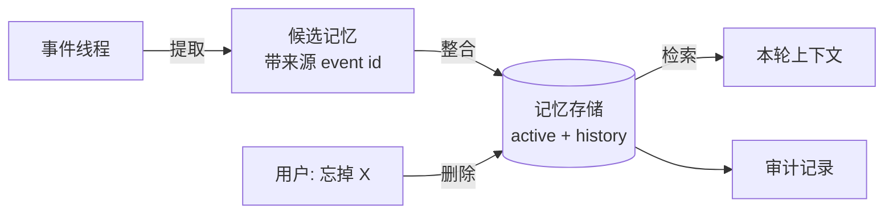

# 15 Memory：提取、整合与检索

> 模型没有记忆，它每次只看到运行时递过去的那一串消息。「记忆」是运行时替它做的四件事：从对话里提取值得记的东西，和已有的合并，下次需要时挑出相关的放进上下文，用户要求时删掉。每一步都是确定性代码加一次可校验的模型调用，没有魔法。

## 为什么需要

把整段对话永久塞回上下文既昂贵又不可靠；没有来源的长期记忆还可能把错误变成「事实」。记忆必须有生命周期、证据和删除路径。

## 学习目标

- 能区分会话记忆、任务记忆、长期记忆，说清各自的权威来源和生命周期，并知道哪一种根本不需要「记忆系统」
- 能实现带来源的记忆提取、按主题的冲突整合、按用户过滤的相关性检索，以及留审计的定向删除
- 能解释为什么「没有来源的记忆」和「不做整合的记忆」各会造成什么故障

## 前置

- [07 Agent State 与 Runtime](../07-agent-state-and-runtime/README.md)：事件线程。长期记忆的来源就是线程里的事件编号
- [原则 05](../../principles/05-runtime-owns-state.md)：四类状态。本课只讲第四类

## 心智模型

先把三个常被混为一谈的东西分开：

| 名字 | 是什么 | 存在哪 | 需要专门的记忆系统吗 |
|---|---|---|---|
| 会话记忆 | 这次对话说过什么 | 事件线程 | **不需要**，`to_messages()` 就是它 |
| 任务记忆 | 走到哪一步、拿到了什么中间结果 | 从事件线程推导 | **不需要**，第 07 课已经解决 |
| 长期记忆 | 跨会话仍然成立的事实、偏好、经历 | 独立的记忆存储 | 需要，这一课讲的就是它 |

分类名不重要（有人分 semantic / episodic / procedural，有人分 persona / entity），重要的是它们的处理流程一样：



**提取**是一次结构化输出的模型调用。输入是带编号的对话，输出是候选记忆列表，每条必须指回它来自哪几行。

**整合是纯代码。** 去重、按主题解决冲突（新的替换旧的，旧的进历史）、给有时效的经历设过期。整合逻辑不该交给模型。

**检索**先按用户过滤，再按相关性排序，只取前几条。这一步是租户边界所在。

**删除**按来源和主题定向删，删的时候写一条审计事件。


## 机制拆解

### 一、提取：来源是硬性字段

```python
class MemoryCandidate(BaseModel):
    content: str
    kind: str = Field(pattern="^(preference|fact|episode)$")
    source_event_ids: list[int] = Field(min_length=1)     # ← 整条规则就在这一行

class ExtractionResult(BaseModel):
    memories: list[MemoryCandidate]
```

提取时把对话按行编号发给模型：

```python
def numbered_transcript(t: Thread) -> str:
    return "\n".join(f"[{i}] {e.type}: {e.data.get('content', '')}"
                     for i, e in enumerate(t.events))

prompt = ("Extract durable facts about the user worth remembering across conversations. "
          "Return JSON {memories:[{content, kind, source_event_ids}]}. "
          "source_event_ids are the bracketed numbers of the lines the fact comes from.\n\n"
          + numbered_transcript(thread))
```

`min_length=1` 让缺来源的整批被拒。为什么值得这么严：

- 用户问「你为什么觉得我不吃辣」，你答得上来。
- 用户说「我没说过这话」，你能核对。
- 用户说「忘掉我关于饮食说的话」，你知道该删哪几条。

存的时候连原文一起存下来，事后不用回线程里翻：

```python
record = {"user_id": "u42", "thread_id": thread.thread_id, **m.model_dump(),
          "source_text": [thread.events[i].data["content"] for i in m.source_event_ids]}
```

### 二、整合：三条规则，全是代码

```python
EPISODE_TTL_DAYS = 180

def add(self, candidate: Memory, today: date) -> str:
    # 规则一：过期的经历不入库
    if candidate.kind == "episode" and today - candidate.observed_on > timedelta(days=EPISODE_TTL_DAYS):
        return "expired"

    for existing in self.active:
        # 规则二：完全重复，丢弃
        if existing.content == candidate.content:
            return "duplicate"

        # 规则三：同一个 subject 上冲突 —— 新的胜出，旧的进 history
        if existing.subject == candidate.subject and existing.kind != "episode":
            self.active.remove(existing)
            self.history.append(replace(existing, superseded_by=candidate.content))
            self.active.append(candidate)
            return f"superseded {existing.content!r}"

    self.active.append(candidate)
    return "added"
```

`subject` 字段是整合能做的前提：**冲突是按主题判断的，不是按内容相似度**。「是素食者」和「开始吃鱼了，不再素食」文本上毫不相似，但 `subject` 都是 `diet`，所以后者取代前者。

旧的进 `history` 而不是删掉，因为「用户以前说过什么」有时候要查。而且这让「记忆变更」本身可审计。

不做整合的后果很直接：模型同时收到「用户是素食者」和「用户开始吃鱼了」，它会随机选一个，用户看到的是一个前后不一的助手。

### 三、检索：租户过滤在第一行

```python
def retrieve(memories, user_id: str, query: str, k: int = 3) -> list[Memory]:
    """先过滤租户，再算相关性。别的用户的记忆绝不能出现。"""
    words = set(query.lower().split())
    scored = [(len(words & set(m.keywords)), m)
              for m in memories if m.user_id == user_id]     # ← 删掉这个条件就是事故
    scored = [(s, m) for s, m in scored if s > 0]
    scored.sort(key=lambda x: -x[0])
    return [m for _, m in scored[:k]]
```

生产里 `len(words & keywords)` 换成向量相似度，其余一行不改。

这行 `m.user_id == user_id` 是本课最重要的一行代码。删掉它，另一个用户的花生过敏就会出现在这个用户的上下文里。**这不是概率问题，是权限问题**，必须有测试守着。

### 四、遗忘：定向删除 + 审计

```python
def forget(memories, user_id: str, subject: str, requested_by: str) -> list[Memory]:
    removed = [m for m in memories if m.user_id == user_id and m.subject == subject]
    kept = [m for m in memories if m not in removed]
    AUDIT.append({
        "at": datetime.now(timezone.utc).isoformat(timespec="seconds"),
        "action": "forget",
        "user_id": user_id,
        "subject": subject,
        "requested_by": requested_by,
        "removed": [{"id": m.id, "source_thread": m.source_thread,
                     "source_event_ids": list(m.source_event_ids)} for m in removed],
    })
    return kept
```

审计记录里存的是**被删记忆的标识和出处**，不是内容——否则「删除」等于把内容抄到另一张表里。

`requested_by` 区分用户主动要求和系统按策略清理，两者的合规含义完全不同。

## 常见错误

**记忆没有来源。** 见第一节。

**不整合直接追加。** 见第二节。

**检索忘了按用户过滤。** 见第三节。这是记忆系统最常见也最严重的事故。

**删除只删了记忆本身。** 如果记忆已经被拷贝进某个摘要、某个用户画像字段或某个缓存，只删记忆表那一行不够。第 16 课的删除演练讲怎么证明删干净了。

## 取舍

- **热路径提取 vs 后台提取。** 边聊边提取，用户下一句就能用上，但每轮多一次模型调用；后台批量提取省钱，但有延迟。常见做法是热路径只提取用户明确说「记住」的，其余后台做。
- **profile vs collection。** 一个固定字段的用户画像结构清楚、容易展示给用户、容易删除；一个开放的记忆条目集合更灵活但需要整合逻辑。上面用的是集合加按主题整合，两者的好处占一点。
- **记多少。** 记得越多检索越难、隐私风险越大。一个实用的标准：**这条记忆下次对话用得上的概率有多大**，用不上就不记。episode 类默认设过期。

## 工程落地

- **记忆的注入要可见。** 这一轮召回了哪几条记忆，要进 trace，也最好让用户能看到。用户看到「我记得你不吃辣」时能纠正，看不到就只能困惑。
- **区分「用户明说」和「模型推断」。** 推断出来的东西在回答里要用可被纠正的语气（「我记得你好像……」），而不是当成事实陈述。
- **遗忘要能级联。** 用户删除账号时，记忆、审计里的关联、缓存、以及已经进了某条摘要的部分，都要有处理方案。
- **记忆表要有 TTL 和容量上限。** 一个聊了三年的用户，记忆条数不该无限增长。
- **怎么测：两类样本都要有。** 该记住的——说过一次，几轮之后还能用上；该忘掉的——用户改了口径，旧的不能再出现。第二类最容易漏测也最容易出事：记忆系统的典型故障不是想不起来，是记住了一件已经不成立的事。

## 框架映射

| 本课概念 | LangGraph | OpenAI Agents SDK | Claude Agent SDK |
|---|---|---|---|
| 跨会话存储 | `BaseStore`（有命名空间，天然按用户隔离） | `Session` 主要存会话历史 | 项目级 memory 文件 |
| 提取与整合 | 自己写节点 | 自己写 | 自己写 |

三个框架都给存储，**都不给整合逻辑**。这正是本课的重点：整合是业务判断，不该外包。官方文档：[LangGraph Memory](https://langchain-ai.github.io/langgraph/concepts/memory/) · [OpenAI Agents SDK](https://openai.github.io/openai-agents-python/) · [Claude Agent SDK](https://docs.claude.com/en/api/agent-sdk/overview)（核对日期 2026-09-05）。

## 一线经验

语音机器人的家庭场景下，多个家庭成员共用一台设备。早期记忆只按设备存，结果孩子说的偏好出现在给家长的回答里。

修法就是上面那一行按用户过滤，加上声纹或显式身份切换来确定「当前用户是谁」。**「当前用户是谁」这个问题，在共享设备上比在 Web 应用里难得多**，而记忆系统的正确性完全依赖它。

另一个经验是记忆里要标「用户明说」还是「模型推断」。推断出来的东西说错了，用户会觉得被冒犯；标明是推断并用可纠正的语气说出来，用户反而会主动更正——这本身就是一次高质量的记忆更新。

## 练习

见 [exercises.md](./exercises.md)。

想看这一课的机制装进一个真实服务是什么样：参考实现的 [M4 RAG 与 Memory](https://github.com/lance2016/ai-app-engineering-ref/blob/main/project/m4-rag-and-memory/README.md)，记忆提取、冲突合并与删除。

## 延伸阅读

- [ai-agents-for-beginners · 13 Agent Memory](https://github.com/microsoft/ai-agents-for-beginners/blob/main/13-agent-memory/README.md)（访问日期 2026-09-04）：记忆类型的分法比本课细，「实现与存储」一节讲了 Mem0 的两阶段流程，和本课的提取加整合是同一个思路。
- [langchain-academy · module-5](https://github.com/langchain-ai/langchain-academy/tree/main/module-5)（访问日期 2026-09-04）：从跨线程的 store 讲到 profile 和 collection 两种 schema。看 markdown 说明就够。
- [LangChain · Memory 概念页](https://docs.langchain.com/oss/python/concepts/memory)（访问日期 2026-09-04）：semantic、episodic、procedural 三分法和「热路径 vs 后台」两种写入时机的出处。

---

[← 上一课 14](../14-rag-end-to-end/README.md) · [下一课 16 →](../16-data-engineering/README.md)
