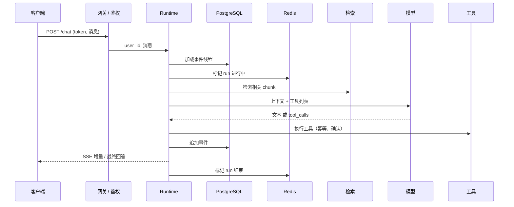

# 16 AI 应用系统架构与端到端数据流

> 前面十一课各讲一个部件。这一课把它们放回一条完整的请求链里：从客户端发出请求，经过网关、会话、上下文、模型、工具、检索，再回到客户端。看清每一跳做什么、耗时在哪、状态归谁，你就知道该往哪加东西、出了问题该去哪看。

## 学习目标

- 能画出一次 AI 应用请求的完整链路，标出每一跳的职责和它读写的状态
- 能说清同步请求、SSE 流式、长任务三种形态各适用什么场景，以及客户端在每种形态下拿到的是什么
- 能划出 Redis 和 PostgreSQL 的边界，并用"把缓存清空"这个实验证明边界画对了

## 前置

- [07 Agent State 与 Runtime](../07-agent-state-and-runtime/README.md)：事件线程和事件流。本课的持久化就是存它
- [13 RAG 端到端](../13-rag-end-to-end/README.md)：检索这一跳的内部
- 前置模块 [P08 HTTP 与 FastAPI](../../prerequisites/python/08-http-and-fastapi/README.md)：SSE 端点用到

## 心智模型

### 一条请求链

每一跳回答一个问题：网关回答"你是谁、能不能进来"，线程加载回答"之前发生过什么"，检索回答"这次需要哪些外部知识"，模型回答"下一步做什么"，工具回答"外部世界怎么变了"，持久化回答"这次发生了什么"。

ai-agents-for-beginners 第 16 课有一句话值得记住：模型大概只占一个生产 Agent 的两成，剩下八成是围着循环的运维骨架。这条链上除了"模型"那一跳，全是骨架。

### 三种形态

| 形态 | 客户端拿到什么 | 适合 | 代价 |
|---|---|---|---|
| 同步 | 等到最后拿一个完整回答 | 短请求、内部 API、批处理 | 用户盯着空白等 |
| SSE 流式 | 边生成边收增量，最后一个 done 事件 | 对话界面 | 代理和负载均衡要配成不缓冲 |
| 长任务 | 立刻拿到 task id，之后轮询或订阅 | 超过几十秒的工作、批量、定时 | 要有任务表、worker、结果通知 |

三种形态共用同一个 runtime 和同一条事件线程，差别只在"什么时候把什么交给客户端"。`01` 用 `MODE` 切换三种形态跑同一条链。

### 存储边界

| 放 Redis | 放 PostgreSQL |
|---|---|
| run 进行中的标记 | 事件线程 |
| 限流计数器 | 用户、会话、任务表 |
| 最近消息的热拷贝 | 长期记忆 |
| 幂等键的短期去重 | 文档 chunk 和向量（pgvector） |
| 任务队列（Taskiq 之类的 broker） | 审计记录 |

判断标准只有一条：**这个东西丢了能不能重建**。能重建的放 Redis，不能的放 PostgreSQL。热拷贝可以同时放两边，但权威只有一个。

## 最小可运行例子

| 文件 | 演示什么 | 运行 |
|---|---|---|
| [`code/01_request_chain.py`](./code/01_request_chain.py) | 每一跳是一个小函数，用上下文管理器计时并记成线程里的 `hop` 事件；`MODE` 切换同步、流式、长任务 | `uv run python lessons/16-system-architecture/code/01_request_chain.py`，`MODE=stream`，`MODE=task` |
| [`code/02_sse_endpoint.py`](./code/02_sse_endpoint.py) | FastAPI 的 `StreamingResponse` 做 SSE，`X-Accel-Buffering: no` 防代理缓冲；用 `TestClient` 在进程内自测，不起服务 | `uv run python lessons/16-system-architecture/code/02_sse_endpoint.py`（需要 `uv sync --group prereq`） |
| [`code/03_storage_boundaries.py`](./code/03_storage_boundaries.py) | TTL 字典当 Redis，SQLite 当 PostgreSQL；写两轮对话后清空缓存，线程从持久层完整恢复；注入时历史只在缓存里，清空就丢 | `uv run python lessons/16-system-architecture/code/03_storage_boundaries.py`，加 `INJECT_HISTORY_IN_CACHE=1` |

`01` 的耗时是 `asyncio.sleep` 模拟的，比例参考了常见的生产分布：模型最慢，检索其次，其余是毫秒级。看输出时注意 `MODE=stream` 的"首字节时间"远小于总时间，这就是流式存在的理由。

## 常见错误与失败注入

**历史只在缓存里。** `03` 的注入开关把事件线程只写进 TTL 缓存。Redis 一重启，用户的对话全没了。这个错误在原型阶段特别常见，因为"先放 Redis 快"。判断方法就是 `03` 做的事：清空缓存，看什么丢了。

**SSE 被代理缓冲。** 流式端点本地测试正常，上了 Nginx 之后变成"等很久然后一次全出来"。原因是代理默认缓冲响应。`02` 里 `X-Accel-Buffering: no` 和 `Cache-Control: no-cache` 两个头就是为这个加的，Nginx 侧还要配 `proxy_buffering off`。

**长任务用 HTTP 长连接硬等。** 一个 90 秒的任务用同步请求做，客户端超时、网关超时、负载均衡超时三个地方都可能先断。`01` 的 `task` 模式立刻返回 id，工作在后台 worker 里做完再持久化，客户端用轮询或订阅拿结果。

**每一跳都自己连数据库。** 网关查一次用户，runtime 再查一次，工具又查一次。连接数和延迟都翻倍。用户身份在网关解析一次后作为参数往下传，`01` 里 `gateway_auth` 返回 `user_id`，后面的跳只收这个字符串。

## 取舍

- **单体 vs 拆服务。** 一条链上的跳先放在一个 FastAPI 进程里，用模块边界隔开。等某一跳（通常是检索或工具执行）需要独立扩容或独立部署时再拆。过早拆服务换来的是网络调用和分布式状态，不是可维护性。
- **SSE vs WebSocket。** SSE 单向、走普通 HTTP、浏览器原生支持自动重连，对话界面够用。WebSocket 双向，语音这类需要客户端持续上行的场景才需要。第 08 课的事件流和本课的 SSE 都是单向的。
- **热拷贝放不放。** 每次都从 PostgreSQL 读线程，简单但慢；加 Redis 热拷贝快，但多一个要保持一致的地方。`03` 的做法是写时双写、读时先缓存后落库，缓存永远只是加速，不是权威。

## 练习

见 [exercises.md](./exercises.md)。

## 对照真实项目

这一课是主项目 [M1](../../project/m1-api-skeleton/README.md) 和 [M2](../../project/m2-state-and-storage/README.md) 的架构总结：M1 做了网关、鉴权和 SSE 端点，M2 做了线程持久化和 Redis 状态。学到这一课时回头看这两个里程碑，检查每一跳是不是都有对应的模块。[M5](../../project/m5-production/README.md) 会在这条链的每一跳加上 trace。

语音机器人项目就是一个"两个进程通过 PostgreSQL、Redis 和实时音视频通道通信"的系统。一个真实的架构教训是早期把"当前处于哪个子 Agent"这个状态放在 Redis，进程重启后状态丢了但 PostgreSQL 里的对话历史还在，两边不一致导致机器人"忘了自己在玩游戏"。按本课的边界表，这个状态要么从历史推导，要么落 PostgreSQL，唯独不能只在 Redis。另一个和三种形态相关的经验：语音场景的模型输出是流式的，但设备端的动作指令必须等一个完整的工具调用才能下发，所以同一条响应里文本走流式、指令走"攒够再发"，两种形态在一个请求里并存。

## 延伸阅读

- [ai-agents-for-beginners · 16 Deploying Scalable Agents](https://github.com/microsoft/ai-agents-for-beginners/blob/main/16-deploying-scalable-agents/README.md)（访问日期 2026-09-04）："From Prototype to Production" 那张七行的对照表和"Scaling Strategies"一节是通用的，其余绑微软托管服务。
- [ai-agents-for-beginners · 10 AI Agents in Production](https://github.com/microsoft/ai-agents-for-beginners/blob/main/10-ai-agents-production/README.md)（访问日期 2026-09-04）：trace 和 span 的概念，第 18 课的前导。
- [MDN · Using server-sent events](https://developer.mozilla.org/en-US/docs/Web/API/Server-sent_events/Using_server-sent_events)（访问日期 2026-09-04）：SSE 帧格式和浏览器端 `EventSource` 的重连行为。
- [FastAPI · Custom Response](https://fastapi.tiangolo.com/advanced/custom-response/)（访问日期 2026-09-04）：`StreamingResponse` 的用法。
- [Redis · Data store 入门](https://redis.io/docs/latest/develop/get-started/data-store/) 与 [PostgreSQL · 事务](https://www.postgresql.org/docs/current/tutorial-transactions.html)（访问日期 2026-09-04）：两边各看一页，理解"能丢"和"不能丢"的差别在哪。

---

[← 上一课 15](../15-data-engineering/README.md) · [下一课 17 →](../17-evaluation/README.md)
