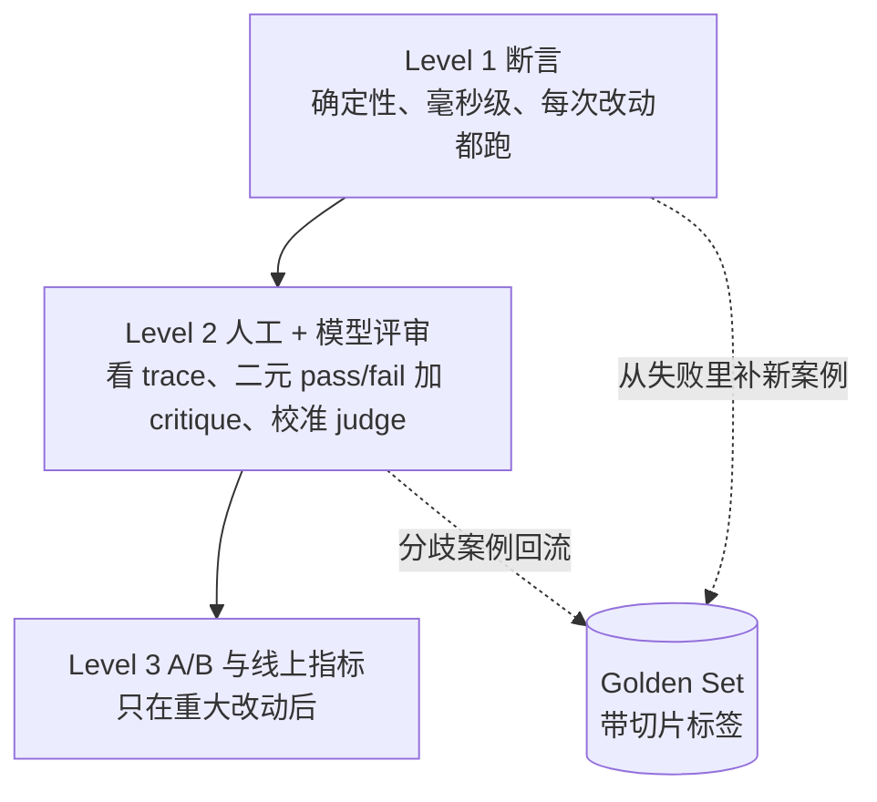

# 17 评测：Golden Set、LLM Judge 与 Agent Eval

> 改了 prompt，试了三个问题，感觉更好了。这门课要把这句话里的每个词换掉：三个问题换成带标签的评测集，"感觉"换成断言和校准过的 judge，"更好"换成和基线比的门禁。

## 学习目标

- 能为一个 AI 功能建一份带切片标签的 golden set，并用确定性断言在一秒内跑完
- 能校准一个 LLM judge：算它和人工标注的一致率与 kappa，从分歧案例改 judge 的 prompt
- 能对 Agent 的轨迹做断言而不只看最终答案，并把一次真实运行录成 fixture 在 CI 里回放
- 能实现一个按切片比对基线的回归门禁，说明为什么总分会掩盖退化

## 前置

- [06 Agent 循环与控制流](../06-agent-loop/README.md)、[07 Agent State 与 Runtime](../07-agent-state-and-runtime/README.md)：轨迹评测直接对第 07 课的 `Thread` 做断言
- [13 RAG 端到端](../13-rag-end-to-end/README.md)：Recall@k 是本课方法在检索层的应用
- 前置模块 [P10 pytest 与测试思维](../../prerequisites/python/10-testing/README.md)

## 心智模型

Hamel Husain 把 AI 应用的评测分成三层，成本递增、频率递减：

这一课主要在 Level 1 和 Level 2 之间。四个要点：

**评测集先于优化。** 第一版 prompt 写完之前，先有 10 条带预期的案例。每条案例三样东西：输入、什么算好（可断言的）、标签。标签是切片的来源：faq、policy、adversarial、multi_step、pii。总分 92% 说明不了什么，"adversarial 切片 0%"才说明问题。

**断言能测的不要用 judge。** 必须包含、不能包含、必须调某个工具、不超过几步、不泄露邮箱格式。这些零成本、确定、每次 `pytest` 都跑。Judge 留给"回答是否切题"这类断言写不出来的判断。

**Judge 先校准再信。** 让人先给 20～50 条打 pass/fail 并写一句 critique，再让 judge 打同一批。算一致率，更要算 Cohen's kappa，因为一个把所有案例都判 pass 的 judge 在 70% 的案例本来就该 pass 时，一致率也有 70%，kappa 却是 0。分歧案例连同人的 critique 放进 judge 的 prompt 当 few-shot，再来一轮。Hamel 的建议是坚持二元 pass/fail，不要 1～5 分：分数看着精细，实际上和专家判断不相关。

**Agent 要评路径。** 最终答案对了，但中途多调了一个发邮件的工具，这不是通过。轨迹断言看的是工具调用序列：必须调什么、不能调什么、有没有重复、几步。把一次真实运行的 `Thread` 存成 JSON，断言就能在没有模型的 CI 里回放。这也是"录制回放测试"。

最后一件事是**门禁**。基线分数存下来，新版本按切片和基线比，任何切片跌破阈值就拒绝。阈值是产品决策，但必须写成代码而不是留在某个人的脑子里。

## 最小可运行例子

| 文件 | 演示什么 | 运行 |
|---|---|---|
| [`code/01_golden_set_assertions.py`](./code/01_golden_set_assertions.py) | 12 条带标签的 golden set，三类断言，按切片报告 | `uv run python lessons/17-evaluation/code/01_golden_set_assertions.py`，加 `PROMPT_VERSION=v2` 看 adversarial 切片掉到 1/3 |
| [`code/02_llm_judge_calibration.py`](./code/02_llm_judge_calibration.py) | judge 输出 pass/fail + critique，和人工标注算一致率、kappa、混淆表，列出分歧 | 同上，加 `INJECT_LENIENT_JUDGE=1` 看 kappa 归零 |
| [`code/03_trajectory_eval.py`](./code/03_trajectory_eval.py) | 对 `Thread` 做轨迹断言；把通过的运行录成 fixture 再回放 | 同上，加 `INJECT_DETOUR=1` 看答案对但路径不对 |
| [`code/04_regression_gate.py`](./code/04_regression_gate.py) | 第一次跑记基线，之后按切片比对；退化就 exit 1 | 跑两次，第三次加 `INJECT_REGRESSION=1` |

被测系统是一个写死答案的函数，有 v1 和 v2 两个"prompt 版本"。这是故意的：评测机制本身要能离线复现，真实系统接进来只是把 `answer()` 换成模型调用。

## 常见错误与失败注入

**只看总分。** `PROMPT_VERSION=v2` 时总分 83%，看着还行；按切片看，adversarial 从 3/3 掉到 1/3，两个对抗案例都泄露了。`04_regression_gate.py` 的总分阈值故意放到 20%，正是为了演示总分门禁抓不住而切片门禁能抓住。

**Judge 太宽松却一致率不低。** `INJECT_LENIENT_JUDGE=1` 时 judge 全判 pass，一致率还有 58%，因为本来就有 7 条该 pass。kappa 是 0.00，这才是真实水平。只报一致率会被这种 judge 骗。

**只评最终答案。** `INJECT_DETOUR=1` 时 Agent 答对了"订单已发货"，但中途调了一次 `send_email`。答案断言通过，轨迹断言失败。生产里这就是"用户没要邮件却收到了邮件"。

**评测集 12 条就下结论。** 12 条里一条失败是 8 个百分点，任何阈值都会被噪声触发。例子里的数字是为了演示机制；真实评测集每个切片至少要几十条，而且要持续从线上失败里补。

**把评测跑得很慢。** 需要 key、要半小时、要人盯的评测只会在发版前跑一次。四个文件加起来一秒跑完，这是它们能进 `pytest` 的前提。

## 取舍

- **断言的严格程度。** `must_contain "14 days"` 会把"两周内"判错。太严会误报，太松会漏报。经验是先严，把误报的案例单独看一眼，确认是断言写窄了再放宽。
- **judge 的成本。** 每条案例一次模型调用，几百条案例就是几百次调用。所以 judge 不进每次提交的 CI，按天或按发版跑。断言进 CI。
- **通过率目标。** Hamel 说得直接：通过率是产品决策，不需要 100%。对抗切片要求 100%，faq 切片 95% 可能就够。阈值按切片设，不设一个全局值。
- **基线怎么更新。** 有意的改进会让分数上升，此时要更新基线；但更新基线的动作要显式、有人批准，否则"跑一次就覆盖基线"会让门禁形同虚设。

## 练习

见 [exercises.md](./exercises.md)。

## 对照真实项目

主项目 [M5.1](../../project/m5-production/README.md) 的 [`aiapp/eval/`](../../project/src/aiapp/eval/) 是这四个文件的合体：`suites.py` 的 `tasks` 套件是 `03` 的轨迹断言跑在真实 `run_agent` 上，`tools` 和 `retrieval` 是 `01` 的 golden set 加切片；`judge.py` 是 `02` 的一致率和 kappa；`gate.py` 是 `04` 的门禁，下限和容忍度在 `project/eval/thresholds.toml`。`scripts/eval_run.py` 出报告并在 CI 里挡 PR，`INJECT_REGRESSION=1` 能看到它变红。

语音机器人项目的经验：最有价值的评测集不是一开始设计出来的，而是从"退出类 bad case"里长出来的。用户说"不聊了"机器人还在说，这类失败先被记成案例，再用真实模型加假数据库跑整个 workflow 复现，复现出来的就进回归集。另一个教训是评测暴露了一个 flaky 的行为：某个选择阶段的点名结果不稳定，不是 bug 而是模型随机性。这类案例要么多跑几次取通过率，要么把断言从"必须点名 A"放宽成"必须点名候选之一"。评测集里 flaky 的案例不处理，整个门禁就会被当成噪声忽略。

## 延伸阅读

- [Hamel Husain · Your AI Product Needs Evals](https://hamel.dev/blog/posts/evals/)（访问日期 2026-09-04）：三层评测的出处。重点读 Level 1 的"把功能拆成场景写断言"和 Level 2 的"用表格对齐 judge 和人"。
- [Hamel Husain · Creating a LLM-as-a-Judge That Drives Business Results](https://hamel.dev/blog/posts/llm-judge/)（访问日期 2026-09-04）：为什么坚持二元 pass/fail，以及 critique 要写到"新员工能看懂"。
- [openai-cookbook · examples/evaluation](https://github.com/openai/openai-cookbook/tree/main/examples/evaluation)（访问日期 2026-09-04）：`use-cases/regression.ipynb` 和 `tools-evaluation.ipynb` 是工程化的回归与工具调用评测示例；绑 OpenAI Evals API，看组织方式即可。
- [ai-agents-for-beginners · 10 AI Agents in Production](https://github.com/microsoft/ai-agents-for-beginners/blob/main/10-ai-agents-production/README.md)（访问日期 2026-09-04）：把可观测和评测放在一起讲，"离线评测和线上评测的循环"那一节值得看。

---

[← 上一课 16](../16-system-architecture/README.md) · [下一课 18 →](../18-observability/README.md)
