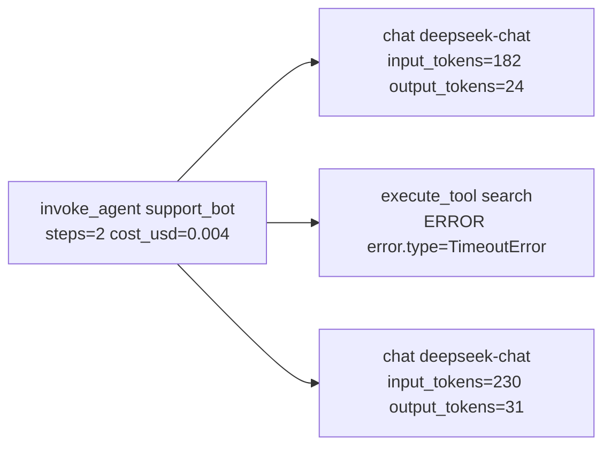

# 18 可观测性：从日志到 LLM Trace

> 一次回答背后是五次模型调用、三次工具调用、两次检索。没有 trace，你看到的只有最后那句话；出问题时在猜，没出问题时不知道花了多少钱。这一课用五十行 Python 自己造一个 tracer，属性名对齐 OpenTelemetry 的 GenAI 约定，最后把它按 OTLP 格式发给 Phoenix。

## 学习目标

- 能把 print 换成带关联 id 的结构化日志，并解释为什么一行一个 JSON 比一行一句话有用
- 能实现一个最小 tracer（span 树、属性、状态、异常事件），并说出 `record_exception` 和 `set_status` 为什么必须一起调
- 能用 OpenTelemetry GenAI 语义约定的属性名标注模型调用和工具调用，知道哪些名字已经废弃
- 能从四种故障（工具超时、模型空输出、成本尖峰、循环）的 trace 里指出各自的信号

## 前置

- [06 Agent 循环与控制流](../06-agent-loop/README.md)、[07 Agent State 与 Runtime](../07-agent-state-and-runtime/README.md)：被观测的对象
- [17 评测](../17-evaluation/README.md)：评测集里的失败案例从 trace 里挑
- 前置模块 [P03 模块、异常与日志](../../prerequisites/python/03-modules-errors-and-logging/README.md)

## 心智模型

一次运行是一棵树。根 span 是这次运行，子 span 是每次模型调用和工具调用。每个 span 有名字、属性、耗时、状态。这棵树回答四类问题：

- **哪一步慢了**：看每个 span 的耗时，工具超时的 span 耗时正好卡在超时值上。
- **哪一步错了**：看状态是 ERROR 的 span 和它上面的异常事件。
- **花了多少钱**：把 chat span 上的 token 属性加起来。
- **走了什么路**：子 span 的序列就是轨迹，重复的子 span 就是循环。

三个决定 trace 有用还是没用的细节：

**属性名用标准的。** OpenTelemetry 的 GenAI 语义约定规定了 `gen_ai.operation.name`、`gen_ai.provider.name`、`gen_ai.request.model`、`gen_ai.usage.input_tokens`、`gen_ai.usage.output_tokens`、`gen_ai.tool.name`、`gen_ai.tool.call.id`、`gen_ai.agent.name`、`gen_ai.conversation.id` 等名字，span 名规定为 `{operation} {model}`（如 `chat deepseek-chat`）、`execute_tool {tool}`、`invoke_agent {agent}`。用这些名字，Phoenix、Langfuse、任何 collector 都直接识别。注意 `gen_ai.system` 和 `gen_ai.usage.prompt_tokens`、`gen_ai.usage.completion_tokens` 已经标为废弃，替代是 `gen_ai.provider.name`、`input_tokens`、`output_tokens`；GenAI 约定在 2026 年从主仓库迁到了独立仓库。

**出错时两个调用一起做。** `span.record_exception(exc)` 只是在 span 上加一个事件；`span.set_status("ERROR", msg)` 才改状态。只做前者，UI 里这个 span 是绿的，异常藏在事件列表里，没人会点开。这是作者项目里踩过的坑，一批工具超时因此静默了两周。

**运行时的语义不会自己出现在 trace 里。** 模型返回空字符串不抛异常，工具返回 4000 行不报错，同一个工具被调五次每次都成功。这些在 trace 里都是绿的，除非运行时主动打上属性：`aiapp.empty_output=true`、`aiapp.cost_usd`、按参数哈希算重复。标准属性给的是"发生了什么"，自定义属性给的是"这在我的系统里意味着什么"。

结构化日志和 trace 的关系：日志是线性的、每条独立、便于 grep 和聚合；trace 有父子关系、便于看一次运行的全貌。两者用同一个 `run_id` 关联，缺一个都不完整。

## 最小可运行例子

| 文件 | 演示什么 | 运行 |
|---|---|---|
| [`code/01_structured_logging.py`](./code/01_structured_logging.py) | JSON 格式的 logging handler，每行带 `run_id`；最后把日志当数据查一次 | `uv run python lessons/18-observability/code/01_structured_logging.py` |
| [`code/02_minimal_tracer.py`](./code/02_minimal_tracer.py) | 五十行 tracer：contextvar 管当前 span，导出为树；`record_exception` 与 `set_status` 分开的后果 | 同上，加 `INJECT_TOOL_ERROR=1`，再加 `INJECT_FORGET_STATUS=1` 看"绿色 span 里藏着异常" |
| [`code/03_failure_experiments.py`](./code/03_failure_experiments.py) | 四个故障各一棵树，附"该看哪个属性" | `INJECT=tool_timeout` / `empty_model` / `cost_spike` / `loop` |
| [`code/04_otlp_export.py`](./code/04_otlp_export.py) | 手工拼 OTLP/HTTP JSON，POST 到 `/v1/traces` | 不设端点时打印 payload；设 `OTEL_EXPORTER_OTLP_ENDPOINT=http://localhost:6006` 发给本地 Phoenix |

`04` 是为了拆掉 SDK 的神秘感：OTLP 就是一个 JSON，属性名是唯一的契约。真实项目当然用 SDK：`pip install arize-phoenix` 后 `phoenix serve`，再用 `opentelemetry-sdk` 加 `opentelemetry-exporter-otlp` 把 `02` 的 tracer 换掉，属性名一个都不用改。Langfuse 同理，它的自托管是一条 `docker compose up`，也吃 OTLP。

## 常见错误与失败注入

**只 `record_exception` 不 `set_status`。** `INJECT_FORGET_STATUS=1 INJECT_TOOL_ERROR=1` 跑 `02`，输出最后一行会告诉你：有异常事件，没有 ERROR 状态。在 Phoenix 里这个 span 是绿的。

**模型空输出没人知道。** `INJECT=empty_model` 跑 `03`。模型返回空字符串，没有异常，没有超时。`03` 里运行时检查了 `reply.content` 并打上 `aiapp.empty_output=true`、把 span 标 ERROR。没有这一步，这次运行在任何仪表盘上都是成功的。

**成本尖峰藏在下一轮。** `INJECT=cost_spike` 跑 `03`。工具返回了 4000 行没分页的结果，这一轮的工具 span 完全正常，是**下一轮** chat span 的 `gen_ai.usage.input_tokens` 从个位数变成几千。成本问题几乎总是滞后一轮出现，所以要看根 span 上聚合的 `aiapp.cost_usd`。

**循环在每一步都是成功的。** `INJECT=loop` 跑 `03`。五个 `execute_tool search` 子 span 全是 OK，参数哈希全一样，根 span 以 step_limit 结束。单看任何一个 span 都没问题；要按 trace 数相同子 span 的个数。第 06 课的跑偏检测在运行时做这件事，trace 让你在事后也能做。

**关联 id 断在异步边界。** `01` 里 `run_id` 是显式传参。真实代码里很容易在 `asyncio.create_task` 或线程池处丢掉。OpenTelemetry 用 contextvar 传播上下文，`02` 的 tracer 也是，但 contextvar 在 `create_task` 时会复制、在线程池里不会自动传，需要显式处理。

## 取舍

- **自制 tracer vs SDK。** 五十行自制版足够教学和小项目，好处是没有依赖、行为完全可见。缺点是没有采样、批量导出、上下文传播到 HTTP 头这些 SDK 的成熟功能。生产用 SDK，但先用自制版理解它在做什么。
- **记多少内容。** `gen_ai.input.messages` 和 `gen_ai.output.messages` 可以把完整对话放进 span，排障极其方便，但涉及隐私、成本和后端存储。常见做法是默认只记 token 数和长度，按采样率或按用户开关记全文。
- **Phoenix 还是 Langfuse。** 两者都吃 OTLP，都能自托管。Phoenix 一条命令起本地实例、和评测功能结合紧；Langfuse 团队协作和 prompt 管理更强。课程默认 Phoenix 是因为起得快。属性名标准化之后，换后端的成本是配置而不是代码。
- **日志和 trace 二选一？** 不选。日志便宜、适合聚合和告警；trace 贵、适合看单次运行。用同一个 `run_id` 把两者连起来。

## 练习

见 [exercises.md](./exercises.md)。

## 对照真实项目

主项目 [M5.2 可观测](../../project/m5-production/README.md) 把 `02` 的 tracer 换成 OpenTelemetry SDK，导出到本地 Phoenix，并把 `03` 的四个故障实验变成故障演练脚本。M3 的 `ToolRunner` 从一开始就要带 `execute_tool` span，这是"第一次调用就该有"的意思。

语音机器人项目的两个教训都写进了这一课。第一个是 `record_exception` 不 `set_status` 的坑，代价是两周的静默超时。第二个和事件驱动架构有关：每个处理步骤接收一类事件、产出另一类事件，代码里看不出"当前走到哪"，只有 trace 能回答。所以那个项目里 trace 不是排障工具，是理解系统运行方式的唯一途径。顺带一个细节：span 属性里放状态对象时做了白名单，只放小的、稳定的字段，否则一个大状态对象序列化进去，每个 span 几十 KB，后端很快撑不住。

## 延伸阅读

- [OpenTelemetry GenAI semantic conventions](https://github.com/open-telemetry/semantic-conventions-genai)（访问日期 2026-09-04）：`docs/gen-ai/gen-ai-spans.md` 是模型调用 span 的规范，`gen-ai-agent-spans.md` 是 `invoke_agent`、`execute_tool`、`invoke_workflow` 的规范。这是属性名的权威来源。
- [OpenTelemetry 属性注册表 · gen_ai](https://github.com/open-telemetry/semantic-conventions/blob/main/docs/registry/attributes/gen-ai.md)（访问日期 2026-09-04）：查哪些名字已标 deprecated，以及 `gen_ai.evaluation.*` 这组把评测结果挂到 trace 上的属性。
- [Arize Phoenix](https://github.com/Arize-ai/phoenix)（访问日期 2026-09-04）：README 的 tracing 一节和 OpenInference 项目。`pip install arize-phoenix` 后 `phoenix serve` 就能接 `04` 的输出。
- [Langfuse](https://github.com/langfuse/langfuse)（访问日期 2026-09-04）：自托管用 docker compose，同样接 OTLP。
- [ai-agents-for-beginners · 10 AI Agents in Production](https://github.com/microsoft/ai-agents-for-beginners/blob/main/10-ai-agents-production/README.md)（访问日期 2026-09-04）：trace 和 span 的概念介绍，以及要跟踪的指标清单。示例绑微软框架，概念部分通用。

---

[← 上一课 17](../17-evaluation/README.md) · [下一课 19 →](../19-reliability-cost-llmops/README.md)
