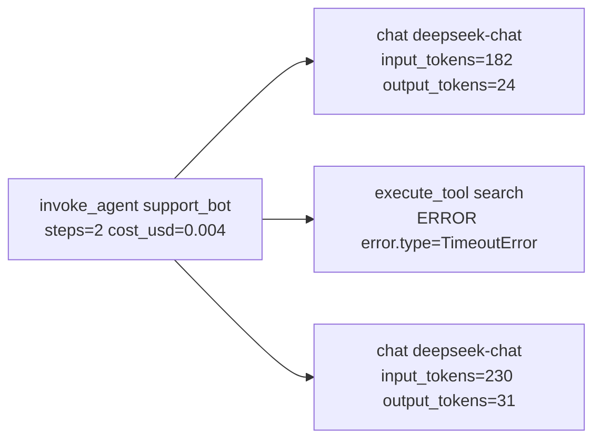

# 19 可观测性：从日志到 LLM Trace

> 一次回答背后是五次模型调用、三次工具调用、两次检索。没有 trace，你看到的只有最后那句话；出问题时在猜，没出问题时不知道花了多少钱。这一课讲怎么用五十行代码造一个 tracer，属性名对齐 OpenTelemetry 的 GenAI 约定，再把它按 OTLP 格式发出去。

## 为什么需要

只记录最终答案，无法知道慢在模型、工具、检索还是重试，也无法把成本和失败归因到租户。Trace 要覆盖一次运行的因果链。

## 学习目标

- 能把 print 换成带关联 id 的结构化日志，并解释为什么一行一个 JSON 比一行一句话有用
- 能实现一个最小 tracer，并说出 `record_exception` 和 `set_status` 为什么必须一起调
- 能用 OpenTelemetry GenAI 语义约定的属性名标注模型调用和工具调用
- 能从四种故障的 trace 里指出各自的信号

## 前置

- [07 Agent State 与 Runtime](../07-agent-state-and-runtime/README.md)：被观测的对象
- [17 评测](../18-evaluation/README.md)：评测集里的失败案例从 trace 里挑

## 心智模型



一次运行是一棵树。根 span 是这次运行，子 span 是每次模型调用和工具调用。这棵树回答四类问题：

- **哪一步慢了**：看每个 span 的耗时，工具超时的 span 耗时正好卡在超时值上。
- **哪一步错了**：看状态是 ERROR 的 span 和它上面的异常事件。
- **花了多少钱**：把 chat span 上的 token 属性加起来。
- **走了什么路**：子 span 的序列就是轨迹，重复的子 span 就是循环。

三个决定 trace 有用还是没用的细节：

**属性名用标准的。** OpenTelemetry 的 GenAI 语义约定规定了 `gen_ai.operation.name`、`gen_ai.provider.name`、`gen_ai.request.model`、`gen_ai.usage.input_tokens` 等名字，span 名规定为 `{operation} {model}`（如 `chat deepseek-chat`）、`execute_tool {tool}`、`invoke_agent {agent}`。用这些名字，Phoenix、Langfuse、任何 collector 都直接识别。

注意 `gen_ai.system` 和 `gen_ai.usage.prompt_tokens` / `completion_tokens` **已经废弃**，替代是 `gen_ai.provider.name` 和 `input_tokens` / `output_tokens`。

**出错时两个调用一起做。** `record_exception(exc)` 只是在 span 上加一个事件；`set_status("ERROR", msg)` 才改状态。**只做前者，UI 里这个 span 是绿的**，异常藏在事件列表里，没人会点开。

**运行时的语义不会自己出现在 trace 里。** 模型返回空字符串不抛异常，工具返回 4000 行不报错，同一个工具被调五次每次都成功。这些在 trace 里都是绿的，除非运行时主动打上属性。**标准属性给的是「发生了什么」，自定义属性给的是「这在我的系统里意味着什么」。**

日志和 trace 的关系：日志是线性的、每条独立、便于 grep 和聚合；trace 有父子关系、便于看一次运行的全貌。两者用同一个 `run_id` 关联，**缺一个都不完整**。


## 机制拆解

### 一、结构化日志：一行一个 JSON

```python
class JsonFormatter(logging.Formatter):
    def format(self, record) -> str:
        payload = {"ts": round(record.created, 3),
                   "level": record.levelname,
                   "event": record.getMessage()}
        payload.update(getattr(record, "fields", {}))    # 结构化字段搭 extra 的车
        return json.dumps(payload, ensure_ascii=False)

def log(logger, event: str, **fields) -> None:
    logger.info(event, extra={"fields": fields})
```

用起来是这样：

```python
log(logger, "model.call", run_id=run_id, step=step,
    latency_ms=round(elapsed * 1000, 2),
    input_tokens=reply.usage.input_tokens,
    output_tokens=reply.usage.output_tokens)
```

`event` 是一个**稳定的短标识**（`model.call`、`tool.call`、`run.finish`），不是一句话。稳定标识才能聚合：「过去一小时 `model.call` 的 p99 延迟」是个能查的问题，「过去一小时打印了『正在调用模型...』的次数」不是。

`run_id` 每一行都带。有了它，日志流才变成一次运行的故事。

### 二、五十行 tracer

```python
@dataclass
class Span:
    name: str
    span_id: str = field(default_factory=lambda: uuid.uuid4().hex[:16])
    parent_id: str | None = None
    attributes: dict = field(default_factory=dict)
    events: list[dict] = field(default_factory=list)
    status: str = "UNSET"           # UNSET | OK | ERROR
    start: float = field(default_factory=time.time)
    end: float | None = None

    def record_exception(self, exc: BaseException) -> None:
        """只加一个事件。不改状态 —— 那是另一个决定。"""
        self.events.append({"name": "exception",
                            "exception.type": type(exc).__name__,
                            "exception.message": str(exc)})

    def set_status(self, status: str, message: str = "") -> None:
        self.status, self.status_message = status, message
```

Tracer 用 `contextvars` 维护「当前是哪个 span」，这样嵌套关系自动成立：

```python
class Tracer:
    def __init__(self):
        self.spans: list[Span] = []
        self._current = contextvars.ContextVar("span", default=None)

    @contextmanager
    def span(self, name: str, **attributes):
        parent = self._current.get()
        span = Span(name=name,
                    parent_id=parent.span_id if parent else None,
                    attributes=dict(attributes))
        self.spans.append(span)
        token = self._current.set(span)
        try:
            yield span
        finally:
            span.end = time.time()
            self._current.reset(token)
```

用法：

```python
with tracer.span("invoke_agent support_bot",
                 **{"gen_ai.operation.name": "invoke_agent"}) as root:
    with tracer.span("execute_tool search",
                     **{"gen_ai.tool.name": "search"}) as ts:
        try:
            result = await run_tool(args)
        except Exception as exc:
            ts.record_exception(exc)
            ts.set_status("ERROR", str(exc))    # ← 这一行忘了，span 就是绿的
            raise
```

`contextvars` 有个坑：`asyncio.create_task` 会**复制**当前上下文（所以子任务能看到父 span），但线程池不会自动传播。SSE 生成器跨任务执行时，父 span 也要显式传。

### 三、四种故障在 trace 里的样子

**工具超时。** 工具 span 的耗时正好等于超时值，状态 ERROR，`error.type=TimeoutError`。最容易认的一种。

**模型空输出。** 模型返回空字符串，**没有异常，没有超时**。运行时必须自己检查：

```python
if not reply.content and not reply.tool_calls:
    span.set_attribute("aiapp.empty_output", True)
    span.set_status("ERROR", "model returned nothing")
```

没有这三行，这次运行在任何仪表盘上都是成功的。

**成本尖峰。** 工具返回了 4000 行没分页的结果，**这一轮**的工具 span 完全正常。异常出现在**下一轮** chat span 的 `gen_ai.usage.input_tokens`：从个位数变成几千。

成本问题几乎总是滞后一轮出现，所以要在根 span 上聚合：

```python
root.set_attribute("aiapp.cost_usd", total_input / 1000 * PRICE_IN
                                   + total_output / 1000 * PRICE_OUT)
```

**循环。** 五个 `execute_tool search` 子 span **全是 OK**，参数哈希全一样，根 span 以 step_limit 结束。单看任何一个 span 都没问题；要按 trace 数相同子 span 的个数。

### 四、OTLP 就是一个 JSON

```python
def build_payload() -> dict:
    trace_id = uuid.uuid4().hex
    root = make_span(trace_id, "invoke_agent support_bot", None,
                     {"gen_ai.operation.name": "invoke_agent",
                      "gen_ai.agent.name": "support_bot"}, status=1, ...)
    chat = make_span(trace_id, "chat deepseek-chat", root["spanId"],
                     {"gen_ai.operation.name": "chat",
                      "gen_ai.provider.name": "deepseek",
                      "gen_ai.request.model": "deepseek-chat",
                      "gen_ai.usage.input_tokens": 182,
                      "gen_ai.usage.output_tokens": 24}, status=1, ...)
    return {"resourceSpans": [{
        "resource": {"attributes": [{"key": "service.name",
                                     "value": {"stringValue": "my-agent"}}]},
        "scopeSpans": [{"scope": {"name": "my.tracer"}, "spans": [root, chat]}],
    }]}

# POST 到 {endpoint}/v1/traces，Content-Type: application/json
```

`status.code`：0 UNSET、1 OK、2 ERROR。属性值要包一层类型标签（`stringValue` / `intValue` / `doubleValue` / `boolValue`）。

**这段代码的价值是拆掉 SDK 的神秘感：OTLP 就是一个 JSON，属性名是唯一的契约。** 真实项目用 `opentelemetry-sdk` 加 `opentelemetry-exporter-otlp`，属性名一个都不用改。

## 常见错误

**只 `record_exception` 不 `set_status`。** 见第二节。这个坑的代价可能是几周的静默超时。

**模型空输出没人知道。** 见第三节。

**成本尖峰藏在下一轮。** 见第三节。

**循环在每一步都是成功的。** 见第三节。

**关联 id 断在异步边界。** `contextvars` 在 `create_task` 时会复制、在线程池里不会自动传，需要显式处理。

## 取舍

- **自制 tracer vs SDK。** 五十行自制版足够教学和小项目，没有依赖、行为完全可见。缺点是没有采样、批量导出、上下文跨 HTTP 传播这些成熟功能。**生产用 SDK，但先用自制版理解它在做什么。**
- **记多少内容。** `gen_ai.input.messages` 和 `gen_ai.output.messages` 可以把完整对话放进 span，排障极其方便，但涉及隐私、成本和后端存储。常见做法是默认只记 token 数和长度，按采样率或按用户开关记全文。
- **Phoenix 还是 Langfuse。** 两者都吃 OTLP，都能自托管。Phoenix 一条命令起本地实例、和评测结合紧；Langfuse 团队协作和 prompt 管理更强。**属性名标准化之后，换后端的成本是配置而不是代码。**
- **日志和 trace 二选一？** 不选。日志便宜、适合聚合和告警；trace 贵、适合看单次运行。

## 工程落地

- **span 属性放状态对象要走白名单。** 只放小的、稳定的字段。一个大状态对象序列化进去，每个 span 几十 KB，后端很快撑不住。
- **采样策略要按重要性分。** 错误的 trace 全采，正常的按比例采。别用统一采样率——出问题的那条正好没采到是常态。
- **成本要能按租户聚合。** `gen_ai.conversation.id` 和自定义的 `tenant_id` 属性都要打上。
- **trace 和评测要打通。** 从一条 trace 一键生成 golden case，是评测集能持续长大的关键（第 18 课）。

## 框架映射

| 本课概念 | LangGraph | OpenAI Agents SDK | Claude Agent SDK |
|---|---|---|---|
| 内置 tracing | 有（LangSmith，也可导出 OTEL） | 有（内置 tracing + exporter） | 需要自己接 |
| GenAI 语义约定 | 通过 OTEL 集成 | 自己映射 | 自己映射 |

三个框架的内置 tracing 都能用，但**属性名不一定符合标准约定**，换后端时要重新映射。官方文档：[OpenTelemetry GenAI 约定](https://github.com/open-telemetry/semantic-conventions-genai) · [LangGraph](https://langchain-ai.github.io/langgraph/) · [OpenAI Agents SDK](https://openai.github.io/openai-agents-python/)（核对日期 2026-09-05）。

## 一线经验

语音机器人项目的两个教训都写进了这一课。

第一个是 `record_exception` 不 `set_status` 的坑，代价是两周的静默超时——仪表盘全绿，用户在投诉。

第二个和事件驱动架构有关：每个处理步骤接收一类事件、产出另一类事件，代码里看不出「当前走到哪」，只有 trace 能回答。**在那个项目里 trace 不是排障工具，是理解系统运行方式的唯一途径。**

顺带一个细节：span 属性里放状态对象时做了白名单，否则后端存储很快撑不住。

## 练习

见 [exercises.md](./exercises.md)。

想看这一课的机制装进一个真实服务是什么样：参考实现的 [M5 生产化](https://github.com/lance2016/ai-app-engineering-ref/blob/main/project/m5-production/README.md)，OpenTelemetry 接线与故障演练。

## 延伸阅读

- [OpenTelemetry GenAI semantic conventions](https://github.com/open-telemetry/semantic-conventions-genai)（访问日期 2026-09-04）：`docs/gen-ai/gen-ai-spans.md` 是模型调用 span 的规范，`gen-ai-agent-spans.md` 是 `invoke_agent`、`execute_tool` 的规范。属性名的权威来源。
- [OpenTelemetry 属性注册表 · gen_ai](https://github.com/open-telemetry/semantic-conventions/blob/main/docs/registry/attributes/gen-ai.md)（访问日期 2026-09-04）：查哪些名字已废弃，以及把评测结果挂到 trace 上的 `gen_ai.evaluation.*`。
- [Arize Phoenix](https://github.com/Arize-ai/phoenix)（访问日期 2026-09-04）：`pip install arize-phoenix` 后 `phoenix serve` 就能接收 OTLP。
- [Langfuse](https://github.com/langfuse/langfuse)（访问日期 2026-09-04）：自托管用 docker compose，同样接 OTLP。
- [ai-agents-for-beginners · 10 AI Agents in Production](https://github.com/microsoft/ai-agents-for-beginners/blob/main/10-ai-agents-production/README.md)（访问日期 2026-09-04）：trace 和 span 的概念介绍，以及要跟踪的指标清单。

---

[← 上一课 18](../18-evaluation/README.md) · [下一课 20 →](../20-reliability-cost-llmops/README.md)
