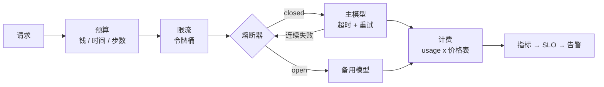

# 19 可靠性、成本、部署与 LLMOps

> 原型和生产跑的是同一个循环。不同的是循环外面那 80%：下游抖动时怎么不被拖死、配额怎么不被撞穿、钱怎么当场算清、坏了怎么回滚。这一课把这些包在循环外面的东西一个一个装上。

## 学习目标

- 能区分可重试和不可重试的失败，并实现带抖动的退避、单次超时和总次数上限
- 能在模型客户端前面加令牌桶限流和熔断器，在主模型故障时自动切到备用模型，并说清两者各防什么
- 能按请求计算成本、按租户归因、在运行时用预算停止失控的循环，并为服务定义 SLO、告警和一份故障演练清单
- 能写出一个 AI 服务的最小部署链：容器、CI、配置与密钥分离、灰度与回滚

## 前置

- [06 Agent 循环与控制流](../06-agent-loop/README.md)：预算和停止条件，本课把它扩展到钱和时间
- [07 Agent State 与 Runtime](../07-agent-state-and-runtime/README.md)：状态外置是水平扩展的前提
- [18 可观测性](../18-observability/README.md)：SLO 和告警建立在指标之上
- 前置模块 [P07 asyncio](../../prerequisites/python/07-asyncio/README.md)、[B03 Git、命令行与 Docker Compose](../../prerequisites/backend/03-git-cli-and-docker/README.md)

## 心智模型



每一层防一种不同的失败，顺序也有讲究：

| 层 | 防什么 | 没有它会怎样 |
|---|---|---|
| 超时 + 重试 | 单次调用挂住或偶发 5xx / 429 | 一个卡住的请求占着连接直到客户端放弃 |
| 令牌桶 | 自己把下游配额撞穿 | 突发流量换来一串 429，重试又加重突发 |
| 熔断器 | 下游持续故障时每个请求都等满超时 | 线程池被等待占满，健康的请求也进不来 |
| 备用模型 | 主供应商整体不可用 | 服务跟着供应商一起挂 |
| 成本预算 | 循环不收敛、上下文膨胀 | 月底看账单才知道 |
| SLO + 告警 | 缓慢劣化没人发现 | 用户先于你知道服务变差了 |

两个容易混的概念：**重试**处理的是"这次失败了，再试可能成功"；**熔断**处理的是"连续失败了，再试只会浪费时间"。重试在单个请求内部，熔断跨请求共享状态。两个都要有，顺序是熔断器包着重试。

ai-agents-for-beginners 第 16 课有一张"原型 vs 生产"的对照表，结论是模型大概只占生产 Agent 的 20%，其余是运维骨架。这一课就是那 80% 里和可靠性、成本、部署相关的部分；可观测性在第 18 课，安全在第 20 课。

## 最小可运行例子

| 文件 | 演示什么 | 运行 |
|---|---|---|
| [`code/01_timeout_retry_jitter.py`](./code/01_timeout_retry_jitter.py) | 失败分类；单次超时；full jitter 退避；不可重试的错误立刻放弃 | `uv run python lessons/19-reliability-cost-llmops/code/01_timeout_retry_jitter.py`，加 `INJECT_ALWAYS_FAIL=1` 或 `INJECT_BAD_REQUEST=1` |
| [`code/02_rate_limit_token_bucket.py`](./code/02_rate_limit_token_bucket.py) | 令牌桶让 12 个并发请求平滑通过一个每秒 5 次的下游 | 同上，加 `INJECT_NO_LIMIT=1` 看 7 个 429 |
| [`code/03_circuit_breaker_fallback.py`](./code/03_circuit_breaker_fallback.py) | closed / open / half-open 三态熔断器 + 主备模型路由；主模型恢复后电路自动闭合 | 同上，加 `INJECT_NO_BREAKER=1` 看每个请求都等满超时 |
| [`code/04_cost_budget.py`](./code/04_cost_budget.py) | 带日期的价格表；按模型归因；80% 告警；按任务分档路由；预算耗尽停止 | 同上，加 `INJECT_RUNAWAY=1` 看失控循环被预算截停 |

时间都缩放过（`SLEEP_SCALE`、`SCALE`），整套跑完不到一秒。读代码时把毫秒当秒看。

`03` 值得多看一眼输出：有熔断器时 30 个请求只有几次探测等在生病的主模型上，其余直接走备用；主模型恢复后，half-open 状态放过去一次探测成功，电路闭合，后面的请求又回到主模型。没有熔断器时，故障期间每个请求都要等满超时才切备用。

## 部署：容器、CI、配置与密钥、灰度与回滚

这一节没有可运行代码，因为它的验收在 CI 和部署平台上，不在本地。但每一项都有一个最小形态。

**容器。** 一个 Dockerfile 把 `uv sync` 的结果冻结成镜像。要点是分层缓存和不带密钥：

```dockerfile
FROM python:3.12-slim
COPY --from=ghcr.io/astral-sh/uv:latest /uv /usr/local/bin/uv
WORKDIR /app
COPY pyproject.toml uv.lock ./
RUN uv sync --frozen --no-dev --no-install-project
COPY . .
RUN uv sync --frozen --no-dev
CMD ["uv", "run", "uvicorn", "project.src.app:app", "--host", "0.0.0.0", "--port", "8080"]
```

`.env` 不进镜像，密钥在运行时通过环境变量或密钥管理服务注入。镜像里出现 API key 的那一刻，它就等于泄露了。

**CI。** 每次提交跑测试和评测门禁。本仓库的冒烟测试就是最小版本：

```yaml
# .github/workflows/ci.yml
on: [push, pull_request]
jobs:
  test:
    runs-on: ubuntu-latest
    steps:
      - uses: actions/checkout@v4
      - uses: astral-sh/setup-uv@v5
      - run: uv sync --all-groups
      - run: uv run pytest -q
      # 第 17 课的评测门禁加在这里：分数低于基线就让 PR 红掉
```

**配置与密钥分离。** 模型名、价格表、预算上限、限流参数是配置，随环境变化，放配置文件或配置中心；API key、数据库密码是密钥，放密钥管理服务。两者都不进代码。`04_cost_budget.py` 里的 `PRICES_USD_PER_M` 在真实服务里应该是从配置加载的，代码里那份只是为了让示例能跑。

**灰度与回滚。** 换模型版本、改系统提示、调检索参数，都算发布。先给 5% 流量，看第 18 课的指标和第 17 课的评测分数，没问题再放大。回滚的前提是上一个版本还在：镜像有 tag，提示词有版本号（第 03 课），配置有历史。一个改了提示词就无法回到上一版的系统，等于没有回滚能力。

## SLO 与告警

SLO 是对用户的承诺，用可测量的指标表达。AI 服务常用的几个：

| 指标 | 例子 | 为什么选它 |
|---|---|---|
| 可用性 | 99.5% 的请求返回非 5xx | 最基本的承诺 |
| 延迟 | p95 首 token 延迟 < 2s | 用户感知的是首 token，不是总时长 |
| 质量 | 评测集通过率 ≥ 92%（第 17 课） | AI 服务独有；线上抽样跑离线评测 |
| 成本 | 每千次会话成本 < 预算 | 成本超标也是服务劣化 |
| 降级率 | 走备用模型的请求 < 5% | 熔断在保护你，但也在给用户次一等的结果 |

告警建在 SLO 的消耗速度上，而不是单次指标上。p95 偶尔越线不值得半夜叫人，但一小时内把一个月的错误预算烧掉一半就值得。Google SRE 手册对这套方法有完整描述，见延伸阅读。

## 故障演练清单

上线前每一项都手动触发一次，确认系统的反应是你设计的那个，不是"看看会怎样"：

1. 主模型返回 429 持续一分钟：熔断应打开，流量走备用，告警应触发，恢复后电路应闭合
2. 主模型延迟从 1s 涨到 10s：超时应生效，p95 告警应触发，用户应看到降级而不是等待
3. 数据库或 Redis 不可用：请求应快速失败并给出可理解的错误，不是挂着
4. 某个工具持续超时：Agent 循环应按第 06 课的失败路由处理，不能把每个请求都拖到步数上限
5. 一个租户的流量突增十倍：限流应只影响这个租户，其他租户的 SLO 不变
6. 价格表更新后成本预算的行为：告警阈值应随之调整
7. 回滚到上一个镜像：五分钟内完成，回滚后的评测分数应回到基线

第 18 课的四个故障实验是这份清单的可观测性部分。

## 常见错误与失败注入

**重试所有异常。** `01` 里 `BadRequest` 不重试。参数错、鉴权错、模型不存在，重试一百次结果一样，只是把一个明确的错误拖成了一个超时。

**重试没有抖动。** 一千个客户端在同一秒失败，一起等 1 秒，一起重试，下游在第二秒又被打垮。full jitter 让每个客户端等 0 到上限之间的随机时间，把尖峰摊平。

**令牌桶容量等于下游限额。** `02` 默认 `capacity=1`。把它改成 5 再跑，会看到几个 429：桶允许 5 个突发，紧接着又以每秒 5 个的速度放行，滑动窗口里就是 10 个。练习 2 让你亲自试。

**预算在步前检查。** `04` 里 `INJECT_RUNAWAY=1` 的输出显示花了 0.054 却只有 0.05 预算。检查发生在每步开始时，所以最多超出一步的钱。这在设计上是可接受的，前提是你知道单步最大花费并留了余量。

**熔断器没有 half-open。** 只有 open 和 closed 两态的熔断器，要么永远不恢复，要么恢复时一次放进全部流量把刚好转的下游再打倒。half-open 只放一个探测。

## 取舍

- **重试次数与延迟预算。** 每次重试都在花用户的等待时间。面向用户的实时对话通常只允许一次重试，后台任务可以多试几次。重试策略应是按调用类型配置的，不是全局常量。
- **备用模型的质量。** 备用通常更便宜也更弱。切到备用后回答质量下降，用户是否能接受、是否要告知，是产品决定。降级率进 SLO 的原因就在这里。
- **限流放在哪一层。** 按全局限保护下游配额，按租户限保护其他租户，按用户限防滥用。三层都要，但每层的参数来源不同。
- **自建还是托管。** 容器、CI、灰度这套东西，云平台的托管服务都能替你做。托管省人力，自建省钱且不被锁定。团队小的时候托管几乎总是对的，这一点和第 21 课"API 还是自己的 GPU"是同一类判断。

## 练习

见 [exercises.md](./exercises.md)。

## 对照真实项目

主项目 [M5.3](../../project/m5-production/README.md) 把本课四个文件放进 [`aiapp/ops/`](../../project/src/aiapp/ops/)：`01` 是 `resilience.with_timeout_retry()`，`02` 是 `ratelimit.py` 的每租户令牌桶（Redis 用 Lua 原子执行），`03` 是 `CircuitBreaker` 加 `FallbackAdapter`（流式只在首块前切换），`04` 是 `cost.py` 的带日期价格表和日预算，超限 402、超频 429。本课"部署"一节是 M5.4：`Dockerfile`、`docker-compose.prod.yml`、`/readyz`、生产配置校验。故障演练清单的六条在 `scripts/chaos.py` 里每次 CI 都跑。

语音机器人项目的一个经验：早期模型调用没有熔断，供应商一次十分钟的故障期间每个用户请求都等满 15 秒超时再失败，机器人在用户面前"发呆"，比直接说"我现在有点问题"糟糕得多。加了熔断和备用模型后，故障期间用户听到的是备用模型稍显生硬的回答，但响应时间正常。另一个经验和成本有关：一个多轮玩法的循环在特定用户输入下不收敛，每轮都带完整历史，直到步数上限才停。按会话计费加上 80% 告警之后，这类问题在发生的当天就能看到，而不是在账单上。

## 延伸阅读

- [ai-agents-for-beginners · 16 Deploying Scalable Agents](https://github.com/microsoft/ai-agents-for-beginners/blob/main/16-deploying-scalable-agents/README.md)（访问日期 2026-09-04）："原型 vs 生产"对照表和 Scaling Strategies 一节值得读，Hands-on Lab 绑定 Azure 可以跳过。
- [12-factor-agents · factor 06 Launch/Pause/Resume](https://github.com/humanlayer/12-factor-agents/blob/main/content/factor-06-launch-pause-resume.md) 与 [factor 11 Trigger from anywhere](https://github.com/humanlayer/12-factor-agents/blob/main/content/factor-11-trigger-from-anywhere.md)（访问日期 2026-09-04）：Agent 作为可以被任何渠道触发、跑几十分钟的程序，对可靠性提出的要求。
- [Google SRE Book · Service Level Objectives](https://sre.google/sre-book/service-level-objectives/)（访问日期 2026-09-04）：SLI、SLO、错误预算的原始定义，本课 SLO 一节的方法来源。
- 各供应商的限流文档，读一遍知道自己面对的限额形态：[DeepSeek Rate Limit](https://api-docs.deepseek.com/quick_start/rate_limit)、[OpenAI Rate limits](https://platform.openai.com/docs/guides/rate-limits)、[Anthropic Rate limits](https://platform.claude.com/docs/en/api/rate-limits)（访问日期均为 2026-09-04）。注意 DeepSeek 文档里的 keep-alive 机制：非流式请求会持续返回空行防止连接超时，自己解析 HTTP 时要处理。
- [Dockerfile reference](https://docs.docker.com/reference/dockerfile/) 与 [GitHub Actions quickstart](https://docs.github.com/en/actions/writing-workflows/quickstart)（访问日期 2026-09-04）：部署一节两个片段的语法来源。

---

[← 上一课 18](../18-observability/README.md) · [下一课 20 →](../20-security-governance/README.md)
