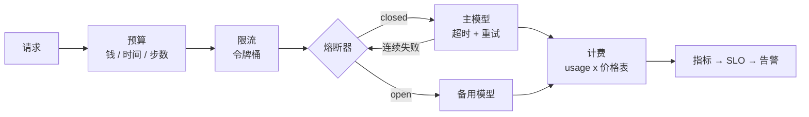

# 20 可靠性、成本、部署与 LLMOps

> 原型和生产跑的是同一个循环。不同的是循环外面那一大圈：下游抖动时怎么不被拖死、配额怎么不被撞穿、钱怎么当场算清、坏了怎么回滚。这一课把这些包在循环外面的东西一个一个装上。

## 为什么需要

供应商抖动、突发流量和失控循环，会把一次模型调用变成超时、重试和账单尖峰。可靠性是循环外的控制面，不是部署结束后才补的装饰。

## 学习目标

- 能区分可重试和不可重试的失败，并实现带抖动的退避、单次超时和总次数上限
- 能在模型客户端前面加令牌桶限流和熔断器，在主模型故障时自动切到备用模型，并说清两者各防什么
- 能按请求计算成本、按租户归因、在运行时用预算停止失控的循环
- 能写出一个 AI 服务的最小部署链：容器、CI、配置与密钥分离、灰度与回滚

## 前置

- [06 Agent 循环与控制流](../06-agent-loop/README.md)：预算和停止条件，本课把它扩展到钱和时间
- [19 可观测性](../19-observability/README.md)：SLO 和告警建立在指标之上

## 心智模型



每一层防一种不同的失败，顺序也有讲究：

| 层 | 防什么 | 没有它会怎样 |
|---|---|---|
| 超时 + 重试 | 单次调用挂住或偶发 5xx / 429 | 一个卡住的请求占着连接直到客户端放弃 |
| 令牌桶 | 自己把下游配额撞穿 | 突发流量换来一串 429，重试又加重突发 |
| 熔断器 | 下游持续故障时每个请求都等满超时 | 线程池被等待占满，健康的请求也进不来 |
| 备用模型 | 主供应商整体不可用 | 服务跟着供应商一起挂 |
| 成本预算 | 循环不收敛、上下文膨胀 | 月底看账单才知道 |
| SLO + 告警 | 缓慢劣化没人发现 | 用户先于你知道服务变差了 |

两个容易混的概念：**重试**处理的是「这次失败了，再试可能成功」；**熔断**处理的是「连续失败了，再试只会浪费时间」。重试在单个请求内部，熔断跨请求共享状态。两个都要有，顺序是**熔断器包着重试**。

这一课比别的长，内容是三块，**可以分三次读**：

| 块 | 小节 | 回答的问题 |
|---|---|---|
| A 运行时可靠性 | 机制拆解一到三 | 下游抖了、挂了、慢了，怎么不被拖死 |
| B 成本与 SLO | 机制拆解四、SLO 与告警 | 钱怎么当场算清，服务变差了谁先知道 |
| C 部署与演练 | 部署与发布、故障演练清单 | 怎么上线、怎么回滚、怎么在演练里先坏一次 |

A 是其余两块的前提，B 和 C 谁先读都行。

## 机制拆解

### 一、失败分类决定要不要重试

```python
class RateLimited(Exception):
    """HTTP 429。可重试，最好遵守 Retry-After。"""

class UpstreamError(Exception):
    """HTTP 5xx。可重试。"""

class BadRequest(Exception):
    """429 之外的 4xx。不可重试：请求本身就是错的。"""

RETRYABLE = (TimeoutError, RateLimited, UpstreamError)
```

退避要带抖动：

```python
def backoff(attempt: int, base: float, cap: float) -> float:
    """full jitter：在 0 到 min(cap, base * 2**attempt) 之间均匀取。"""
    return random.uniform(0, min(cap, base * (2 ** attempt)))

async def call_with_retry(fn, attempts, per_attempt_timeout, base, cap) -> str:
    for attempt in range(attempts):
        try:
            return await asyncio.wait_for(fn(), timeout=per_attempt_timeout)   # 每次都有 deadline
        except RETRYABLE as exc:
            if attempt == attempts - 1:
                raise
            await asyncio.sleep(backoff(attempt, base=base, cap=cap))
        except BadRequest:
            raise            # ← 不重试，立刻放弃
    ...
```

`random.uniform(0, ...)` 是重点，不是 `base * 2**attempt` 本身。一千个客户端在同一秒失败，如果都等固定的 1 秒，下游在第二秒又被打垮一次。full jitter 把这个尖峰摊平。

`per_attempt_timeout` 也不能省。只设总超时的话，一次挂住的调用会把所有重试机会都耗光。

### 二、令牌桶：容量决定突发行为

```python
class TokenBucket:
    """每秒补 rate 个令牌，上限 capacity。acquire() 等到有令牌为止。"""
    def __init__(self, rate: float, capacity: int):
        self.rate, self.capacity = rate, capacity
        self.tokens = float(capacity)
        self.updated = time.monotonic()
        self._lock = asyncio.Lock()

    async def acquire(self) -> None:
        async with self._lock:
            while True:
                now = time.monotonic()
                self.tokens = min(self.capacity,
                                  self.tokens + (now - self.updated) * self.rate)
                self.updated = now
                if self.tokens >= 1:
                    self.tokens -= 1
                    return
                await asyncio.sleep((1 - self.tokens) / self.rate)
```

`capacity` 有个反直觉的地方：**它不该等于下游的限额**。

下游限每秒 5 次（滑动窗口），你把 `capacity` 设成 5：桶一开始满的，5 个请求瞬间放行，紧接着又以每秒 5 个的速度补，一秒的滑动窗口里就是 10 个——照样 429。

`capacity=1` 才是平滑的：永远不突发，严格按 `rate` 放行。要允许一点突发时，`capacity` 要按下游的窗口长度算，不能照抄限额数字。

### 三、熔断器必须有三态

```python
class State(StrEnum):
    CLOSED    = "closed"      # 正常
    OPEN      = "open"        # 故障中，跳过主路
    HALF_OPEN = "half_open"   # 冷却结束，放一个探测

class CircuitBreaker:
    def allow(self) -> bool:
        if self.state == State.OPEN and \
           time.monotonic() - self.opened_at >= self.recovery_timeout:
            self.state = State.HALF_OPEN
        return self.state != State.OPEN

    def record_success(self) -> None:
        self.state, self.failures = State.CLOSED, 0

    def record_failure(self) -> None:
        self.failures += 1
        if self.state == State.HALF_OPEN or self.failures >= self.failure_threshold:
            self.state, self.opened_at = State.OPEN, time.monotonic()
```

`record_failure` 里 `self.state == State.HALF_OPEN` 那个条件很关键：**探测失败立刻重新打开**，不等再攒够阈值。

只有 open / closed 两态的熔断器，要么永远不恢复，要么恢复时一次放进全部流量，把刚好转的下游再打倒一次。

配上路由：

```python
async def complete(self, messages) -> ModelResponse:
    if self.breaker is None or self.breaker.allow():
        try:
            reply = await asyncio.wait_for(self.primary.complete(messages), PRIMARY_TIMEOUT)
            self.breaker.record_success()
            return reply
        except RETRYABLE:              # ← 只有「主模型这边不行」才算熔断失败
            self.breaker.record_failure()
        except BadRequest:
            raise                      # ← 请求本身就是错的，换个模型一样错
    return await self.fallback.complete(messages)      # 快速失败后走备用
```

**这里的异常分类和第一节是同一套，不能图省事写成 `except Exception`。** 那样写有两个后果：一个参数拼错导致的 400 会被记成主模型故障，攒够阈值就把健康的主模型熔断掉；同时这个错误会被「降级」成备用模型的一次调用，掩盖掉真正的 bug。熔断器统计的必须是「这个依赖不可用」，不是「这次请求失败了」。

效果差别很大：有熔断器时，故障期间 30 个请求只有几次探测等在生病的主模型上；没有熔断器时，**每个请求都要等满超时**才切备用。

### 四、成本：价格表带日期，预算在运行时生效

```python
# USD / 1M tokens。示例数字，截至 2026-09-04；每家都会变。
# 真实服务从配置加载，并把日期记在旁边。
PRICES_USD_PER_M = {
    "small-fast":  {"in": 0.15, "out": 0.60},
    "large-smart": {"in": 2.50, "out": 10.00},
}

@dataclass
class CostMeter:
    budget_usd: float
    warn_at: float = 0.8
    spent_usd: float = 0.0
    by_model: dict[str, float] = field(default_factory=dict)

    def charge(self, model: str, usage) -> float:
        price = PRICES_USD_PER_M[model]
        cost = (usage.input_tokens * price["in"]
              + usage.output_tokens * price["out"]) / 1_000_000
        self.spent_usd += cost
        self.by_model[model] = self.by_model.get(model, 0.0) + cost
        if not self.warned and self.spent_usd >= self.warn_at * self.budget_usd:
            self.warned = True
            alert(f"{self.spent_usd / self.budget_usd:.0%} of budget used")
        return cost

    @property
    def exhausted(self) -> bool:
        return self.spent_usd >= self.budget_usd
```

循环里在**每步开始前**检查：

```python
for step, task in enumerate(tasks, 1):
    if meter.exhausted:
        stop(f"budget ${meter.budget_usd:.2f} exhausted at step {step}")
        break
    model = pick_model(task)            # 分类任务走小模型，开放任务走大模型
    meter.charge(model, call(model, task).usage)
```

所以它**最多会超出一步的钱**。这在设计上可以接受，前提是你知道单步最大花费并留了余量。想严格不超，就要预估这一步的成本再决定要不要执行，代价是预估不准时会过早停止。

`by_model` 的归因很有用：一次运行花超了，是大模型调多了还是小模型上下文爆了，看这张表就知道。

## 部署：容器、CI、配置与密钥、灰度与回滚

**容器。** 一个 Dockerfile 把依赖冻结成镜像。要点是分层缓存和**不带密钥**：

```dockerfile
FROM python:3.12-slim
COPY --from=ghcr.io/astral-sh/uv:latest /uv /usr/local/bin/uv
WORKDIR /app
COPY pyproject.toml uv.lock ./
RUN uv sync --frozen --no-dev --no-install-project    # 依赖单独一层，代码变了不重装
COPY . .
RUN uv sync --frozen --no-dev
CMD ["uv", "run", "uvicorn", "app:app", "--host", "0.0.0.0", "--port", "8080"]
```

`.env` 不进镜像。**镜像里出现 API key 的那一刻，它就等于泄露了**——镜像会被推到仓库、被拉到很多机器、被 `docker history` 看到。

**CI。** 每次提交跑测试和评测门禁（第 18 课）。分数低于基线就让 PR 红掉。

**配置与密钥分离。** 模型名、价格表、预算上限、限流参数是**配置**，随环境变化，放配置文件或配置中心；API key、数据库密码是**密钥**，放密钥管理服务。两者都不进代码。

**灰度与回滚。** 换模型版本、改系统提示、调检索参数，**都算发布**。先给 5% 流量，看第 19 课的指标和第 18 课的评测分数，没问题再放大。

回滚的前提是上一个版本还在：镜像有 tag，提示词有版本号（第 03 课），配置有历史。**一个改了提示词就无法回到上一版的系统，等于没有回滚能力。**

## SLO 与告警

SLO 是对用户的承诺，用可测量的指标表达：

| 指标 | 例子 | 为什么选它 |
|---|---|---|
| 可用性 | 99.5% 的请求返回非 5xx | 最基本的承诺 |
| 延迟 | p95 首 token 延迟 < 2s | 用户感知的是首 token，不是总时长 |
| 质量 | 评测集通过率 ≥ 92%（第 18 课） | AI 服务独有；线上抽样跑离线评测 |
| 成本 | 每千次会话成本 < 预算 | 成本超标也是服务劣化 |
| 降级率 | 走备用模型的请求 < 5% | 熔断在保护你，但也在给用户次一等的结果 |

**告警建在 SLO 的消耗速度上**，而不是单次指标上。p95 偶尔越线不值得半夜叫人，但一小时内把一个月的错误预算烧掉一半就值得。

## 故障演练清单

上线前每一项都手动触发一次，确认系统的反应**是你设计的那个**，不是「看看会怎样」：

1. 主模型返回 429 持续一分钟：熔断应打开，流量走备用，告警应触发，恢复后电路应闭合
2. 主模型延迟从 1s 涨到 10s：超时应生效，p95 告警应触发，用户应看到降级而不是等待
3. 数据库或 Redis 不可用：请求应快速失败并给出可理解的错误，不是挂着
4. 某个工具持续超时：Agent 循环应按第 06 课的失败路由处理，不能把每个请求都拖到步数上限
5. 一个租户的流量突增十倍：限流应只影响这个租户，其他租户的 SLO 不变
6. 回滚到上一个镜像：五分钟内完成，回滚后的评测分数应回到基线

## 常见错误

**重试所有异常。** 参数错、鉴权错、模型不存在，重试一百次结果一样，只是把一个明确的错误拖成了一个超时。

**重试没有抖动。** 见第一节。

**令牌桶容量等于下游限额。** 见第二节。

**熔断器没有 half-open。** 见第三节。

**预算只在请求开始时检查一次。** 见第四节。

## 取舍

- **重试次数与延迟预算。** 每次重试都在花用户的等待时间。面向用户的实时对话通常只允许一次重试，后台任务可以多试几次。**重试策略应是按调用类型配置的，不是全局常量。**
- **备用模型的质量。** 备用通常更便宜也更弱。切到备用后回答质量下降，用户是否能接受、是否要告知，是产品决定。降级率进 SLO 的原因就在这里。
- **限流放在哪一层。** 按全局限保护下游配额，按租户限保护其他租户，按用户限防滥用。三层都要，但每层的参数来源不同。
- **自建还是托管。** 容器、CI、灰度这套东西，云平台的托管服务都能替你做。托管省人力，自建省钱且不被锁定。团队小的时候托管几乎总是对的。

## 工程落地

- **每个外部依赖一个独立的熔断器实例。** 共用一个，向量库挂了会把模型调用也一起断掉。熔断器的状态是按依赖分的，不是按服务分的。
- **价格表是带生效日期的配置，不是代码里的常量。** 供应商调价之后，新调用按新价算，历史账单不能被改写——否则上个月的成本报表每天都在变。
- **灰度按租户切，不按流量百分比切。** 按百分比切会让同一个用户在新旧版本之间来回跳，行为不一致比慢更让人困惑。
- **配置和密钥分两条路。** 配置可以进镜像和代码库，密钥只能运行时注入。这条界线一旦破了，回滚一个旧镜像就可能把已经轮换掉的密钥带回线上。
- **怎么测。** 故障演练要能在 CI 里跑，不是一份手工操作手册：把下游换成会超时、会返 429、会吐坏 JSON 的假实现，断言熔断器如期打开、fallback 生效、并且账单记录仍然完整。演练写成测试才会被持续执行。

## 框架映射

| 本课概念 | LangGraph | OpenAI Agents SDK | Claude Agent SDK |
|---|---|---|---|
| 重试 | 节点级 retry policy | 自己包 | 自己包 |
| 熔断 / 限流 | 自己写 | 自己写 | 自己写 |
| 成本记账 | 从 usage 自己算 | `RunResult` 的 usage | 消息带 usage |

**这一层三个框架基本都不管。** 它是你自己的控制面，也是原型和生产的真正分界。官方文档：[LangGraph](https://langchain-ai.github.io/langgraph/) · [OpenAI Agents SDK](https://openai.github.io/openai-agents-python/) · [Claude Agent SDK](https://docs.claude.com/en/api/agent-sdk/overview)（核对日期 2026-09-05）。

## 一线经验

语音机器人项目早期模型调用没有熔断。供应商一次十分钟的故障期间，每个用户请求都等满 15 秒超时再失败，机器人在用户面前「发呆」——**这比直接说「我现在有点问题」糟糕得多**。加了熔断和备用模型后，故障期间用户听到的是备用模型稍显生硬的回答，但响应时间正常。

另一个经验和成本有关：一个多轮玩法的循环在特定用户输入下不收敛，每轮都带完整历史，直到步数上限才停。按会话计费加上 80% 告警之后，这类问题**在发生的当天就能看到**，而不是在账单上。

## 参考实现

想看这一课的机制装进一个真实服务是什么样：参考实现的 [M5 生产化](https://github.com/lance2016/ai-app-engineering-ref/blob/main/project/m5-production/README.md)，限流、fallback、成本统计与容器化。

## 延伸阅读

- [Google SRE Book · Service Level Objectives](https://sre.google/sre-book/service-level-objectives/)（访问日期 2026-09-04）：SLI、SLO、错误预算的原始定义，本课 SLO 一节的方法来源。
- [AWS Architecture Blog · Exponential Backoff and Jitter](https://aws.amazon.com/blogs/architecture/exponential-backoff-and-jitter/)（访问日期 2026-09-05）：full jitter 的出处，有对比实验数据。
- 各供应商的限流文档，读一遍知道自己面对的限额形态：[DeepSeek Rate Limit](https://api-docs.deepseek.com/quick_start/rate_limit)、[OpenAI Rate limits](https://platform.openai.com/docs/guides/rate-limits)、[Anthropic Rate limits](https://platform.claude.com/docs/en/api/rate-limits)（访问日期均为 2026-09-04）。注意 DeepSeek 的 keep-alive 机制：非流式请求会持续返回空行防止连接超时，自己解析 HTTP 时要处理。
- [ai-agents-for-beginners · 16 Deploying Scalable Agents](https://github.com/microsoft/ai-agents-for-beginners/blob/main/16-deploying-scalable-agents/README.md)（访问日期 2026-09-04）：「原型 vs 生产」对照表和 Scaling Strategies 一节。
- [Dockerfile reference](https://docs.docker.com/reference/dockerfile/)（访问日期 2026-09-04）：部署一节那个片段的语法来源。

---

[← 上一课 19](../19-observability/README.md) · [下一课 21 →](../21-security-governance/README.md)
