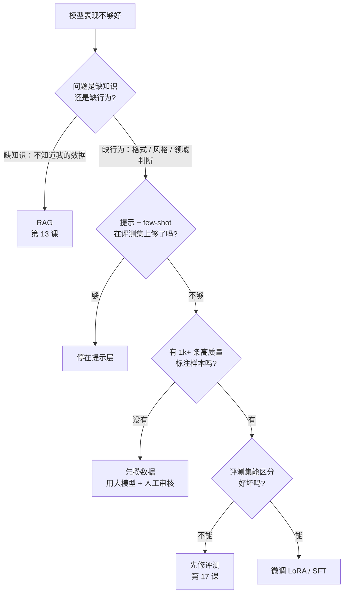

# 21 模型适配、微调与推理服务

> 应用工程师不需要会训练模型，但需要在"改提示、加检索、微调、换模型、自己部署"之间做决定，并且能算清每个选择的显存、延迟和钱。这一课给的是决策框架和两个计算器，不是训练教程。

## 学习目标

- 能用一棵决策树判断一个质量问题该用提示、RAG 还是微调解决，并说出微调的前置条件
- 能估算一个模型在给定精度、批大小和上下文长度下的显存，解释 KV cache 和 GQA 为什么决定了能不能服务长上下文
- 能算出托管 API 和自建 GPU 的成本临界点，并列出临界点之外还要考虑的因素

## 前置

- [01 LLM 工作原理与能力边界](../01-how-llms-work/README.md)：attention、上下文窗口、token
- [17 评测](../17-evaluation/README.md)：没有评测集就无法判断微调有没有用
- [19 可靠性、成本、部署与 LLMOps](../19-reliability-cost-llmops/README.md)：成本核算和部署链
- [Track · LLM 原理补课](../../tracks/llm-internals/README.md)：想深入 LoRA 和量化的数学再去那里

## 心智模型

### 决策树：改哪一层

三条判断规则：

1. **知识问题不要微调。** 微调不能可靠地让模型记住事实，还会随着数据变化过期。新知识、私有数据、需要引用来源的，走 RAG。
2. **微调解决的是行为。** 固定的输出格式、领域术语的使用、特定的判断倾向（比如客服话术的克制程度）、把一个大模型的能力压进一个小模型。这些是提示词写再长也不稳定、但几千条样本能教会的东西。
3. **微调的前置条件是评测集。** 没有评测集，你无法知道微调后是好了还是坏了，也无法知道是不是提示词稍微改一下就够了。llm-course 把评测放在微调之前不是偶然。

### LoRA 一段话

全量微调要更新全部参数，70B 模型的梯度和优化器状态需要几百 GB 显存。LoRA 的观察是：微调带来的参数变化是低秩的。它冻结原始权重 W，在旁边加两个小矩阵 A（d×r）和 B（r×d），r 通常是 8 到 64，训练时只更新 A 和 B。前向计算变成 W·x + B·A·x。参数量从 d² 降到 2dr，显存需求随之降一到两个数量级，训练完可以把 B·A 合并回 W，推理零开销。代价是表达能力受 r 限制，适合"调行为"，不适合"学大量新知识"。这和上面的决策树是一致的。

### 推理：延迟和显存从哪来

一次生成分两个阶段。**Prefill** 把整个提示一次算完，计算密集，耗时和提示长度成正比，决定首 token 延迟。**Decode** 每步生成一个 token，每步都要读一遍全部权重，访存密集，耗时和输出长度成正比，决定 token 之间的间隔。

Decode 每步都要用到前面所有 token 的 key 和 value，重复计算太贵，所以缓存起来，这就是 **KV cache**。它的大小是 2 × 层数 × kv 头数 × 头维度 × 精度字节 × 序列长度 × 批大小。序列一长、批一大，它就超过权重本身。**GQA**（分组查询注意力）让多个查询头共用一组 kv 头，把 kv 头数从 32 降到 8 或 4，KV cache 直接缩到四分之一到八分之一。这是现在 8B 模型能服务 32k 上下文的原因。

**量化**把权重从 fp16 的 2 字节压到 int8 的 1 字节或 int4 的 0.5 字节，显存减半再减半，访存带宽需求同比下降，decode 变快。代价是质量小幅下降，int8 几乎无损，int4 在多数任务上可接受，在数学和代码上更明显。注意量化的通常只是权重，KV cache 默认还是 fp16，除非推理引擎专门支持 KV cache 量化。

### vLLM 还是 llama.cpp

| | vLLM | llama.cpp |
|---|---|---|
| 目标场景 | 服务器，多用户并发 | 单机、边缘、CPU 或消费级 GPU |
| 核心技术 | PagedAttention 管理 KV cache，连续批处理 | GGUF 量化格式，CPU / Metal / CUDA 后端 |
| 吞吐 | 高，批越大越划算 | 低，为单用户延迟优化 |
| 部署形态 | OpenAI 兼容的 HTTP 服务 | 命令行或嵌入进程；也有兼容服务 |
| 适合 | 自建推理集群 | 本地开发、隐私敏感的端侧、演示 |

两者都提供 OpenAI 兼容接口，所以第 00 课的 adapter 换个 base URL 就能接。这也是为什么课程一直强调协议兼容：换推理后端不该改业务代码。

## 最小可运行例子

| 文件 | 演示什么 | 运行 |
|---|---|---|
| [`code/01_memory_estimator.py`](./code/01_memory_estimator.py) | 权重 + KV cache 两项显存估算；对比 fp16 / int8 / int4；对比 GQA 和 MHA；批 8 × 32k 上下文时 KV 超过权重 | `uv run python lessons/21-model-adaptation-finetuning-inference/code/01_memory_estimator.py`，加 `INJECT_IGNORE_KV=1` 看忘掉 KV cache 的估算有多离谱 |
| [`code/02_cost_breakeven.py`](./code/02_cost_breakeven.py) | 托管 API 每百万 token 价格 vs 自建 GPU 按利用率折算的价格；临界月流量；利用率敏感性 | 同上，加 `UTILISATION=0.2` 看 GPU 大半时间空转时的价格 |

两个文件里的数字全是**带日期的假设**（2026-09-04），模型结构以各模型的 `config.json` 为准，价格以当天的价格表为准。它们的价值在公式，不在数字。

`01` 的输出里有两行值得对比：8B GQA 模型在 fp16 下权重约 15G、8 路 32k 上下文的 KV cache 约 32G；同样大小的模型如果用 MHA（32 个 kv 头），KV cache 是 128G。这就是为什么模型卡上的 kv 头数比参数量更能决定它能不能在你的卡上服务长上下文。

## 常见错误与失败注入

**只算权重不算 KV cache。** `INJECT_IGNORE_KV=1` 之后 70B int4 看起来 33G 就够，能塞进一张 80G 卡跑 8 路 32k。实际再加 80G 的 KV cache。这是自建推理最常见的容量误判。

**用峰值利用率算成本。** `02` 默认 60% 利用率，改成 20%（大多数内部工具的真实水平），自建的每 token 成本翻三倍。GPU 是按小时付费的，空转的小时和满载的小时一样贵。

**拿微调解决知识问题。** 微调了三千条产品文档问答，模型学会了文档的"语气"，但事实仍然编。因为微调改的是权重分布，不是一个可以精确检索的存储。

**没有评测集就开始微调。** 微调完看几个例子觉得"好像好了"，上线后发现另一类问题变差了。第 17 课在这一课之前，是有意的顺序。

## 取舍

- **微调的小模型 vs 提示的大模型。** 微调后的 7B 在特定任务上可以追平大模型，成本和延迟低一个量级，但每次任务定义变化都要重训。任务稳定、量大时值得；任务还在变时不值得。
- **量化精度。** int8 几乎总是值得的；int4 要在自己的评测集上验，尤其是数学、代码、多语言。质量下降不均匀，平均分掩盖了某些切片的崩塌。
- **自建的隐性成本。** `02` 算的是 GPU 小时费。没算的是搭建和维护推理服务的工程师、值班、模型升级、容量规划、故障切换用的第二张卡。这些通常比 GPU 本身贵。临界点计算器给出的是"自建可能划算"的必要条件，不是充分条件。
- **锁定。** 托管 API 换供应商只改 adapter；自建换推理引擎也只改 adapter，但换硬件不是。协议兼容保护的是代码，不是采购。

## 练习

见 [exercises.md](./exercises.md)。

## 对照真实项目

这一课的产出是选型决策，落在设计型里程碑 [M6](../../project/m6-platform-design/README.md)：为多租户平台写"模型与推理选型"一节，用 `01` 估算候选模型的显存，用 `02` 算平台预期流量下的临界点，结论要带日期和假设。

语音机器人项目的经验：意图分类这个任务最终用的是一个针对命令集微调过的小模型，而不是通用大模型加长提示。原因是三条：任务定义稳定（命令集半年不变）、有大量真实对话可以标注、延迟要求苛刻（用户说完话到设备动作要在一秒内）。但同一个项目里的闲聊部分一直用通用大模型加提示，因为"聊得好"的定义在变，微调追不上。同一个系统里两种选择并存，判断依据就是上面那棵决策树。

## 延伸阅读

- [llm-course · The LLM Engineer](https://github.com/mlabonne/llm-course)（访问日期 2026-09-04）：README 里 Engineer 路线的 Inference optimization 和 Deploying LLMs 两节，本课推理部分的取舍框架来源，链接了 Flash Attention、MQA/GQA、speculative decoding 的原始资料。
- [LLMs-from-scratch · ch05](https://github.com/rasbt/LLMs-from-scratch/blob/main/ch05/README.md)、[ch06](https://github.com/rasbt/LLMs-from-scratch/blob/main/ch06/README.md)、[ch07](https://github.com/rasbt/LLMs-from-scratch/blob/main/ch07/README.md)（访问日期 2026-09-04）：预训练、分类微调、指令微调的从零实现。想知道微调在代码层面是什么就读这三章，Track · LLM 原理补课按它的顺序组织。
- [LoRA: Low-Rank Adaptation of Large Language Models](https://arxiv.org/abs/2106.09685)（访问日期 2026-09-04）：原始论文，第 4 节的方法描述一页就够。
- [vLLM 文档](https://docs.vllm.ai/en/latest/) 与 [llama.cpp](https://github.com/ggml-org/llama.cpp)（访问日期 2026-09-04）：两个推理引擎的入口。vLLM 首页的 PagedAttention 一段解释了它怎么管理 KV cache。
- [ai-agents-for-beginners · 17 Creating Local AI Agents](https://github.com/microsoft/ai-agents-for-beginners/blob/main/17-creating-local-ai-agents/README.md)（访问日期 2026-09-04）：小模型在本地做 Agent 的场景和"云端加本地"的混合模式，绑定微软工具的部分可跳过。

---

[← 上一课 20](../20-security-governance/README.md) · [下一课 22 →](../22-product-design-ux/README.md)
