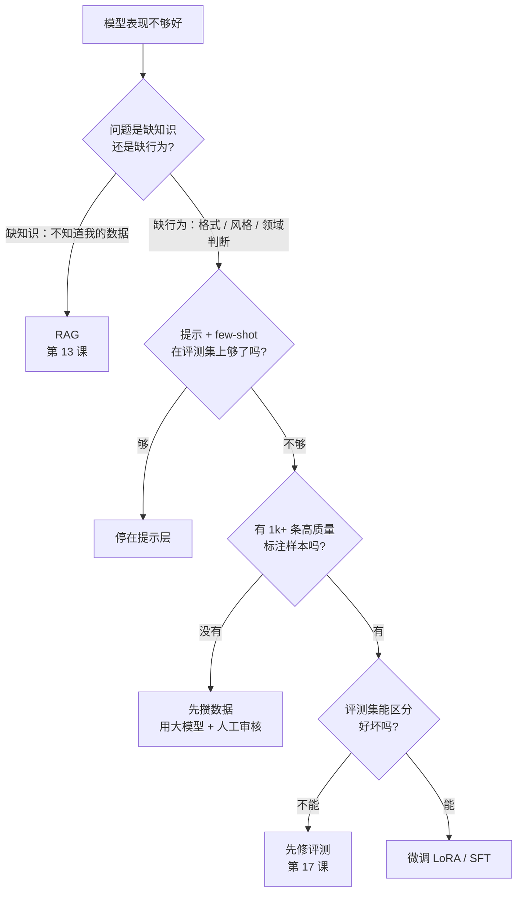
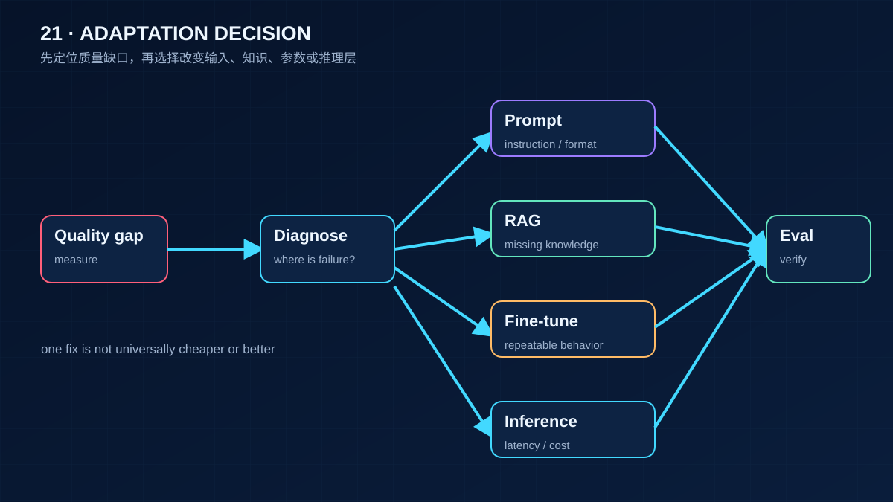

# 21 模型适配、微调与推理服务

> 应用工程师不需要会训练模型，但需要在「改提示、加检索、微调、换模型、自己部署」之间做决定，并且能算清每个选择的显存、延迟和钱。这一课给的是决策框架和两个计算器，不是训练教程。

## 为什么需要

质量问题常被误诊为「需要微调」，结果花了训练和部署成本，却没有解决数据、提示或评测缺口。选择模型适配方式前要先定位问题并算账。

## 学习目标

- 能用一棵决策树判断一个质量问题该用提示、RAG 还是微调解决，并说出微调的前置条件
- 能估算一个模型在给定精度、批大小和上下文长度下的显存，解释 KV cache 和 GQA 为什么决定了能不能服务长上下文
- 能算出托管 API 和自建 GPU 的成本临界点，并列出临界点之外还要考虑的因素

## 前置

- 前置 [F05 训练与对齐](../../prerequisites/llm-foundations/05-training-and-alignment/README.md) 和 [F06 KV Cache 与推理](../../prerequisites/llm-foundations/06-kv-cache-and-inference/README.md)：LoRA 为什么有效、prefill 与 decode、KV cache 公式、GQA、量化。本课直接用这些结论
- [17 评测](../17-evaluation/README.md)：没有评测集就无法判断微调有没有用

## 心智模型

### 决策树：改哪一层



三条判断规则：

1. **知识问题不要微调。** 微调不能可靠地让模型记住事实，还会随着数据变化过期。新知识、私有数据、需要引用来源的，走 RAG。
2. **微调解决的是行为。** 固定的输出格式、领域术语的使用、特定的判断倾向、把一个大模型的能力压进一个小模型。这些是提示词写再长也不稳定、但几千条样本能教会的东西。
3. **微调的前置条件是评测集。** 没有评测集，你无法知道微调后是好了还是坏了，也无法知道是不是提示词稍微改一下就够了。

**LoRA 在这棵树里的位置**：它让「调行为」便宜到一张消费级显卡就能做，但表达能力受 rank 限制，不适合「学大量新知识」。这和上面的规则一致——知识走 RAG，行为才微调。



## 机制拆解

### 一、显存估算：两项，都要算

```python
def weights_bytes(m: ModelShape, bytes_per_param: float) -> float:
    return m.params_b * 1e9 * bytes_per_param        # fp16 2, int8 1, int4 0.5

def kv_cache_bytes(m: ModelShape, seq_len: int, batch: int,
                   bytes_per_value: float = 2.0) -> float:
    return 2 * m.layers * m.kv_heads * m.head_dim * bytes_per_value * seq_len * batch
    #    ↑ K 和 V 两份
```

模型结构要从它的 `config.json` 里读：

```python
ModelShape("8B  GQA kv=8",  params_b=8.0,  layers=32, kv_heads=8,  head_dim=128)
ModelShape("7B  MHA kv=32", params_b=7.0,  layers=32, kv_heads=32, head_dim=128)
ModelShape("70B GQA kv=8",  params_b=70.0, layers=80, kv_heads=8,  head_dim=128)
```

算出来的结果值得盯一眼（80G 单卡，8 路并发，32k 上下文）：

| 模型 / 精度 | 权重 | KV cache (8×32k) | 合计 |
|---|---:|---:|---:|
| 8B GQA kv=8, fp16 | 15G | 32G | 47G |
| 7B MHA kv=32, fp16 | 13G | **128G** | 141G |
| 70B GQA kv=8, int4 | 33G | 80G | 113G |

两个结论：

**`kv_heads` 比参数量更能决定它能不能服务长上下文。** 同样 7B，GQA 和 MHA 的 KV cache 差八倍。看模型卡时先看这个数字。

**KV cache 通常还是 fp16，即使权重量化到 int4。** 除非推理引擎明确支持量化 KV cache。所以 70B int4 的 33G 权重看着能塞进 80G 卡，加上 80G 的 KV cache 就装不下了——这是自建推理最常见的容量误判。

### 二、成本临界点

```python
# 示例数字，2026-09-04。换成你的供应商价格表和云厂商 GPU 价格。
API_USD_PER_M_IN  = 0.30
API_USD_PER_M_OUT = 1.20
GPU_USD_PER_HOUR  = 2.50        # 一张 80G 卡，按需
GPU_TOKENS_PER_SEC = 1_500      # 7B 级模型在健康批大小下的聚合解码吞吐
UTILISATION = 0.6               # GPU 真正在生成的时间占比
HOURS_PER_MONTH = 730
OUTPUT_SHARE = 0.25             # 输出 token 占总量的比例

def api_cost_per_m(output_share: float) -> float:
    return API_USD_PER_M_IN * (1 - output_share) + API_USD_PER_M_OUT * output_share

def selfhost_cost_per_m(utilisation: float) -> float:
    tokens_per_hour = GPU_TOKENS_PER_SEC * 3600 * utilisation
    return GPU_USD_PER_HOUR / tokens_per_hour * 1_000_000

def breakeven_tokens_per_month() -> float:
    """整月养一张卡的钱，等于按 token 付 API 的量。"""
    return GPU_USD_PER_HOUR * HOURS_PER_MONTH / api_cost_per_m(OUTPUT_SHARE) * 1_000_000
```

**`UTILISATION` 是整个公式里最敏感的参数。** 默认 60%；改成 20%（大多数内部工具的真实水平），自建的每 token 成本翻三倍。**GPU 是按小时付费的，空转的小时和满载的小时一样贵。**

用峰值利用率算成本，是自建方案最常见的自我欺骗。

### 三、vLLM 还是 llama.cpp

| | vLLM | llama.cpp |
|---|---|---|
| 目标场景 | 服务器，多用户并发 | 单机、边缘、CPU 或消费级 GPU |
| 核心技术 | PagedAttention 管理 KV cache，连续批处理 | GGUF 量化格式，CPU / Metal / CUDA 后端 |
| 吞吐 | 高，批越大越划算 | 低，为单用户延迟优化 |
| 部署形态 | OpenAI 兼容的 HTTP 服务 | 命令行或嵌入进程；也有兼容服务 |
| 适合 | 自建推理集群 | 本地开发、隐私敏感的端侧、演示 |

两者都提供 OpenAI 兼容接口，所以第 00 课的适配器换个 base URL 就能接。**这也是课程一直强调协议兼容的原因：换推理后端不该改业务代码。**

## 常见错误

**只算权重不算 KV cache。** 见第一节。

**用峰值利用率算成本。** 见第二节。

**拿微调解决知识问题。** 微调了三千条产品文档问答，模型学会了文档的「语气」，但事实仍然编。因为微调改的是权重分布，**不是一个可以精确检索的存储**。

**没有评测集就开始微调。** 微调完看几个例子觉得「好像好了」，上线后发现另一类问题变差了。第 17 课在这一课之前，是有意的顺序。

## 取舍

- **微调的小模型 vs 提示的大模型。** 微调后的 7B 在特定任务上可以追平大模型，成本和延迟低一个量级，但每次任务定义变化都要重训。**任务稳定、量大时值得；任务还在变时不值得。**
- **量化精度。** int8 几乎总是值得的；int4 要在自己的评测集上验，尤其是数学、代码、多语言。质量下降不均匀，**平均分掩盖了某些切片的崩塌**。
- **自建的隐性成本。** 上面算的是 GPU 小时费。没算的是搭建和维护推理服务的工程师、值班、模型升级、容量规划、故障切换用的第二张卡。**这些通常比 GPU 本身贵。** 临界点计算给出的是「自建可能划算」的必要条件，不是充分条件。
- **锁定。** 托管 API 换供应商只改适配器；自建换推理引擎也只改适配器，但换硬件不是。协议兼容保护的是代码，不是采购。

## 工程落地

- **模型升级要走评测门禁。** 供应商发新版本、你换了量化精度、换了推理引擎，都要跑一遍第 17 课的评测集再上线。
- **微调数据本身是资产也是风险。** 训练数据里的 PII 会被模型记住；数据的来源和授权要能说清（第 20 课 LLM04）。
- **自建推理要有容量规划。** 显存估算给的是能不能起来，吞吐和并发才决定能服务多少人。压测比估算可靠。
- **混合部署是常态。** 高频简单任务走自建小模型，低频复杂任务走托管大模型。适配器层做路由，业务层无感。

## 框架映射

| 本课概念 | LangGraph | OpenAI Agents SDK | Claude Agent SDK |
|---|---|---|---|
| 接自建推理 | LangChain 的 OpenAI 兼容 provider | 改 base URL | 不支持（绑 Anthropic） |
| 按任务路由模型 | 不同节点配不同 model | 不同 agent 配不同 model | 单模型 |

自建推理的接入点是**OpenAI 兼容协议**，不是框架特性。官方文档：[vLLM](https://docs.vllm.ai/en/latest/) · [llama.cpp](https://github.com/ggml-org/llama.cpp) · [LangGraph](https://langchain-ai.github.io/langgraph/) · [OpenAI Agents SDK](https://openai.github.io/openai-agents-python/)（核对日期 2026-09-05）。

## 一线经验

语音机器人项目里，意图分类最终用的是一个针对命令集微调过的小模型，而不是通用大模型加长提示。三条理由：任务定义稳定（命令集半年不变）、有大量真实对话可以标注、延迟要求苛刻（用户说完话到设备动作要在一秒内）。

但同一个项目里的闲聊部分一直用通用大模型加提示，因为「聊得好」的定义在变，微调追不上。

**同一个系统里两种选择并存**，判断依据就是上面那棵决策树。这也说明「要不要微调」不是一个系统级的决定，是一个任务级的决定。

## 练习

见 [exercises.md](./exercises.md)。

## 延伸阅读

- [llm-course · The LLM Engineer](https://github.com/mlabonne/llm-course)（访问日期 2026-09-04）：Engineer 路线的 Inference optimization 和 Deploying LLMs 两节，链接了 Flash Attention、MQA/GQA、speculative decoding 的原始资料。
- [LLMs-from-scratch · ch05–ch07](https://github.com/rasbt/LLMs-from-scratch)（访问日期 2026-09-04）：预训练、分类微调、指令微调的从零实现。想知道微调在代码层面是什么就读这三章。
- [LoRA: Low-Rank Adaptation of Large Language Models](https://arxiv.org/abs/2106.09685)（访问日期 2026-09-04）：原始论文，第 4 节的方法描述一页就够。
- [vLLM 文档](https://docs.vllm.ai/en/latest/)（访问日期 2026-09-04）：首页的 PagedAttention 一段解释了它怎么管理 KV cache。
- [ai-agents-for-beginners · 17 Creating Local AI Agents](https://github.com/microsoft/ai-agents-for-beginners/blob/main/17-creating-local-ai-agents/README.md)（访问日期 2026-09-04）：小模型在本地做 Agent 的场景和「云端加本地」的混合模式。

---

[← 上一课 20](../20-security-governance/README.md) · [下一课 22 →](../22-product-design-ux/README.md)
