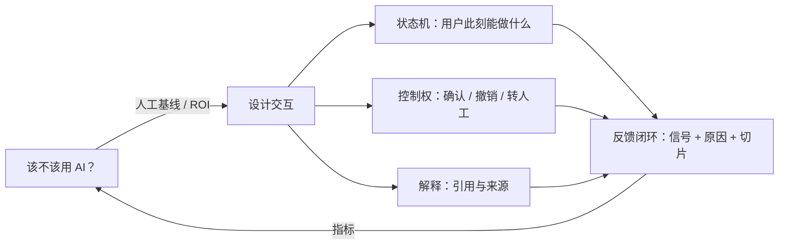
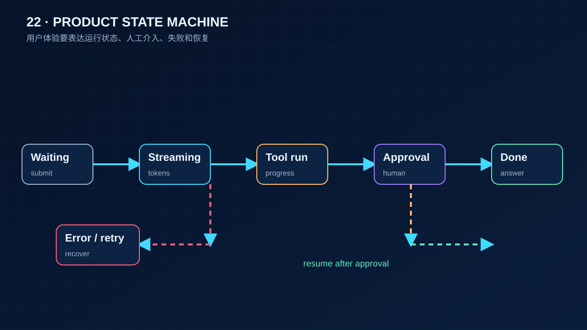

# 22 AI 产品设计与交互

> 前面二十一课在让 Agent 可靠。这一课问的是另一件事：用户凭什么相信它、什么时候该把决定权还给用户、怎么知道产品有没有变好。答案大多不在模型里，在交互设计和反馈闭环里。

## 为什么需要
Agent 的不确定性如果没有映射成清楚的界面状态，用户只会看到卡住、误执行或断线丢字。产品体验要把控制权和反馈做成系统状态。

## 学习目标

- 能用人工基线和 ROI 判断一个功能该不该上 AI，并说出三种"不该用"的信号
- 能把流式回答建模成显式的 UI 状态机，说清每个状态用户能做什么、看到什么
- 能按可逆性给动作分级，正确选择确认、撤销窗口或直接执行，并设计带原因码和切片的反馈闭环

## 前置

- [05 Tool Calling](../05-tool-calling/README.md)：确认门。本课的"撤销窗口"是它的另一半
- [07 Agent State 与 Runtime](../07-agent-state-and-runtime/README.md)：事件流。本课 UI 状态机消费的就是那份事件
- [17 评测](../17-evaluation/README.md)：离线指标。本课讲线上反馈怎么接回去

## 心智模型

四个判断，每个对应一段代码或一张清单：

**先问要不要。** 人工基线是"现在人怎么做、多久、错多少"。AI 方案只有在成本或质量上明显好于这条线，且失败后果可承受时才值得做。三个"不该用"的信号：任务有唯一正确答案且已有确定性方案；错误不可逆且无法验证；用户需要的是速度而不是判断。

**流式回答是一个状态机。** 等待、流式输出、工具执行中、需要确认、完成、失败，每个状态的渲染和可用操作都不同。把它写成显式的状态和转移表，"工具跑了十秒界面卡住"和"断线后文字全没了"这类问题就会在转移表上暴露出来，而不是在用户投诉里。

**控制权按可逆性分级。** 可逆动作直接做，给一个撤销窗口；不可逆动作先确认；影响资金、删除、发送给第三方的动作必须确认且留审计。分级由运行时按动作的声明决定，不由模型判断。这和第 05 课确认门是同一条原则的两面。

**反馈要能定位问题。** 一个总体的"点赞率 85%"什么都说明不了。反馈要挂在具体的事件上、带原因码、能按意图或场景切片。一张按意图切分的表，才能看出"退款"这个场景有 60% 在转人工。

## 最小可运行例子

| 文件 | 演示什么 | 运行 |
|---|---|---|
| [`code/01_stream_ui_state_machine.py`](./code/01_stream_ui_state_machine.py) | 七个 UI 状态和合法转移表；一个 reducer 把第 07 课的事件映射成界面帧；断线后保留已显示的文字 | `uv run python lessons/22-product-design-ux/code/01_stream_ui_state_machine.py`，加 `INJECT_DISCONNECT=1` |
| [`code/02_undo_window.py`](./code/02_undo_window.py) | 可逆动作走撤销窗口，不可逆动作走确认；同一个"撤销"按钮，两条不同的运行时路径 | 同上，加 `USER_UNDOES=1` |
| [`code/03_feedback_metrics.py`](./code/03_feedback_metrics.py) | 反馈挂在事件上、带原因码，按意图切片后总体数字和切片数字讲的是两个故事 | 同上 |

读 `01` 时对照 `TRANSITIONS` 表：`DONE` 和 `FAILED` 只能回到 `WAITING`，也就是用户发起下一轮；`STREAMING` 可以自转移，这就是增量文本。想加一个"用户打断"状态，先改表，再改 reducer。

## 常见错误与失败注入

**用一个不断变长的字符串代表回答。** 断线时字符串被清空重来，用户看到已经出现的文字消失了。`01` 里 `INJECT_DISCONNECT=1` 展示的是另一种处理：进入 `FAILED`，但 `text` 保留，界面明确说"以下是部分回答"。

**每个动作都弹确认。** 用户很快学会无脑点确定，确认就失效了。`02` 里 `archive_conversation` 不确认，直接做，给 0.3 秒撤销窗口；只有 `send_payment` 确认。确认是稀缺资源，只花在不可逆的地方。

**引用做成装饰。** 引用列表放在回答末尾、点不开、和正文没有对应关系，等于没有。引用要能回到原文的具体位置，第 13 课讲怎么在检索层保留这个信息，本课的 `citations` 字段只是把它带到界面。

**只收点赞点踩。** 没有原因码，负反馈无法归因；没有切片键，看不出哪个场景在坏。`03` 里如果把 `intent` 列删掉，`refund` 场景 60% 转人工这个事实就被总体 73% 的接受率盖住了。

## 取舍

- **透明 vs 简洁。** 显示模型正在用什么工具、引用来自哪里，会增加界面噪音。原则是默认折叠、可展开，关键动作前展开。
- **撤销窗口的长度。** 太短用户来不及反应，太长动作迟迟不生效。多数界面用 5～10 秒；有外部副作用的动作（发邮件）窗口结束前根本不该发出去，这要求后端支持延迟提交。
- **转人工的时机。** 早转人工浪费人力，晚转人工用户已经生气。信号可以是连续两次负反馈、用户重复同一个问题、或者模型自己请求（第 07 课的 `request_human_input`）。把阈值做成配置，按场景调。

## 生产方案
主项目 Playground 将 SSE 事件映射为等待、流式、工具中、需确认、完成和失败状态；M1/M3 的事件契约是 UI 的数据源。

## 框架映射

| 本课概念 | LangGraph | OpenAI Agents SDK | Claude Agent SDK |
|---|---|---|---|
| UI state machine / approval affordance | interrupt event → UI | stream events + approval UI | message stream + permission prompt |

*映射按 Framework Lab 的概念边界整理，框架行为以官方文档和 [Framework Lab](../../project/framework-lab/README.md) 在 2026-09-04 的实现证据为准。*

## 练习

见 [exercises.md](./exercises.md)。

## 对照真实项目

主项目 [M5](../../project/m5-production/README.md) 的评测和可观测部分会消费 `03` 这种反馈记录；[M6](../../project/m6-platform-design/README.md) 的 RFC 要写清用户可见的确认、撤销和转人工规则。

语音机器人项目的一个观察：语音没有屏幕，"状态机"的每个状态都要用声音表达。等待用一个短音效，工具执行中用一句"我看一下"，需要确认时必须完整复述要做的事。第一版没有"工具执行中"的反馈，用户以为机器人没听见，反复重复指令，触发了双重执行。修法就是给 `TOOL_RUNNING` 状态一个可感知的表达，问题消失。另一个和撤销直接相关的经验：物理动作（移动、播放）几乎都不可逆或代价高，所以语音场景的确认比屏幕场景多得多，但确认的话术要短，否则用户会打断它。

## 延伸阅读

- [generative-ai-for-beginners · 12 Designing UX for AI Applications](https://github.com/microsoft/generative-ai-for-beginners/blob/main/12-designing-ux-for-ai-applications/README.md)（访问日期 2026-09-04）：可用性、可靠性、可访问性、愉悦四个维度，加信任与透明、协作与反馈两节。本课的结构受它启发，但把重点从原则挪到了可运行的状态机。
- [ai-agents-for-beginners · 06 Building Trustworthy AI Agents](https://github.com/microsoft/ai-agents-for-beginners/blob/main/06-building-trustworthy-agents/README.md)（访问日期 2026-09-04）：系统提示框架、五类威胁与缓解、人工介入。威胁那一节在第 20 课展开。
- [Google PAIR · People + AI Guidebook](https://pair.withgoogle.com/guidebook)（访问日期 2026-09-04）：按用户需求、心智模型、解释与信任、反馈与控制、错误与优雅失败组织，每章有可直接用的设计模式。
- [Microsoft HAX Toolkit](https://www.microsoft.com/en-us/haxtoolkit/)（访问日期 2026-09-04）：18 条人机交互指南加设计模式库，"make clear what the system can do"和"support efficient correction"两条对应本课的状态机和撤销。

---

[← 上一课 21](../21-model-adaptation-finetuning-inference/README.md) · [下一课 23 →](../23-system-design-decisions/README.md)
