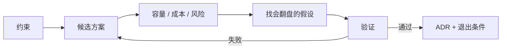

# 23 系统设计与技术决策

> 前面的课教你怎么把每一层做对。这一课教你在还没动手之前做决定：自建还是买、检索还是微调、Workflow 还是 Agent、单体还是平台。决定的质量不取决于你知道多少方案，取决于你能不能把假设写出来、算出来、并给它一个退出条件。

## 为什么需要
技术选型不是列出最多方案，而是找出会改变结论的假设。没有容量、成本、威胁和退出条件的方案，无法被团队复盘或安全地替换。

## 学习目标

- 能用同一套框架处理四类常见决策：Build vs Buy、模型 vs RAG vs 微调、Workflow vs Agent、单体 vs 平台，并写出可被推翻的假设
- 能为一个 AI 服务做容量与成本估算，用 Little's law 从峰值 RPS 推出并发运行数，并说出两个最大的成本杠杆
- 能写一份带备选方案和退出条件的 ADR，并完成一道多租户知识库加任务 Agent 平台的综合设计题

## 前置

- [16 系统架构与端到端数据流](../16-system-architecture/README.md)：本课的估算落在那条请求链的每个环节上
- [17 评测](../17-evaluation/README.md) 到 [21 模型适配](../21-model-adaptation-finetuning-inference/README.md)：四类决策各自的技术依据
- [09 Workflow 还是 Agent](../09-workflow-vs-agent/README.md)：本课把那一课的架构选择放进更大的决策框架

## 心智模型

```mermaid
flowchart LR
    P[问题与约束] --> A[列出方案<br/>含"什么都不做"]
    A --> N[算数<br/>容量 / 成本 / 延迟]
    N --> M[决策矩阵<br/>找出会翻盘的假设]
    M --> V[去验证那个假设]
    V --> R[写 ADR<br/>决定 + 后果 + 退出条件]
    R -->|退出条件触发| P
```

**决策是一份可以被推翻的文档，不是一次会议。** 框架有五步，每步对应一个产出物：

1. **写清约束**：数据边界、合规、团队规模、预算、上线时间。约束比目标更能筛掉方案。
2. **列方案时永远包括"不做"和"最简单的那个"**。很多时候人工加规则就够，AI 方案要证明自己比它好。
3. **算数**。日请求量、峰值 RPS、并发运行数、每日 token、每日花费、数据库写入。数不用精确，但要有，且每个数字能追溯到一个假设。
4. **决策矩阵的真正产出是敏感性**。哪一个权重挪 10% 结论就翻？那就是你现在最该去验证的假设，而不是继续开会。
5. **ADR 记决定，更记后果和退出条件**。半年后有人问"为什么当初这么选"，答案在文档里；有人说"情况变了"，看退出条件有没有被触发。

四类决策的常见翻盘点：

| 决策 | 通常的默认 | 会翻盘的假设 |
|---|---|---|
| Build vs Buy | 核心差异化自建，通用能力买 | 供应商的数据驻留或退出成本；你的 trace 格式是否被支持 |
| 模型 vs RAG vs 微调 | 知识用 RAG，行为用提示词，两者都不够再微调 | 知识更新频率；删除义务；是否需要引用 |
| Workflow vs Agent | 能枚举步骤就 Workflow | 路径是否真的不可枚举；失败代价是否允许探索 |
| 单体 vs 平台 | 第二个团队出现之前是单体 | 有没有真实的第二个消费者；配额和隔离是否已经成为事故来源 |

### 决策不是终点：验证与退出




## 最小可运行例子

| 文件 | 演示什么 | 运行 |
|---|---|---|
| [`code/01_capacity_estimator.py`](./code/01_capacity_estimator.py) | 从十几个假设推出峰值 RPS、并发运行数、每日 token 与花费、事件写入速率；对比 prompt cache 和模型路由两个杠杆 | `uv run python lessons/23-system-design-decisions/code/01_capacity_estimator.py`；加 `INJECT_TRAFFIC_SPIKE=1` 看容量假设翻倍 |
| [`code/02_adr.py`](./code/02_adr.py) | ADR 作为数据结构渲染成 Markdown，含备选方案、后果、退出条件；示例是"租户知识用 RAG 不用微调" | 同上 |
| [`code/03_decision_matrix.py`](./code/03_decision_matrix.py) | 加权决策矩阵，以及真正有用的部分：哪些权重变化会翻转结论 | 同上 |

`01` 里 `peak_concurrent_runs = peak_rps × p95_turn_seconds` 是 Little's law，工作进程数和数据库连接池都从它来。改 `p95_turn_seconds` 看并发数怎么变，会明白为什么第 19 课的延迟优化同时也是容量优化。

## 常见错误与失败注入

**估算没有假设表。** 只有结论"需要 20 台机器"，没人能复核。`01` 的 `Assumptions` 是一个 dataclass，每个数字有名字，改一个看全局。

**决策矩阵用来证明已有结论。** 先有答案再填分数，矩阵变成装饰。`03` 的 `flips()` 会告诉你哪些权重变化会翻转结论。如果几乎任何变化都不翻，说明结论稳健；如果一个 10% 的变化就翻，说明你其实还没决定，先去验证那个权重。

**ADR 没有退出条件。** 决策变成教条，情况变了没人敢改。`02` 的 `exit_criteria` 是必填字段。写不出退出条件，通常说明还没想清楚为什么选它。

**平台化太早。** 第一个消费者还没稳定就抽象成平台，抽象层按想象中的第二个消费者设计，第二个真出现时发现不匹配。默认是单体，等真实的第二个团队来提需求。

## 取舍

- **精确 vs 及时。** 估算的目的是决策，误差在两倍以内就够用。花一周把误差压到 10%，往往不如先按两倍余量上线再用真实数据修正。
- **可逆决策与不可逆决策。** 换一个 reranker 是可逆的，直接试；选数据库、选多租户隔离模型是不可逆的，值得写 ADR 和做验证。把精力花在不可逆的那几个上。
- **自建的隐性成本。** 自建的账面成本是工程时间，隐性成本是维护、值班、安全补丁和"没人敢改"。Buy 的隐性成本是退出成本和数据出境。矩阵里两者都要有一列。

## 生产方案
M6 的 [`platform RFC`](../../project/m6-platform-design/README.md) 用 ADR、容量估算、威胁模型和迁移 / 退出条件收敛决策。

## 框架映射

| 本课概念 | LangGraph | OpenAI Agents SDK | Claude Agent SDK |
|---|---|---|---|
| decision matrix / ADR / capacity model | graph vs application boundary | SDK choice + provider constraints | SDK choice + platform constraints |

*映射按 Framework Lab 的概念边界整理，框架行为以官方文档和 [Framework Lab](../../project/framework-lab/README.md) 在 2026-09-04 的实现证据为准。*


## 练习

见 [exercises.md](./exercises.md)。练习 5 是综合设计题，附参考答案骨架。

## 对照真实项目

主项目 [M6 综合设计](../../project/m6-platform-design/README.md) 就是这一课的作业：用 `01` 估容量，用 `03` 做 Build vs Buy，用 `02` 写 ADR，最后合成一份 RFC。M6 的 README 里有 RFC 模板。

语音机器人项目里的一个决策实例：意图分类最初用大模型直接做，延迟和成本都高。备选是微调一个小模型专做分类，或者用规则加关键词。最终选了微调小模型加大模型兜底的双模型方案。当时写下的退出条件是"小模型分类准确率在新意图上线后两周内跌破阈值"和"两个模型的结果冲突率超过某个比例"。后来第二个条件真的被触发过一次，团队据此调整了冲突时的裁决规则，而不是争论方案对错。这是退出条件的价值：它把"要不要改"从立场问题变成观测问题。

## 延伸阅读

- [12-factor-agents · README](https://github.com/humanlayer/12-factor-agents/blob/main/README.md)（访问日期 2026-09-04）：把十二条当作设计评审清单，逐条问"这个方案违反了哪条、为什么可以接受"。
- [Anthropic · Building effective agents](https://www.anthropic.com/research/building-effective-agents)（访问日期 2026-09-04）："从最简单的方案开始，只在需要时增加复杂度"，是 Workflow vs Agent 决策的出发点。
- [Michael Nygard · Documenting Architecture Decisions](https://cognitect.com/blog/2011/11/15/documenting-architecture-decisions)（访问日期 2026-09-04）：ADR 的原始提议，格式就是标题、上下文、决定、状态、后果。本课加了备选方案和退出条件两节。
- [ADR GitHub organization](https://adr.github.io/)（访问日期 2026-09-04）：各种 ADR 模板和工具的汇总。
- [ai-agents-for-beginners · 10 AI Agents in Production](https://github.com/microsoft/ai-agents-for-beginners/blob/main/10-ai-agents-production/README.md) 与 [16 Deploying Scalable Agents](https://github.com/microsoft/ai-agents-for-beginners/blob/main/16-deploying-scalable-agents/README.md)（访问日期 2026-09-04）："从原型到生产什么真的变了"和三种部署形态，绑定微软平台的部分可跳过。

---

[← 上一课 22](../22-product-design-ux/README.md) · [→ 主项目 M6](../../project/m6-platform-design/README.md)
