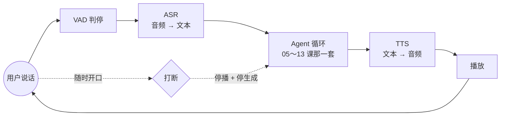

# 24 语音应用：链路、延迟预算与打断

> 把前面所有机制放进一个延迟以百毫秒计、用户看不见文字、还随时会打断你的形态里。语音不是「给聊天应用加一个麦克风」，它换掉了这门课里几乎每一条延迟和确认的默认值。

## 为什么需要

一个在网页上表现良好的 Agent，接上电话之后通常是这样坏的：

用户说完话，等了两秒半没动静，以为没听见，又说了一遍——两句话叠在一起进了同一轮。模型开始回答，用户听了三个字就插嘴，系统还在念完整段，念完才反应过来。最后是转账金额：用户说的是「一万四」，识别成了「一万四千」，工具参数照单全收，而**用户根本不知道系统听到的是什么**。

这三件事分别是延迟、打断和输入可信度。它们在文本应用里都不算大事，在语音里每一件都是致命的。

## 学习目标

- 能为一个语音场景写出一张延迟预算表，把「用户说完到听见第一个音」拆到每一段，并指出哪一段最先该优化
- 能设计打断的处理路径，说清打断之后对话历史里该记什么
- 能判断哪些槽位必须回读确认，并解释语音链路的输入为什么比文本输入更不可信

## 前置

- [02 模型调用、结构化输出与流式](../02-model-api-structured-output-streaming/README.md)：那条流式的两个消费者，在这一课变成 TTS 和工具执行器
- [07 Agent State 与 Runtime](../07-agent-state-and-runtime/README.md)：double texting 的三种策略，打断是它在语音里的形态
- [23 AI 产品设计与交互](../23-product-design-ux/README.md)：UI 状态机和确认与撤销，这一课把它们搬到没有屏幕的场景

## 怎么理解它



**级联和端到端是两条不同的路。** 上面这张图是级联：三个模型串起来，每一段都能看、能测、能换。端到端语音模型把中间三步合成一次调用，延迟和语气都更好，代价是**中间没有文本可看**——你的 trace 里少了一层，评测、审计和工具参数校验全都要重新想办法。**先做级联，除非延迟已经成了产品的生死问题。**

**延迟是这类应用的第一约束，而且它是个预算，不是一个指标。** 人在对话里对停顿的容忍大约在一秒上下，超过就会开始重复自己或者以为断线了。这一秒要分给判停、识别、模型首 token、语音合成首包和网络往返，**每一段都只有一两百毫秒**。第 01 课那笔成本账在这里换成了时间账：先列预算，再选模型。

**打断是一等公民，不是异常。** 用户开口的那一刻要同时做三件事：停播放、停生成、记下**实际播出到了哪里**。第三件最容易漏——模型以为整段话都被听到了，而用户只听到前六个字，后面的对话全建立在一个假的前提上。

**ASR 的输出是不可信输入。** 文本输入里用户打错字自己看得见，语音里用户不知道系统听成了什么。识别结果进工具参数之前必须过一道，金额、日期、人名、地址这类槽位要回读确认。这是第 05 课确认门在语音里的样子，触发条件从「动作不可逆」扩展到「**输入不可信 + 动作不可逆**」。

## 机制拆解

下面三段代码只为说明机制，省略了音频编解码、重采样和网络传输，不能直接运行。

### 一、延迟预算：先分配，再选型

```python
@dataclass(frozen=True)
class TurnBudget:
    """一轮的目标：用户说完最后一个字，到听见第一个音。单位毫秒。"""
    vad_silence: int = 300      # 判停：等多久算「说完了」
    asr_tail: int = 150         # 尾包送完到出最终文本
    llm_first_token: int = 350  # 模型首 token
    tts_first_chunk: int = 150  # 合成首包
    network: int = 100          # 两端往返

    def total(self) -> int:
        return (self.vad_silence + self.asr_tail
                + self.llm_first_token + self.tts_first_chunk + self.network)

def check(b: TurnBudget, ceiling: int = 1000) -> list[str]:
    over = []
    if b.total() > ceiling:
        over.append(f"总预算 {b.total()} 超了 {ceiling}")
    if b.vad_silence > 400:
        over.append("判停太久，用户会以为没听见")      # ← 最容易被忽略的一段
    return over
```

`vad_silence` 是这张表里最反直觉的一项：它常常是最大的一块，却经常没人管。**判停调短，用户体验立刻变好，代价是句中停顿会被误判成说完了**——中文里报数字、报地址时停顿很多，这个参数要按场景调，不能取一个全局默认值。

另外注意 `llm_first_token`：这一栏决定了推理模型基本进不了实时语音链路（第 01 课）。要用它，就得把它放到「先说一句『我查一下』再去想」的异步路径上。

### 二、打断：停掉，并且记下实际说了多少

```python
async def speak(text: str, session) -> None:
    session.spoken = ""                       # 本轮实际播出的部分
    try:
        async for sentence in split_sentences(text):     # 按句切，首包才快
            audio = await tts(sentence)
            await player.play(audio)                     # 播完这一句才继续
            session.spoken += sentence
    except asyncio.CancelledError:
        await player.stop()
        raise

async def on_user_speech(session):
    session.generation.cancel()               # ← 停生成：别再往下算了
    session.speech.cancel()                   # ← 停播放：立刻安静
    await session.speech                      # 等 CancelledError 走完，拿到 spoken
    session.history.append(
        Message(role="assistant", content=session.spoken + "（被用户打断）"))
```

关键是最后那两行：**写进历史的是 `session.spoken`，不是模型生成的全文**。用户只听到了前半句，模型的下一轮就该建立在前半句上。把全文记进去，接下来它会理直气壮地引用一段用户从没听过的话。

按句切分（`split_sentences`）同时解决两件事：首包延迟低，以及打断的粒度是一句而不是一整段。**这就是第 02 课「一条流两个消费者」的语音版**：TTS 消费者按句号切，工具执行器仍然要等完整参数。

### 三、不可信输入：置信度低的槽位要回读

```python
CRITICAL = {"amount", "account", "date", "address"}

def needs_readback(slots: dict, asr_conf: float, action_reversible: bool) -> list[str]:
    if action_reversible and asr_conf > 0.9:
        return []                                    # 可撤销 + 听得清，不打扰
    return [k for k in slots if k in CRITICAL]       # ← 只回读关键槽位，不是全部

def readback(slots: dict) -> str:
    parts = [f"{LABEL[k]}{spell_out(slots[k])}" for k in sorted(slots)]
    return "我确认一下：" + "，".join(parts) + "，对吗？"
```

`spell_out` 是这段里最不起眼、最该有的一个函数：金额要念成「一万四千元整」而不是「14000」，账号要一位一位念。**回读的目的是让用户听出识别错误，念成一串数字就等于没回读。**

判断条件里同时看了两件事：动作可不可逆（第 05 课）和输入可不可信。语音链路把第二项加了进来——同样一个查询动作，文本输入下不用确认，语音输入下如果识别置信度很低，也值得确认一次。

## 常见错误

**用文本应用的延迟标准做语音。** 「三秒内返回」在网页上是及格线，在电话里是事故。延迟预算要在选型之前定下来，它会直接否掉一批模型和一批架构（比如中间再加一跳网关）。

**打断后把整段回答记成说过了。** 见第二节。这是语音应用里最难查的一类问题：日志、trace、模型输出全都正常，只有用户觉得「它在胡说」。

**把 ASR 文本当可信输入直接填参数。** 识别错误不会报错，它会安安静静地变成一个合法的工具参数。**没有回读的语音下单系统，早晚会转错一笔钱。**

**TTS 等整段生成完再合成。** 首包延迟直接变成整段生成时间，预算表上那 150 毫秒变成三秒。按句流式合成是这条链路的默认做法，不是优化项。

**在句中停顿处抢答。** VAD 阈值调得太激进，用户报手机号中间喘口气就被打断。这个参数和上一条是一对矛盾，只能按场景实测，不能抄别人的默认值。

## 取舍

- **级联还是端到端。** 级联每一段可观测、可替换、可单独评测，中间的文本还能直接喂给工具和审计；端到端延迟低、语气自然，但你失去了中间那层文本，trace、评测、参数校验都要重做。**先级联，把延迟预算逼到极限之后再考虑换。**
- **判停快还是判停准。** 短的 `vad_silence` 让对话流畅，长的让报数字不被打断。折中做法是按对话状态动态调：普通闲聊短一点，正在收集数字槽位时长一点。
- **回读哪些槽位。** 每个都读，用户会烦到挂电话；一个都不读，早晚转错账。按「不可逆 + 关键槽位 + 置信度」三者组合来决定，这三个条件都在运行时手里，不在模型手里。
- **延迟用话术填还是硬扛。** 需要查库存、调接口时，可以先播一句「我查一下」，把两秒的空白填住。代价是这句话本身占掉几百毫秒，而且用多了会显得敷衍。**它是产品决定，不是技术决定**（第 23 课）。

## 工程落地

- **每一轮都要留一份带时间戳的记录**：ASR 最终文本与置信度、判停耗时、模型首 token 与总耗时、TTS 首包、实际播出时长、有没有被打断、打断发生在第几个字。这份记录是语音应用唯一能复盘的东西（第 19 课）。
- **音频要留样，但要按合规留。** 排查识别问题只能靠原始音频。留多久、谁能听、怎么脱敏，在上线前就要定（第 21 课）。
- **电话链路有它自己的约束**：采样率通常只有 8k、单声道、丢包和抖动是常态。在 16k 干净录音上测出来的识别率，到电话上会掉一截，**评测集必须用真实链路录的音频**。
- **打断要能穿透每一层。** 取消信号必须一路传到 TTS 和播放器，任何一层吞掉它，用户都会听到一段停不下来的话。这条在事件驱动架构里尤其容易漏。
- **怎么测。** 用真实录音做回归集，每条音频配三层断言：ASR 文本是否命中关键词、槽位提取是否正确、各段延迟的 p95 是否还在预算内。前两层零成本、确定，能进 CI；延迟那层要在接近生产的链路上跑（第 18 课）。

## 框架映射

| 本课概念 | LangGraph | OpenAI Agents SDK | Claude Agent SDK |
|---|---|---|---|
| 语音输入输出 | 不涉及，自己接 ASR/TTS | 有 voice 相关封装，也可直接用 realtime 接口 | 不涉及 |
| 打断与取消 | 自己在节点外做取消 | 会话层可取消，播放侧仍要自己接 | 会话中断由调用方处理 |
| 延迟预算 | 三家都不管 | 三家都不管 | 三家都不管 |

**延迟预算和打断，三个通用框架一个都不管**——它们的抽象层级在对话逻辑上，不在音频管道上。真正做这件事的是语音专用框架：[Pipecat](https://github.com/pipecat-ai/pipecat) 和 [LiveKit Agents](https://github.com/livekit/agents) 都把管道、打断和时间戳做成了一等公民，值得读它们的管道模型再决定自己写多少。官方文档：[LangGraph](https://langchain-ai.github.io/langgraph/) · [OpenAI Agents SDK](https://openai.github.io/openai-agents-python/) · [Claude Agent SDK](https://docs.claude.com/en/api/agent-sdk/overview)（核对日期 2026-09-06）。

## 参考实现

想看这一课的机制装进一个真实服务是什么样：参考实现的 [M6 综合设计](https://github.com/lance2016/ai-app-engineering-ref/blob/main/project/m6-platform-design/README.md)（还是草稿）。

## 延伸阅读

- [OpenAI · Realtime API](https://platform.openai.com/docs/guides/realtime)（访问日期 2026-09-06）：端到端语音链路的一个具体实现，重点看它怎么表达打断和会话事件。
- [OpenAI · Speech to text](https://platform.openai.com/docs/guides/speech-to-text) 与 [Text to speech](https://platform.openai.com/docs/guides/text-to-speech)（访问日期 2026-09-06）：级联链路两端的接口形态，注意流式和非流式的区别。
- [Pipecat](https://github.com/pipecat-ai/pipecat)（访问日期 2026-09-06）：开源的语音管道框架，它的 frame 与 pipeline 模型是理解「打断怎么穿透每一层」最快的材料。
- [LiveKit Agents](https://github.com/livekit/agents)（访问日期 2026-09-06）：另一套实现，附带电话接入的完整示例。
- [Twilio · Voice 文档](https://www.twilio.com/docs/voice)（访问日期 2026-09-06）：电话侧的约束——编码、采样率、拨号流程，做外呼或接入呼叫中心时绕不开。

---

[← 上一课 23](../23-product-design-ux/README.md) · [下一课 25 →](../25-system-design-decisions/README.md)
