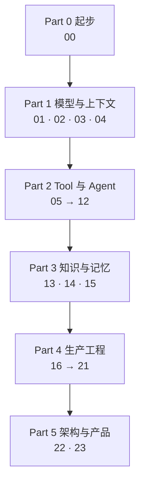

# 主线 24 课：每个 Part 在搭什么

> 24 课不是 24 个独立主题。它们按「一个 AI 应用是怎么一层层长出来的」排序：先有能调通的模型，再有能执行的工具和能循环的运行时，再有外部知识和记忆，最后是让它能上线、能被观测、能被信任的那一圈骨架。

这一页有两张地图，回答两个不同的问题。

## 地图一：一个 AI 应用由哪些能力构成

和读的顺序无关，这是**系统的结构**。做架构评审、排查线上问题、判断自己缺什么的时候，看这张。

| 能力域 | 它回答什么 | 哪几课 | 缺了会怎样 |
|---|---|---|---|
| 模型接入 | 选哪个模型、怎么拿到可解析的输出、一次调用花多少 | 01 · 02 · 03 | 供应商一变全线重写；输出解析全靠正则 |
| 检索 | 不在模型权重里的知识怎么进来 | 04 · 13 · 15 | 只能回答通识问题，一问业务就编 |
| 工具执行 | 模型怎么影响外部世界，谁保证只发生一次 | 05 · 11 · 12 | 重试变成两笔转账；模型能调它不该调的东西 |
| 运行时控制 | 循环怎么走、什么时候停、状态归谁 | 06 · 07 · 09 · 10 | 死循环烧钱；重启之后不知道自己在做什么 |
| 上下文组装 | 每一轮到底发了什么给模型 | 08 · 14 | 模型"忘事"，而你无法解释为什么 |
| 评测 | 凭什么说这次改动变好了 | 17 | 每次上线都是赌博 |
| 可观测 | 出事之后能不能查出是哪一层 | 18 | 只能看到最后那句错误回答 |
| 可靠性与成本 | 下游抖动怎么办，钱怎么算清 | 19 | 上游一慢全站雪崩；月底看账单才知道 |
| 安全边界 | 谁能让它做什么，数据会不会漏 | 20 | 一段用户输入就能越权 |
| 架构与产品决策 | 这些东西怎么拼起来，用户看到什么 | 16 · 21 · 22 · 23 | 组件都对，系统不成立 |

**这十行就是一个 AI 应用的检查清单。** 拿它去对照自己手上的项目，空着的那几行就是风险所在。

## 地图二：按什么顺序学

这是**读的路径**，按依赖关系排，前面是后面的地基。

两张地图对不齐是正常的：**能力域按系统结构分，Part 按学习依赖分。** 比如检索能力横跨 04 和 13，中间隔了八课，因为要先懂工具和运行时才谈得上把检索装进 Agent。

四条判断贯穿全课，哪一课都在用：**模型是不可信的部件**（Part 1）、**执行和状态归运行时**（Part 2）、**知识来自外部而不是权重**（Part 3）、**没有评测就没有「变好了」**（Part 4）。

下面每个 Part 都回答同一组问题：**它解决什么、学完你的应用多了什么能力、怎么确认自己真的学会了。**

---

## Part 0 起步

**解决什么。** 说清这门课的读法，以及一次最小的模型调用长什么样。

**学完之后。** 知道正文的代码为什么不能直接跑、什么时候该去参考实现看能跑的版本。

| 课 | 一句话 |
|---|---|
| [00](./00-setup/README.md) | 课程定位，加一段能直接复制去跑的最小模型调用 |

**出师标准。** 答不上就回去看括号里那一课。

- 这门课的示意代码为什么不追求能运行，什么情况下该去参考实现（00）
- 一次模型调用由哪几部分组成，哪些是协议规定的、哪些是供应商自己加的（00）

---

## Part 1 模型与上下文

**解决什么。** 把模型当一个有规格书、会出错、按 token 收费的部件来用，而不是当一个无所不知的对话伙伴。

**学完之后。** 应用能选对模型、拿到结构化的输出、把指令和上下文管起来，并且能把语义检索接进来。

| 课 | 一句话 |
|---|---|
| [01](./01-how-llms-work/README.md) | 硬约束过滤、能力探针、每段对话的成本模型 |
| [02](./02-model-api-structured-output-streaming/README.md) | 消息格式、JSON Schema 约束、流式增量、重试 |
| [03](./03-prompt-engineering/README.md) | 系统指令、few-shot、prompt 版本化与回归门禁 |
| [04](./04-embeddings-and-vector-search/README.md) | 选模型和维度、暴力检索到什么规模换索引、pgvector |

**出师标准。**

- 选型里哪些条件是硬约束、哪些是打分项，为什么许可证属于前者（01）
- 为什么成本要按一段对话算，不按一次调用算（01）
- 模型返回的 JSON 解析失败时，运行时该做什么、不该做什么（02）
- 改了 prompt，凭什么说它变好了（03）
- 换 embedding 模型为什么必须重建全部向量，维度能不能跨模型比（04）

**在参考实现里。** [M0 并发实验](https://github.com/lance2016/ai-app-engineering-ref/blob/main/project/m0-concurrency/README.md)、[M1 API 骨架](https://github.com/lance2016/ai-app-engineering-ref/blob/main/project/m1-api-skeleton/README.md)。

---

## Part 2 Tool 与 Agent

**解决什么。** 让模型能影响外部世界，同时保证执行、状态和边界全部握在确定性代码手里。这是全课最长的一个 Part，也是「AI 应用」和「聊天界面」的分界线。

**学完之后。** 应用有了工具、循环、状态、上下文组装和能力接入，可以自己走多步完成一个任务。

| 课 | 一句话 |
|---|---|
| [05](./05-tool-calling/README.md) | 选对工具、参数有效、外部系统真的做了且只做了一次 |
| [06](./06-agent-loop/README.md) | 最小循环；停止条件、预算、失败分类与恢复 |
| [07](./07-agent-state-and-runtime/README.md) | 状态是一份事件记录；checkpoint、暂停恢复、人工介入 |
| [08](./08-context-engineering-for-agents/README.md) | 裁剪、压缩、工具结果整形、缓存友好的布局 |
| [09](./09-workflow-vs-agent/README.md) | 五种 workflow 模式，什么时候才真的需要自治 Agent |
| [10](./10-multi-agent-handoff/README.md) | 分工、交接和并行竞速；状态归谁、历史给多少 |
| [11](./11-mcp/README.md) | 能力接入：生命周期、能力发现、两条错误通道 |
| [12](./12-skills-and-capability-layers/README.md) | Tool、MCP、Skill、Plugin、A2A 各管什么 |

**出师标准。**

- 模型输出了一个 tool call，此时外部世界变了没有，接下来哪几步必须是确定性代码（05）
- 超时重试为什么必须带幂等键，这个键防的是哪一种重复、防不住哪一种（05）
- 一个循环有哪几种停法，为什么每种都要落一条事件（06）
- 为什么状态必须归运行时，而不是塞在对话历史里（07）
- 上下文窗口为什么是预算而不是容量（08）
- Agent 和 Workflow 的边界在哪，什么时候多一个 Agent 反而更差（09、10）
- MCP 解决了什么，不解决什么（11、12）

**在参考实现里。** [M2 数据与状态](https://github.com/lance2016/ai-app-engineering-ref/blob/main/project/m2-state-and-storage/README.md)、[M3 Tool Workflow](https://github.com/lance2016/ai-app-engineering-ref/blob/main/project/m3-tool-workflow/README.md)。

---

## Part 3 知识与记忆

**解决什么。** 让应用能用上不在模型权重里的知识：文档、历史对话、用户偏好。

**学完之后。** 应用有了检索、引用、记忆和一套管数据的规矩。

| 课 | 一句话 |
|---|---|
| [13](./13-rag-end-to-end/README.md) | 解析、切块、索引、混合检索、重排、生成、引用 |
| [14](./14-memory/README.md) | 会话、任务、长期记忆的边界；提取、冲突合并、过期 |
| [15](./15-data-engineering/README.md) | 版本、新鲜度、权限和删除演练 |

**出师标准。**

- 回答错了，怎么判断问题出在检索还是生成（13）
- Recall@k 和 Hit@k 分别回答什么问题，什么场景该看哪个（13）
- 引用校验能证明什么、不能证明什么（13）
- 记忆系统最危险的故障是哪一种，怎么测出来（14）
- 为什么说决定 RAG 上限的是数据不是模型（15）

**在参考实现里。** [M4 RAG 与 Memory](https://github.com/lance2016/ai-app-engineering-ref/blob/main/project/m4-rag-and-memory/README.md)。

---

## Part 4 生产工程

**解决什么。** 让这套东西能上线、能被观测、坏了能定位、贵了能查账、被攻击时能挡住。这个 Part 决定一个 demo 和一个生产系统的差距。

**学完之后。** 应用有了评测、trace、限流、fallback、成本账、安全边界和部署流程。

| 课 | 一句话 |
|---|---|
| [16](./16-system-architecture/README.md) | 从客户端到模型再回来的完整请求链，以及存储边界 |
| [17](./17-evaluation/README.md) | 切片、kappa、轨迹断言、回归门禁 |
| [18](./18-observability/README.md) | 结构化日志、OpenTelemetry GenAI 约定、四种故障的样子 |
| [19](./19-reliability-cost-llmops/README.md) | 超时、重试、限流、熔断、fallback、成本预算、SLO |
| [20](./20-security-governance/README.md) | 提示注入、越权、数据泄露、沙箱、多租户边界 |
| [21](./21-model-adaptation-finetuning-inference/README.md) | 什么时候该微调、显存怎么算、自建的成本临界点 |

**出师标准。**

- 一次请求经过哪些跳，每一跳回答什么问题（16）
- 没有评测集，为什么就不能说「变好了」（17）
- 工具超时、上下文溢出、成本尖峰、静默降级，在 trace 里各长什么样（18）
- 限流、熔断、fallback 各挡哪一类失败，为什么三个都要有（19）
- 提示注入为什么不能靠提示词防（20）
- 什么问题该用 RAG、什么问题才轮到微调，这条界线为什么是经验不是规律（21）

**在参考实现里。** [M5 生产化](https://github.com/lance2016/ai-app-engineering-ref/blob/main/project/m5-production/README.md)。

---

## Part 5 架构与产品

**解决什么。** 把前面所有机制放回产品和决策的语境里：用户看到什么、决策怎么记录、什么时候该推翻自己。

**学完之后。** 能独立设计一个 AI 应用，并且写得出一份别人能审的技术决策。

| 课 | 一句话 |
|---|---|
| [22](./22-product-design-ux/README.md) | 流式 UI 状态机、确认与撤销、引用展示、反馈闭环 |
| [23](./23-system-design-decisions/README.md) | 容量估算、决策矩阵的敏感性、带退出条件的 ADR |

**出师标准。**

- 一个流式界面要表达哪几种状态，哪一种最容易被漏掉（22）
- 什么操作必须要确认，什么操作可以只提供撤销（22）
- 一份 ADR 里最容易缺的是哪一部分（23）
- 容量估算错在哪一步最贵（23）

**在参考实现里。** [M6 综合设计](https://github.com/lance2016/ai-app-engineering-ref/blob/main/project/m6-platform-design/README.md)（还是草稿）。

---

## 整套课程的出师标准

读完 24 课，衡量标准不是记住了多少个主题，而是这两件事能不能做。

**一、拿到一个需求，能独立走完这条链。**

先判断这件事该不该用 AI 做；该用，那么模型怎么选、prompt 和上下文怎么组织、知识从哪来、要不要工具和记忆、运行时怎么控制循环和状态、拿什么验证它变好了、线上怎么看、坏了怎么兜、贵了怎么查、被攻击怎么挡、用户看到什么、以及这些决定为什么这么做、什么条件下推翻。

**二、拿到一个线上失败案例，能定位到层。**

一句错误的回答背后可能是八层里的任意一层：

能说出「先看哪一层、用什么证据排除它、排除之后往哪走」，比记住任何一个术语都重要。这也是[原则 07](../principles/07-locate-failures-by-layer.md)的全部内容。

答不上来的地方，回到对应 Part 的出师标准，那里有链接。

---

[前置 · LLM 原理](../prerequisites/README.md) · [12 条工程原则](../principles/README.md) · [自测：我该从哪一课开始](../reference/diagnostic.md)
