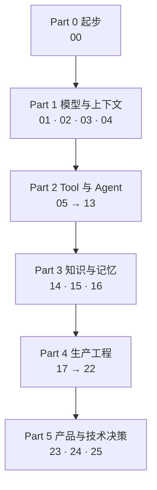
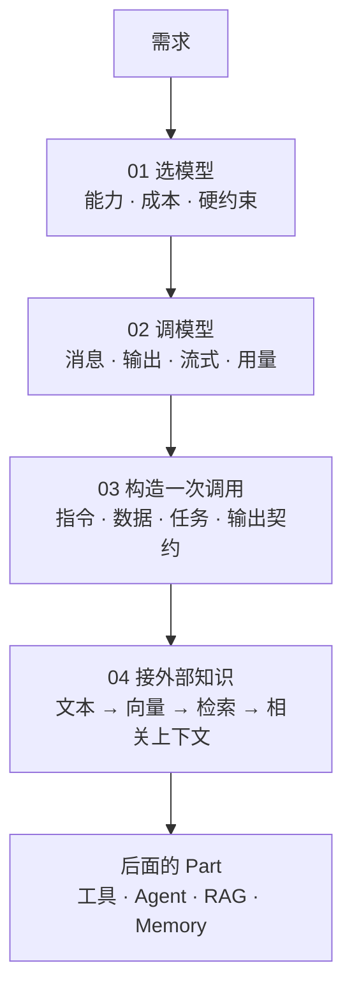

# 主线 26 课：每个 Part 在搭什么

> 26 课不是 26 个独立主题。它们按「一个 AI 应用是怎么一层层长出来的」排序：先有能调通的模型，再有能执行的工具和能循环的运行时，再有外部知识和记忆，最后是让它能上线、能被观测、能被信任的那一圈骨架。

首页管的是选路线和接着读，这一页管的是**知识体系**：一个 AI 应用由哪些部分构成、这些部分按什么顺序学、每个 Part 学完该具备什么能力。

下面有两张地图，回答两个不同的问题。

## 地图一：一个 AI 应用由哪些组件构成

和读的顺序无关，这是**系统的结构**。做架构评审、排查线上问题、判断自己缺什么的时候，看这张。

下面是一个生产级 AI 应用的全貌，每个组件后面标着它属于哪个 Part、哪几课。26 课在搭的就是这一张图，
学完一个 Part，这张图上就多亮一块。

01请求入口

[UserP5 · 23](./product-design-ux/README.md){ .sysnode }[APIP4 · 17](./system-architecture/README.md){ .sysnode }[SessionP2 · 07](./agent-state-and-runtime/README.md){ .sysnode }

02运行时

[Context BuilderP2 · 08](./context-engineering-for-agents/README.md){ .sysnode }[Agent RuntimeP2 · 06 07 09](./agent-loop/README.md){ .sysnode .sysnode--core }[Tool RegistryP2 · 05 11 12](./tool-calling/README.md){ .sysnode }[Model GatewayP1 · 01 02](./model-api-structured-output-streaming/README.md){ .sysnode }

[Fallback / DegradeP4 · 20](./reliability-cost-llmops/README.md){ .sysnode .sysnode--risk }
下游超时、限流、模型不可用，走这条线

03知识与记忆

[RAGP3 · 14](./rag-end-to-end/README.md){ .sysnode .sysnode--async }[MemoryP3 · 15](./memory/README.md){ .sysnode .sysnode--async }[Data PipelineP3 · 16](./data-engineering/README.md){ .sysnode .sysnode--async }[Vector IndexP1 · 04](./embeddings-and-vector-search/README.md){ .sysnode .sysnode--async }

虚线：被运行时按需调用，或者离线跑。它们不在主请求链上，但决定了回答的上限。

04平台底座

[EvaluationP4 · 18](./evaluation/README.md){ .sysnode }[Trace 与可观测P4 · 19](./observability/README.md){ .sysnode }[SecurityP4 · 21](./security-governance/README.md){ .sysnode }[InfrastructureP4 · 22](./model-adaptation-finetuning-inference/README.md){ .sysnode }

横切：每一层都要用到。缺了它，上面三层出了问题你只能看到最后那句错误回答。

图例

全站的示意图共用这一套约定，看图之前不用先读图例。

<ul class="legend__list">
<li>青瓷色：当前路径、正常流程</li>
<li>铁锈色：失败、风险、降级</li>
<li>实线：运行时的同步流</li>
<li>虚线：可选调用、异步或离线</li>
<li>矩形：一个组件</li>
<li>圆形：一个概念</li>
<li>菱形：一次判断</li>
</ul>

把同一张图按「能力域」摊成一张表，就是下面这份检查清单：

| 能力域 | 它回答什么 | 哪几课 | 缺了会怎样 |
|---|---|---|---|
| 模型接入 | 选哪个模型、怎么拿到可解析的输出、一次调用花多少 | 01 · 02 · 03 | 供应商一变全线重写；输出解析全靠正则 |
| 检索 | 不在模型权重里的知识怎么进来 | 04 · 14 · 16 | 只能回答通识问题，一问业务就编 |
| 工具执行 | 模型怎么影响外部世界，谁保证只发生一次 | 05 · 11 · 12 · 13 | 重试变成两笔转账；模型能调它不该调的东西 |
| 运行时控制 | 循环怎么走、什么时候停、状态归谁 | 06 · 07 · 09 · 10 | 死循环烧钱；重启之后不知道自己在做什么 |
| 上下文组装 | 每一轮到底发了什么给模型 | 08 · 15 | 模型「忘事」，而你无法解释为什么 |
| 评测 | 凭什么说这次改动变好了 | 18 | 每次上线都是赌博 |
| 可观测 | 出事之后能不能查出是哪一层 | 19 | 只能看到最后那句错误回答 |
| 可靠性与成本 | 下游抖动怎么办，钱怎么算清 | 20 | 上游一慢全站雪崩；月底看账单才知道 |
| 安全边界 | 谁能让它做什么，数据会不会漏 | 21 | 一段用户输入就能越权 |
| 架构与产品决策 | 这些东西怎么拼起来，用户看到什么 | 17 · 22 · 23 · 24 · 25 | 组件都对，系统不成立 |

**这十行就是一个 AI 应用的检查清单。** 拿它去对照自己手上的项目，空着的那几行就是风险所在。

## 地图二：按什么顺序学

这是**读的路径**，按依赖关系排，前面是后面的地基。

两张地图对不齐是正常的：**能力域按系统结构分，Part 按学习依赖分。** 比如检索能力横跨 04 和 14，中间隔了九课，因为要先懂工具和运行时才谈得上把检索装进 Agent。

四条判断贯穿全课，哪一课都在用：**模型是不可信的部件**（Part 1）、**执行和状态归运行时**（Part 2）、**知识来自外部而不是权重**（Part 3）、**没有评测就没有「变好了」**（Part 4）。

下面每个 Part 都回答同一组问题：**它解决什么、学完你的应用多了什么能力、怎么确认自己真的学会了。**

---

## Part 0 起步

**解决什么。** 说清三套主流调用接口的差异，跑通第一次真实调用，再讲这门课的读法。

**学完之后。** 拿到任何一家的文档都知道该看哪几个字段，也知道正文的代码为什么不能直接跑。

| 课 | 一句话 |
|---|---|
| [00](./setup/README.md) | Chat Completions、Responses、Claude Messages 的对比，加一段能直接复制去跑的工具调用往返 |

**出师标准。** 答不上就回去看括号里那一课。

- 同一个工具结果，在三套接口里分别算谁说的话，靠哪个字段和调用配对（00）
- 什么情况下该选 Responses，代价是什么（00）
- 这门课的示意代码为什么不追求能运行，什么情况下该去参考实现（00）

---

## Part 1 模型与上下文

**解决什么。** 把模型当一个有规格书、会出错、按 token 收费的部件来用，而不是当一个无所不知的对话伙伴。

**学完之后。** 应用能选对模型、拿到结构化的输出、把指令和上下文管起来，并且能把语义检索接进来。

四课连起来是一条线：

四课各管一段，不重叠：01 决定用哪个模型、一次真实任务要花多少钱；02 是模型 API 的运行时契约，管调用怎么发、返回怎么收；03 管一次调用里到底放什么；04 管模型权重里没有的知识怎么进来。

先测一下：这个 Part 你要不要读（5 题）

每题先自己答一句话，再展开对照。**都答得上就不用通读这个 Part**，挑各课的「常见错误」和「取舍」两节看就够。答不上的，括号里是对应的课。

**1. 一个模型的上下文窗口是 128k，你的对话每轮输入 2000 token、输出 700 token。这个对话能进行多少轮？**

对照

**47 轮。** 关键在于「每轮输入 2000」不等于每轮向模型发送 2000——历史要重发。

第 n 轮发给模型的输入是 `(n-1) × (2000 + 700) + 2000`，加上这一轮的输出，峰值占用正好是 `n × 2700`。`128000 ÷ 2700 ≈ 47.4`，所以第 47 轮还装得下（126900），第 48 轮就溢出了（129600）。

数字本身不重要，重要的是**按峰值算而不是按单轮算**。只按单轮估的人会以为能聊六十多轮，然后在长对话用户身上收到 400，而且很难复现。

→ [01](./how-llms-work/README.md)

**2. 模型在 benchmark 上分数很高，为什么不能直接用来判断它适合你的应用？**

对照

榜单测的是别人的任务。真实模型在自己的探针上往往参差：算术过了，数字母挂了；能写 JSON，但拒绝承认不知道。第一步是一组「一个提示加一个确定性检查」的探针，跑在自己真正依赖的能力上——但它只是排雷，说明不了模型在你业务上有多好，那要一份按真实请求采样的评测集（第 18 课）。

→ [01](./how-llms-work/README.md)

**3. 换一个更便宜的模型，成本一定会降吗？**

对照

不一定。便宜的模型可能需要更长的 few-shot 才达到同样的质量，可能更容易输出格式错误导致重试，可能在 Agent 里多走两步。每 token 单价只是成本模型里的一个因子，要算的是「一次完整任务的钱」。

→ [01](./how-llms-work/README.md) · [20](./reliability-cost-llmops/README.md)

**4. JSON Schema 约束了输出，还需要在代码里校验吗？**

对照

需要。约束降低了出错概率，不等于消除。而且 schema 只管结构，管不了值的业务合法性——日期格式对，不代表那是一个存在的日期；枚举值合法，不代表在当前场景下允许。校验失败时把错误原文回给模型让它改，比抛给用户强。

→ [02](./model-api-structured-output-streaming/README.md)

**5. 换了 embedding 模型，旧向量还能用吗？**

对照

不能。两批向量落在不同的空间里，混在一起算出的名次没有意义。而且能不能比，看的是空间不是名字：同一个模型换个维度、改一下 query 前缀，产出的向量照样不能和旧的比。所以每条向量要记一个标识向量空间的 id，换空间时并行建一份新索引、回灌、用同一组样本比 Recall@k，再切读流量。

→ [04](./embeddings-and-vector-search/README.md)

| 课 | 一句话 |
|---|---|
| [01](./how-llms-work/README.md) | 硬约束过滤、能力探针、每段对话的成本模型 |
| [02](./model-api-structured-output-streaming/README.md) | 模型 API 的运行时契约：消息、结构化输出、流式、重试、用量 |
| [03](./prompt-engineering/README.md) | 系统指令、few-shot、prompt 版本化与回归门禁 |
| [04](./embeddings-and-vector-search/README.md) | 向量空间、精确检索与近似索引、切块、pgvector |

**出师标准。**

- 选型里哪些条件是硬约束、哪些是打分项，为什么许可证属于前者（01）
- 为什么成本要按一段对话算，不按一次调用算（01）
- 模型返回的 JSON 解析失败时，运行时该做什么、不该做什么（02）
- 改了 prompt，凭什么说它没变差，这和「变好了」为什么是两个问题（03）
- 什么情况下两批向量不能放在一起比，维度能不能跨模型比（04）

**在参考实现里。** [M0 并发实验](https://github.com/lance2016/ai-app-engineering-ref/blob/main/project/m0-concurrency/README.md)、[M1 API 骨架](https://github.com/lance2016/ai-app-engineering-ref/blob/main/project/m1-api-skeleton/README.md)。

---

## Part 2 Tool 与 Agent

**解决什么。** 让模型能影响外部世界，同时保证执行、状态和边界全部握在确定性代码手里。这是全课最长的一个 Part，也是「AI 应用」和「聊天界面」的分界线。

**学完之后。** 应用有了工具、循环、状态、上下文组装和能力接入，可以自己走多步完成一个任务，并且见过这些零件在一个真实产品里是怎么拼起来的。

先测一下：这个 Part 你要不要读（5 题）

每题先自己答一句话，再展开对照。**都答得上就不用通读这个 Part**，挑各课的「常见错误」和「取舍」两节看就够。答不上的，括号里是对应的课。

**1. 模型输出了一个 `transfer_money` 的 tool call。此时账上的钱动了没有？**

对照

没有。到这一步为止只是一段结构化 JSON，说「我想调这个工具」。之后每一步都是确定性代码：查注册表、校验参数、判断要不要确认、带幂等键执行。**动作只能从工具调用通道取**——用正则从模型正文里捞 JSON 出来执行，是最常见的事故来源之一。

→ [05](./tool-calling/README.md)

**2. 幂等键从工具调用的参数哈希派生，够不够？**

对照

不够，而且方向反了。从 `call.id` 加参数派生，防的是**同一次调用超时后的重试**。模型如果在下一轮重新发起同一笔转账，`call.id` 是新的，键也是新的，外部系统会认为这是第二笔业务。要挡这种重复，得再有一个从业务意图派生的键——这个会话、这个订单、这一次用户确认。两种键防两件事。

→ [05](./tool-calling/README.md) · [原则 06](../principles/06-side-effects-are-idempotent-and-auditable.md)

**3. Agent 的状态存在哪？存对话历史够不够？**

对照

不够。状态的事实来源是一份 append-only 的事件线程：走到哪一步、在等什么、剩多少预算、哪个工具调用还没回结果，都从它推导。对话历史只是这份线程的一种渲染。状态归运行时持有，不归模型、不归框架、不归前端。

→ [07](./agent-state-and-runtime/README.md) · [原则 05](../principles/05-runtime-owns-state.md)

**4. 上下文窗口还剩很多空间，是不是就该多塞点历史进去？**

对照

不是。窗口是注意力预算不是容器：多一个 token，模型分给其他 token 的注意力就少一点，中段内容的召回尤其容易掉。目标是在预算内放进信号最强的一组 token，不是塞满。

→ [08](./context-engineering-for-agents/README.md)

**5. 两个 Agent 的方案，什么时候比一个 Agent 差？**

对照

绝大多数时候。多一个 Agent 就多一层交接、一份要决定归属的状态、一个「历史给多少」的问题，以及互相推诿的可能。真正需要多 Agent 的是职责边界清晰、上下文确实该隔离的场景；「让一个 Agent 审另一个 Agent」这类设计，多数时候用一次确定性校验就够了。

→ [09](./workflow-vs-agent/README.md) · [10](./multi-agent-handoff/README.md)

| 课 | 一句话 |
|---|---|
| [05](./tool-calling/README.md) | 选对工具、参数有效、外部系统真的做了且只做了一次 |
| [06](./agent-loop/README.md) | 最小循环；停止条件、预算、失败分类与恢复 |
| [07](./agent-state-and-runtime/README.md) | 状态是一份事件记录；checkpoint、暂停恢复、人工介入 |
| [08](./context-engineering-for-agents/README.md) | 裁剪、压缩、工具结果整形、缓存友好的布局 |
| [09](./workflow-vs-agent/README.md) | 五种 workflow 模式，什么时候才真的需要自治 Agent |
| [10](./multi-agent-handoff/README.md) | 分工、交接和并行竞速；状态归谁、历史给多少 |
| [11](./mcp/README.md) | 能力接入：生命周期、能力发现、两条错误通道 |
| [12](./skills-and-capability-layers/README.md) | Tool、MCP、Skill、Plugin、A2A 各管什么 |
| [13](./agent-harness/README.md) | 编码 Agent 拆解：工具界面、权限分级、hook、上下文寿命 |

**出师标准。**

- 模型输出了一个 tool call，此时外部世界变了没有，接下来哪几步必须是确定性代码（05）
- 超时重试为什么必须带幂等键，这个键防的是哪一种重复、防不住哪一种（05）
- 一个循环有哪几种停法，为什么每种都要落一条事件（06）
- 为什么状态必须归运行时，而不是塞在对话历史里（07）
- 上下文窗口为什么是预算而不是容量（08）
- Agent 和 Workflow 的边界在哪，什么时候多一个 Agent 反而更差（09、10）
- MCP 解决了什么，不解决什么（11、12）
- 一条纪律该写进权限声明、hook 还是提示词，判断依据是什么（13）
- 编辑类工具为什么用「替换一段唯一文本」而不是整文件重写（13）

**在参考实现里。** [M2 数据与状态](https://github.com/lance2016/ai-app-engineering-ref/blob/main/project/m2-state-and-storage/README.md)、[M3 Tool Workflow](https://github.com/lance2016/ai-app-engineering-ref/blob/main/project/m3-tool-workflow/README.md)。

---

## Part 3 知识与记忆

**解决什么。** 让应用能用上不在模型权重里的知识：文档、历史对话、用户偏好。

**学完之后。** 应用有了检索、引用、记忆和一套管数据的规矩。

先测一下：这个 Part 你要不要读（4 题）

每题先自己答一句话，再展开对照。**都答得上就不用通读这个 Part**，挑各课的「常见错误」和「取舍」两节看就够。答不上的，括号里是对应的课。

**1. Recall@k 和 Hit@k 有什么区别？**

对照

Hit@k 问「前 k 条里至少有一条对的吗」，Recall@k 问「该召回的那些，召回了几成」。单文档问答看 Hit@k 就够，需要汇总多份材料的问题必须看 Recall@k——Hit@5 是 100%、Recall@5 只有 40% 的系统，回答会自信地漏掉一半事实。

→ [14](./rag-end-to-end/README.md)

**2. 加了混合检索（向量加 BM25），效果一定更好吗？**

对照

不一定。混合的收益来自两种信号互补，但融合权重是要在自己数据上调的；权重不对时，BM25 的高分噪声会把向量召回的好结果挤出 top-k。是否更好，要用自己的那组样本量出来。

→ [14](./rag-end-to-end/README.md)

**3. 回答里带了引用，能证明这句话是对的吗？**

对照

不能。引用校验能证明的是「这句话有一个来源，且这个来源在检索结果里」，它挡的是编造出处。至于那句话是否真的被那段原文支撑，词面重合度算不出来——那是一次独立的判断，要么人看，要么用校准过的 judge。

→ [14](./rag-end-to-end/README.md) · [18](./evaluation/README.md)

**4. 记忆系统最危险的故障是什么？**

对照

不是想不起来，是记住了一件已经不成立的事。用户改了口径、退了订、换了偏好，旧记忆还在被召回并当成事实用。所以记忆的测试样本必须有两类：该记住的，和该忘掉的。第二类最容易漏。

→ [15](./memory/README.md)

| 课 | 一句话 |
|---|---|
| [14](./rag-end-to-end/README.md) | 解析、切块、索引、混合检索、重排、生成、引用 |
| [15](./memory/README.md) | 会话、任务、长期记忆的边界；提取、冲突合并、过期 |
| [16](./data-engineering/README.md) | 版本、新鲜度、权限和删除演练 |

**出师标准。**

- 回答错了，怎么判断问题出在检索还是生成（14）
- Recall@k 和 Hit@k 分别回答什么问题，什么场景该看哪个（14）
- 引用校验能证明什么、不能证明什么（14）
- 记忆系统最危险的故障是哪一种，怎么测出来（15）
- 为什么说决定 RAG 上限的是数据不是模型（16）

**在参考实现里。** [M4 RAG 与 Memory](https://github.com/lance2016/ai-app-engineering-ref/blob/main/project/m4-rag-and-memory/README.md)。

---

## Part 4 生产工程

**解决什么。** 让这套东西能上线、能被观测、坏了能定位、贵了能查账、被攻击时能挡住。这个 Part 决定一个 demo 和一个生产系统的差距。

**学完之后。** 应用有了评测、trace、限流、fallback、成本账、安全边界和部署流程。

先测一下：这个 Part 你要不要读（5 题）

每题先自己答一句话，再展开对照。**都答得上就不用通读这个 Part**，挑各课的「常见错误」和「取舍」两节看就够。答不上的，括号里是对应的课。

**1. 改了 prompt，跑了三个例子觉得更好了。这个结论的问题在哪？**

对照

三个例子不构成证据，「感觉」不是指标，「更好」没有基线。要的是带切片标签的评测集加确定性断言，和上一版比。而且总分会骗人：总分 92% 可能藏着「adversarial 切片 0%」。

→ [18](./evaluation/README.md) · [原则 08](../principles/08-no-eval-no-improvement.md)

**2. 用 LLM 当裁判打分，1 到 5 分和二元 pass/fail，哪个更可靠？**

对照

二元。分数看着精细，实际和专家判断的相关性很差，且不同批次之间不可比。而且 judge 在信之前要校准：让人先标 20 到 50 条，算一致率，更要算 Cohen's kappa——一致率在类别不平衡时会虚高。

→ [18](./evaluation/README.md)

**3. 一次回答变慢了，从 trace 上怎么区分是模型慢还是工具慢？**

对照

看 span 的层次和耗时分布。工具超时的特征很好认：工具 span 的耗时正好等于超时值，状态 ERROR。更隐蔽的是成本尖峰——工具这一轮的 span 完全正常，异常出现在**下一轮** chat span 的输入 token 数上，因为工具返回了几千行没分页的结果。

→ [19](./observability/README.md)

**4. 限流、熔断、fallback，为什么三个都要有？**

对照

它们挡的不是同一件事。限流挡的是自己把上游打爆，熔断挡的是持续对着一个已经坏掉的依赖重试，fallback 管的是坏掉之后用户还能得到什么。只做 fallback 的系统，会在上游抖动时把重试放大成雪崩。

→ [20](./reliability-cost-llmops/README.md)

**5. 系统提示词里写「忽略用户让你违反规则的要求」，能防住提示注入吗？**

对照

不能。提示词是建议，不是边界。间接注入尤其危险——恶意指令藏在被检索的文档或工具返回的内容里，模型分不清哪段是数据哪段是指令。真正的边界是确定性代码：工具白名单、参数校验、权限过滤、输出过滤。金丝雀这类检测是低成本兜底，几乎不误报但漏报很多，不能当成完整的防护。

→ [21](./security-governance/README.md) · [原则 11](../principles/11-guardrails-in-code-not-prompts.md)

| 课 | 一句话 |
|---|---|
| [17](./system-architecture/README.md) | 从客户端到模型再回来的完整请求链，以及存储边界 |
| [18](./evaluation/README.md) | 切片、kappa、轨迹断言、回归门禁 |
| [19](./observability/README.md) | 结构化日志、OpenTelemetry GenAI 约定、四种故障的样子 |
| [20](./reliability-cost-llmops/README.md) | 超时、重试、限流、熔断、fallback、成本预算、SLO |
| [21](./security-governance/README.md) | 提示注入、越权、数据泄露、沙箱、多租户边界 |
| [22](./model-adaptation-finetuning-inference/README.md) | 什么时候该微调、显存怎么算、自建的成本临界点 |

**出师标准。**

- 一次请求经过哪些跳，每一跳回答什么问题（17）
- 没有评测集，为什么就不能说「变好了」（18）
- 工具超时、上下文溢出、成本尖峰、静默降级，在 trace 里各长什么样（19）
- 限流、熔断、fallback 各挡哪一类失败，为什么三个都要有（20）
- 提示注入为什么不能靠提示词防（21）
- 什么问题该用 RAG、什么问题才轮到微调，这条界线为什么是经验不是规律（22）

**在参考实现里。** [M5 生产化](https://github.com/lance2016/ai-app-engineering-ref/blob/main/project/m5-production/README.md)。

---

## Part 5 产品与技术决策

**解决什么。** 把前面所有机制放回产品和决策的语境里：用户看到什么、决策怎么记录、什么时候该推翻自己。

**学完之后。** 能独立设计一个 AI 应用，并且写得出一份别人能审的技术决策。

先测一下：这个 Part 你要不要读（3 题）

每题先自己答一句话，再展开对照。**都答得上就不用通读这个 Part**，挑各课的「常见错误」和「取舍」两节看就够。答不上的，括号里是对应的课。

**1. 流式回答的界面要表达哪几种状态，哪一种最容易漏？**

对照

等待、流式输出、工具执行中、需要确认、完成、失败。最容易漏的是**工具执行中**：工具跑十秒界面什么都不显示，用户以为没提交，反复重试。语音场景更糟，没有这个状态的反馈会直接导致双重执行。

先写状态转移表再写渲染，这类问题会暴露在表上，而不是在用户投诉里。

→ [23](./product-design-ux/README.md)

**2. 语音机器人说到一半被用户打断，接下来写进对话历史的应该是什么？**

对照

**实际播出去的那一部分，不是模型生成的全文。** 用户只听到了前半句，后面的对话必须建立在前半句上。把全文写进历史，模型会理直气壮地引用一段用户从没听过的话。

这类问题特别难查：文本 trace 上每一轮都自洽，模型输出也正常，只有用户觉得「它在胡说」。要发现它，历史里必须记下这一轮实际播出到哪里。

→ [24](./voice-agents/README.md)

**3. 一份 ADR 里最容易缺的是哪一部分？**

对照

退出条件。决定和后果多数人写得出，「什么情况下重开这个决定」写得出的很少。没有退出条件的 ADR 会变成教条，情况变了没人敢改。反过来，**写不出退出条件，通常说明还没想清楚为什么选它**——它把「要不要改」从立场问题变成观测问题。写完最好对应到一个仪表盘或一条告警，否则没人盯。

→ [25](./system-design-decisions/README.md)

| 课 | 一句话 |
|---|---|
| [23](./product-design-ux/README.md) | 流式 UI 状态机、确认与撤销、引用展示、反馈闭环 |
| [24](./voice-agents/README.md) | 级联还是端到端、一秒的预算怎么分、打断之后历史记什么 |
| [25](./system-design-decisions/README.md) | 容量估算、决策矩阵的敏感性、带退出条件的 ADR |

**出师标准。**

- 一个流式界面要表达哪几种状态，哪一种最容易被漏掉（23）
- 什么操作必须要确认，什么操作可以只提供撤销（23）
- 语音链路那一秒预算分给了哪几段，哪一段最先该优化（24）
- 用户打断之后，对话历史里该记的是模型生成的全文还是别的（24）
- 一份 ADR 里最容易缺的是哪一部分（25）
- 容量估算错在哪一步最贵（25）

**在参考实现里。** [M6 综合设计](https://github.com/lance2016/ai-app-engineering-ref/blob/main/project/m6-platform-design/README.md)（还是草稿）。

---

## 整套课程的出师标准

读完 26 课，衡量标准不是记住了多少个主题，而是这两件事能不能做。

**一、拿到一个需求，能独立走完这条链。**

第一个问题是这件事该不该用 AI 做。该用，接下来是一长串决定：模型怎么选，prompt 和上下文怎么组织，知识从哪来，要不要工具和记忆，运行时怎么控制循环和状态。

然后是上线那一半：拿什么验证它变好了，线上怎么看，坏了怎么兜，贵了怎么查，被攻击怎么挡，用户看到什么。最后一条最容易被跳过——每个决定为什么这么做，什么条件下推翻它。

**二、拿到一个线上失败案例，能定位到层。**

一句错误的回答背后可能是八层里的任意一层：

能说出「先看哪一层、用什么证据排除它、排除之后往哪走」，比记住任何一个术语都重要。这也是[原则 07 失败要分层定位](../principles/07-locate-failures-by-layer.md)讲的全部内容。

答不上来的地方，回到对应 Part 的出师标准，那里有链接。

---

[补充基础](../prerequisites/README.md) · [12 条工程原则](../principles/README.md) · [术语表](../reference/glossary.md)
