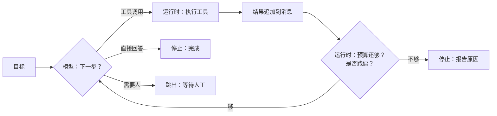

# 06 Agent 循环与控制流

> Agent 就是一个循环：模型决定下一步，运行时执行，把结果放回去，再问模型。这一课讲这个循环里哪些事归模型、哪些事归运行时，以及循环怎么停。停不下来的 Agent 不是 Agent，是事故。

## 为什么需要

没有明确停止条件的 Agent 会在失败时继续调用，直到预算耗尽或账单失控。循环必须能被读懂、能被测试，也必须由运行时决定何时停止。

## 学习目标

- 能说清循环里每一步是模型的责任还是运行时的责任
- 能设计步数、token、时间三种预算，并让循环停止时报告是哪一种耗尽了
- 能给工具失败分类，并为每一类指定一种确定性的恢复动作

## 前置

- [05 Tool Calling](../tool-calling/README.md)：工具契约和四个守卫，本课的循环建立在它们之上

## 怎么理解它



循环里只有一个菱形归模型：**下一步做什么**。其余全归运行时：执行、记账、判断该不该继续、决定怎么处理失败。把这个边界画清楚，Agent 的可靠性问题就变成了普通软件的可靠性问题。

三个要点：

**停止条件全部由运行时持有。** 模型「自然停下」是一种停止方式，但不能是唯一的。至少还要有步数上限、token 预算、时间预算，以及跑偏检测。每种停止都要有名字，让用户和日志知道为什么停的。

**失败要分类，恢复要确定。** 网络抖动重试就行；参数错了回给模型让它改；模型反复调同一个工具，再问它一次只会得到同样的结果，应该警告一次然后升级给人。三种情况用同一招「再问模型」，结果是烧钱、绕圈、然后超时。

**一个 Agent 管 3～10 步。** 上下文越长模型越容易跑偏，这是 12-factor 的 factor 10 反复强调的经验。任务大就拆成多个小 Agent，让确定性代码把它们串起来。这一点第 09 课和第 10 课展开。

还有一条来自 factor 08 的观察：循环不一定要一口气跑完。模型请求「问用户一个问题」或「部署到生产」时，正确做法是**跳出循环**，把状态存下来，等人回来再续。本课的循环还是单进程内的，怎么跨请求暂停和恢复是第 07 课的内容。

## 机制拆解

下面三段代码只为说明机制，省略了适配器、日志和类型定义，不能直接运行。

### 一、循环本身很短

```python
async def run_agent(model, goal, tools, max_steps):
    messages = [Message(role="user", content=goal)]

    for step in range(1, max_steps + 1):
        reply = await model.complete(messages, tools=tools)

        # 模型不再要工具，说明它认为任务完成了
        if not reply.tool_calls:
            return Result(stop_reason=FINISHED, answer=reply.content)

        messages.append(Message(role="assistant", tool_calls=reply.tool_calls))
        for call in reply.tool_calls:
            messages.append(run_tool(call))     # 执行归运行时

    # 走到这里说明模型一直在要工具，运行时替它踩刹车
    return Result(stop_reason=STEP_LIMIT)
```

十几行。复杂度不在循环本身，在循环外面的预算和路由。注意最后那个 `return`：它是整段代码里最重要的一行，因为它是唯一保证进程能结束的东西。

### 二、预算要在每轮结算之后检查

```python
@dataclass
class Budget:
    max_steps: int
    max_tokens: int
    max_seconds: float
    steps: int = 0
    tokens: int = 0
    started: float = 0.0

    def charge(self, tokens: int) -> StopReason | None:
        """记一轮账，返回第一个耗尽的预算；都没耗尽返回 None。"""
        self.steps += 1
        self.tokens += tokens
        if self.tokens > self.max_tokens:
            return StopReason.TOKEN_BUDGET
        if time.monotonic() - self.started > self.max_seconds:
            return StopReason.TIME_BUDGET
        if self.steps >= self.max_steps:
            return StopReason.STEP_LIMIT
        return None
```

循环里的用法是：模型返回后先 `charge(输入 token + 输出 token)`，拿到非 `None` 就带着这个原因停下。三种预算共用一个返回值，调用方不需要写三个 `if`。

`tokens` 要算输入加输出。只算输出是常见错误——历史随着轮次增长，输入才是主要开销。

### 三、失败分类决定恢复动作

```python
ROUTES = {
    Failure.TRANSIENT:     Route.RETRY,      # 网络抖动、限流、超时
    Failure.INVALID_INPUT: Route.FEEDBACK,   # 参数错了，模型能自己改
    Failure.OFF_TRACK:     Route.ESCALATE,   # 重复同一个调用，再问也没用
}

async def execute(call, tool, max_retries=2):
    for attempt in range(1, max_retries + 2):
        try:
            return ok(call, tool(call.arguments))
        except TransientError:
            await asyncio.sleep(0.05 * attempt)   # RETRY：退避后重来
        except ValueError as exc:
            return error(call, str(exc))          # FEEDBACK：把错误回喂给模型
    return error(call, "tool unavailable after retries")
```

跑偏检测放在循环里，不放在 `execute` 里，因为它要看的是**跨轮次**的历史：

```python
sig = f"{call.name}:{json.dumps(call.arguments, sort_keys=True)}"
if sig in seen:
    if warned:
        return "needs_human"          # 警告过一次还重复，升级给人
    warned = True
    messages.append(error(call, "你已经用同样的参数调过它了，换个做法"))
else:
    seen.add(sig)
    messages.append(await execute(call, tool))
```

签名用「工具名 + 规范化参数」。只看工具名会误判：一个正常的「读三个文件」任务会被当成死循环。

## 常见错误

**`while True` 加一个「模型总会停」的假设。** 真实模型不会故意不停，但会因为工具结果里的某句话进入循环——比如工具返回「请重试」。没有 `max_steps`，这个进程会一直跑到 API 额度耗尽。

**预算只在进入循环时检查一次。** 一轮里模型返回一个超长回答就直接突破预算。检查必须在每轮结算之后。

**把所有异常都 catch 成「工具失败，重试」。** 参数错误重试一百次结果一样；瞬时错误回给模型让它「修参数」，是让它修一个不存在的问题。异常类型不同，恢复路径就该不同。

**跑偏检测太敏感。** 只看工具名、或者用一个永不过期的 `set` 记全部历史，都会把合法的重复查询判成死循环。

## 取舍

- **步数上限设多少。** 太小任务做不完，太大失控成本高。经验值按任务类型分档：查询类 3～5，多工具协作 8～12，超过 15 步的任务应该拆。上限是安全网，不是目标。
- **重试的代价谁付。** 重试是拿延迟换成功率。给用户的实时对话里，一次重试可能就超出可接受的等待时间；后台任务则可以多重试几次。重试策略应该是循环的参数，不是写死的常量。
- **升级给人 vs 直接放弃。** 升级需要有人接，有人接就要有第 07 课的暂停机制。没有这个机制时，诚实的「我做不到」比假装完成好，也比无限等待好。

## 工程落地

从上面的示意代码到能上线，还差几件事：

- **每一次停止都要落一条结构化事件**，带上停止原因和当时的预算快照。事后排查「这次为什么只跑了两步」，靠的是这条记录，不是日志里的一句话。
- **预算要分层**：单次运行有预算，单个用户每天有预算，整个服务每月有预算。只做最里面那层，一个死循环的用户就能把整月账单打穿。
- **重试要带上幂等键**，否则「瞬时错误」的重试会把已经生效的副作用做第二遍。这是第 05 课工具契约的延续。
- **跑偏检测的窗口要可配**，不同任务类型的合理重复度差很多。
- **怎么测。** 每次运行记下停止原因和走了几步，按版本统计分布。改提示词或换模型之后，「平均步数从 3 涨到 7」「预算耗尽的比例从 2% 涨到 15%」这类退化只有这两个数字看得见——最终回答往往还是对的。

## 框架映射

| 本课概念 | LangGraph | OpenAI Agents SDK | Claude Agent SDK |
|---|---|---|---|
| 循环本身 | 图的 conditional edges | `Runner` | SDK 内部托管 |
| 步数上限 | `recursion_limit` | `max_turns` | `max_turns` |
| 停止原因 | 自己在 state 里记 | `RunResult` | 结果消息的 `subtype` |
| 失败路由 | 自己写节点 | 自己写 | 自己写 |

三个框架都不替你做失败分类和预算记账，这部分永远是你自己的代码。官方文档：[LangGraph](https://langchain-ai.github.io/langgraph/) · [OpenAI Agents SDK](https://openai.github.io/openai-agents-python/) · [Claude Agent SDK](https://docs.claude.com/en/api/agent-sdk/overview)（核对日期 2026-09-05）。

## 一线经验

语音机器人项目早期依赖模型「聊完自己停」，结果模型倾向于一直找话说，用户想结束对话要反复说「不聊了」。后来加了一个显式的退出工具：模型判断用户想结束时调用它，运行时收到后静默终止。这比在提示词里写「用户说再见时停止」稳定得多。

这就是「停止条件由运行时持有」的一个具体形态：给模型一个表达「我想停」的结构化出口，但停不停由代码决定。

另一个经验是任务型 Agent 的步数上限要比聊天型小得多。每一步都伴随一次设备动作，跑偏的代价是物理的。

## 参考实现

想看这一课的机制装进一个真实服务是什么样：参考实现的 [M3 Tool Workflow](https://github.com/lance2016/ai-app-engineering-ref/blob/main/project/m3-tool-workflow/README.md)，循环的步数与预算控制。

## 延伸阅读

- [12-factor-agents · factor 08 Own your control flow](https://github.com/humanlayer/12-factor-agents/blob/main/content/factor-08-own-your-control-flow.md)（访问日期 2026-09-04）：三种控制流形态的代码示例，「跳出循环等人」就出自这里。
- [12-factor-agents · factor 10 Small, focused agents](https://github.com/humanlayer/12-factor-agents/blob/main/content/factor-10-small-focused-agents.md)（访问日期 2026-09-04）：为什么一个 Agent 管 3～10 步，以及「模型变强了这条还成立吗」的回答。
- [Anthropic · Building effective agents](https://www.anthropic.com/engineering/building-effective-agents)（访问日期 2026-09-05）：循环与工作流的边界，第 09 课会详细展开。

---

[← 上一课 05](../tool-calling/README.md) · [下一课 07 →](../agent-state-and-runtime/README.md)
