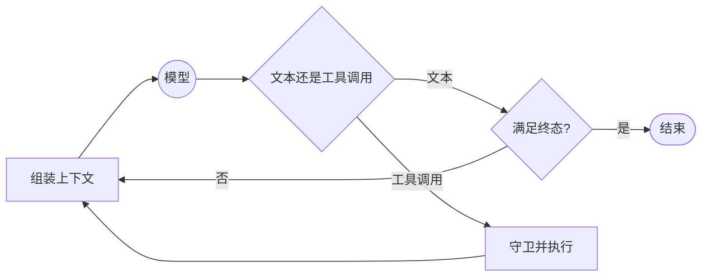

# 06 Agent 循环与控制流

> Agent 不是“模型自己跑起来了”，而是运行时反复执行：给模型上下文、读取下一步建议、执行或拒绝、记录结果，再决定是否继续。

<details class="case" markdown="1">
<summary>例子：模型一直说“再检查一次”，请求跑到步数上限才停止</summary>

每一轮看起来都有理由，但没有任何代码判断目标是否已经完成。最后停下的原因只是预算耗尽，用户得到一个没有结论的回答，账单却已经产生。

!!! note "构造的例子"
    循环行为用于说明停止条件；实际步数和成本取决于任务与模型。

</details>

## 循环真正负责什么



模型提出下一步，运行时决定是否接受。停止不是 Prompt 里的一句话，而是代码可观察的终态。

## 至少需要四种停止条件

| 条件 | 谁判断 | 例子 |
|---|---|---|
| 正常完成 | 代码和业务结果 | 必填字段齐全，验收通过 |
| 模型完成回答 | 运行时 | 没有工具调用且允许直接回答 |
| 预算耗尽 | 运行时 | 步数、时间、token 或金额超限 |
| 不可恢复失败 | 运行时 | 权限拒绝、上下文无法构造 |

不要只相信模型返回“完成”。把停止原因写进事件，才能解释一次运行为什么结束。

## 最小循环

```python
for step in range(budget.max_steps):
    if budget.exhausted():
        return finish("budget_exhausted")

    reply = model.complete(build_context(state), tools=registry.specs())
    if not reply.tool_calls:
        return finish("model_answer", reply.text)

    results = guard_and_execute(reply.tool_calls, state)
    state.append(reply, results)

return finish("step_limit")
```

这段代码是机制示意，省略了异步、持久化和错误细节，不能直接运行。循环的每个入口和出口都应留下可回放的事件。

## 错误先分类，再决定是否继续

- 参数错误：回传给模型修正，限制修正次数。
- 临时错误：按预算重试或降级。
- 权限错误：停止并说明需要谁处理。
- 外部结果未知：不要当成失败重做，进入查询或人工对账。

## 怎么测

准备能触发不同出口的样本：直接回答、一次工具、多次工具、工具错误、模型空输出、预算耗尽和取消。测：

- 每次运行是否有且只有一个终态；
- 终态原因是否和事件一致；
- 预算耗尽前是否停止产生新工具调用；
- 同一输入的步骤数、成本和失败率是否可比较。

## 参考实现与延伸

参考实现的循环、预算和工具工作流在 [M3 Tool Workflow](https://github.com/lance2016/ai-app-engineering-ref/tree/main/project/m3-tool-workflow)（核对日期 2026-09-10）。可对照 [12-factor-agents](https://github.com/humanlayer/12-factor-agents) 关于控制流和预算的原则（访问日期 2026-09-10）。

---

[← 上一课 05](../tool-calling/README.md) · [下一课 07 →](../agent-state-and-runtime/README.md)
