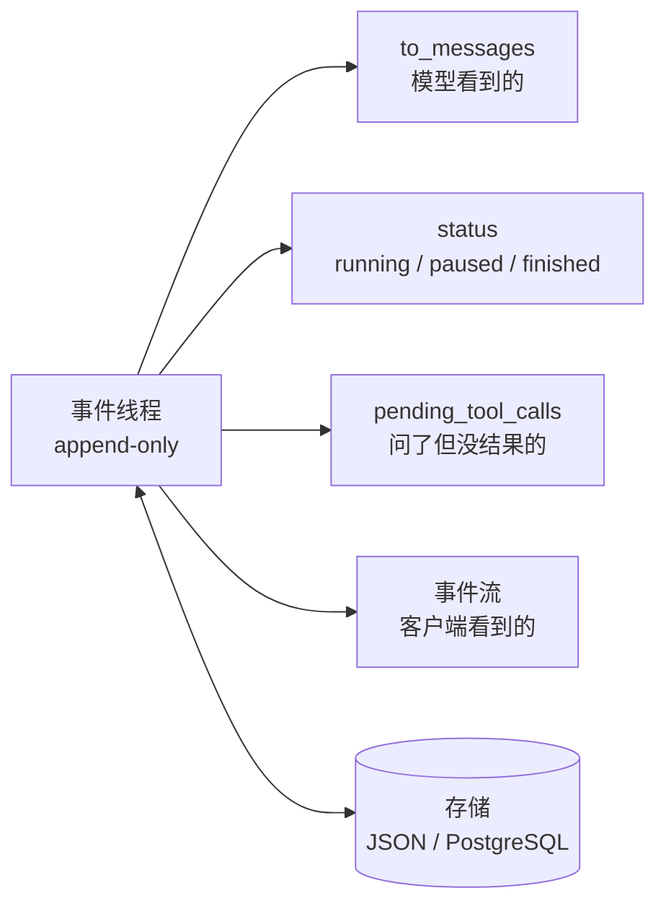
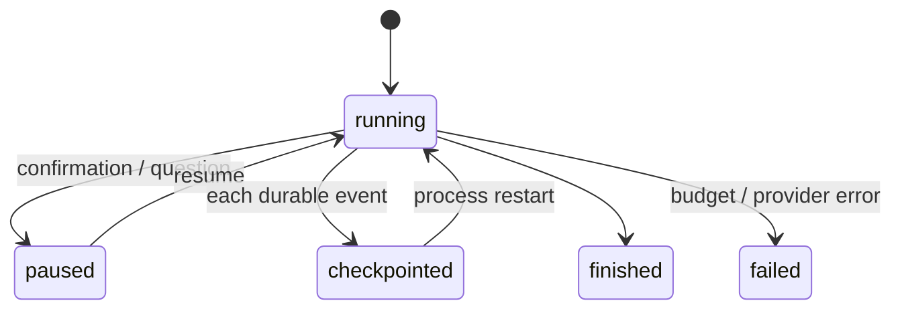

# 07 Agent State 与 Runtime：持久化、暂停恢复与人工介入

> 上一课的循环跑在一个进程里，停下就没了。这一课把状态从局部变量里拿出来，变成一份可以存盘、可以加载、可以从任意一点继续的事件记录。做到这一步，「等用户回来再继续」和「进程崩了接着跑」就成了同一件事。

<details class="case" markdown="1">
<summary>例子：Agent 问「哪一家？」，用户十二分钟后回答，它从头又问了一遍</summary>

一个订餐 Agent。`run()` 是跑在一次 HTTP 请求里的 async 函数，对话历史和「现在等用户答哪个问题」都是这个函数的局部变量。

| 时刻 | 发生了什么 |
|---|---|
| `T+0s` | 用户：「今晚订个两人位」 |
| `T+2s` | 模型调 `find_restaurants(party=2)`，运行时执行，拿回两家 |
| `T+3s` | 模型问「Noodle House 还是 Sea Breeze？」，`run()` 在这里等用户输入 |
| `T+30s` | 网关请求超时，连接断开，`run()` 的协程被取消 |
| `T+12min` | 用户从手机点开会话，回「Sea Breeze」 |
| `T+12min` | 新的一次请求，新的一个 `run()`，历史是空的 |
| `T+12min` | 模型：「好的，请问几位？」 |

`find_restaurants` 那次调用的结果既不在数据库里，也不在任何内存里——它跟着那个被取消的协程一起没了。用户等的十二分钟白等，那次工具调用的钱白花。

麻烦的是这不只在「等人」的时候发生。一次重新部署、一次 Pod 驱逐、一次 OOM，效果和上面这条时间线完全一样。

!!! note "构造的例子"
    这段时间线是为讲清机制编的。本课 [一线经验](#一线经验) 那一节才是作者自己的经历。

</details>

## 为什么需要

把状态留在局部变量里，进程退出、用户晚点回复、网络重试，都会让任务丢失或重复。事件、checkpoint 和恢复协议要先于框架抽象想清楚。

## 学习目标

- 能把 Agent 的状态建模为一个 append-only 的事件线程，并从它推导出模型消息、运行状态和待处理的工具调用
- 能实现跨进程的暂停与恢复：把「问用户」做成工具调用，checkpoint 到存储，另一个进程加载后继续
- 能说清 checkpoint 保证的是「本地事件不重复」，以及为什么「外部副作用不重复」要另外靠幂等键、状态查询或对账
- 能说出 double texting 的三种策略，并解释为什么「没有策略」等于「行为未定义」

## 前置

- [06 Agent 循环与控制流](../agent-loop/README.md)：循环结构、停止条件、「跳出循环等人」的伏笔
- [05 Tool Calling](../tool-calling/README.md)：幂等键。恢复时不重跑已执行的工具，靠的是同一个思路

## 怎么理解它



一句话：**发生过什么是唯一的事实，其他都是它的推导。** 这是 12-factor 的 [factor 05](https://github.com/humanlayer/12-factor-agents/blob/main/content/factor-05-unify-execution-state.md) 和 [factor 12](https://github.com/humanlayer/12-factor-agents/blob/main/content/factor-12-stateless-reducer.md) 合起来的意思。

运行时不维护「当前第几步、是否在等用户」这类变量，需要时从事件列表里算。好处是存盘只存一个列表，恢复只加载一个列表，界面展示和日志排障看的也是同一个列表——它们永远不会对不上。

在这个模型上，四件事变得很自然：

### 问人是一个工具调用

模型输出 `request_human_input(question=...)`，运行时记一条 `human_input_requested` 事件，存盘，退出。它和调用 `find_restaurants` 唯一的区别是结果不是立刻有的。factor 07 把这叫「用工具调用联系人类」。

### 暂停发生在选好工具和执行之间

模型已经说了要做什么，运行时还没做。在这个点上存盘，恢复时先看待处理的调用：有结果的跳过，没结果的执行。所以进程在任何一步崩掉都能接上。

**「有结果的跳过」这句话里藏着一个前提：结果已经落盘。** 崩在「外部动作已经做完、结果还没写进线程」那一瞬间，这次调用在恢复时看起来和从没执行过一样。这个窗口消不掉，只能管住，见机制拆解第三节。

### 恢复就是「加载，然后继续 fold」

没有特殊的恢复逻辑。同一个 `run()` 函数，传入一个新线程就是启动，传入一个加载回来的线程就是恢复。

### 客户端看的是同一份事件

循环每 append 一条就 yield 一条，前端拿到的进度和存进数据库的记录是同一个对象。不需要再发明一套 progress 结构。



## 机制拆解

### 一、事件是事实，其余全是推导

一段跑到一半的对话，事件线程长这样：

```python
t.append("user_message",      content="Book me a table for two tonight.")
t.append("assistant_message", tool_calls=[{"id": "c1", "name": "find_restaurants",
                                           "arguments": {"party": 2}}])
t.append("tool_result",       tool_call_id="c1", content='["Noodle House", "Sea Breeze"]')
t.append("assistant_message", tool_calls=[{"id": "c2", "name": "request_human_input",
                                           "arguments": {"question": "哪一家？"}}])
t.append("human_input_requested", tool_call_id="c2", question="哪一家？")
```

三个推导方法，加起来二十几行：

```python
def to_messages(self) -> list[Message]:
    """模型看到的。运行时专用事件在这里被过滤掉。"""
    ...

def pending_tool_calls(self) -> list[ToolCall]:
    """问了但还没有结果的调用 —— 恢复时从这里继续。"""
    asked = {c.id: c for e in self.events if e.type == "assistant_message"
                    for c in e.tool_calls}
    answered = {e.data["tool_call_id"] for e in self.events
                if e.type in ("tool_result", "human_input")}
    return [c for cid, c in asked.items() if cid not in answered]

def status(self) -> str:
    """running / paused / finished —— 算出来的，没有对应字段。"""
    ...
```

`status()` 是算出来的，这一点很关键。它没有对应的存储字段，所以不存在「数据库说在等用户、事件里却没有提问」这种不一致。

### 二、暂停恢复：同一个函数，两种入口

```python hl_lines="4"
async def run(thread, model, max_steps=6):
    while thread.steps() < max_steps:
        # ① 先把模型已经要求、但还没结果的调用处理掉
        for call in thread.pending_tool_calls():
            if call.name == "request_human_input":
                thread.append("human_input_requested",
                              tool_call_id=call.id, question=call.arguments["question"])
                thread.save(CHECKPOINT)
                return                       # 暂停：存盘后直接退出进程
            thread.append("tool_result", tool_call_id=call.id, content=execute(call))
            thread.save(CHECKPOINT)          # 每记一条结果就 checkpoint

        # ② 再问模型下一步
        reply = await model.complete(thread.to_messages(), tools=TOOLS)
        thread.append("assistant_message", content=reply.content,
                      tool_calls=reply.tool_calls)
        thread.save(CHECKPOINT)
        if not reply.tool_calls:
            thread.append("run_finished", answer=reply.content)
            thread.save(CHECKPOINT)
            return
```

启动和恢复的差别只在调用方：

```python
if CHECKPOINT.exists():
    thread = Thread.load(CHECKPOINT)
    if thread.status() == "paused":
        pending = thread.pending_tool_calls()[0]
        thread.append("human_input", tool_call_id=pending.id, content=user_answer)
else:
    thread = Thread()
    thread.append("user_message", content=goal)

await run(thread, model)      # 同一个函数
```

第 ① 步那个循环是整段的核心：它让「恢复」不需要任何特殊逻辑。结果已经落盘的调用不在 `pending_tool_calls()` 里，不会被再执行一次。

### 三、checkpoint 保证的是本地，外部副作用要另外管

第 ① 步只能保证一件事：**同一个 `call.id`，结果落盘之后不会再执行一次**。它管的是线程里的记录。外部世界那一侧，运行时给不出同样的承诺。

窗口在这里：

```text
execute(call) ──外部动作已经发生──▶ append("tool_result") ──▶ save()
                     ↑ 崩在这里：钱已经出去了，线程里一条记录都没有
```

恢复时这次调用还在 `pending_tool_calls()` 里，看起来和从没执行过一样，于是又跑一遍。把顺序倒过来（先记后执行）会换成另一种坏法：记了却没执行，恢复时这次调用被当成已完成跳过，一个该发生的动作静默消失。漏做比重做难查得多，所以通行的选择是宁可重做，再想办法让重做无害。

第一步是承认存在第三种状态——这次调用**做没做，本地不知道**：

```python
for call in thread.pending_tool_calls():
    if thread.started(call.id):                    # 上次崩在执行途中
        state = probe(call, key=idem_key(call))    # 拿键去外部系统查这笔成没成
        if state.done:
            thread.append("tool_result", tool_call_id=call.id, content=state.result)
            thread.save(CHECKPOINT)
            continue                               # 查到了，补一条记录就行
        if state.unknown:
            thread.append("needs_reconciliation",  # 查不出来：停下，别赌
                          tool_call_id=call.id, key=idem_key(call))
            thread.save(CHECKPOINT)
            return
    thread.append("tool_started", tool_call_id=call.id, key=idem_key(call))
    thread.save(CHECKPOINT)                        # 先落一条「我要做了」
    thread.append("tool_result", tool_call_id=call.id, content=execute(call))
    thread.save(CHECKPOINT)
```

三条路，按代价从低到高：

- **外部幂等键（第 05 课）。** 重跑带同一个键，外部系统自己去重。最省事，前提是对方支持这个键。
- **`tool_started` 事件。** 多一次写，换来「上次崩在这一步」这个信息。它和 outbox 是同一个思路：先在自己这边留下意图，再动外部。窗口没消失，只是坏法从「做了没记」变成「记了没做」，而后者查得出来。
- **状态查询加对账。** `probe` 拿幂等键或业务 id 去问外部系统。查不出来的（对方没有查询接口、或者查询也超时）落一条 `needs_reconciliation`，交给定时对账任务和人，别在恢复路径上赌一次。

有一个特例可以省掉整层：副作用就在自己的数据库里。那时把业务写入和事件 append 放进同一个事务，两件事一起成功或一起失败，窗口根本不存在。跨进程、跨系统的副作用才需要上面三条。

**什么时候别上这一层。** 只读工具（查天气、检索、读文件）重跑只多花一点钱；幂等的写（把状态设成 X、覆盖一个 key）重跑也无害。这一层是为不可逆、又不幂等的动作准备的：付款、发消息、下单、删除。给所有工具都套三段式，多一倍的写入换不到任何东西。

### 四、事件流就是同一份事件

```python
async def run_streaming(thread, model) -> AsyncIterator[Event]:
    """和上面同一个循环；每次 append 的同时 yield 给监听方。"""
    yield thread.append("run_started")
    for _ in range(6):
        reply = await model.complete(thread.to_messages(), tools=tools)
        yield thread.append("assistant_message", content=reply.content,
                            tool_calls=reply.tool_calls)
        if not reply.tool_calls:
            yield thread.append("run_finished", answer=reply.content)
            return
        for call in reply.tool_calls:
            yield thread.append("tool_result", tool_call_id=call.id,
                                content=execute(call))
```

`thread.append()` 返回它刚追加的事件，所以 `yield thread.append(...)` 一行同时做了两件事。这个小设计保证了**流和存储不可能不一致**——它们是同一个对象。

客户端那边格式化成 SSE 就行：

```python
def as_sse(event) -> str:
    return f"event: {event.type}\ndata: {json.dumps(event.data, ensure_ascii=False)}\n"
```

### 五、double texting 的三种策略

用户在第一次运行还没结束时又发了一条。三种做法：

```python
async def handle_second_message(thread, current: asyncio.Task, text: str):
    if POLICY == "reject":
        await current                       # 直接丢弃第二条，第一次运行继续

    elif POLICY == "enqueue":
        await current                       # 等第一次跑完
        thread.append("user_message", content=text)
        await run(thread, model)            # 再跑第二次

    elif POLICY == "interrupt":
        current.cancel()
        with contextlib.suppress(asyncio.CancelledError):
            await current
        done = sum(1 for e in thread.events if e.type == "tool_result")
        thread.append("run_interrupted", completed_tool_results=done)
        thread.append("user_message", content=text)
        await run(thread, model)            # 已完成的工具结果留在线程里，不浪费
```

看 interrupt 那一支里的 `completed_tool_results`：**被打断不等于前面白干**。已经拿到的工具结果留在事件线程里，第二次运行的模型能看到它们。

不选任何一种策略，第二条消息会在第一次运行还在写线程时被追加进去，两个循环交错写同一个列表。代码里没有任何一行决定过这时候该怎么办，所以这个行为是未定义的。

## 常见错误

**把「工具不会重跑」当成 checkpoint 的承诺。** 它承诺的只是「结果落盘的调用不再执行」。`execute()` 和 `save()` 之间那一瞬间崩掉，外部动作已经发生，线程里没有记录，恢复时照样会再跑一次。运行时做不到「执行和记录」原子化，所以这件事要靠幂等键、`tool_started` 加状态查询、或者对账来管，见第三节。

**把「做没做不知道」当成「没做」。** 这是上一条的具体形态：`probe` 查不出结果时直接重跑，一笔付款就可能出两次。未知是第三种状态，它的正确去处是人工对账队列。

**恢复时重放所有事件的副作用。** 有人把「恢复」实现成「从头把每条事件再执行一遍」。**事件是记录，不是指令。** 恢复只是把列表加载进内存，然后从待处理的调用继续。

**执行状态另存一份。** 比如在线程之外再存一个 `status` 字段。两处只要有一次没同步，Agent 就会卡在一个自相矛盾的状态里。

**double texting 没有策略。** 见上。

## 取舍

- **这一整套值不值得上。** 一次分类、一次翻译、一次摘要——同步调完就返回、没有副作用、几秒内结束的活，事件线程是纯负担，直接调完返回。判据是问一句：这件事跑到一半掉了，重跑一遍的代价是什么？可以忽略就别上。这一课的东西是为「会等人、会崩、会重启、要审计」的任务准备的，那时候它省下的是排查时间。
- **每步存盘 vs 只在暂停时存盘。** 每步存盘让任意点崩溃都能恢复，代价是每一步多一次写。对话类 Agent 步数少，每步存没问题；长任务可以按阶段存，但要接受阶段内崩溃会重做。
- **interrupt vs enqueue。** interrupt 响应快，用户改主意时立刻生效，但已经花掉的模型调用作废；enqueue 不浪费，但用户要等第一轮跑完。聊天场景通常 interrupt，后台任务通常 enqueue。reject 最简单，适合「一次只能有一个操作在进行」的场景，比如支付。
- **三段式写入要不要给所有工具都上。** `tool_started` + `probe` 让崩溃窗口可查，代价是每次工具调用多一次写、多一次外部查询，还多一个恢复分支要维护。按工具分：不可逆且不幂等的（付款、发消息、下单、删除）上，只读和幂等的不上。全上等于给查天气也交一份保险费。
- **线程里放多少东西。** factor 05 建议尽量把执行状态都放进线程，但 session id、密钥、大文件这类东西不该进模型上下文。`to_messages()` 是过滤器：线程里可以有运行时专用事件，模型看不到。第 08 课会在这个过滤器上做更多事。
- **模型列的清单归哪一类。** 模型输出的「接下来要做这五件事」和工具结果一样，是发生过的事实，追加进线程就行。「其中哪几件做完了」则要从后续事件推导，别单独存一份跟着它同步——上面那条「执行状态另存一份」说的就是这个。清单要活过压缩是另一件事，归第 08 课的 `protected` 管。整套机制在第 10 课。

## 工程落地

- **JSON 文件换成数据库表**时，`run()` 一行都不用改——这正是把存储抽象成 `save()` / `load()` 两个方法的收益。
- **并发写要有乐观锁**。`(conversation_id, seq)` 上加唯一约束，`append(event, expected_seq=n)` 冲突就失败重读。两个写者只有一个能赢，这比事后对账便宜得多。
- **`status` 字段可以有，但只能是缓存**。事实来源永远是事件列表。加这个字段是为了让「列出所有 paused 的会话」不用扫全表。
- **人工介入有两种，不要混。** 「问用户一个问题」的答案本身就是工具结果；「批准一个副作用」批准之后工具还要真的跑。两者的恢复路径不同，事件字段也该不同。
- **事件表只增不改**，这让审计和回放天然成立。要改就追加一条修正事件。
- **怎么测。** 用一个记调用次数的假工具，跑一段跑到一半的事件线程，断言四件事：从 checkpoint 加载后结果已落盘的工具没有跑第二遍、`to_messages()` 的输出和崩溃前逐字相同、两个写者并发 `append(expected_seq=n)` 只有一个成功、以及一条只有 `tool_started` 没有 `tool_result` 的线程在恢复时先走 `probe` 而后决定要不要重做（`probe` 返回 unknown 时线程停在 `needs_reconciliation`）。四条都不需要模型，一秒内跑完，能进 CI（第 19 课）。

## 框架映射

| 本课概念 | LangGraph | OpenAI Agents SDK | Claude Agent SDK |
|---|---|---|---|
| 状态持久化 | `checkpointer`（SQLite / Postgres） | `RunState` 序列化 + `Session` 存历史 | `session_id` + resume |
| 暂停 | 节点里 `interrupt()` | `needs_approval` 或 `StopAtTools` | `can_use_tool` 回调返回 deny |
| 恢复 | 从 `interrupt()` 处接上要传 `Command(resume=值)`；只是接着跑完未完成的 checkpoint 才传 `None` | `RunState.from_string()` | `resume=session_id` |
| 事件流 | `astream_events` | `Runner.run_streamed` | 消息流 |

LangGraph 在这一层做得最完整，但恢复的粒度要看清：**checkpoint 存的是节点边界，不是语句**。resume 时那个节点从头重跑，`interrupt()` 之前的语句会再执行一遍——它自己的文档给的建议就是把 `interrupt()` 放在节点最前面，或者让前面的动作幂等。节点里有多个 `interrupt()` 时，resume 的值按它们在节点里的出现顺序匹配。这一层的问题和本课第三节是同一个：框架能保证自己的状态不错乱，保证不了你在节点里调的那个外部接口只发生一次。官方文档：[LangGraph · Interrupts](https://docs.langchain.com/oss/python/langgraph/interrupts) · [OpenAI Agents SDK](https://openai.github.io/openai-agents-python/) · [Claude Agent SDK](https://docs.claude.com/en/api/agent-sdk/overview)（核对日期 2026-09-09）。

## 一线经验

语音机器人项目早期把「当前在哪个子 Agent」「是否在等用户确认」这类执行状态存在一个单独的状态对象里，和对话历史分开。一次部分失败之后两边不一致，机器人反复问同一个问题。

修法是把这些状态都改成从历史推导，单独的状态对象只留缓存作用，不再是事实来源。

另一个和 double texting 直接相关的场景：语音输入天然会出现用户在机器人说话时插话。那里用的是 interrupt 策略，但保留了被打断之前已经完成的工具结果——和上面 interrupt 分支的做法一样。

## 参考实现

事件线程的存储协议在 [`storage/base.py`](https://github.com/lance2016/ai-app-engineering-ref/blob/main/project/src/aiapp/storage/base.py)，PostgreSQL 实现在 [`postgres.py`](https://github.com/lance2016/ai-app-engineering-ref/blob/main/project/src/aiapp/storage/postgres.py)，幂等键和「一个线程同时只有一个运行」的锁在 [`redis_kv.py`](https://github.com/lance2016/ai-app-engineering-ref/blob/main/project/src/aiapp/storage/redis_kv.py)。内存版和数据库版共用同一组契约测试（[`m2/test_thread_store_contract.py`](https://github.com/lance2016/ai-app-engineering-ref/blob/main/tests/project/m2/test_thread_store_contract.py)、[`test_kv_contract.py`](https://github.com/lance2016/ai-app-engineering-ref/blob/main/tests/project/m2/test_kv_contract.py)），每步存盘的取舍记在 [M2 数据与状态](https://github.com/lance2016/ai-app-engineering-ref/blob/main/project/m2-state-and-storage/README.md)。

## 延伸阅读

- [12-factor-agents · factor 05 Unify execution state and business state](https://github.com/humanlayer/12-factor-agents/blob/main/content/factor-05-unify-execution-state.md)（访问日期 2026-09-04）：本课那张事件线程图的出处，列了七个好处。
- [12-factor-agents · factor 06 Launch/Pause/Resume](https://github.com/humanlayer/12-factor-agents/blob/main/content/factor-06-launch-pause-resume.md) 与 [factor 07 Contact humans with tools](https://github.com/humanlayer/12-factor-agents/blob/main/content/factor-07-contact-humans-with-tools.md)（访问日期 2026-09-04）：注意 factor 06 那条备注——很多编排器允许暂停，但不允许在「选好工具」和「执行工具」之间暂停。
- [12-factor-agents · factor 12 Stateless reducer](https://github.com/humanlayer/12-factor-agents/blob/main/content/factor-12-stateless-reducer.md)（访问日期 2026-09-04）：作者自己说「这条主要是好玩」，但本课的事件线程就是照它写的。
- [LangGraph · Persistence](https://langchain-ai.github.io/langgraph/concepts/persistence/) 与 [Human-in-the-loop](https://langchain-ai.github.io/langgraph/concepts/human_in_the_loop/)（访问日期 2026-09-05）：同一组问题的框架化回答，值得对照看它的 checkpoint 粒度选择。

---

[← 上一课 06](../agent-loop/README.md) · [下一课 08 →](../context-engineering-for-agents/README.md)
