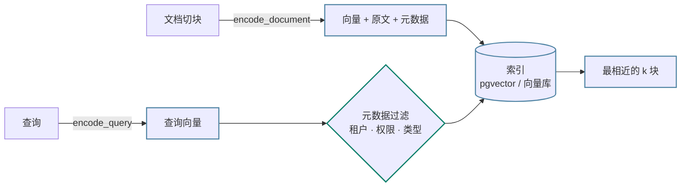
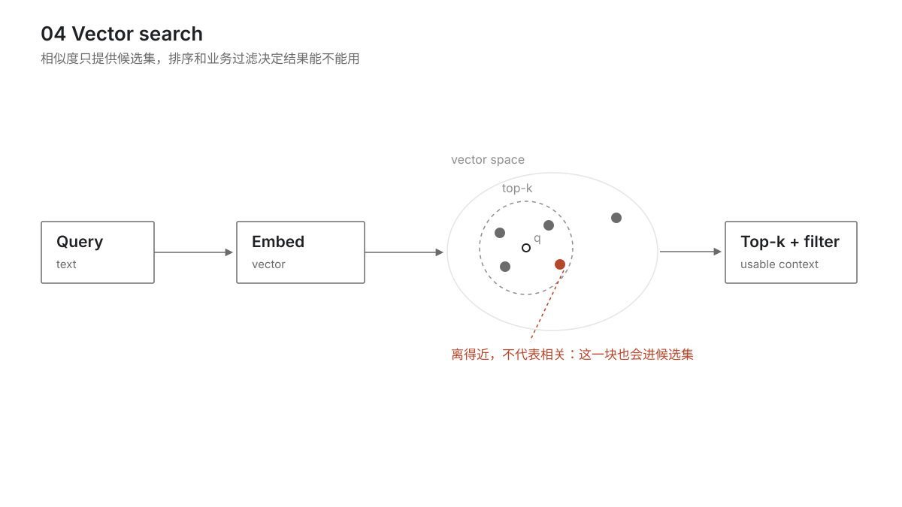

<div class="lesson lesson--part1" markdown="1">

# 04 Embedding 与向量检索基础

> 这一课只讲工程：怎么选模型和维度、什么时候该从精确检索换成近似索引、切块怎样改变召回、pgvector 怎么建表建索引，以及向量检索什么时候不好使。为第 15 课 RAG 和第 16 课 Memory 打底。

<details class="case" markdown="1">
<summary>例子：查「重置密码」，同义的那条漏了，词一样的那条反而排第一</summary>

查询 `how do I reset my password`，库里四个候选，按余弦相似度排下来是这样：

| 余弦 | 候选 | |
|---:|---|---|
| 高 | steps to reset your password | 共享词多，排对了 |
| ~0 | I forgot my login credentials | 同义，但没共享词，漏了 |
| 高 | how do I reset my router | 共享词，但意思不同，假阳性 |
| ~0 | quarterly revenue grew by twelve percent | 确实无关 |

第一行和第四行都对，错在中间两行。这里用的「embedding」是个哈希词袋：把每个词哈希进 64 个桶之一，计数，再归一化（代码在下面第一节）。它只认字面，所以「忘记登录凭据」离得远，「重置路由器」离得近。

**中间两行就是你付钱给 embedding 模型的理由。**

!!! note "构造的例子"
    上面这四条候选和后面几段文档、SQL 都是为讲清机制编的。「换了模型，忘了重灌旧向量」那一节是真事。

</details>

合适的 embedding 模型通常能把同义的说法拉近、把只是共享词的推远，这类字面上的错会少很多。但换上它之后，剩下的问题一个都不会自动消失：查询和文档得落进同一个空间、切块粒度决定召回、换近似索引的时机得压测才知道、`ERR-5012` 这类查询向量检索本来就不擅长。换个更强的模型修不了错误的切块粒度，也修不了过时的向量。这一课讲的是这几件事。

<div class="lesson-meta" markdown="1">

## 向量检索的三个判断 { .lesson-meta__heading }

- 能为一个场景选 embedding 模型和维度，说出托管与自部署的取舍，以及换向量空间的迁移成本
- 能实现精确 top-k 检索，并说出用什么办法判断该不该换成近似索引
- 能说明切块大小如何改变检索结果，以及哪类查询用关键词检索比向量检索更合适
- 能写出 pgvector 建表、建索引和带过滤条件查询的 SQL

## 需要补哪一点向量基础 { .lesson-meta__heading }

- 这一课不解释向量为什么能比较、余弦为什么先归一化、embedding 层和文本 embedding 模型差在哪。要补就翻 [F02 Embedding 与向量空间](../../prerequisites/llm-foundations/02-embeddings/README.md)，不用先读完再回来

</div>

## 四个工程事实 { .section--concept }



[F02](../../prerequisites/llm-foundations/02-embeddings/README.md) 讲了向量为什么能比较，也讲了归一化之后余弦就是点积（pgvector 的 `<=>` 算的是余弦距离，等于 1 减余弦相似度；存归一化后的向量可以用内积代替，省一次开方）。这里补四个工程事实。

### query 和 document 要落进同一个空间

通常要保持同模型、同版本、同维度和同归一化方式。但「同一个模型」不等于「同一段代码」——有一类模型做的是非对称检索，编码查询和编码文档的输入不一样：有的要求查询加一个前缀（`query: `），有的要传 `task_type` 或 `input_type` 参数，有的干脆是两个 encoder。这类模型上要是两边都按文档的方式编码，相似度会明显变差，而且不报错。

所以心智模型不是 `embed(query) == embed(document)`，是两个函数：

```text
encode_query(text)     ─┐
                        ├─→ 同一个可比较的向量空间
encode_document(text)  ─┘
```

两个函数可以是同一段代码，也可以不是。能不能比，看它们产出的向量在不在同一个空间。选模型之前先翻文档，看它分不分 query 和 document。

### 先跑精确检索，压测说了算

暴力法把查询向量和每一条比一遍，对当前候选集合能得到精确结果。什么时候该换成近似索引，**没有一条「多少万条以内」的分界线**：同样十万条向量，Python 循环、NumPy 批量、pgvector、专用向量库的延迟能差几个数量级，还要看维度、内存、并发和过滤条件。顺序是：跑精确检索 → 压出延迟和吞吐 → 和 SLO（你对用户承诺的延迟上限，第 21 课细说）比 → 超了再上索引。

### 向量检索不等于搜索

它擅长「意思相近」，不擅长「一模一样」。

| | 擅长 | 不擅长 |
|---|---|---|
| 关键词检索（BM25 这类） | 订单号、型号、错误码、人名、代码符号、精确术语 | 换个说法就找不到 |
| 向量检索 | 同义、换种说法、有时还能跨语言 | 精确匹配一串 ID；罕见词会被拉到「看着像」的东西上 |
| 两者混合 | 很多生产场景 | 多一套索引、一套融合排序要维护 |

用户搜 `ERR-5012`，纯向量检索很可能返回一堆长得像错误码的东西。它和词袋的短板正好倒过来：词袋只认字面，向量只认意思，而这类查询要的恰恰是字面。这一课只建立这个意识，怎么混合、怎么重排是第 15 课。**学完这一课别得出「搜索 = embedding + 余弦」的结论。**

### 过滤是检索的一部分

真实查询几乎从来不是「在全部向量里找 top-k」，而是「在这个租户、这个用户有权看的、这一类文档里找 top-k」。过滤条件和向量一起决定结果，也影响索引怎么用，见下面第四节的 SQL。



## 从词袋到 pgvector { .section--practice }

### 一、先写七行词袋，看它坏在哪

下面的词袋只为说明相似度，省略了导入和 tokenizer，不能直接运行。

```python
DIM = 64

def embed(text: str, dim: int = DIM) -> list[float]:
    """把每个 token 哈希进 dim 个桶之一，计数，再做 L2 归一化。"""
    vec = [0.0] * dim
    for tok in tokenize(text):
        bucket = int(hashlib.md5(tok.encode()).hexdigest(), 16) % dim
        vec[bucket] += 1.0
    norm = math.sqrt(sum(v * v for v in vec)) or 1.0
    return [v / norm for v in vec]         # 不归一化，长文本会天然占便宜
```

<details class="case" markdown="1">
<summary>例子：查「重置密码」，「忘记登录凭据」一个词都不沾，得分就是零</summary>

查 `how do I reset my password`，候选 `I forgot my login credentials` 和它一个词都不共享，每个词哈希到别的桶去了，点积为零——同义在词袋里没有任何表示。

`how do I reset my router` 共享 `how`、`do`、`I`、`reset`，四个桶都撞上，所以分数高。它和目标文档的差别只在一个词（`router` 对 `password`），而词袋对这个词和对 `how` 一样对待。

最后那句归一化不能省：不做的话向量模长跟着文本长度涨，长文档会莫名靠前。

</details>

从概念上，真实模型替换的是编码器；索引、过滤和迁移这些工程约束仍然存在，维度或 query/document 规则变化时还要同步调整实现。

### 二、精确检索先跑起来

```python
class VectorIndex:
    def __init__(self):
        self._rows: dict[str, list[float]] = {}
        self.comparisons = 0

    def add(self, doc_id, text):
        self._rows[doc_id] = embed(text)

    def search(self, query, k) -> list[tuple[float, str]]:
        q = embed(query)
        scored = []
        for doc_id, vec in self._rows.items():
            self.comparisons += 1              # 每次查询比 N 次
            scored.append((cosine(q, vec), doc_id))
        return heapq.nlargest(k, scored)
```

每次查询 O(N) 次比较。`heapq.nlargest` 而不是全排序，是因为 k 通常远小于 N。

**别拿这段代码的耗时去估生产延迟。** 它每条向量都要走一遍 Python 解释器循环；换成 NumPy 批量点积、pgvector 或专用向量库，同样的 N，延迟能差几个数量级。同理也别背「多少万条以内不用建索引」——用自己的数据、维度、并发和过滤条件压一遍，和 SLO 比，超了再上索引。

先跑精确检索还有一个好处：它的结果就是召回 100% 的基准。之后换近似索引掉了多少召回，是拿它当分母算出来的。

### 三、切块大小是检索参数

同一份文档，两种切法，同一个查询，结果不同：

```python
DOCUMENT = ("Our return policy allows refunds within thirty days. "
            "Shipping is free for orders above fifty dollars. "
            "Gift cards never expire and can be used online or in store. "
            "To reset your password use the link on the login page. "     # ← 目标句
            "Loyalty points are earned on every purchase.")

DISTRACTOR = "Password managers help you keep unique passwords for every site."

def one_chunk(text):   return [text]
def by_sentence(text): return [s.strip() for s in re.split(r"(?<=\.)\s+", text) if s.strip()]
```

查询 `"how to reset password"`：

- **整块切**：文档确实包含答案，但它的向量是五个话题的平均值。那个纯讲密码的干扰项反而排第一。
- **按句切**：目标句单独成块，向量只表达一件事，排第一。

这就是「一个 chunk 只讲一件事」这条经验的来源。第 15 课会把它展开成完整的切块策略。

### 四、pgvector 的最小用法

用 PostgreSQL 加 [pgvector](https://github.com/pgvector/pgvector) 存向量，一个库同时管业务数据和检索。核心 SQL 是这几句：

```sql
CREATE EXTENSION IF NOT EXISTS vector;

CREATE TABLE chunks (
    id                 bigserial PRIMARY KEY,
    tenant_id          text NOT NULL,   -- 过滤条件，几乎每个查询都要带
    doc_id             text NOT NULL,   -- 按文档删除靠它，见第 17 课
    embedding_space_id text NOT NULL,   -- 模型 + 版本 + 维度 + 预处理，见下面的上线清单
    content            text NOT NULL,
    embedding          vector(1024)     -- 维度写死在表定义里
);

-- 近似索引；先不建也能查，精确扫描的结果还能当召回基准
CREATE INDEX ON chunks USING hnsw (embedding vector_cosine_ops);
CREATE INDEX ON chunks (tenant_id, embedding_space_id);   -- 过滤字段也要有索引

-- <=> 是余弦距离，越小越近
SELECT id, content, 1 - (embedding <=> $1) AS similarity
FROM chunks
WHERE tenant_id = $2 AND embedding_space_id = $3          -- ← 先圈范围，再谈相似度
ORDER BY embedding <=> $1
LIMIT 5;
```

**那句 `WHERE` 不是可选的。** 少了它，一个用户能检索到另一个用户的文档；混了向量空间，名次直接变成噪音。使用 pgvector 近似索引时，索引会先扫描候选，再应用 `WHERE` 过滤，条件很窄时可能返回不足 k 条，甚至空结果。pgvector 0.8+ 提供 iterative scans 来扩大扫描范围，但是否够用仍要在自己的数据上压测。

**维度写死在表定义里。** 换 embedding 空间通常意味着建一份新索引重灌数据，怎么迁见下面的上线清单。

索引选哪种，最小的取舍是这三行：

| | 召回 | 查询延迟 | 内存 | 写入 / 构建 | 要调的参数 |
|---|---|---|---|---|---|
| 精确（不建索引） | 100% | 随 N 线性涨 | 低 | 便宜 | 没有 |
| HNSW | 高，可调 | 好 | 高 | 慢，吃内存 | `m`、`ef_construction`、`ef_search` |
| IVFFlat | 中等，看探查数 | 好 | 相对低 | 要先有数据训练聚类 | `lists`、`probes` |

没有哪一行是「更好」的，参数也必须在自己的数据上调。向量库怎么选、参数怎么调，超出这一课的范围。

## 典型检索为什么会错 { .section--risk }

**查询和文档不在同一个向量空间。** 换了模型、换了版本、维度不一样、非对称模型少加了那个 `query: ` 前缀——任何一条都会让相似度变成噪音。最难发现的是最后一条：代码跑得通，分数也有高有低，只是名次没意义。

**没归一化就比点积。** 长文本的向量模长大，点积天然偏高，长句子会莫名靠前。

**切块只按长度切。** 500 字一刀，切口正好落在句子中间，两边都残缺。按语义边界（段落、句子、标题层级）切，长度只作为上限。

**把玩具向量当真。** 用词袋做语义检索，用户换个说法就搜不到，搜出来的还常是只共享了几个词、意思不相干的东西。玩具是用来理解机制的，上线用真实模型。

**拿向量检索当全文搜索用。** 用户输入订单号、错误码、型号时，向量检索返回的是「长得像」的东西。这类查询要么走关键词索引，要么先用规则识别出来直接精确匹配。

**查询不带过滤条件。** 多租户系统里这是一个权限漏洞，不是性能问题。加了过滤又没测过窄条件下的召回，会出现「明明有这条数据却搜不到」。

## 托管还是自部署，精确还是近似 { .section--decision }

- **托管 embedding 还是自部署。** 托管接口通常按 token 计费、运维少，但数据要发给供应商；自部署开源模型（bge、gte 系列）可以把数据留在自己的环境，要自己管 GPU 和版本。低敏感数据先验证效果时可从托管开始，合规或成本要求变化后再比较自部署。
- **维度大小。** 同一个模型截断到更低维度，通常会掉一点精度，换来的是存储、索引内存和比较时间同比例下降。注意这条只在同一个模型内部成立：跨模型比维度没有意义，768 维的模型完全可能比 1536 维的准。很多模型支持调用时指定较低维度，掉多少、省多少，在自己的数据上测。
- **精确还是近似。** 判断依据是压测，不是数据量。先跑精确检索，量出延迟、吞吐和带过滤条件时的表现，和 SLO 比。超了再上索引，同时接受召回不再是 100%——上之前用精确检索的结果当分母，量一下 Recall@k（正确答案落在前 k 条结果里的比例）掉了多少。参数在自己的数据上调，抄别人的值没有意义。
- **纯向量还是加上关键词。** 只上向量最省事，一套模型一套索引；加关键词检索和融合排序，`ERR-5012` 那类查询才救得回来，代价是两套索引、两套参数，还要决定怎么融合，中文场景还多一层分词。什么时候值得，第 15 课有完整判断。

## 从一张表到能上线 { .section--practice }

- **每条向量记一个 `embedding_space_id`**，查询时按它过滤。这个 id 由模型、版本、维度、预处理方式（归一化、query/document 前缀怎么加）一起拼出来。只记一个模型名不够：同一个模型换个维度、改个前缀，产出的向量就和旧的不能比了。**不能混的是空间，不是名字。**
- **换空间用并行迁移，不要原地改。** 顺序是：建一份新索引（新表或新 collection）→ 后台回灌全量向量 → 双跑一段时间，用同一组样本比新旧的 Recall@k → 切读流量 → 观察 → 删旧的。这样任何一步出问题都能切回去。数据库能不能改列不是重点，重点是迁移期间要有两份可比较的索引和一个能回退的开关。
- **`doc_id` 上要有索引**，因为按文档删除是高频操作（用户删文档、合规删除）。
- **这些结论下一次用到是在第 15 课**，中间隔了八课。到那时如果记不清切块和召回的关系，回来看一眼这一课第一个例子和第三节就够，不用重读整课。
- **怎么测。** 准备一组「查询 → 应该召回哪几条」的样本，量 Recall@k：前 k 条里捞回了几条该捞的。改切块、换向量空间、调索引参数，都跑这一组，比较才有意义。样本里要包含带过滤条件的查询，那是线上真实的形态。没有这个数字，一切检索优化都是感觉。第 15 课会在同一组样本上再加答案质量的评测。

## 框架在哪一层插入 { .section--reference }

| 本课概念 | LangGraph | OpenAI Agents SDK | Claude Agent SDK |
|---|---|---|---|
| 向量存储 | LangChain 的 `VectorStore` 抽象，几十个实现 | 没有内置，自己写检索工具 | 没有内置，外部检索工具 |
| embedding | LangChain 的 `Embeddings` 接口 | 直接调供应商接口 | 直接调供应商接口 |

只有 LangChain 生态在这一层做了抽象。好处是换向量库改一行；代价是多一层依赖，且各实现的能力差异被抽象藏起来了（有的支持元数据过滤，有的不支持）。官方文档：[LangGraph](https://langchain-ai.github.io/langgraph/) · [OpenAI Agents SDK](https://openai.github.io/openai-agents-python/) · [Claude Agent SDK](https://docs.claude.com/en/api/agent-sdk/overview)（核对日期 2026-09-05）。

## 换了模型，忘了重灌旧向量 { .section--risk }

语音机器人项目里 embedding 用在两处：对话历史检索和长期记忆召回。

换了一次 embedding 模型之后，旧记忆的向量没有重建。新旧向量混在一个表里，召回质量悄悄下降了几周才被发现——因为没有任何报错，只是「感觉最近记性变差了」。

后来给每条向量加了一个标识向量空间的字段（先是模型加版本，后来把维度和前缀方式也拼了进去），查询时只在同一个空间内比较，迁移期间跑一个后台任务慢慢重算。这个字段成本几乎为零，省下的是一次很难定位的故障。

## 在参考项目里验证向量空间隔离

参考项目没有把真实 embedding 服务硬塞进测试，而是用确定性的哈希向量跑同一份知识库契约。这样可以单独验证索引行为：

```bash
cd ai-app-engineering-ref
uv run pytest tests/project/m4/test_knowledge_store_contract.py -q
```

重点看 `test_vectors_from_another_model_are_never_compared` 和 `test_new_version_replaces_old_chunks_and_reuses_unchanged_vectors`。前一个故意把两条文档放进不同的 embedding space，后一个升级文档版本并检查旧块不会继续出现在检索结果里；换成真实 embedding 供应商时，这两条仍然是必须保留的契约。

## 参考实现里的向量边界 { .section--reference }

embedding 走 adapter：[`adapters/embeddings.py`](https://github.com/lance2016/ai-app-engineering-ref/blob/main/project/src/aiapp/adapters/embeddings.py)，离线那个是纯哈希的确定性实现。建表和两条检索路径在 [`knowledge/postgres_store.py`](https://github.com/lance2016/ai-app-engineering-ref/blob/main/project/src/aiapp/knowledge/postgres_store.py)，pgvector 走向量，tsvector 走文本。「换了模型忘了重建」那个事故的代码级防线是 [`m4/test_knowledge_store_contract.py`](https://github.com/lance2016/ai-app-engineering-ref/blob/main/tests/project/m4/test_knowledge_store_contract.py) 里「不同模型的向量永不比较」那条，全貌见 [M4 RAG 与 Memory](https://github.com/lance2016/ai-app-engineering-ref/blob/main/project/m4-rag-and-memory/README.md)。

## 把向量检索接到数据管道 { .section--reference }

- [generative-ai-for-beginners · 08 Building Search Applications](https://github.com/microsoft/generative-ai-for-beginners/tree/main/08-building-search-applications)（访问日期 2026-09-04）：余弦相似度的图解，加一个用 YouTube 字幕做的检索示例。
- [pgvector README](https://github.com/pgvector/pgvector)（访问日期 2026-09-04）：距离操作符、HNSW 和 IVFFlat 的参数、维度限制都在这一页。
- [OpenAI · Embeddings guide](https://platform.openai.com/docs/guides/embeddings)（访问日期 2026-09-04）：维度裁剪、常见用例。
- [阿里云百炼 · 文本向量](https://help.aliyun.com/zh/model-studio/embedding)（访问日期 2026-09-04）：text-embedding-v3 的维度、批量限制和计费；国内可直接访问。
- [Anthropic · Embeddings](https://platform.claude.com/docs/en/build-with-claude/embeddings)（访问日期 2026-09-04）：Anthropic 自己不提供 embedding 模型，这页讲怎么选第三方，选型考虑写得实在。

---

[← 上一课 03](../prompt-engineering/README.md) · [下一课 05 →](../tool-calling/README.md)

</div>
